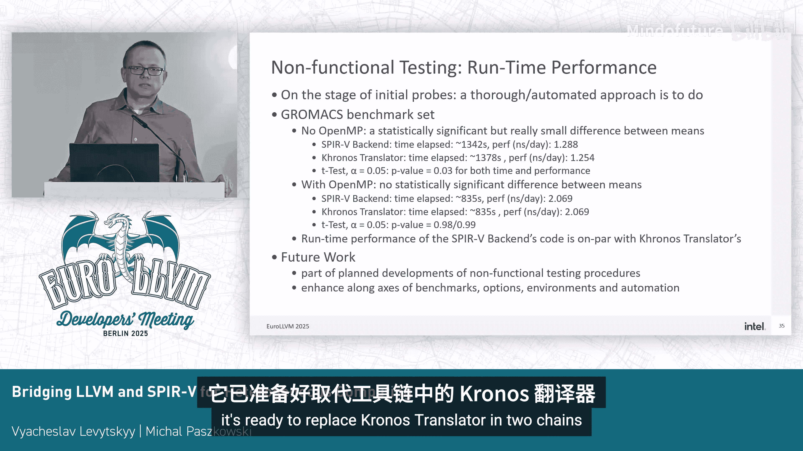

# 011：连接LLVM与SPIR-V以实现异构计算

## 概述

在本教程中，我们将学习LLVM SPIR-V后端项目。SPIR-V后端已成为一个官方目标，用于生成SPIR-V的工具。我们计划将其扩展到实际应用中，包括深度学习工作负载，并希望看到其他实现，如使用该后端的Adaptive C++。我们的总体目标是提升质量、性能和功能。本教程将涵盖SPIR-V后端的技术和社区方面，讨论项目面临的挑战、解决方案和集成工作。

## 项目背景与挑战

上一节我们介绍了项目的总体目标。本节中，我们来看看项目所处的背景和面临的核心挑战。

异构计算领域，编译过程复杂，需要一个统一的代码表示形式，以便在各种后端API和硬件上实现计算内核。一个关键挑战是决定在编译流程的哪个阶段进行何种转换，因为代码会从后端无关的中间表示（IR）转换为设备特定的二进制文件。

SPIR-V作为一种抽象指令集，隐藏了特定供应商指令集和语言的细节，为此提供了解决方案。**SPIR-V** 是一种用于计算和图形的跨供应商、可移植的中间表示。**LLVM SPIR-V后端** 则是LLVM工具链中此前缺失的一环。

我们曾使用Khronos Translator来生成SPIR-V，但这增加了复杂性和外部依赖。我们的原生后端消除了这一障碍，提供了紧密的集成和更好的可维护性。

支持SYCL一直是开发的主要驱动力，但OpenCL和Vulkan同样受益于计算能力的改进。随着项目日益成熟，它正变得更适合现实世界的工作负载。

## SPIR-V后端的作用与复杂性

上一节我们了解了SPIR-V如何解决异构编译的挑战。本节中，我们深入探讨后端在连接不同生态时所扮演的角色及其复杂性。

SPIR-V后端是不同利益交汇点，其实现需要协调众多参与方和用例。计算领域对语义有很高的期望，SPIR-V指令定义明确，从源代码到目标代码的含义流必须被精确保留。考虑到SPIR-V作为可移植IR有许多不同用户（运行时环境、前端、后端），这是一项挑战。

例如，作为硬件驱动程序一部分的、从SPIR-V反向翻译回LLVM IR的过程（由Khronos Translator实现），可能会难以处理意外的、特定于后端的模式。同时，仅靠LLVM工具和概念也不足以完全捕获丰富的SPIR-V语义。

如果你将所有涉及的参与方和用例连接起来，会看到一个复杂的交叉网络。OpenCL和SYCL中的着色器（Shader）和内核（Kernel）在功能上可能重叠，这造成了来自运行时的隐式依赖和限制，这些运行时需要防范不支持的SPIR-V功能。后端需要管理这种二分法，实现内核和着色器的共享核心，并依赖环境检查来在这些模型之间分支，以确保跨不同领域的正确性。

## 澄清规范与处理类型

上一节我们讨论了后端协调不同模型的复杂性。本节中，我们来看看后端在澄清规范模糊性和处理类型系统方面的工作。

后端的工作之一是澄清SPIR-V规范中的模糊之处。一个最近的例子是关于计算风格（Compute flavor）如何使用图像读写指令。这些指令依赖于着色器能力，但可能在计算中使用未知的图像格式。这种不必要的耦合导致了使用图像的计算机工作负载中的错误。SPIR-V后端帮助规范演进，在内核上下文中记录了此行为。

另一个主要问题是运行时与指针类型的对抗。关键词是**脆弱性**。运行时依赖SPIR-V类型，而前端和优化器可能生成破坏类型跟踪的模式。类型推断至关重要，但并非总是可行。规范中没有指导前端如何创建IR或内部函数（intrinsics）以最终映射到SPIR-V。前端自行解决问题可能导致不一致。

最近的例子是前端将按位布尔值打包成32位向量，这违反了SPIR-V将布尔视为没有任何位模式的规定。因此，虽然语义一致性是目标，但实现路径可能不明确且脆弱。

## 类型推断机制

上一节我们看到了类型系统面临的挑战。本节中，我们详细探讨后端如何进行类型推断。

SPIR-V具有分层类型系统，大多数指令都是类型化的。后端运行一个模型（Module）Pass来扫描IR中的模式，发现依赖关系并推断类型，避免依赖名称修饰（name mangling）。为了编码类型和关系，类型推断会发出内部内部函数。

类型推断很复杂，以下是后端推断类型的步骤草案：
1.  分析函数体，维护一个不完整类型的工作列表，允许延迟推断直到整个模型被分析。
2.  尽早修复`getelementptr`指令。
3.  根据函数签名和调用点处理函数参数。
4.  进行前向遍历，使用操作数推断结果类型。
5.  进行后向反转，调整或细化操作数类型。

除了规则，还有基于经验猜测的空间，例如处理具有不同类型的值的`phi`节点。Pass中还编码了一些关于已知函数的先验知识，例如地址空间之间的指针类型转换，意味着参数和结果类型等价。

后向反转从结果推断操作数类型，确保在整个模型中生成一致的类型。我们构建一个指针类型转换，并将更改进一步传播到受影响的操作用户。除了对IR进行推理，我们还使用已知内置操作码的语义。最后，我们检查函数调用点并最终确定不完整类型，这也是从IR转换器清理中保存函数指针扩展的时刻。

连续辅助函数传播更改，最终在需要时为指令插入指针类型转换，并修补所有LLVM类型。目前，唯一的特殊情况是单元素向量（one element vector）的情况。

## 类型推断的局限性与解决方案

上一节我们介绍了类型推断的步骤。本节中，我们看看当类型推断不可行时的解决方案及其局限性。

当前端没有生成足够的含义时，类型推断并不总是能以格式良好的方式进行。一些SPIR-V指令没有对应的LLVM指令或内部函数，例如`OpGroupNonUniform`的复制操作。前端使用内置函数来编码在指针之间复制的代码，给定元素数量。如果我们无法猜测指针类型，问题在于SPIR-V中字节数比元素数更重要，操作码将无法工作。

想象一下，内置函数调用被插入到IR中，但指针和IR之间没有任何有用的关系来帮助推断类型。这正是我们通常希望避免的情况，因为依赖名称修饰是危险的。但在这种情况下，我们只能使用编码在名称修饰中的指针类型。当然，最好是根据字节数重新表述操作码本身，但现在改变为时已晚。可行的选项要么是无类型指针扩展，要么是一个假设的新内置函数来正确传达含义。

## 模型范围指令与性能优化

上一节我们讨论了类型推断的特定挑战。本节中，我们转向后端在处理模型范围指令和性能优化方面的努力。

另一个问题是逻辑上的不匹配。形式上，模型（Module）是指令的线性列表。然而，实际上存在模型范围和函数范围，模型范围按照预定义顺序存放类型定义，我们必须为相同的类型重用相同的类型ID。我们也希望保持其他定义（如常量）的唯一性，以避免输出膨胀。

想象一下，LLVM IR中的函数指令引用函数范围内的定义，但我们必须记住，这些定义最终必须属于模型范围并被重用。这是另一个概念上的不匹配。对于常量，我们甚至没有选择，它们从一开始就在后端之外被创建和复制，从转换器开始。

我们演讲的标题中使用“桥接”（bridging）一词并非偶然，后端充当了SPIR-V和LLVM概念之间的桥梁。定义的去重和模型指令的高效收集至关重要。后端不能成为异构计算的瓶颈，关键词是**高效**。我们希望在后端中替换计算工具中的转换器，但直接比较绝对时间不公平。LLC运行许多Pass，转换和优化IR和MIR，后端在其他Pass之间将IR降低为SPIR-V。而Khronos工具则在没有LLVM开销的情况下进行翻译，因此转换器更快。这不是零开销，如果比较，它大约快5到60倍。

第一个性能问题的根源正是对模型范围指令的低效处理。去重曾用于构建ID的依赖图，但数据结构扩展性不好。我们完全移除了图，翻译时间获得了5倍加速，这是缩小性能差距的坚实一步。下一步是进一步改进类型和值的去重和跟踪，通过更智能的类型管理，减少了内部内部函数对MIR的膨胀和发出的机器代码。总效果是从原始基线获得了25倍加速，中间状态和IR/MIR转储更清晰，代码更简单。

未来，我们计划分析内存使用情况，并最终解决类型推断逻辑。它目前与IR转换纠缠在一起，使维护复杂化。因此，我们希望从类型推断中创建一个独立的、可重用的Pass，并可能在后端和其他项目之间共享。

## 缓存与一致性管理

上一节我们探讨了性能优化。本节中，我们来看看确保缓存一致性的挑战和解决方案。

解决性能问题有一个预期且有意为之的副作用：去重的跟踪并非完全简单，因为IR在翻译过程中会发生变化。有些变化是失控的，是后端无关的Pass的一部分。虽然这些变化本可以被监控，但之前并没有。

以前的方法不能保证实体的正确缓存，可能会由于指令的移除及其在指令选择中的修改而随机返回陈旧和不正确的记录。我们通过为跟踪和最终定义去重创建正确的缓存来解决这个问题。

无法完全控制IR的变化意味着缓存比双向映射更复杂一些，尽管新的实现无论如何都更简单。其思想是通过基于类型和内容从LLVM IR实体创建唯一键，并存储相应的指令及冗余信息来监控IR变化、验证记录和识别陈旧项，这确保了最终一致性。

一致性是最终的，因为IR的变化发生在外。冗余和自定义哈希有助于区分有效记录和陈旧记录。我们将定义存储为机器指令、其定义虚拟寄存器和哈希的元组，结合双向映射，这足以提供一致的查找和擦除操作。当我们看到机器函数中此虚拟寄存器的定义，并且该定义与存储的指令相同时，我们就使用该记录。

过去在某些负载中存在不稳定的行为，在这个修复之后，我们不再观察到它。

## 指令选择与社区生态

上一节我们讨论了后端内部的缓存机制。本节中，我们来看看指令选择的改进空间和更广泛的社区影响。

TableGen的使用必须在指令选择中变得更智能，这是后端持续关注的一部分，也是可能需要进行重大重构的部分。我们计划将所有内容同步到一种方法，并尝试将手动编码的语义检查和全局指令选择（GlobalISel）模式匹配转移到TableGen模式。目前指令选择代码通常看起来重复，可以由TableGen模式处理，因此有改进空间。

最近的成就已经包括从机器验证器（Machine Verifier）角度的有效性、TableGen手动记录规则的简化、中间表示和底层假设。在最近的美国LLVM开发者会议上讨论了与全局指令选择的一些有问题的交互，让我们从实用角度简要回顾一下。

第一个是SPIR-V中的`OpPhi`，它是一个PHI节点，但未被识别为PHI。我们讨论过修补LLVM代码生成的想法，在机器指令`isPHI`中进行硬编码检查，而不是修补SPIR-V后端并推迟`OpPhi`的生成。支持指令选择阶段后的特定目标代码行为不是更好吗？答案是否定的。覆盖硬编码检查是一个优雅的解决方案，因为选定的指令不应需要任何进一步的选择。目标指令`isPHI`将帮助后端在ISA中报告PHI指令，但问题是为时已晚，优化Pass正在使用硬编码检查，大约有300个地方需要重构，因此优雅的方案看起来不可行。我们与代码库保持一致，使用通用的PHI操作码直到模型最终化，这为我们启用了优化Pass。

类似的问题但相反的解决方案是保持指针类型一致。后端在指针之间使用位转换（bitcast），我们希望使用通用的`G_BITCAST`，但解决方案是生成SPIR-V的`OpBitcast`。理由是低级类型（LLT）没有带来足够的信息来将`G_BITCAST`的使用与SPIR-V对齐，因此我们不能发出通用操作码，其语义与`OpBitcast`不同。

## 新应用与数据类型支持

上一节我们探讨了后端与LLVM基础设施的集成。本节中，我们来看看后端如何支持新的应用和数据类型。

回到社区方面，后端的显著进展和非实验状态启用了新的应用。SYCL仍然是变化的主要驱动力，新的AI工作负载和扩展正在进行中。

新的用例提出了缺少BF16支持的问题。BF16很重要，但全局指令选择不区分语义差异，将16位浮点仅视为IEEE半精度（half）。这种模糊性是一个问题，尤其是在AI工作负载中。我们需要确保正确的位模式被保留，并且指令能正确解释位，在全局指令选择中准确表示非标准负载类型，并为高效的代码生成和大量出现提供坚实的基础。

缺乏BF16意识导致在全局指令选择中表示BF16时采用变通方法。项目使用半精度浮点或整数进行编码，然后依赖内部函数、元数据或添加位转换。单独的寄存器组可能使情况复杂化，后端需要根据上下文猜测一个16位值到底是浮点数还是整数。所有这些都分裂了生态系统，增加了出错的机会。

LLVM社区提出了几个选项来正确表示BF16这种非标准浮点类型。第一个是扩展低级类型以区分变体；另一个是重新定义LLT种类，添加格式说明符以指定格式，包括未来的扩展如FP8和TF32，缺点是这需要大量重构；下一个是在浮点指令中嵌入类型作为操作数，这会使MIR变得臃肿，Pass必须注意额外的操作数；最后，我们可以进入推理领域，附加元数据并依赖分析Pass。总之，我们确实需要BF16的第一类表示，以避免猜测带来的陷阱。

## 测试与质量保证

上一节我们讨论了新数据类型带来的挑战。本节中，我们来看看项目如何通过测试和QA来保证质量。

我们的测试套件正在迅速扩展，反映了不断变化的优先级。测试超越了文件检查（FileCheck），我们使用Spirv-Tools验证代码在语法和语义上是否有效。展望未来，我们计划识别覆盖范围的薄弱点，并自动化非功能性测试。

后端在Mobos和持续集成环境中的推广，迅速发现了一些需要修复的地方。许多问题是次要的，但仍需要紧急修复。作为一个教训，在像LLVM这样的大型代码库中，即使对子项目的质量非常谨慎，也可能让难以检测的bug隐藏起来，导致在新环境中出现意外。来自构建机器人（buildbot）、消毒器（sanitizers）和外部环境的扩展覆盖确实有帮助。

## 性能评估与未来展望

上一节我们了解了项目的测试和质量保证措施。本节中，我们评估后端生成的代码性能，并对整个教程进行总结。

后端在异构计算领域是稳定的。我们将更好地支持OpenCL，并解决SYCL中所有已知问题。对于Triton和SYCL Native（N2）的测试套件，通过率也很高，其中一些功能有意不被支持，其他功能正在进行中。添加扩展可能需要更多时间和精力，例如联合矩阵（joint matrix）的例子。

在QA中有很多活动部分：下游Intel LLVM、上游LLVM、Khronos Translator、运行时驱动程序有时会给出分支，组件在不同时间表上更新，总是存在滞后。因此，在环境更新到一致状态之前，C工作流中的通过率可能看起来比实际低。在LLVM之外进行持续测试仍然有帮助。

我们检查了后端生成的SPIR-V代码的运行时性能与Khronos Translator生成的代码相比如何。目前处于初始探测阶段，采用自动化的方法。第一个结果是好消息：我们代码的运行时性能与转换器相当，没有显著差异。

在本演示开始时，我告诉过你这是一系列小课程，而不是一个要传达的信息。所以，如果我现在只挑选一条信息，那就是：LLVM SPIR-V后端是一个重要且稳定的项目，它已准备好替换工具链中的Khronos Translator。

## 总结

在本教程中，我们一起学习了LLVM SPIR-V后端项目。我们从项目背景和异构计算的挑战开始，了解了SPIR-V作为可移植IR的价值以及原生后端的重要性。我们深入探讨了后端在桥接LLVM与SPIR-V生态时面临的技术复杂性，包括协调不同计算模型、澄清规范模糊性以及处理脆弱的类型系统。

我们详细介绍了后端强大的类型推断机制及其局限性，并看到了通过性能优化（如高效的模型指令去重和缓存管理）如何显著提升编译速度。我们还探讨了后端在指令选择、支持新数据类型（如BF16）以及通过严格测试和质量保证来确保稳定性方面的持续改进。

最后，我们了解到后端生成的代码在运行时性能上已与成熟工具相当，标志着它已准备好广泛应用于实际的异构计算工具链中。LLVM SPIR-V后端项目展示了通过开源协作解决复杂工程挑战的强大能力。