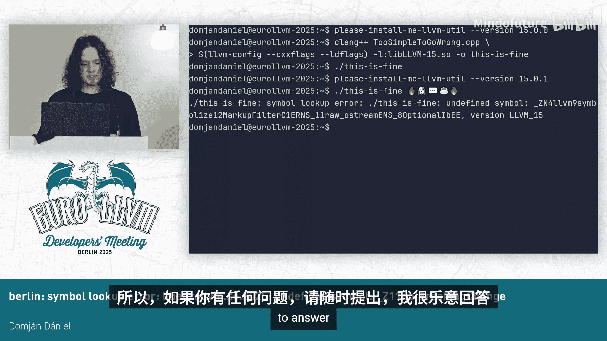

# 012：符号查找错误与 ABI 破坏检测


在本教程中，我们将学习如何理解共享库更新时出现的“未定义符号”错误，并探讨一种基于源代码分析来检测破坏应用程序二进制接口（ABI）兼容性变更的方法。

## 重现一个典型的符号查找错误

上一节我们介绍了课程目标，本节中我们来看看如何重现一个典型的符号查找错误。

首先，我们从一个函数开始。这个函数的名字经过C++名称修饰（mangling）后，看起来可能有些复杂，但它是一个完全合法的修饰名。

```cpp
// 一个具有复杂修饰名的函数
void ABI_breaking_function(int param1);
```

这不是日常编程中常见的函数，但为了演示，我们将其放入一个库中。为了让这个库有实际功能，我们为这个函数提供一个定义。

```cpp
// 函数定义
void ABI_breaking_function(int param1) {
    // 执行一些操作
}
```

现在，我们可以将这个源文件编译成一个共享库。

```bash
clang++ -shared -fPIC my_talk.cpp -o libmytalk.so
```

编译完成后，我们得到了一个共享库 `libmytalk.so`。假设有另一个名为 `libeurollvm.so` 的库使用了 `libmytalk.so` 中的代码，因此它必须链接到 `libmytalk.so`。此外，还有一个名为 `berlin` 的可执行文件使用了 `libeurollvm.so`。

目前，如果我们运行 `berlin`，它会成功执行并输出 `libmytalk.so` 中定义的消息。一切看起来都很正常。

## 引入一个看似兼容的变更

上一节我们创建了一个可以正常工作的库，本节中我们来看看如何通过一个看似微小的变更来破坏其兼容性。

现在，我们觉得 `ABI_breaking_function` 函数的参数有点少，决定为其添加一个新的参数。

```cpp
// 修改函数声明，添加一个新参数
void ABI_breaking_function(int param1, int param2);
```

这个改动带来了一个问题：任何调用这个函数的源代码将因为参数数量不匹配而无法编译。为了保持源代码兼容性（API兼容性），我们为新参数提供一个默认值。

```cpp
// 为新增参数提供默认值
void ABI_breaking_function(int param1, int param2 = 0);
```

我们同样在函数的定义中添加这个新参数（和默认值），然后重新编译 `libmytalk.so` 库。这就像是发布了一个包含此变更的库的新版本。

由于这是一个共享库，理论上，任何链接到它的应用程序无需重新编译，应该仍然能够正常工作，从而实现向后二进制兼容。因此，再次运行 `berlin` 应该会成功，对吗？

实际上，运行 `berlin` 会导致失败，并出现我们在课程开头提到的“未定义符号”错误。

## 理解源代码兼容性与二进制兼容性

上一节我们看到了一个破坏二进制兼容性的变更，本节中我们来深入理解兼容性的两种类型。

当应用程序链接到一个共享库时，库的内容并不直接成为应用程序的一部分。应用程序中只包含对库的引用。在运行时，动态加载器会根据这个引用去磁盘上查找并加载库文件。如果文件被新版本覆盖（例如通过安装更新），那么加载和执行的就是这个最新安装的版本。

有两种主要的兼容性需要关注：

*   **源代码兼容性（API兼容性）**：这意味着任何使用库旧版本的应用程序，无需修改就能针对新版本重新编译成功。我们为参数添加默认值的变更就保持了源代码兼容性。
*   **二进制兼容性（ABI兼容性）**：这意味着这些应用程序无需重新编译，就能直接使用库的新版本。

如果我们对比 `libmytalk.so` 旧版本和新版本的接口：

*   **源代码层面**：由于添加了默认参数，函数可以像以前一样被调用，因此变更保持了源代码兼容。
*   **二进制层面**：函数的修饰名（mangled name）包含了其参数类型信息。添加新参数（即使是默认参数）改变了函数的修饰名。这意味着函数在二进制文件中定义的标签（即其修饰名）发生了变化。未重新编译的应用程序仍然试图用旧的标签（旧的修饰名）去调用它，但新库中已不存在这个标签，因此动态加载器在运行时找不到该符号，导致了“未定义符号”错误。

## 现有检测工具的局限性

上一节我们明确了问题的根源，本节中我们来看看现有的解决方案及其局限性。

在维护遗留系统时，如果因为库的变更导致系统故障，若能有一个工具自动检测这些破坏性变更将会非常有帮助。

目前存在一些检测工具，但它们大多分析二进制文件。这似乎是解决此问题的直接方法，因为二进制接口本就存在于二进制文件中。然而，不同平台使用不同的二进制格式（如ELF、Mach-O、PE），因此没有一种通用的、跨平台的二进制分析解决方案。

另一些工具则利用DWARF调试信息来获取跨平台支持。但DWARF并非唯一的调试信息格式，例如Windows使用PDB，这又是完全不同的东西。

那么，如果我们转而分析源代码呢？这里面临另一个问题：对于C++语言，目前不存在专门用于分析库兼容性的成熟工具。

## 基于 LLVM/Clang 构建新的分析工具

上一节我们讨论了现有工具的不足，本节中我们来看看如何利用 LLVM 生态构建一个新的解决方案。

LLVM 项目包含许多可以以某种方式推理源代码的工具，但没有一个专门针对库兼容性分析。另一方面，LLVM 提供了一套 `LibTooling` 库，允许我们根据需要创建独立的 Clang 工具。我们还拥有 `ASTMatchers` 库，它允许我们从 Clang 的抽象语法树（AST）中提取信息。

以下是核心思路：利用这些库，创建一个新的独立 Clang 工具。这个工具可以获取同一库不同版本的源代码，并运用静态代码分析来检测实际破坏兼容性的变更。

然而，直接比较来自不同翻译单元（源文件）的 AST 节点并非易事。Clang 为每个编译的源文件创建一个独立的 AST 上下文，节点通过指针访问。在同一个 AST 上下文中，通过比较指针地址即可判断是否为同一节点。但在不同的 AST 上下文中，即使两个节点代表相同的声明，它们的物理内存地址也绝不可能相同。

为了解决这个问题，Clang 提供了 **ODR Hash** 机制。ODR Hash 以 AST 节点作为输入，生成一个哈希值作为输出。由于这是一个哈希函数，只要节点代表相同的声明，无论其内存地址如何，都会生成相同的哈希值。这样，我们就可以利用 ODR Hash 来跨不同的 AST 上下文进行比较。

这个想法的实现已经可以在 GitHub 上的一个仓库中找到。这是一个严肃的工具，尽管它的名字可能看起来有些创意。

## 工具演示：检测 ABI 破坏

上一节我们介绍了新工具的原理，本节中我们通过演示来看看它的实际效果。

首先，回顾一下我们对 `libmytalk.so` 所做的那个破坏了 ABI 的变更。让我们看看这个工具会如何报告它。

要使用这个工具，我们需要指定要分析的库旧版本的源文件，以及新版本的源文件。

```bash
# 假设工具名为 abi-compliance-checker
abi-compliance-checker -old libmytalk_v1.cpp -new libmytalk_v2.cpp
```

运行后，工具会显示一条警告，指出 `ABI_breaking_function` 的一个重载在新库中缺失。这正是导致 ABI 破坏的原因。

这看起来像是一个精心构造的简单例子。那么，在真实项目上效果如何呢？有人曾要求用 LLVM 本身来评估这个工具。我们就以 LLVM 15 的符号化器（symbolizer）组件为例。

我们将使用 LLVM 15.0.0 版本符号化器的头文件，并指定其构建目录（包含编译数据库 `compile_commands.json`），以便工具能获取正确的编译选项来构建 AST。对于新版本，我们使用 LLVM 15.0.1 的相同源文件。

LLVM 的次要版本发布通常旨在保持二进制和源代码兼容性，因此我们预计不会看到警告。但工具实际上报告了多个警告。这些警告源于两个变更：

1.  在 15.0.1 中，一个名为 `MarkupFilter` 的类增加了一个新字段。这改变了类在内存中的大小和大多数字段的偏移量。
2.  该类的构造函数增加了一个新参数，这改变了其修饰名（标签）。



如果我们有一段简单的代码，它只是实例化一个 `MarkupFilter` 然后退出。在安装 LLVM 15.0.0 后编译这段代码并运行，一切正常。如果我们决定升级到 LLVM 15.0.1，然后运行**同一个**（未重新编译的）应用程序，我们最终会得到与本教程开头完全相同的“未定义符号”警告。

## 问答与总结

本节课中我们一起学习了共享库 ABI 兼容性的重要性、破坏兼容性的常见原因，以及一种基于 Clang AST 和 ODR Hash 来检测此类破坏性变更的静态分析工具。

以下是演讲结束后的一些问答摘要：

*   **问**：如果函数被标记为 `extern "C"`，修改参数还会产生未定义符号错误吗？
    *   **答**：对于 `extern "C"`，函数没有名称修饰，因此参数变化通常不会影响其链接符号名。但具体行为可能更复杂，不过一般来说，这避免了因修饰名改变导致的问题。
*   **问**：基于源代码的工具如何处理预处理器指令（如 `#ifdef`）？为了检测所有潜在的 ABI 不兼容，是否需要为所有目标平台编译？
    *   **答**：是的，这是一个挑战。工具需要针对特定的目标平台进行配置（通过传递对应的编译器目标三元组参数），这样源代码才会被正确地预处理，生成包含该平台特定信息的 AST。理论上，这能提供针对该平台的准确分析。二进制分析工具同样面临需要跨平台支持的问题。将此类检查集成到针对不同平台的 CI（持续集成）系统中会很有用。

通过本教程，你应该对共享库更新时的 ABI 兼容性问题有了清晰的认识，并了解了一种利用 LLVM/Clang 基础设施来主动检测此类问题的前沿方法。


