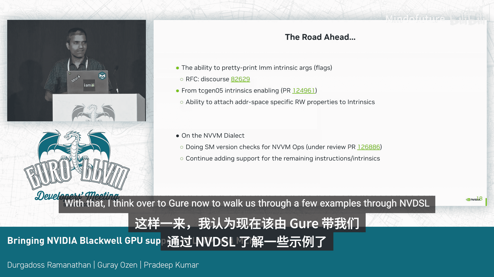
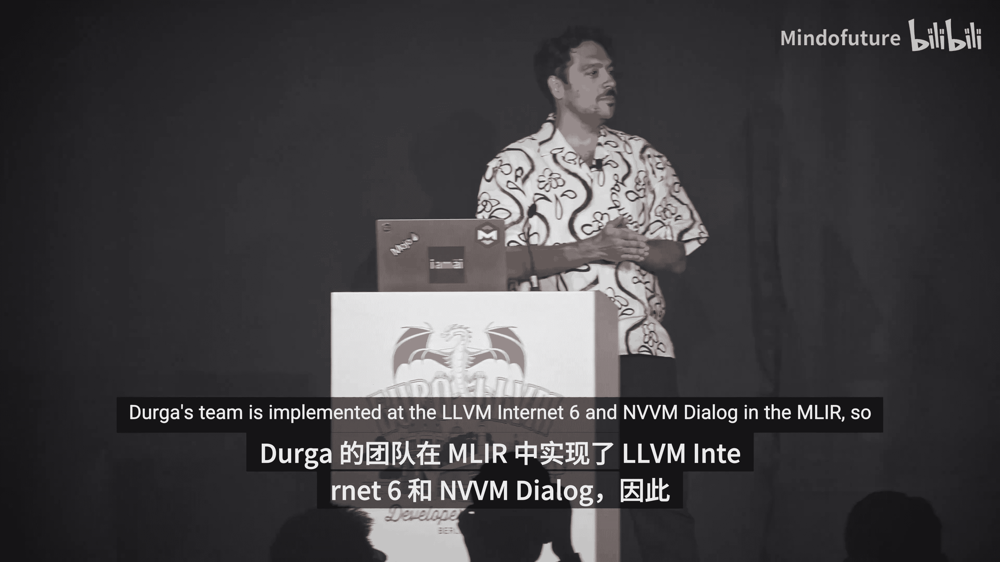
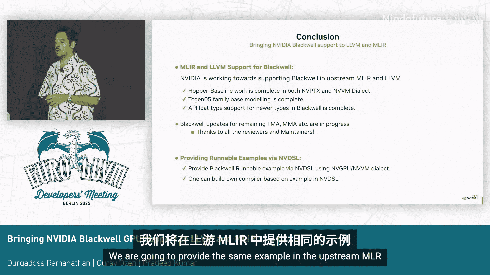

# 013：为LLVM和MLIR引入NVIDIA Blackwell支持

## 概述

在本节课中，我们将学习如何为上游LLVM和MLIR编译器框架添加对NVIDIA Blackwell GPU架构的支持。我们将介绍Blackwell的新特性，探讨在NVPTX后端和NVVM方言中的实现方法，并通过NVDSL展示具体的GEMM（通用矩阵乘法）示例。

## Blackwell GPU架构简介

Blackwell是NVIDIA最新的GPU架构，它引入了多项旨在加速AI计算的新特性。其中，矩阵乘累加单元和Tensor内存加速器是与我们今天讨论最相关且最有趣的部分。

在矩阵乘累加单元方面，从Ampere架构开始，我们让线程束内的线程协作执行一个矩阵乘累加块。在Hopper架构中，这扩展到了线程束组协作。而Blackwell进一步扩展，现在允许来自最多一对计算线程数组的线程协作计算一个矩阵乘累加块。

同时，Blackwell还支持新的Tensor内存。它拥有专用的分配、释放指令以及加载/存储指令。这意味着它由程序员管理，并且与之前的架构不同，Blackwell中矩阵乘累加操作的累加器和部分操作数可以来自Tensor内存。

此外，Blackwell的矩阵乘累加单元还支持块缩放类型，即FP6和FP4数据类型。所有这些特性都通过ISA中的`tc_gen5`系列指令集暴露出来。

在Tensor内存加速器方面，它主要负责在共享内存和全局内存之间进行数据拷贝。它理解最多五维数据，支持平铺模式、多播模式等。在Blackwell中，它在多播模式中获得了对几种专用模式的支持，以及分散-聚集支持。

## 编译器流程概览

为了让大家了解这些特性如何融入编译器流程，我们来看一个整体图景。MLIR中的NVVM方言将这些特性建模为操作，它也可以将它们降级为LLVM IR，作为内部函数或内联PTX。

然后，LLVM IR通过NVPTX后端生成PTX代码。

对于Blackwell，我们预计需要在NVVM方言中添加几十个操作。同时，NVPTX后端已经为Tensor内存添加了地址空间6。我们估计还需要在后端添加大约一千个内部函数来支持这些特性。

## 内部函数数量与可扩展性

现在我们来谈谈内部函数。我们看到一个简单的Tensor内存加速器指令示例，仅其一个变体就可能降级为数百个内部函数。同样，建模Blackwell矩阵乘累加单元的`tc_gen5`矩阵乘累加系列指令，单独就可能降级为大约700个内部函数。

观察当前Blackwell之前基线版本的内部函数分布，我们大约有3000个内部函数，其中40%已经来自矩阵乘累加和Tensor内存加速器指令。现在，我们仅为了支持Blackwell的Tensor内存加速器和矩阵乘累加单元，就要再增加一千个内部函数。

这具有可扩展性吗？为了回答这个问题，我们尝试了一个实验：运行一组测试，覆盖1千、2千直至1万个内部函数，观察在后端添加这些内部函数对LLVM构建时间、二进制大小以及用户内核编译时间的影响。

这个实验的基础设施建立在当前已有的一个简单Tensor内存加速器内部函数之上，也包括前端内部函数和NVPTX代码生成，所有这些都是通过TableGen生成的。我们构建了多达1万个内部函数的版本。

在二进制大小方面，例如`opt`、`llc`等工具，我们看到有高达3%的边际增长。对我们来说，有条件地编译这些包含文件或TableGen生成的前端包含文件以及后端文件非常重要。在这些方面，我们看到与添加的内部函数数量成比例的增长。这些表格中的时间单位都是毫秒，因此在LLVM的完整发布版本构建中，我们没有看到任何影响。

但是，当我们考虑用户内核编译时间时，情况有所不同。我们在上百个Blackwell内核上运行了相同的测试集，这些都是为GEMM实现的实际内核，使用了我们迄今为止添加的内部函数。

编译时间测量使用`-time-passes`选项完成，这些是大约20次运行的平均值，并分别测量了`opt`阶段和`llc`阶段。在`opt`阶段，我们没有看到这些内核编译时间有任何影响，这是可以理解的，因为目前大多数内部函数对于优化通道来说只是简单的传递。

在`llc`阶段，它承担了为这些内部函数进行实际选择和代码生成的重任。对于1千和2千个内部函数，我们看到边际增长高达约1%和4%。但当我们增加到5千或1万个内部函数时，编译时间可能增加高达15%。

## 内部函数整合策略

显然，我们无法承受这样的开销。因此，我们开始研究以某种形式整合这些内部函数的方案。

我们早期采用的一种方法是将一组修饰符建模为标志位，我们称之为“标志位”，但它实际上是一个整数常量。

这里展示了一个例子，例如平铺模式、多播模式等，将它们打包在一起，说“好的，这是一个常量”。只有后端会查看这个常量，并将其分层映射到它拥有的适当变体。这种方法在可维护性和兼容性方面效果很好。

但是，我们遇到了一些实际问题。其中之一是，我们将某个字段或修饰符建模为，比如说，一个2位字段。然后ISA扩展器将其变成了一个3位字段。现在我们如何用这些标志位来管理？我们尝试了一些变通方法。另一个问题是解析标志位本身。随着ISA的演进，内部函数变得更加复杂，例如它们可能变成多个32位或更宽的类型，处理这些标志常量本身变得更加困难。基本上，我们必须解包，然后将它们映射到它们对应的枚举值。

因此，我们考虑的另一种方法是：与其将所有内容打包到一个`i32`中，不如将一组修饰符单独拆分到一个标志字段中。这在某种意义上更容易处理，因为如果你在调试或修改IR，我们可以直接将标志值映射到枚举值，并且我们实际上永远不会用完位宽，我们可以使用`i8`、`i16`或`i32`。

但问题是，将一个打包的`i32`值扩展到多组`i32`对位码大小有什么影响？我们再次回到之前测量的同一组内核，几何平均值大致接近1，但对于少数内核，我们看到`.bc`文件大小增加了高达3%。

## 经验总结与指导原则

我们从中学习到的是：是的，为了可读性，将所有内容放在内部函数的名称中很重要，但我们也需要牢记内部函数的数量，以及何时选择哪种方法，哪些修饰符集合可以作为标志位，哪些效果好或不好。

我们已经为NVPTX制定了一套指导原则，并在这个PR中进行了汇总。

## 浮点类型支持

接下来是浮点类型的添加。Blackwell支持这些窄浮点类型，即FP6和FP4类型，我们已经在LLVM的APFloat基础设施中添加了对它们的支持。

FP6和FP4类型相对简单，建立在现有的基础设施之上。但具有精度0的缩放格式类型带来了相当大的挑战。经过与维护者的几轮讨论和审查，我们发现关键是要让APFloat理解某些特殊类型的精度可以为0。一旦我们向APFloat阐明了这一点，一切就都顺利就位了。

APFloat通常有一个称为“穷举对测试”的概念。它获取一种类型，然后遍历该类型中的所有位模式，并测试所有算术运算。使用这类测试有助于揭示这些类型特有的许多边界情况。

当然，所有这些类型在MLIR中也都有类型定义支持。

## MLIR与NVVM方言支持

转到MLIR方面，我认为大多数`tc_gen5`操作现在都在NVVM方言中得到支持。`tc_gen`类型集几乎都通过内部函数进行了分层。作为准备工作，我们还在添加一些Blackwell之前的功能，主要是在Tensor内存加速器方面。

该方言本身可以支持内联PTX和内部函数降级。更重要的是，NVVM方言中的一个特定操作可以部分降级为内联PTX（针对某些修饰符），然后为另一部分降级为内部函数。我们发现在开发早期和调试阶段，这个功能非常方便。

是的，我们也在积极将一些现有的内联汇编迁移到基于内部函数的方式。

## 未来展望

展望内部函数的未来，我们认为能够漂亮地打印一些这些标志参数，而不仅仅是说一个巨大的值或简单的枚举值，这将很有好处。例如，能够说明这代表舍入模式、归约模式或平铺模式等。关于这个主题有相关的讨论，欢迎大家查看并告诉我们您的想法。

在启用`tc_gen5`期间出现的另一个项目是，我们无法指定特定的读写属性。目前我们正在IR端使用更保守的属性来解决这个问题，但拥有这些属性会更好，我们计划在某个时候研究这个问题。

在NVVM方言方面，随着所有这些添加，我们意识到我们没有方法来检查这些操作所需的SM版本。因此，它们会一直传递到IR，然后在后端失败。我们正在添加对此的支持，这有助于我们在开发流程的更早阶段捕获这些SM版本检查。

当然，我们也将添加对剩余指令作为内部函数的支持。

## 通过NVDSL的GEMM示例

现在，让我们通过NVDSL来了解几个GEMM示例。

Doga的团队已经在MLIR中实现了LLVM IR和NVVM方言。因此，我们在那里有基本的支持。但如果我告诉你，“去实现一个非常快速的内核”，你能做到吗？我认为这需要时间，因为并行编程很难，使用所有这些Tensor特性也很难，编写快速内核真的很难。

因此，我们决定同时提供GEMM示例的基本构建块，以及这些PTX指令和NVVM方言。

为此，我们使用了NVDSL，这是我去年介绍的。我不会讲太多细节，但你可以观看相关视频。它基本上是一个Python中的测试DSL，你可以生成NV GPU代码或NVVM方言。

它能做什么？让我快速介绍一下：它可以自动生成MLIR函数，我们有装饰器，它可以即时编译并执行。它处理所有的样板代码，进行运算符重载，并将NumPy类型转换为MLIR类型。所以，它只是给你一个小小的Python DSL，让我们可以专注于性能或在MLIR中进行测试。我们编写一个内核，然后它可以生成许多变体，这样我们就可以测试更大的场景。

让我们深入了解一下。这是去年关于Hopper GPU的幻灯片，展示了Hopper GPU的工作原理。在Hopper中，我们有一个Tensor核心，Tensor核心指令的大小是64x1028x16。所以，如果你想做1028x1028x64的GEMM，你需要执行8条指令。这就是Hopper，结果存储在寄存器中。这意味着如果你想进行计算，想使用这些寄存器的结果，你必须持有这些值才能继续。

在NVIDIA，我们进行线程束专业化。一些线程束执行Tensor内存加速器加载，一些执行矩阵乘累加，另一些执行算术逻辑。这真的很难管理线程束专业化，因为你必须持有整个线程束，然后为了下一次计算而保持它们移动。所以这很复杂。

## Blackwell的变革：Tensor内存

那么在Blackwell中发生了什么变化？在Blackwell中，我们引入了Tensor内存。这在核心生成方面是一个游戏规则改变者，因为它真正简化了线程束专业化。

这里发生了什么？我们的Tensor核心尺寸变大了，但这并不那么重要。重要的是，现在Tensor核心的结果存储在内存中。这个内存非常快，并且可以被其他寄存器或其他线程束访问。

所以你不必持有你的线程束组或线程束来继续计算。你基本上可以取一个线程束，实际上取一个线程，然后提交线程束到Tensor核心，然后你可以继续你的工作，你可以使用其他线程束继续线程束专业化。

另一件事是同步方式发生了变化。我们使用M屏障。这有点细节，但更容易管理屏障，因为现在一切都是异步的。我确定这对你来说还不清楚，所以我们将通过示例逐步讲解。

我们将从一个非常基础的Tensor核心开始。这是我去年教程中的第3章。我取了同一章并将其应用于Blackwell GPU。

我们内核的顺序版本是：0:2 和 8x1028x64。我们使用F16类型，在F32上累加，对吗？如果你用NVDSL编写，右边就是代码。我们将逐步完成所有这些步骤，这将是接下来的许多幻灯片。

在左边，你看到的是执行时间线，右边你看到的是代码。如果你看执行时间线，你会看到四个线程束，对吗？你会看到四个线程束。我使用第一个线程束。我们有一个“领导者线程”的概念，领导者线程是我的线程束中最快的线程。我可以动态地获取它，这是一条指令。

## 内核执行步骤详解

好的，让我们启动内核。这是一个GPU内核，我们启动内核。

我有两个来自主机的Tensor内存加速器描述符，我需要引入一个栅栏。我取我的第一个线程束，我取我最快的线程。所以它们为这个Tensor内存加速器引入栅栏，因为它们位于全局内存中，我需要确保它们对所有人可见。

同时，我初始化我的M屏障。它们就像是分离的数组，如果你不熟悉这个，我将使用两个M屏障，一个用于数据加载，另一个用于矩阵乘累加。这就是引导过程。

**步骤2**：在这个步骤2中，由于我们有了Tensor内存，我需要分配这个内存，对吗？我将使用线程束0来分配它。我分配Tensor核心，12x8列，我有1028个线程。所以我的结果矩阵将完美地放在那里。这就是步骤3，我们分配它。

现在我们已经完成了引导。我们可以对M屏障进行栅栏操作，这意味着这些M屏障栅栏对其他线程可见。我也在使用屏障，所以我想确保我所有的线程都在同一个位置。这样我就可以开始计算了，我将开始做一些有趣的事情。

**步骤4**：好的，让我们开始做一些有趣的事情，这就是步骤4。在这里，我将使用Tensor内存加速器加载数据。Tensor内存加速器也是一个异步的内存加载/存储单元。你可以取最快的线程，告诉它们“加载这么多数据”。你可以启动许多指令。我们使用M屏障。

**步骤5**：我们将等待这些数据。所有来自Tensor内存加速器的数据都是异步到达的。

**步骤6**：终于，我的数据在我的共享内存中，因为我使用Tensor内存加速器将数据从全局内存加载到共享内存。我的数据在那里。现在我知道我可以相乘这些矩阵了。在Hopper之后，正如你现在所知或正在学习，矩阵乘累加指令可以直接与共享内存一起工作。所以如果你不想，你不必手动将它们加载到寄存器中，它们可以直接在共享内存上工作，你只需要构建寄存器描述符。

所以这是步骤6。在步骤6中，我取我的线程束0，我取我最快的线程，我在这里使用矩阵乘累加指令或`mma` API。我们有一个for循环。正如我在上一张幻灯片中展示的，我需要执行大约四条这样的矩阵乘累加指令，因为我在K维度上跨步。所以我想完成GEMM。对于结果，累加器是这里的`tm`，你可以看到`tm`符号。我们在同一个东西上累加。所以这不是跨步，唯一跨步的部分是矩阵A和矩阵B的描述符。

然后，在步骤6结束时，我们提交这个屏障。我们说“嘿，我完成了矩阵乘累加”。我们提交它，这很好。

**步骤7**：现在，让我们进入步骤7。在这个步骤7中，我使用第二个M屏障。我等待第二个M屏障。这个M屏障与矩阵乘累加相连。所以，正如你在这里看到的，我的内核中的所有线程都在等待这个矩阵乘累加。因为我这样做，我想使用我所有的线程，因为我想将`tm`存储到全局内存。你可以用多种方式做到这一点。但正如我所说，这是一种做GEMM的方式，这就是我想做的。所以现在，在步骤7之后，我的矩阵乘法完成了。我的数据在`tm`中，对吗？它不在我的寄存器中。所以我需要复制它们。

**步骤8**：这是步骤8。所以为了复制，我们有一个加载指令。你可以加载Tensor内存中的任何内容到你的寄存器中。在这里，我有128个线程，我每个线程加载128个元素。所以我基本上将我所有的矩阵加载到我的寄存器中。

**步骤9**：我们有一个for循环，就像这个SF4循环。因为我有我的寄存器，我直接将这些寄存器存储到全局内存。这不是最好的方法，因为它不是合并访问，但你知道，你也可以存储到共享内存，然后返回到全局内存，或者你可以直接使用Tensor内存加速器将共享内存中的所有内容存储到全局内存。有很多方法。但这是其中一种方法。如果你能理解并学会它，你基本上可以在这个想法之上构建你的编译器。正如你所见，即使是基础的东西，即使是基础的GEMM仍然需要线程束专业化，因为我们使用这个线程束做这个，我们使用另一个线程束做那个。

无论如何，让我们结束内核，我的时间快到了。这是最后一步。在最后一步，我只需要释放我的`tm`，我还需要放弃我的分配许可，这意味着我完成了这个`tm`，我的SM中的另一个CTA或另一个CTA可以分配它。

基本上就是这样。这就是GEMM。

## 总结

让我们总结一下我们在NVIDIA正在做的事情。我们支持MLIR，我们正在上游MLIR上工作，我们正在为Blackwell带来支持。Hopper基线已经存在。在NVPTX中，我们可以作为内部函数，也在NVVM方言中，我们正在改进它。

此外，我们将提供可运行的示例。我们将在`mlir-nvidia`仓库中提供相同的示例。

感谢聆听。