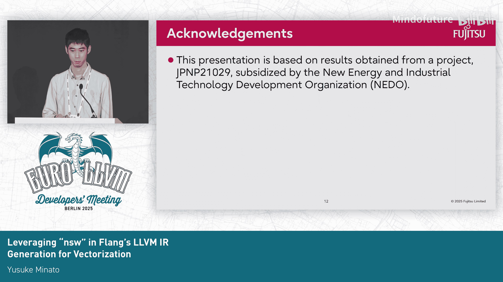
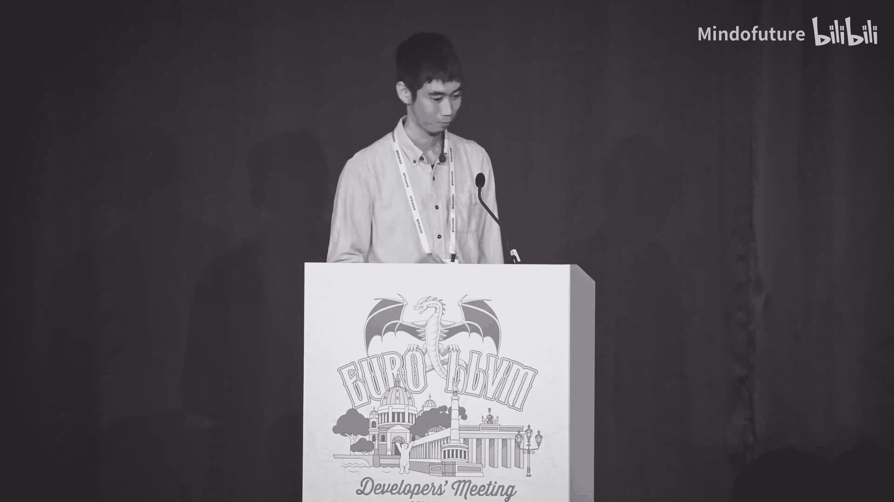

# 014：利用NSW属性提升Flang向量化能力


## 概述

在本节课程中，我们将学习如何通过在Flang生成的LLVM IR中添加“无符号溢出”（`NSW`）属性，来提升后端循环向量化（Vectorization）的能力。课程内容基于2025年LLVM欧洲开发者大会的相关演讲，我们将解析其核心思路、实施方法以及面临的挑战。

---

## 背景：Flang与向量化

上一节我们介绍了优化背景，本节中我们来看看具体的技术路径。

Flang是LLVM项目中的Fortran前端编译器。它本身不包含向量化优化通道，而是依赖LLVM后端中的`LoopVectorize`等通道进行优化。向量化在性能优化中扮演着重要角色，因此提升后端的向量化能力是关键。

为了评估向量化能力，我们使用了一个名为**TSVC**的基准测试套件。该套件包含用Fortran和C编写的测试循环，有助于区分前端生成问题与后端优化问题。

尽管Flang依赖后端优化，但前端生成的LLVM IR质量会直接影响后端向量化的难易程度。如果IR过于复杂或信息不足，后端优化器可能无法有效进行向量化。

---

## 问题分析：阻碍向量化的循环类别

以下是我们在TSVC测试中发现的、Flang 19版本无法向量化而Clang 19可以向量化的循环类别。这些类别指出了前端IR生成可以改进的方向：

1.  **数组下标分析的复杂性**：Fortran中数组下标计算涉及不同位宽（32位到64位）的转换和偏移量计算，导致IR复杂。
2.  **通过引用传递的归约变量**：作为参数传递的归约变量增加了分析难度。
3.  **编译时大小未知的数组**：动态数组形状影响了向量化的确定性。
4.  **仅需类型提升的循环**：这些循环本应更容易向量化。

我们认为，类别A和B的问题可以通过在前端生成LLVM IR时添加更多信息来解决。本教程将重点讨论如何利用`NSW`属性解决类别A的问题。

---

## 核心概念：NSW属性

上一节我们明确了问题所在，本节中我们来看看解决问题的核心工具——`NSW`属性。

`NSW`是LLVM IR中应用于整数运算指令（如`add`, `sub`, `mul`）的一个属性。它是“No Signed Wrap”的缩写，表示该指令的**结果不会发生有符号整数溢出**。

### NSW的作用

`NSW`的一个关键用途是**简化涉及不同位宽整数的计算**，并为优化器提供关键信息。

考虑以下表达式是否恒等：
`(i + 1) - 1 == i`

实际上，在数学上这并不总是成立。在C语言中，如果`i`是`int`类型且等于`INT_MAX`，那么左边表达式会因溢出而得到`INT_MAX - 1`，右边则是`INT_MAX`，两者不等。

**然而**，如果加法操作具有`NSW`属性，即编译器能确定`i <= INT_MAX - 1`，那么该等式就成立。优化器可以利用这个信息进行化简。

在LLVM IR中，带有`NSW`的加法指令如下所示：
```llvm
%sum = add nsw i32 %i, 1
```

### NSW在Fortran中的适用性

那么，我们能否安全地为Fortran运算添加`NSW`属性呢？

关键在于语言规范。**Fortran标准并未定义整数溢出的行为**，这意味着如何处理溢出由编译器实现决定。因此，主流Fortran编译器（如`gfortran`, `ifort`）通常**假设循环变量、数组下标和循环边界计算不会溢出**。

基于此，我们可以做出相同假设，并为这些计算添加`NSW`属性，以帮助优化。当然，我们也提供了一个编译选项（`-fno-signed-integer-overflow`）来禁用此行为，以满足需要严格溢出检查的用户。

---

## 实施方案：在Flang中集成NSW

了解了NSW的原理和适用性后，现在我们来看看在Flang中的具体实现方法。

我们在Flang的IR生成器（`Fortran::lower::ExprBuilder`）中引入了一个新的标志。这个生成器负责递归地将抽象语法树（AST）节点降低为LLVM IR指令。

该标志控制是否为目标整数运算指令添加`NSW`属性。其逻辑如下：

*   **默认启用**：为**循环变量增量**、**数组下标计算**和**循环边界计算**添加`NSW`。
*   **特殊情况禁用**：对于Fortran 2008及以后版本中引入的、用于位运算比较的内部函数（如`POPCNT`, `LEADZ`），不添加`NSW`，因为它们可能有不同的溢出语义。

### 代码生成示例

考虑一个简单的Fortran `DO`循环：
```fortran
DO i = 1, N
  A(i) = B(i) + C(i)
END DO
```

在优化前的LLVM IR中，循环边界和下标计算是普通的算术运算。经过我们的修改后，生成的IR会包含`NSW`属性：

```llvm
; 循环上界计算 (可能涉及转换)
%ub = add nsw i64 %N, 0
; 数组下标计算 (从32位扩展到64位)
%idx.ext = sext nsw i32 %i to i64
%idx = sub nsw i64 %idx.ext, 1
; 循环变量递增
%i.next = add nsw i32 %i, 1
```

这些`NSW`属性向后端的`LoopVectorize`通道提供了关键的不溢出保证，使其能够更准确地分析循环，并成功将更多循环类别A中的代码向量化。

---

## 挑战与未解决的问题

在实施过程中，我们也遇到了一些挑战和尚未解决的问题。

1.  **与现有优化的交互**：添加`NSW`属性意外触发了`LoopStrengthReduce`（循环强度削减）通道中的一个性能回归。该通道在考虑`NSW`时进行了不同的转换，虽然转换本身合理，但却阻碍了后续某些优化分析。这体现了优化通道之间复杂的相互作用。
2.  **剩余问题**：TSVC中类别B（通过引用传递的归约变量）和类别C（编译时大小未知的数组）的问题根源已经找到，但目前尚无简便的解决方案。解决它们可能需要更复杂的前端变换或新的分析机制。

---

## 总结

本节课中我们一起学习了如何利用LLVM IR的`NSW`属性来提升Flang编译器的向量化能力。

我们首先分析了Flang在向量化方面面临的主要问题，特别是数组下标计算复杂化导致的向量化失败。然后，我们深入探讨了`NSW`属性的含义和作用，明确了在Fortran语境下安全添加该属性的依据。接着，我们介绍了在Flang前端IR生成器中集成`NSW`属性的具体实现策略。最后，我们了解了当前方案遇到的挑战以及尚未解决的其他向量化障碍。





这项改进使得Flang 20能够向量化此前无法处理的三个TSVC测试循环，是提升Fortran编译器性能的一次有效实践。它强调了前端高质量IR生成对后端优化的重要性。