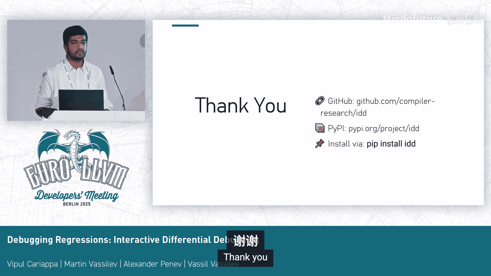

# 016：交互式差分调试

## 概述

在本节课中，我们将学习如何使用交互式差分调试技术来定位复杂软件系统中的回归问题。我们将介绍差分调试的核心概念，并通过一个实际演示来展示如何利用工具快速缩小问题范围。

---

## 问题领域：复杂的软件系统

现代软件系统通常由数百万行代码构成，并由全球各地的开发者共同维护。在这样的系统中，开发新功能或进行维护工作很容易引发意外的行为，导致系统其他部分出现代码回归。这些问题通常难以隔离和复现。

随着系统复杂度的增加，调试成为开发周期中一项耗时且困难的任务，这对软件质量和添加新功能的能力产生了负面影响。

## 差分调试：一种强大的方法

差分调试是一种强大的方法，有助于缓解上述问题。其核心思想是使用一个先前稳定的版本作为参考点。通过将当前版本与基准版本进行比较，我们可以轻松地缩小问题可能被引入的范围，从而显著减少搜索空间。

然而，现有的工具通常将两个调试实例完全分开处理，它们之间无法通信或同步，这错失了一个重要的机会。

## 介绍交互式差分调试器

我们的解决方案是交互式差分调试器。它自动化了过滤参考版本和回归软件系统之间无关执行路径的过程。

让我们看看它的实际工作原理。首先，它同时持有同一系统的两个版本：一个我们认为正确的基准版本，以及一个我们怀疑引入了错误的回归版本。

接下来，我们使用像GDB或LLDB这样的调试器，在交互式差分调试器的控制下并行运行这两个版本。这些是广为人知的调试器，我们主要关注它们。

使用它们的强大之处在于，我们利用了深度视图。交互式差分调试器会自动比较内部状态，例如变量值、调用栈、内存布局，并仅高亮显示不同的部分。这意味着我们可以忽略所有噪声，忽略行为一致的系统部分，只专注于出现分歧的执行路径。

最终，我们得到一个聚焦的调试视图，它只显示差异，这极大地加快了根本原因分析的速度。

## 系统设计与实现

交互式差分调试器被设计为像LLDB和GDB这类调试器的前端。它利用了LLDB强大的Python API，从两个目标进程获取详细信息，提供了超越传统调试器输出的丰富洞察。

虽然交互式差分调试器也能在GDB上运行，但GDB缺乏LLDB提供的专用API，这使得LLDB成为高级功能的首选后端。

该系统的工作原理是允许每个LLDB实例调试同一程序的不同版本。交互式差分调试器同步它们的执行，并过滤掉相同部分，仅高亮显示差异。

## 用户界面

通过高亮显示差异，我们可以看到程序的界面。它是基于终端的。界面分为两个并排的视图：左侧显示基准版本，右侧显示回归版本。

我们可以向两个调试器实例同时发送单个命令。如果需要，也可以向特定目标实例单独发送并执行命令。

界面上有面板显示栈帧之间的差异，例如局部变量或子程序的参数，当然还有实际的执行状态。

---

## 演示：调试一个Clang回归问题

现在到了演示时间。在演示中，我们将尝试解决GitHub上的一个问题。这个问题与类模板参数推导有关。看起来在Clang版本20中存在一个回归。

我有一个可复现的案例。我们有一个结构体`S`，它有一个嵌套的`M`构造函数。我们断言其值类型等于`int`。如果我使用LLVM版本19执行此代码，不会引发任何问题。而如果我使用LLVM版本20，它会报告一个静态断言错误，但这并非预期行为。

我将启动交互式差分调试器。我指定LLDB作为我的基准调试器，使用版本19作为基准目标，版本20作为回归目标，然后启动它。

这需要一点时间，因为它需要读取所有符号，而这些二进制文件相当大。

因为我们要调试与模板推导相关的内容，所以我将在这里设置一个断点并启动程序。

现场演示总是有挑战性的。我们在“从初始化中推导模板特化”处停止了执行。这就是视图，你可以看到栈帧、局部变量、参数以及调试视图本身。为了简化，我修改了交互式差分调试器以在此处显示Clang版本号，这样阅读起来稍微容易一些。

目前，我们在基准版本和回归版本之间没有看到任何差异。让我们逐步执行，直到找到一些分歧。

我们有一些“候选”和“最佳”结果，这可能是我们需要查看的地方。还有一个“尝试解析重载”的lambda函数，可能也值得关注。

我们正在执行“尝试解析重载”lambda函数。执行后，让我们输出它解析出的“最佳”结果。

现在你可以看到，在基准版本中，我们构建了一个`int`类型，而在回归版本中，我们得到了记录类型，即结构体本身。我们在这里看到了分歧。差异视图让你更容易在基准版本和回归版本之间进行比较，颜色使其非常容易识别这些差异。

让我终止进程并重新启动，我们可以进入那个lambda函数看看。

我将步入这个函数。再次，看起来这里没有任何分歧。让我们继续执行。

我们位于一个`for`循环内部，正在添加潜在的推导候选。让我们步入这个函数，也许这里很有趣。“最佳可行函数”。再次，基准版本和回归版本看起来没有分歧。

但是，如果我们步入这里然后继续执行，我们看到了一个明显的分歧。基准版本在执行其他内容，而回归版本在执行完全不同的东西。在这种情况下，你可能更希望独立地查看基准版本或回归版本，而不需要交叉通信。在这种场景下，你可以使用中间的输入字段向回归版本或基准版本单独发送特定命令。

我将执行到下一个执行点。看起来我们在执行同一行代码，因此我可以再次同步执行并继续下一步。

让我们看看是否有其他分歧。这里似乎有一个分歧。如果我们向上滚动查看，我们位于一个`if`语句中，即“获取更特化的模板”。看起来在我们的基准版本中，我们进入了`if`块，而控制流退出了。所以在基准版本中，`if`语句结果为真，而在回归版本中，`if`语句结果为假。

因此，我们现在确切地知道了基准版本和回归版本在何处产生分歧。这有助于缩小搜索范围并精确定位错误出现的位置。如果需要，我们可以进一步调试，但我会在这里停止并继续幻灯片内容。

---

## 未来工作

未来的工作方向包括改进语义调试。在演示中，你可以看到指针值不同，但底层数据可能相同。在这种情况下，调试器声称基准版本和回归版本之间存在差异是没有意义的。我们希望关闭地址空间布局随机化能有所帮助，但不确定如何消除指针地址不同但底层值相同的情况下的差异。它应该能够识别出这是相同的东西。

下一个方向是自动在分歧的栈帧处中断。假设我们有两个版本，在基准版本中函数A调用函数B，而在回归版本中函数A调用函数C，那么栈帧就会产生分歧。在我们的示例中没有展示这种情况，但在这种栈帧分歧的情况下，也许可以引入一个新命令，例如“运行直到栈帧分歧”，一旦两个版本的栈帧产生分歧就停止执行，并将控制权交给用户，以便我们检查发生了什么。

观察分歧的变量。我们已经有了观察点，可以在特定变量值改变时暂停程序。但在我们的案例中，这可能不是很有趣。更有趣的场景是变量值发生了变化，但在基准版本和回归版本中的变化不一致。例如，基准版本中的某个整数被赋值为5，而回归版本中为25。在这种情况下，我们希望停止执行并检查发生了什么，而不是仅仅在变量上设置观察点并在所有场景下查看。

更好的GDB支持。GDB目前没有为我们提供可构建的API。我们目前在内部启动GDB命令行界面，然后使用通用输入/输出管道与GDB接口通信，这是一个非常糟糕的设计，使得同步执行变得困难。因此，我们可能需要添加API，或者找出其他解决方案，但GDB确实相当难以合作。

---

## 总结

在本节课中，我们一起学习了交互式差分调试技术。我们了解了如何利用基准版本来快速定位回归问题，通过自动化比较和过滤，将注意力集中在产生分歧的执行路径上。演示部分展示了如何使用该工具解决一个实际的Clang模板推导回归问题。我们还探讨了该工具的未来改进方向，包括语义调试增强和更好的调试器后端支持。对于处理复杂软件系统中的回归问题，交互式差分调试是一个强大且高效的辅助工具。