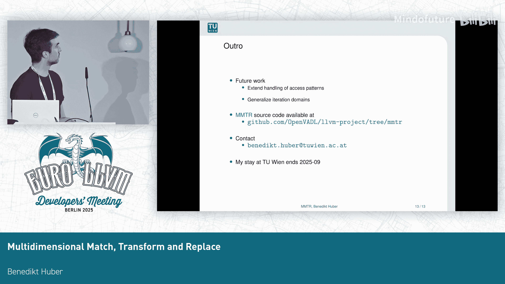

# 018：使用模式匹配、变换与代码替换


## 概述
在本节课中，我们将学习如何使用 LLVM 的 Polly 库进行多维模式匹配、循环变换和代码替换。这项技术旨在自动识别程序中符合特定模式的循环结构，将其转换为可被高度优化的目标实现（如特定库函数或硬件指令）调用的形式，从而提升程序性能。

## 多维向量化的挑战
上一节我们概述了课程目标。本节中，我们来看看多维向量化面临的挑战。在 LLVM 中，对于单维循环，我们已经拥有强大的工具，例如循环向量化器或 SLP 向量化器。然而，多维循环的优化仍然是一个开放性问题。

优化的目标实现通常以优化库函数调用的形式存在，例如 OpenBLAS 中的矩阵乘法或 Intel AMX 扩展中的二维点积。程序员通常通过显式调用这些库或内部函数来使用它们。但这种方法可移植性差且容易出错。

因此，MMTR（多维匹配、变换与替换）的目标是：
*   识别可被替换的循环。
*   对循环进行变换，使其能够被替换。
*   用优化的目标实现替换这些循环。

## MMTR 的工作原理与限制
我们观察到，许多优化的目标实现在语义上等同于一个具有以下特征的完美嵌套循环：
*   稠密且矩形的迭代域。
*   常量步长。
*   循环不变量迭代次数。
*   循环体较小，控制流不太复杂。

这些是相当强的限制条件，也可以看作是 MMTR 未来需要改进的方向。这类循环适合在多面体模型中进行分析，也适合进行模式匹配。

MMTR 作为 Polly 库的扩展实现，Polly 是随 LLVM 发行的多面体优化库。它目前实现在 LLVM 19 中，工作在 LLVM 的中端。有两种模式：
*   **参数化维度**：维度大小作为参数传递给优化目标实现，通常用于库函数调用。
*   **固定维度**：维度大小限制为固定值，通常见于操作固定大小向量或矩阵寄存器的专用指令。

## 多面体模型简介
为了理解后续内容，我们需要简要了解多面体模型。它是一种用于表示控制流和内存访问的紧凑模型。一个限制是，所有的数组索引和分支条件都必须是仿射函数（类似于线性函数）。

以下是核心概念：
*   **多面体语句**：一段线性代码，可以近似理解为基本块。
*   **多面体语句实例**：特定迭代变量取值下的一次语句执行。
*   **实例集合**：所有实例的集合。
*   **数组访问映射**：一个从多面体语句实例到数组索引的映射。
*   **多面体调度**：一个从实例到多维时间点的映射。

在 MMTR 中，我们利用这些映射来分析内存访问和执行强大的循环变换，例如循环分裂、循环融合、条带挖掘或分块。

## MMTR 的输入：M 模式
MMTR 需要为每个优化的目标实现定义一个 **M 模式** 作为输入。这个模式用于匹配目标循环。

一个 M 模式包含以下部分：
1.  **指令模式**：匹配目标循环体的指令序列。
2.  **维度信息**：需要匹配的循环维度信息。
3.  **内存访问信息**：所有内存访问的描述。
4.  **替换块信息**：匹配成功后用于替换的代码块信息。

## 实例解析：矩阵乘法
为了展示 MMTR 如何工作，我们来看一个简短的例子：一个典型的矩阵乘法实现。

以下是其核心循环结构：
```c
for (i = 0; i < N; i++) {
  for (j = 0; j < M; j++) {
    C[i][j] = 0; // 初始化块
    for (k = 0; k < P; k++) {
      C[i][j] += A[i][k] * B[k][j]; // 核心计算
    }
  }
}
```
注意其中包含一个初始化块 `C[i][j] = 0;`，这一点稍后会很重要。

### 定义 M 模式
假设我们有一个用于向量矩阵乘法的优化目标实现。我们需要在 TableGen 中为其指定 M 模式。

以下是定义步骤：
1.  **指定指令模式**：直接映射核心计算部分的指令树（乘法和加法）。
2.  **指定访问**：我们有三个读访问（A[i][k], B[k][j], C[i][j]）和一个写访问（C[i][j]）。其中，对 C 的访问是二维矩阵访问。
3.  **指定维度**：例如，固定维度，外层大小为 6，内层大小为 4。
4.  **指定替换调用**：最终指定优化目标实现的函数名及其所需参数。

### 匹配与变换过程
MMTR 按以下步骤工作：

**1. 匹配循环体**
首先，MMTR 使用指令模式检查循环体中的所有指令是否等价于该模式。同时，它会捕获后续计算可能需要的值，例如需要作为参数传递的指针。

**2. 检查实例集合的形状和大小**
目前，这被限制为矩形形状。MMTR 会检查循环的迭代域是否符合要求。

**3. 检查内存访问映射**
对于每个内存访问，检查其是否映射到指定的模式。例如，对于二维矩阵访问，它需要投影到最内层的两个维度。这涉及到模重命名等操作。

**4. 获取步长信息**
通过 Polly 的 `ArrayInfo` 功能获取访问矩阵所需的步长信息。

**5. 执行必要变换**
匹配成功后，可能需要进行变换以使循环可替换。例如，上面例子中的初始化块 `C[i][j] = 0;` 无法被目标实现替换。因此，我们需要通过操作 Polly 的调度树，使用**循环分裂**将其移出主循环体。

此外，对于固定维度模式，我们还需要进行**循环分块**，这会产生序幕、主体和尾声。最终，留在中心的主体部分就是一个与我们的 M 模式完全等价的嵌套循环。

这些变换通常不是无条件安全的，因此我们必须检查变换后的调度是否仍然有效。

**6. 代码替换**
在 Polly 的代码生成阶段，MMTR 会移除这个嵌套循环，并用对优化目标实现的调用来替换它，并提供之前捕获的参数。

## 评估与结果
我们对 MMTR 进行了评估，使用 OpenBLAS 作为目标实现。我们提供了四种模式：
*   三维模式：矩阵乘法。
*   二维模式：向量矩阵乘法（如示例所示）。
*   两种一维模式：点积和向量加法。

在 PolyBench 测试集中，30 个基准测试里有 7 个成功匹配。三维和二维案例获得了显著的加速。一维案例的性能与常规 LLVM 向量化器相当。这些好结果主要归功于 OpenBLAS 的高效实现以及基准测试本身非常适合 OpenBLAS。



此外，我们在 MLPerf Tiny 基准套件的 Visual Wake Words 模型上进行了测试。使用 TFLM 从模型文件生成 C 代码后，我们在热点函数中获得了 4 次匹配，将推理运行时间减少了 66%。

## 未来工作
MMTR 的未来工作方向包括：
*   泛化访问模式。
*   泛化迭代域的大小和形状。
*   提供更好的成本模型。

## 总结
本节课中，我们一起学习了如何使用 LLVM Polly 库的 MMTR 扩展进行多维模式匹配、变换和代码替换。我们了解了其工作原理、如何定义 M 模式、完整的匹配与变换流程，并通过实例和评估结果看到了该技术的潜力。MMTR 为自动利用高度优化的底层库或硬件指令提供了一条途径，是提升程序性能的有力工具。