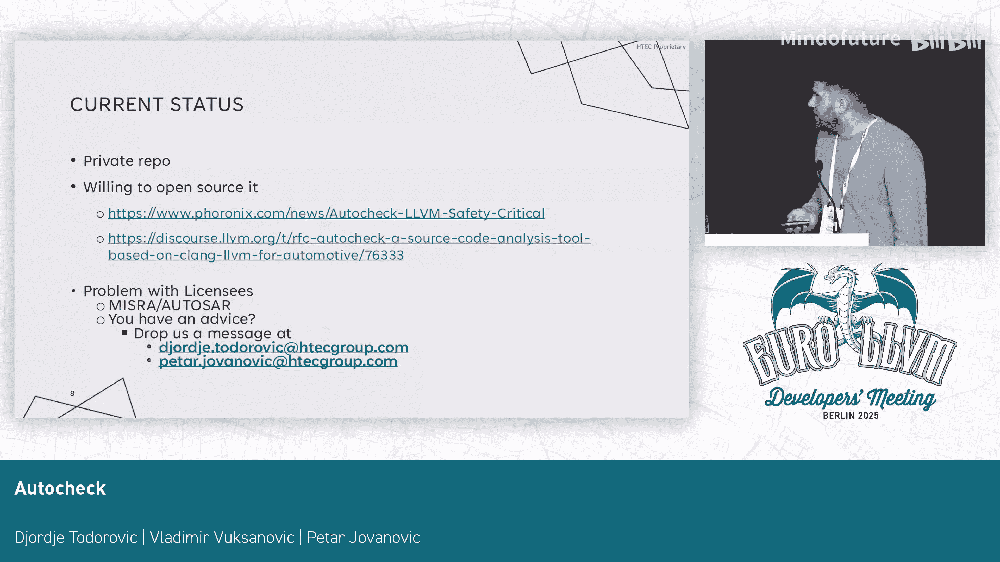
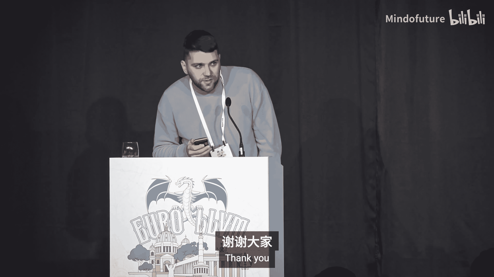

# 019：现状与问题

在本教程中，我们将介绍一个名为AutoCheck的静态分析工具。该工具主要针对MISRA和AUTOSAR编码规范，用于检查C++代码的安全性。我们将探讨其实现原理、功能特点、当前的开源状态以及面临的挑战。

## 概述

AutoCheck是一个基于Clang的静态代码分析工具，旨在帮助开发者遵循汽车行业的关键安全编码规范，如MISRA和AUTOSAR。它既可以作为持续集成（CI）流程的一部分，也可以作为代码编辑器的插件使用。本教程将详细解析其技术架构和独特功能。

## MISRA规范简介

首先，我们需要理解AutoCheck的主要目标之一：MISRA规范。MISRA是一套为编写安全C++代码而制定的编码指南，在汽车软件等安全关键型行业中至关重要。该规范支持多个C++标准，而AutoCheck工具支持其中大部分标准。

## 工具实现原理

上一节我们介绍了MISRA规范，本节中我们来看看AutoCheck是如何实现的。该工具本质上是围绕Clang库的一个封装器，其实现方式与Clang Tidy类似。

以下是实现规则所基于的几个前端阶段：
*   预处理器（Preprocessor）
*   词法分析（Lexer）
*   抽象语法树访问者（AST Visitors）
*   语法树匹配器（ST Matches）

一个有趣的特点是，部分规则是在LLVM IR（中间表示）级别实现的。这是因为在进行某些数据流分析时，使用LLVM IR比使用AST更有优势。例如，有一条MISRA规则对某些算术运算的值范围提出了约束，这条规则就是在LLVM IR层面实现的。

## 语言服务器协议（LSP）集成

正如之前提到的，我们实现了语言服务器协议（LSP）。这使得工具能够轻松集成到各种集成开发环境（IDE）中，而不仅仅是VS Code。以下是一个示例，可以清晰地展示工具如何报告规则违规。

## 人工智能集成

我们还在有意义的地方集成了人工智能（AI）。具体来说，AI被用于那些编译器技术难以处理的场景。例如，静态分析器可能建议优化结构体（`struct`）的字段布局。在进行字段重组时，我们使用AI来保持数据的局部性（cache locality）。为此，我们利用了`ama-cpp` API。

## 项目现状与挑战

这是本次介绍中最重要的部分：项目的当前状态。我们在一年前宣布了该项目并将其公开，但后来由于不确定是否违反了某些许可证（即法律问题），不得不再次将其转为私有。因此，我们确实需要帮助。

如果您或您所在的公司有相关经验，请通过提供的联系方式与我们联系。我们非常希望将此项目开源。

由于时间关系，我们无法进行演示。感谢观看。

## 总结

本节课中我们一起学习了AutoCheck工具。它是一个基于Clang、用于检查MISRA和AUTOSAR编码规范的静态分析工具。我们了解了其通过多个编译阶段（包括LLVM IR）实现规则的方式，以及它如何通过LSP支持多种IDE，并在特定场景下集成AI以提供更优的代码建议。最后，我们也了解到该项目目前因许可证问题处于私有状态，并正在寻求社区帮助以实现开源。