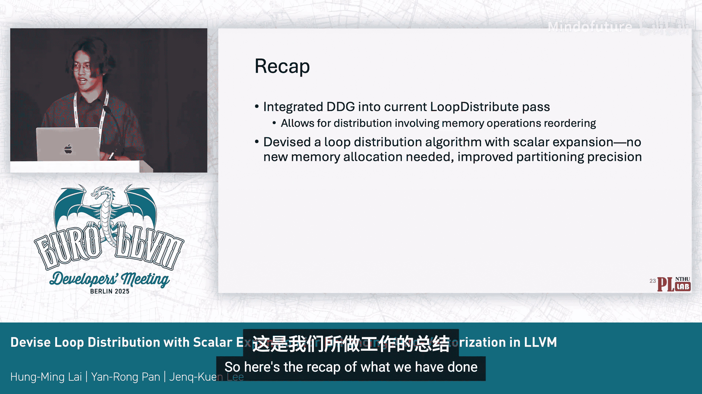
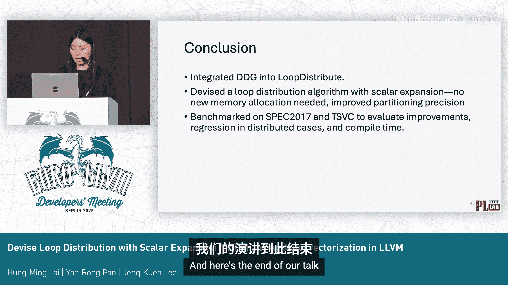
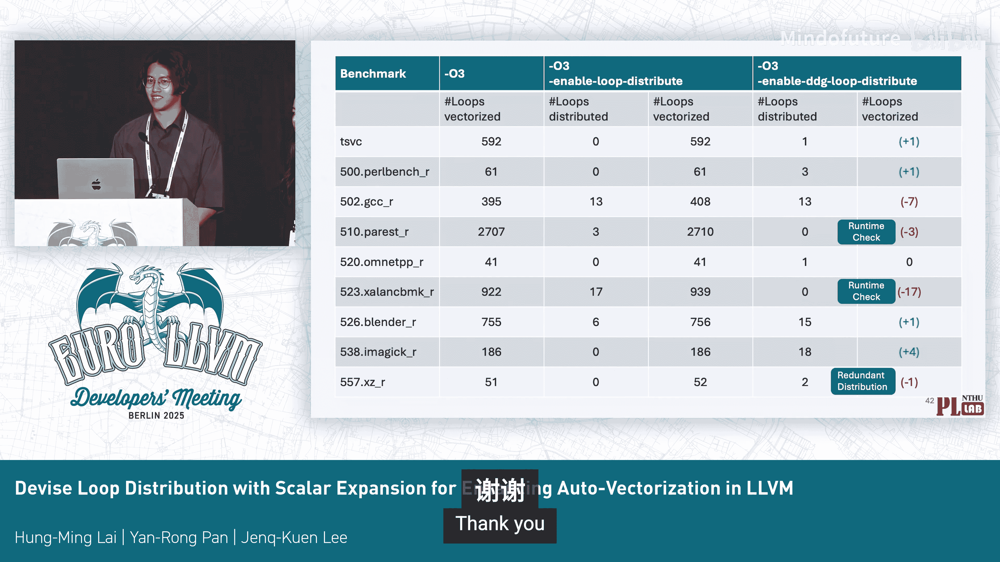
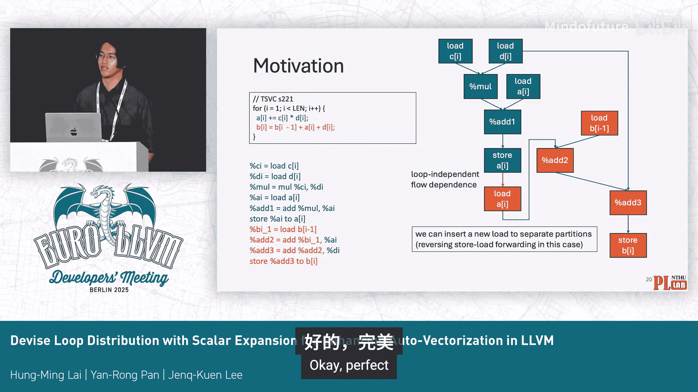

# 020：利用标量扩展增强自动向量化的循环分布

在本教程中，我们将学习如何通过改进循环分布（Loop Distribution）来增强LLVM编译器的自动向量化能力。我们将探讨当前循环分布算法的局限性，并介绍一种基于数据依赖图（DDG）和标量扩展（Scalar Expansion）的新方法。

## 背景与动机 🎯

循环分布是一种编译器变换，它将一个循环分割成多个具有相同迭代空间的循环，每个新循环只执行原循环体的一部分。然而，这种变换并非总是有益的，因为它不仅会重新调度计算，还可能复制某些计算（例如循环头）。

循环分布如何实现部分循环向量化？对于包含依赖环（dependent cycles）的循环，它们通常是不可向量化的。循环分布可以通过将这些环拆分到独立的循环中，从而实现对循环其他部分的向量化。

LLVM目前有一个循环分布优化通道（pass），其目标也是实现部分向量化。它的实现使用了一种快速、轻量级的算法，不构建依赖图，仅依赖循环简单别名分析（LAA）。但这种方法存在挑战和局限性，主要是无法对内存操作进行重排序。因此，该通道目前虽在流水线中，但默认未启用。

我们这项工作的重点是尝试利用数据依赖图来改进其分区能力，并希望未来能为“总是有益的分布”建立更好的成本模型。

## 当前算法的局限性案例研究 🔍

以下是三个展示当前分布通道局限性的案例。

**案例一：优化后分区边界不可分**
此案例取自TSVC S2121。在CSE和GVN等其他通道进行向量化前优化时，这段代码是可分布的，可以将一个语句分离到一个循环中。但优化后，冗余的加载被消除，导致分区边界变得不可分割。

**案例二：内存操作顺序敏感**
此案例展示两个具有相同计算但内存操作顺序不同的循环。只有一种模式可以被分布。这是因为当前的循环分布通道依赖于内存操作的词法顺序。

**案例三：由Phi和SSA值引起的依赖环**
此案例中的依赖环仅由Phi节点和SSA值引起。当前的分布通道可以检测由内存操作引起的依赖环，但无法检测由Phi和SSA值引起的环，因此不会分布此案例，而此案例是不可向量化的。

造成这些局限性的原因是当前算法仅依赖LAA，这使得重排内存操作变得不安全。因此，它只能分布某些特定模式，即分区边界由不安全的内存操作决定，并且如果它们共享相同的内存操作，还会导致一些合并。

## 相关工作与我们的计划 📋

社区之前对此问题已有许多努力，例如该通道原作者在其首次演讲中提到了未来基于依赖图进行分布的工作，其他演讲也提到了向基于DDG的分布迈进。值得注意的是，目前DDG补丁已经合入LLVM上游。

然而，为什么基于DDG的循环分布仍未成为现实？我们发现，人们主要担心其可扩展性，因为构建整个依赖图会带来预期的时间复杂度问题。

在我们的工作中，我们计划尝试将可用的DDG分析集成到循环分布通道中。我们试图覆盖当前算法已处理的所有情况，并通过运行一些基准测试来检查是否存在性能回归。对于未来的工作，我们希望借助此分析启用更多案例，并开发更好的成本模型用于合并和调度。

## 基于依赖图的经典分布算法 📚

经典的教科书式分布算法基于依赖图，主要包含三个步骤：
1.  将源代码转换为计算依赖图。每个节点代表一个语句，每条边代表一条内存依赖边。
2.  计算强连通分量（SCC）。同一SCC内的语句应放在同一个循环中。
3.  循环的顺序应遵循SCC依赖图的拓扑排序顺序。

## 将算法适配到LLVM IR 🔧

将此算法适配到LLVM IR最具挑战的部分是第一步。因为在原始算法中，一个语句映射到一个DDG节点，但在LLVM IR中，我们不能将单个指令放到不同的循环中，我们需要将所有依赖的指令放在同一个循环中。

首先，我们看看当前的DDG图是怎样的。其节点是指令级别的，可能包含单指令节点、多指令节点或DDG中的SCC（会形成一个管道块）。其边只有两种：一种是使用-定义链（Use-Def），另一种是内存依赖边。它目前不支持控制依赖，并且支持为单个函数或单个循环构建依赖图，无需为整个模块构建所有依赖图。

回到算法的第一步。为了适配LLVM IR，我们只需要找到“种子指令”，然后沿着使用-定义链向上遍历，获取所有依赖的指令。

但是，即使有了DDG，有些情况仍无法通过此方法启用，例如我们刚才提到的案例研究一，其中存在的冗余加载会将所有分区合并在一起。因此，我们希望引入标量扩展技术来解决这个问题。

以下是动机示例。在这个例子中，我们想将蓝色指令和绿色指令分开，但这两个种子指令依赖于同一个SSA值。这里的直觉是，我们可能希望通过加载指令重新加载这个SSA值，这样两者就变得可分离了。

这个过程类似于向量化中的标量扩展。扩展通常用于打破依赖，但通常涉及新的内存分配。例如，在右侧，你会看到每次迭代都会赋值到一个新的`T[i]`位置，从而打破由标量`t`创建的循环依赖。

我们在分布通道中想做的是检测可进行无分配扩展的标量。其要求是：存储（store）必须在每次迭代中写入不同的地址，并且新的加载（load）必须支配我们分区中的所有使用。基本上，它逆转了存储-加载转发（store-load forwarding）。我们的启发式方法是：检查存储指针的标量演化（scalar evolution）是否可计算，以验证其符合第一个要求；第二个要求是，我们使用存储的位置来验证支配性，因为目前我们在存储之后立即插入新的加载。

## 实验与结果 📊

我们的目标是覆盖原始循环分布处理的所有情况。我们主要关注被分布的循环数量，同时也会展示编译时间开销的结果。

实验设置：使用Intel核心CPU和LLVM 20编译TSVC和Spec CPU 2017基准测试。试验中有三种配置：
1.  LLVM 20，不启用循环分布。
2.  启用原始版本的循环分布。
3.  启用基于DDG版本的循环分布。

结果显示，在大多数基准测试中，我们版本分布的循环数量超过了原始版本，尽管仍有一些案例出现性能回归。

在向量化循环数量方面，约一半的基准测试表现优于原始版本，而另一半的向量化数量有所下降。我们稍后会解释这个结果。

关于编译时间回归，所有编译时间以秒为单位。最右侧一列是我们DDG版本的编译时间。可以看到，考虑到编译时间，变化并不大，而且在一些基准测试中，编译时间甚至有所减少。这是因为在我们的DDG版本中，当我们发现没有可获利的循环分布候选时，能够提前退出。

此外，从图表中可以看到，DDG分析所消耗的时间（R列）只占整个循环分布通道执行时间的一小部分。

## 结果分析与案例分类 📈

我们的DDG版本并未在所有基准测试中都表现更优。为了解释这一结果，我们将成功的分布案例分类为以下六种情况。

**情况一：冗余计算分布**
在这类案例中，原始循环分布能够进行分布，但我们可以看到，分布后分区1中的所有指令都包含在分区0中。这种分布被视为冗余计算。在我们的DDG版本中，我们会消除此类分布，并且分区1有可能被向量化。这种冗余分布也会影响向量化循环的数量。

**情况二：运行时检查案例**
在这类案例中，我们为C和D添加了`restrict`关键字，因此只需考虑A和B是否与其他内存重叠。在原始循环分布中，它会先忽略这些别名边，然后尝试分布。而在我们的DDG版本中，由于DDG不提供运行时检查功能所需的信息，我们无法处理此类案例。

**情况三：仅包含反向依赖的案例**
这类案例无法被分布，在原始版本中也无法被向量化。但我们可以看到中间的简化DDG图。如果我们交换语句顺序，将第二个语句放在前面，我们就能在不分布的情况下向量化这个测试案例。在原始循环分布中，我们无法知道这个`final`指令的内存依赖。而在我们的DDG版本中，这个`final`指令会被插入到管道块中，我们将其视为非循环分区，因此能够分布此类测试案例。

**情况四：可识别为循环分区的案例**
在这个测试案例中，我们假设第二个语句中的所有操作都是独立加载的。左侧是原始版本，能够被分布；右侧是我们的DDG版本。我们能够识别出第二个语句是一个循环分区，并且能够被我们的DDG版本分布。

**情况五：我们的工作能做而原始版本不能的案例**
我们能够使用标量扩展技术来增强循环分布。我们能够复制仅加载的指令。在这个测试案例中，语句1和语句2中都有`D[i]`，但实际上，在分区0和分区1中，它们是相同的加载`D[i]`。在原始版本中，它们会被合并到一个分区，从而导致分布失败。而在我们的DDG版本中，如果我们分析发现一个加载指令有多个使用，并且该加载指令与任何内存依赖无关，我们就能够复制这个加载，从而分布此类循环。

## 总结与展望 🌟

本节课中，我们一起学习了如何通过结合数据依赖图和标量扩展技术来改进LLVM中的循环分布，以增强自动向量化。

我们比较了两种不同版本分布的支持情况。原始版本需要保持内存操作顺序，而我们的DDG版本能够重排内存操作以增强循环分布。

然而，我们DDG版本循环分布的主要局限性在于无法提供运行时检查功能，这是因为我们的DDG不提供别名信息。此外，我们目前的方法只处理包含循环依赖的案例，对于仅包含反向依赖的案例，如果我们能如前所述重排语句顺序，则能够向量化此类案例。

关于一半基准测试在DDG版本中向量化数量下降的原因：最后一个基准测试是因为原始分布存在冗余分布，这也会影响向量化数量。另外三个基准测试则是因为我们的DDG版本不支持运行时检查，因此无法匹配原始版本分布的性能。

未来的工作可以集中在开发更精确的成本模型，以评估不同代码生成策略（如重新计算与重加载）的代价，从而做出更优的分布决策。