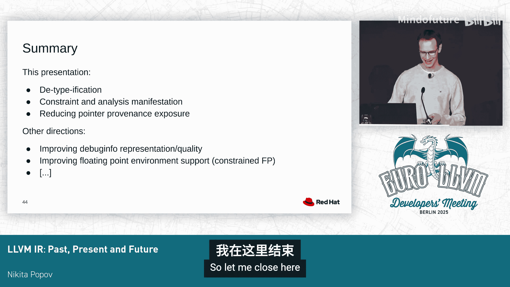

# 021：LLVM IR 的过去、现在与未来


在本节课程中，我们将回顾 LLVM IR 的发展历程，探讨其近期的重要变化，并展望未来的演进方向。我们将重点关注三个核心主题：类型的简化、分析结果的显式表达以及指针来源（provenance）的精确追踪。

## 遥远的过去：LLVM 1.0 时代

上一节我们介绍了课程概述，本节中我们来看看 LLVM IR 的起点。在 LLVM 1.0 时代，IR 的语法与今天大不相同。

它包含了一些如今已不常见的元素：
*   **实现定义的类型**：例如 `implementation begin`。
*   **C 风格整数类型**：例如 `long` 和 `U end`。
*   **一等公民的 `memfree` 指令**：用于内存释放。

随着时间的推移，这些元素逐渐被移除。LLVM 2.0 引入了更熟悉的语法和无符号整数类型。LLVM 7.0 移除了 `memfree` 指令，改用普通的函数调用。最终，在 LLVM 15.0 切换到不透明指针（opaque pointer）后，IR 才呈现出我们今天熟悉的样子。

## 类型简化：一个持续的主题

上述演变过程的一个共同主线是“去类型化”，即从 IR 中移除不必要的类型信息。

以下是两个关键例子及其动机：
*   **无符号整数类型**：用单一的 `integer` 类型替代独立的 `signed` 和 `unsigned` 类型。
*   **不透明指针类型**：用单一的 `ptr` 类型替代多种具体的指针类型（如 `i32*`）。

这样做的动机始终一致：避免引入不必要的类型转换。虽然这并非严格启用了新的优化，但它引导编译器走向更通用的方向。例如，当有符号加法和无符号加法是同一个操作时，对它们进行去重就变得非常简单。此外，这也有正确性方面的考虑：如果保留一个带有元素类型的指针，却告诉开发者这个类型没有语义，那么开发者很可能会误用。彻底移除它是防止误用的唯一方法。

## 当前进行中的变化：从 GEP 到指针加法

延续“去类型化”的方向，一个正在进行的重要变化是从 `getelementptr` (GEP) 指令迁移到 `ptr.add` 指令。

目前，GEP 是基于类型的。它需要一个基类型和指向该类型的索引。以下三个 GEP 指令实际上执行完全相同的操作：将一个指针增加 4 个字节。
```llvm
%p1 = getelementptr i32, ptr %base, i64 1
%p2 = getelementptr [4 x i8], ptr %base, i64 0, i64 4
%p3 = getelementptr {i16, i16}, ptr %base, i64 0, i32 1
```
我们的目标是将其转变为单一的 `ptr.add` 指令，该指令只做一件事：给指针增加一个偏移量。

这项迁移已部分完成。目前，在可能的情况下，我们使用 `getelementptr i8`，这基本上等同于 `ptr.add`。尚未完成的是对可变偏移量的处理。这种情况更为复杂，因为它通常涉及一个缩放因子。这个缩放因子可以表示为独立的移位或乘法指令，也可以作为原生缩放支持内嵌到 `ptr.add` 指令中。关于采用哪种方向的决定尚未做出，这也是该项目目前停滞的地方。

## 其他潜在的简化方向

“去类型化”的思路可以应用到更多地方：
*   **`load`/`store` 指令**：目前它们接受一个类型参数，但实际只使用该类型的大小和对齐信息。理想情况下，应直接表示大小和对齐，这可以防止开发者做出错误的假设（例如，忽略结构体中的填充字节）。
*   **各种属性**：如 `byval`、`sret`。
*   **全局变量**：这更棘手，因为它们还涉及初始化器。

## 指令标志的激增与价值

现在，让我们切换到一个完全不同的主题。在过去的几个 LLVM 版本中，我们添加了大量新的指令标志。

以下是新增标志的例子：
*   `or disjoint`
*   `zext` 的 `nneg` (non-negative)
*   `icmp` 的 `us` (unsigned signed) 等

许多新标志的目标之一是能够撤销规范化转换。例如，一个 `or disjoint` 指令可以转换回 `add`；带有 `nneg` 标志的 `zext` 可以转换回 `sext`；带有 `us` 标志的比较可以透明地在无符号和有符号谓词之间切换。

这样做的动机包括：
1.  **撤销转换**：某些优化（如地址模式匹配）可能更偏好原始的指令形式（如 `add` 而非 `or`）。标志允许我们在更复杂的场景中可靠地撤销之前的转换。
2.  **显式分析结果**：将一个过程（如复杂的过程间分析）推断出的信息，通过标志传递给另一个只进行局部变换的过程。
3.  **传达前端保证**：基于语言语义，前端可以附加一些 LLVM 自身可能无法推断出的保证。

## IR 中的值约束：一个核心挑战

将分析结果或值约束显式化到 IR 中，是优化编译器的核心挑战之一。LLVM 提供了多种机制，但没有一种是完全令人满意的。

以下是现有机制及其问题：
*   **属性与元数据**：允许表达精确的信息（如精确的值范围），但主要作用于调用或加载边界，一旦内联就很容易丢失。
*   **指令标志**：精度较低（如 `nneg` 只提供一个比特的信息），且只适用于特定指令。
*   **假设（`assume`）**：完全通用的机制，可以编码任何信息，但额外的指令和使用会阻碍优化。

我们当前的策略是继续添加更多的属性和标志，希望情况能有所改善。

## 一个前瞻性构想：操作数标志

一个思考方向是，某些新标志实际上与周围的指令无关，纯粹是关于值的陈述。因此，更合理的做法可能不是创建像 `zext nneg` 这样的指令，而是让一个普通的 `zext` 指令的某个操作数具有 `nneg` 标志。

这种“操作数标志”的概念可以泛化，涵盖许多最近添加的指令标志（如 `ui2fp` 的 `nneg`、`icmp` 的 `us`），甚至包括一些我们目前没有但很有用的标志（如 `sub nsw` 的 `nneg`）。进一步的泛化是在特定使用点或操作数上附加范围信息。

然而，这个构想面临巨大挑战：
*   **维护负担**：每次添加新标志都会带来大量的更新工作，因为许多变换会就地修改指令，可能无法维持新标志的不变性。
*   **存储开销**：为每个用户存储信息会带来开销。不过可以进行一些权衡，例如只存储前导零比特数，这能以更低的成本获得大部分优化收益。

这个方向目前仍非常具有推测性，其可行性有待验证。

## 指针来源与捕获属性

让我们回到更实际的议题。除了新指令标志，我们也添加了许多新属性，动机类似：传达前端约束和显式化分析结果。这里我们重点讨论最新的 `captures` 属性。

`captures` 属性取代了旧的 `nocapture`（即 `captures none`）。它的新意在于允许指定指针的哪些组件可能被捕获，主要组件是地址（address）和来源（provenance）。

我们可以这样声明：
*   这个指针参数只捕获指针的地址，但不捕获其来源。
*   或者，它捕获两者，但仅通过函数返回值。

这里的核心区别是：
*   **地址**：指针的整数值或指针身份。
*   **来源**：通过该指针进行内存访问的实际权限。



了解一个内存对象的地址并不意味着你被允许使用它，你必须拥有相应的来源。这个区别对别名分析和内存优化至关重要，它们只关心来源，不关心地址。例如，仅比较地址但不暴露来源的指针比较，将不再干扰别名分析和内存优化。

## 减少来源暴露的更大目标

强调这个话题，是因为它是一个更大目标的一部分。考虑 `ptrtoint` 指令：它将指针转换为整数，然后你可能想将整数转换回指针。`ptrtoint` 转换会暴露指针的来源，然后在 `inttoptr` 时恢复。问题在于，这从技术上使 `ptrtoint` 产生了副作用，意味着我们不应该消除它。但为了优化，我们有时还是会这样做，尽管这可能导致错误的编译结果。

部分问题在于，LLVM 目前没有任何机制可以让你获取指针地址而不同时暴露其来源。因此，我们需要这样的机制，例如为 `ptrtoint` 添加一个标志，或者一个单独的 `ptrtoaddr` 指令。

与此密切相关的是，IR 中 `ptrtoint` 的一个最大贡献者是**指针减法**，因为 LLVM 没有原生操作。你必须先将指针转换为整数，然后再进行整数减法。这意味着每次指针减法都会暴露来源，导致指针“逃逸”，从而使大多数内存优化停止工作。

因此，我认为我们应该有一个专门的 `ptr.sub` 指令来镜像 `ptr.add`，它应该只捕获地址。如果结合常见的标志（例如，要求相减的指针属于同一内存对象），那么减法甚至不会泄露任何关于对象基地址的信息。

## 总结与展望

本节课中我们一起学习了 LLVM IR 演进的三个核心方向：

1.  **去类型化议程**：持续简化 IR 中的类型信息，例如从不透明指针到 `ptr.add` 指令的迁移，旨在减少不必要的复杂性并防止误用。
2.  **分析结果与约束的显式化**：通过指令标志、属性等机制，将分析信息和前端保证编码到 IR 中，以促进优化过程间的协作。
3.  **减少指针来源暴露**：更严肃地对待指针来源，通过新属性（如 `captures`）和潜在的新指令（如 `ptr.sub`），目标是减少因 `ptrtoint` 等操作导致的错误编译，同时在此过程中改进优化。

当然，IR 的变化远不止这些。例如，最近有出色的工作将调试信息表示从内部函数转换为记录格式，未来还有更多改进调试位置处理的变更。此外，即将有重大变化来改进受约束浮点运算的表示方式（从专用内部函数转换为通用内部函数上的操作数绑定包）。由于时间关系，这些内容无法在此详述。


LLVM IR 的演进是一个持续的过程，需要在引入新功能、改进优化能力和维护生态系统稳定性之间不断权衡。