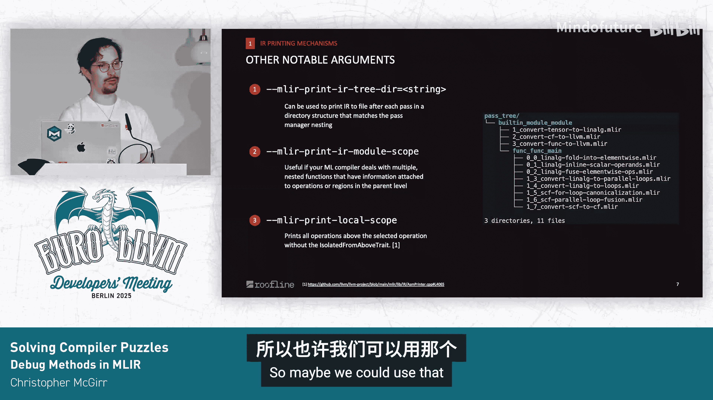
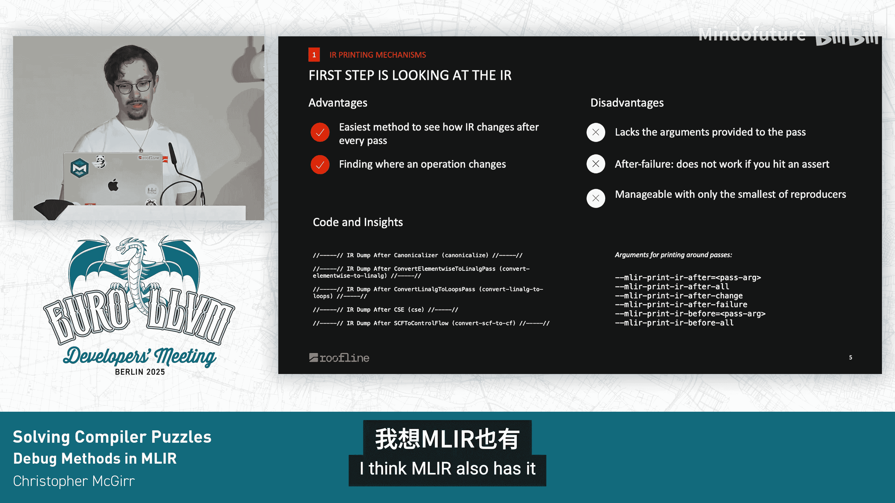

# 024：解决编译器难题


在本教程中，我们将学习在 MLIR 框架中调试 AI 模型编译问题的实用工具和方法论。我们将重点介绍如何应对非源语言输入（如 ONNX 等交换格式）的大型模型编译挑战，并探索一系列从基础到进阶的调试技巧。

## 概述：MLIR 调试的挑战与工具

调试 ML 编译器时，我们常面临几个核心挑战：输入文件巨大（可能包含数 GB 的常量数据）、需要理解多层抽象、以及可能遇到诸如过程序错误、形状推断失败或模式匹配失败等问题。为了高效定位问题根源，我们需要一套系统化的调试方法。

接下来，我们将逐一探讨五个主要的调试主题，从最基本的 IR 查看开始。

## 1️⃣ 打印机制：查看 IR 状态

调试的第一步通常是查看中间表示（IR）的当前状态。MLIR 的 `mlir-opt` 工具提供了一系列打印参数，可以帮助我们观察编译过程中 IR 的变化。

以下是几个常用的打印参数：
*   `-print-ir-after-all`：在每个过程后打印 IR。
*   `-print-ir-before-all`：在每个过程前打印 IR。
*   `-print-ir-after-failure`：在过程失败后打印 IR。

这些参数会输出类似 `// -----// IR Dump After SomePass (some-pipeline) // ----- //` 的头部信息，清晰地标记 IR 所处的阶段。

**局限性**：这些方法较为基础。如果过程是参数化的，仅看 IR 可能难以理解其具体行为。此外，对于段错误或断言失败等硬性故障，`-print-ir-after-failure` 可能无法生效。最重要的是，当处理像 Llama 3.2 这样的大型模型时，向终端输出数十 GB 的文本是不现实的。

## 2️⃣ 处理大型文件：省略常量与结构化输出

上一节我们提到了打印大型 IR 的困难。MLIR 提供了 `-mlir-elide-elementsattrs` 和 `-mlir-elide-resource-strings` 选项，可以省略元素属性和资源字符串的打印，这对于阅读包含大量常量的 IR 非常有帮助。

除了省略内容，我们还可以将输出结构化保存到文件，便于在不同编译状态间跳转分析。

以下是两个有用的参数：
*   `-mlir-print-ir-after-all-to=/path/to/dir`：将每个过程后的 IR 转储到一个目录结构中，该结构模仿了过程管道的层次。
*   `-mlir-print-ir-module-scope`：当过程在函数上操作，但调试需要查看模块级别的属性时，此参数会打印整个模块范围的 IR。
*   `-mlir-print-ir-local-scope`：如果 IR 中包含嵌套的、具有 `IsolatedFromAbove` 特性的操作，此参数只打印到第一个此类操作为止，避免输出过多内容。

## 3️⃣ 深入过程内部：调试模式与模式匹配

当我们通过打印将问题范围缩小到某个特定过程后，需要深入该过程内部，了解其模式匹配的细节。这时可以使用 `-debug` 和 `-debug-only` 参数。

**重要提示**：这些参数仅在 **Debug 模式** 构建的 MLIR 中可用。它们会打印每个模式匹配成功或失败的信息。如果一个过程包含大量模式，输出会非常冗长。幸运的是，一些模式会通过 `notifyRewriteFailure` 提供友好的失败信息。

对于开发者而言，在创建新过程时，使用 `LLVM_DEBUG` 宏添加调试语句是帮助未来自己和其他开发者的好习惯。当然，这种调试方式同样只适用于较小的 IR 片段。

## 4️⃣ 生成与使用重现器（Reproducer）

为了稳定地复现和报告问题，MLIR 提供了重现器功能。它能在编译器失败时，生成一个包含重放失败所需参数的自包含 IR 文件。

使用方式如下：
`mlir-opt my_input.mlir -pass-pipeline=“...” -mlir-generate-reproducer=reproducer.mlir`

生成的 `reproducer.mlir` 文件末尾会附加一个 `_mlir_reproducer` 外部资源，其中序列化了运行的管道字符串和其他标志（如是否禁用线程）。

**注意事项**：
1.  确保你的过程中所有参数都是**可序列化**的。如果过程接受一个自定义结构体作为参数，但该结构体没有实现从字符串的序列化/反序列化，重放时会导致奇怪且令人困惑的失败。
2.  深层嵌套的过程管理器有时可能导致异常行为。
3.  要生成一个仅重放失败前最后一个过程的“本地重现器”，需要确保在 MLIR 上下文中禁用了线程（`-mlir-disable-threading`）。

## 5️⃣ 交互式调试：LLDB 集成

对于更复杂的交互式调试，可以集成 LLDB。LLVM 和 MLIR 子项目提供了优秀的“漂亮打印”功能，可以将复杂的内部数据结构转换为更易读的格式。

例如，在调试器中，一个 `OpOperand` 的 `producer` 和 `consumer` 字段可能被漂亮地打印为具体的操作名称（如 `linalg.generic`），而非原始的内存地址。

**配置示例**（VS Code `launch.json`）：
```json
“miDebuggerArgs”: “-q -ex ‘script sys.path.insert(1, \“/path/to/llvm-project/llvm/utils/lldb\”)’ -ex ‘script sys.path.insert(1, \“/path/to/llvm-project/mlir/utils/lldb\”)’ -ex ‘command script import lldb_utils’ -ex ‘command script import mlir_lldb’”
```

对于尚不支持漂亮打印的复杂类型（如 `Value`），在 LLDB 终端中直接调用 `op->dump()`、`attr.dump()`、`type.dump()` 等方法通常是有效的。

MLIR 还支持**操作调试**，允许在更高粒度（如特定过程或模式）上设置断点。当调试器停在断点时，可以使用 MLIR 的游标功能来检查 IR，并跳转到父操作或子操作。这需要启用相应的调试钩子以确保断点被正确注册。

## 6️⃣ 自动化问题简化：MLIR-Reduce

最后，我们介绍用于自动化缩小问题范围的工具：MLIR-Reduce。给定一个触发错误的 IR 和一个用于检测错误是否仍然存在的测试脚本，MLIR-Reduce 会尝试不断简化 IR，直到得到一个最小的、仍能触发错误的复现用例。

**公式**：`MLIR-Reduce(Input_IR, Test_Script) -> Minimal_Reproducer_IR`

这在理论上非常适合自动化错误报告，甚至可以集成到 CI 中自动生成工单。MLIR 官方文档详细记录了如何使用它以及如何为自定义方言或操作实现简化模式。

**实践经验**：然而，在实际使用中，MLIR-Reduce 有时无法充分简化问题，且需要一定的进阶知识来配置。很多时候，手动将 IR 输出为文本格式并删除无关行，直到剩下几个能触发问题的操作为止，可能速度更快。

此外，还有一些下游项目提供了定制的简化工具，如 MLIR-EIE-Reduce 和 Circuit-Reduce，它们可能包含比原生 MLIR-Reduce 更多的功能。

## 总结与额外资源

本节课我们一起学习了在 MLIR 中调试编译器问题的多种方法。我们从基础的 IR 打印开始，探讨了处理大型文件、深入过程调试、生成重现器、使用 LLDB 进行交互式调试，以及利用 MLIR-Reduce 自动化简化问题。

总的来说，MLIR 已经提供了相当丰富的工具集来应对大多数调试场景，当然仍有改进空间以提升开发效率。除了这些工具，还有两个宝贵的资源：
1.  **Lit 测试**：对于理解某个过程的预期行为非常有帮助。相比阅读复杂的 C++ 代码，查看输入 IR 和预期输出 IR 的测试用例通常更直观。
2.  **阅读源代码**：最终，深入阅读相关过程和工具的代码是理解其工作原理和调试方法的最根本途径。

希望本教程能帮助你更高效地解决 MLIR 编译器中遇到的难题。


---

### 问答环节摘要

**问：关于重现器，你提到选项必须可序列化。有一种机制是在 TD 文件中定义过程并提供选项，这是否满足了要求？**
答：使用 TableGen 定义的过程可以满足要求。问题通常出现在纯 C++ 实现且未使用 TableGen 的过程中。在一个大型编译器管道中，定位是哪个过程导致的问题可能比较困难，因为错误信息可能比较隐晦。

**问：我希望能在过程之间对 IR 进行差异比较。SSA 值编号会变化，导致微小的改动引发后续大量变更，使得常规 diff 工具不太有用。是否有专门工具？**
答：我目前不太清楚。但今天早些时候有一个关于 diffing LLVM IR 的精彩演讲，其技术或许可以应用到 MLIR 上。



**问：LLVM 有一套丰富的 `-print-changed` 功能，可以显示过程间精简的差异，而不是打印全部 IR。MLIR 有计划引入类似功能吗？**
答：我认为 MLIR 可能已经有了类似功能，只是我没有在幻灯片中列出。需要核实一下。





