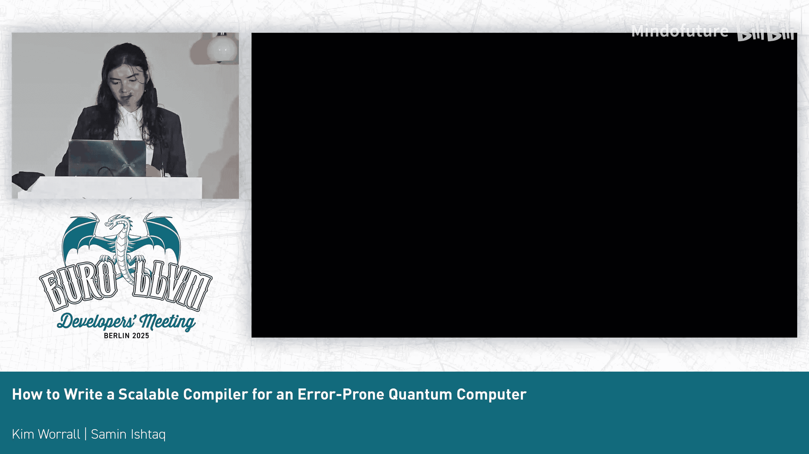

# 025：如何为易出错的量子计算机编写可扩展的编译器

在本教程中，我们将学习如何为易出错的量子计算机设计一个可扩展的编译器。我们将从量子计算的基础概念开始，逐步深入到编译器设计中的具体挑战和解决方案，包括中间表示、错误校正、硬件控制以及优化策略。

## 量子计算基础 🧠

首先，我们需要了解什么是量子计算机。量子计算机使用量子比特（qubit）作为基本计算单元，与经典比特不同，量子比特可以同时处于0和1的叠加态。

## 量子编程栈与硬件抽象 🔗

上一节我们介绍了量子计算的基本概念，本节中我们来看看量子编程的软件栈和硬件抽象。

目前存在多种量子编程语言和多种物理实现量子比特的技术（如超导、离子阱等）。这些不同的硬件平台需要统一的抽象层。

量子硬件通常由一个极低温的冰箱（用于维持量子态）和内部的物理量子比特阵列组成。我们需要一个控制系统来与这些物理量子比特进行交互。

以下是描述与物理量子比特交互的基本操作：

1.  **初始化**：将一个物理量子比特（例如 `Q1`）初始化为 `|0>` 态。
2.  **单量子比特门操作**：对单个量子比特施加一个操作（门），这会改变测量时得到0或1的概率。
3.  **双量子比特门操作**：对两个量子比特施加相互作用。
4.  **测量**：在计算结束时，测量一个量子比特，得到一个可用于经典计算的比特结果。

## 物理约束与挑战 ⚙️

了解了基本操作后，我们必须认识到物理世界带来的约束。

*   **不可克隆定理**：量子信息不能被完美复制。这意味着我们不能将同一个量子比特同时传递给一个需要两个输入的门，但可以通过交换操作来移动信息。
*   **物理连通性**：如果两个量子比特需要相互作用，它们必须在物理位置上相邻。这直接影响我们的寄存器分配策略。
*   **内存与计算空间统一**：在量子计算机中，存储量子信息的内存空间本身就是计算发生的空间，这与经典计算机中从内存获取指令的模式不同。
*   **测量的破坏性**：测量通常是破坏性的。如果在不进行量子交互的情况下对同一个量子比特测量两次，会得到相同的结果。

为了优化，我们使用类似静态单赋值（SSA）的形式，称为QSSA。当我们与一个量子比特交互后，该操作会返回一个新的SSA值，供后续操作使用。

## 硬件控制系统详述 🖥️

上一节我们讨论了物理约束，本节我们具体看看控制量子比特的硬件系统。

实际的硬件控制由现场可编程门阵列（FPGA）板卡完成。每块FPGA板卡连接着一些导线，这些导线控制着不同的设备（如激光器）。通过向特定导线发送特定时长的脉冲，可以控制激光照射量子比特，从而引发相互作用。

由于导线体积庞大，我们通常需要多个控制盒，每个控制盒管理大约4到6个量子比特。这意味着这些控制盒之间需要同步。如果一个操作涉及分属两个不同控制盒的量子比特，那么这两个控制盒的操作必须精确同步。

此外，我们还需要一个“转换”步骤。虽然像CNOT门这样的操作对经典计算机科学家来说很直观，但它可能不是硬件原生支持的。我们必须将其转换为硬件可以执行的基本操作序列。这些底层操作被称为“脉冲方言”，它们描述了向特定导线发送多长时间的脉冲来控制激光。

## 量子错误校正的必要性 🛡️

量子错误校正对于量子计算机至关重要，因为大约每1000次操作就会发生一次错误（如比特翻转）。任何一个错误都可能毁掉整个计算。特别是，量子比特可能会“退相干”，即从量子态退化为经典态，这通常每几微秒就可能发生。

错误校正的基本思想是将一个逻辑量子比特的数据编码到多个物理量子比特上。以下是错误校正的基本步骤：

1.  **数据编码**：将一个逻辑量子比特的数据编码到多个物理数据量子比特上。
2.  **添加辅助量子比特**：引入一些初始为空的辅助量子比特。
3.  **交互与测量**：让数据量子比特与辅助量子比特进行交互，然后测量辅助量子比特（而不直接测量数据量子比特，以免破坏其状态）。
4.  **重复与比对**：多次重复上述过程（通常需要应对两种类型的错误，故用两种颜色表示）。通过比较多轮测量的结果，如果发现结果在不应变化时发生了变化，就能检测到错误并进行纠正。

## 可扩展性挑战与系统架构 📈

错误校正改变了我们的计算栈。每次测量都需要将数据送出进行处理，因此需要一个独立的解码系统。解码芯片通常不能与量子比特放在一起，因为它们会产生热量，而量子比特需要极低温环境。解码系统还需要与控制系统协同工作，进行数据交换。

当我们谈论“可扩展性”时，通常认为需要数百万个量子比特及其上的操作才能实现所谓的“量子优势”。如果错误率约为十分之一，我们就必须对它们进行校正，并在大约10微秒内完成校正和重复操作。这意味着我们需要处理的数据量可能达到每秒太字节级别。

目前，栈中不同部分的代码生成和集成是手工完成的。我们的目标是将其整合，并利用硬件中存在的巨大并行性。本教程将主要关注代码生成部分。

## 编译器实现策略 🛠️

上一节我们概述了规模挑战，本节我们深入编译器为实现错误校正和可扩展性所采取的具体策略。

首先，我们需要显式地表示“空操作”。因为在错误校正中，我们需要知道何时系统处于空闲状态，以确保“恒等操作”不会意外引入错误。我们会在所有间隙处插入这些恒等操作。

接下来，我们采用物理学家设计的错误校正码，将所有操作和量子比特在其下进行编码。这可以通过实现接口来完成，并且我们可能需要将操作转换到一个新的门集合，因为在这些编码后的量子比特上可执行的操作可能与原始物理量子比特上的不同。

这引入了新的抽象，我们称之为“补丁”，它们看起来像小方块。基本操作包括将两个补丁合并，或者将其拆分（逆操作），以及其他实现实际门操作所需的各种操作。

然后，我们需要一种方法来集成这些操作，生成小型的电路和操作序列，以供解码器校准使用，其中一些校准需要硬件的实际信息。

为此，我们给操作添加“噪声属性”。当我们将一个逻辑量子比特分配给一个具有特定噪声特性的物理量子比特时，这些属性可以与现有软件结合，分析硬件与代码的匹配情况，从而在运行时配置解码器。

有时我们还需要添加“节拍”标记，以明确时间步进，确保后续操作在下一个周期发生。

## 协调与中间表示设计 🔄

前面提到的各个部分最初是分离的，现在我们需要将它们协调起来。

我们将它们整合到一个MLIR（多级中间表示）管道中。这样，我们可以从称为STM的包中获取配置，并将其发送给解码器。同时，我们在底层使用另一种方言来表示可以发送给控制系统、并与解码系统交互的操作。

我们添加了自己的发送和接收操作（因为目前使用物理电缆，不需要像MPI那样的复杂功能），并将指令收集到显式的并行和同步区域中。明确知道哪些操作块必须同时执行对我们至关重要。

## 优化策略：寄存器分配与映射 🗺️

最后，我们来讨论一些优化策略。如前所述，寄存器分配变得与物理内存中的相邻性相关。而当我们使用编码后的量子比特时，情况变得更加复杂。

原因之一是，现在执行操作有多种方式。例如，我可以让相邻的补丁交互，也可以通过测量中间区域来实现跨区域的交互，甚至可以通过之前提到的交换操作来移动补丁，从而实现更远距离的交互。

因此，我们必须思考如何将这些数学上构建的操作集，映射到实际的硬件布局上，并将它们转换为可以大规模运行的形式。

## 总结与展望 🌟

本节课中，我们一起学习了为易出错的量子计算机设计可扩展编译器的核心内容。

这是一个非常新的领域。目前的工作主要是整合不同部分：我们构建了MLIR方言并将它们管道化，现在正逐步应用于实际的控制系统和小规模的错误校正实验（例如谷歌约400个物理量子比特的实验）。

随着规模扩大，控制芯片和解码芯片都将变得更大、更并行。我们需要更好地理解这一点，并为量子程序提出更优的抽象，而不仅仅是“一次操作一个物理量子比特”。最好的编译器优化来自于了解硬件使用方式和算法结构。

从顶层到底层，所有这些都是经典硬件，都需要由常规编译器和编译器工程师来解决。物理学的挑战存在于最底层，我们需要找到更好的表示方法，以便将顶层的需求一直贯通到底层实现。

---

## 问答环节精选 ❓

**问：** 您提到谷歌有约400个量子比特，并假设它们排列成某种二维网格。随着量子比特数量进一步增加，是否会遇到类似“平方-立方”的问题？即量子比特数量按平方增长，而来自边缘的控制线数量增长较慢？您是否从其他领域（如布局布线）获得灵感？

**答：** 人们已经开始思考这些问题。目前大部分精力集中在让量子比特能够工作并保持超过纳秒的相干时间。有一些思考方向，例如将芯片堆叠起来，或者使用不同类型的量子比特（如可移动量子比特，它们具有全连接性但操作速度较慢）。目前的理解是，我们将需要大量并行芯片，可能由顶层的“超级计算机”来协调所有这些小方块（每个方块管理其下的4-6个量子比特）。芯片之间也需要侧向通信以实现同步。与机器学习社区的交流很有益，因为解码问题本质上涉及大量的矩阵乘法运算。我们肯定可以从其他计算领域（如并行计算）学习经验。

**问：** 关于寄存器分配，在连接性（将寄存器放在一起）与操作移动次数之间存在巨大权衡，特别是当连接图可以是任意结构时。目前是否存在无需组合爆炸就能有效探索这个设计空间的方法？

**答：** 据我所知，目前我们还没有大规模进行此类优化。一些最先进的技术使用非常密集的图算法将电路映射到硬件上，这非常耗时。可以使用启发式方法。近年来的研究表明，可以优先使用芯片上性能更好的量子比特（例如，边缘的量子比特错误率可能更高，而中间的一些则很好）。如果只在中间这些好的量子比特上运行较小的计算，可以得到更准确的结果。这仍然是一个新领域，关于如何为编码后的量子比特进行优化，是近几年才开始发展的想法。如果有人想尝试为此做优化，将会非常受欢迎。

