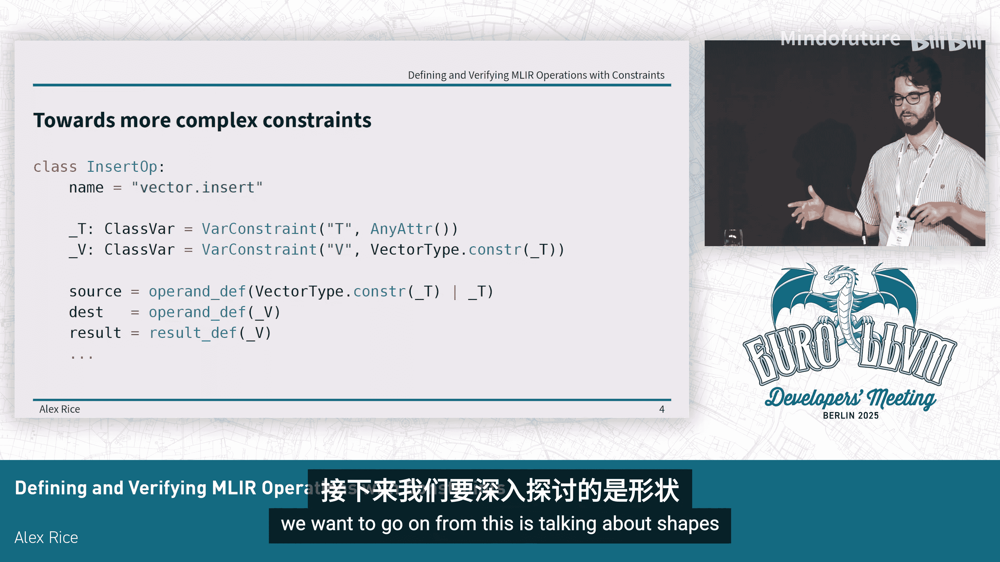

# 026：使用约束定义和验证MLIR操作


## 概述

在本节中，我们将探讨一种在MLIR中定义操作的新方法。这种方法采用更具声明性的方式，可以看作是Ivan在其IDL演讲中介绍的约束系统的扩展。我们将在XDSL（一个类似Python的MLIR克隆）的上下文中介绍该系统的工作原理、当前进展以及未来的计划。

## 操作定义的作用

首先，让我们退一步思考：操作定义究竟有什么作用？在MLIR中定义了一个操作，但这意味着什么？不仅仅是给它一个名字。

操作通常附带相关的验证逻辑，用于检查其输入类型是否正确，以及输入和输出的数量是否匹配。它还可能期望始终拥有各种属性。所有这些都内置于操作定义中。

第二类作用可以称为“推断”。有时我们希望用不完整的数据来指定一个操作，并能够从给定的不完整数据中推断出其余的数据。这方面的两个主要例子是构建器和自定义格式。构建器可能只需要一个非常简洁的接口来构建操作，但仍需要填充所有必要信息。更常见的是自定义格式，它不必包含大量额外的不必要数据。

## 一个简单示例：加法操作

我们从一个最简单的例子开始：两个数字的加法操作。定义这个操作需要做什么？

首先关注验证：我们所有的输入（两个输入和一个输出）都需要是整数类型（例如`si32`）。但仅仅对每个部分施加约束是不够的，因为这些约束是相互关联的，需要彼此通信。我们不能独立地定义每个约束。

观察下面的通用格式，它满足每个单独的条件（两个输入是整数，输出是整数），但显然是错误的，因为我们实际上需要所有这些类型都相同。

我们还看到了推断问题：上面的自定义格式只指定了一个类型（结果类型）。操作定义需要知道应该将输入类型设置为与结果类型相同。

## 如何编码这些约束？

我们如何在XDSL中编码所有这些信息呢？以下是一种类似Python伪代码的方式：

```python
# 伪代码示例
Var(‘T’)  # 定义一个类型变量 T
Constraint(‘operand_lhs’, ‘T’)  # 左操作数类型为 T
Constraint(‘operand_rhs’, ‘T’)  # 右操作数类型为 T
Constraint(‘result’, ‘T’)       # 结果类型为 T
```

关键点在于我们使用了`Var`约束。`Var`约束的含义是，无论在哪里遇到这个约束，它都应该是同一个东西。这里我们指定左操作数和右操作数需要满足同一个`Var`约束，结果也需要满足同一个`Var`约束。

然后我们可以指定汇编格式。如您所见，只给出了结果类型。因此，左操作数和右操作数的类型没有给出，系统可以从这个`Var`约束中推断出它们需要与结果类型相同。

## 扩展约束系统

这是一个简单的例子。那么，我们想在此基础上如何发展呢？基本上，所有这些变量约束都可以嵌套在系统已有的其他约束中。

虽然没有足够的时间探讨所有可用的验证功能，但这里有一个例子。假设我们有一个向量插入操作`vector.insert`。这个操作允许你将一个元素插入向量，或者将一个向量本身插入到多维向量中。

有趣的一行是这里的`_V`。我们声明了一个向量类型，但约束该向量类型的元素是另一个约束。这允许我们讨论所有这些关系。

## 未来方向：形状验证

我们未来希望发展的方向是讨论形状验证，因为目前的系统尚未处理任何形状验证。




## 总结


在本节中，我们一起学习了一种使用声明性约束来定义和验证MLIR操作的新方法。我们了解了操作定义在验证和类型推断中的作用，并通过加法操作的例子看到了如何使用`Var`约束来确保类型一致性。我们还简要探讨了更复杂的嵌套约束示例，并指出了未来将形状验证纳入该系统的发展方向。这种方法旨在使操作定义更加简洁、健壮，并减少样板代码。