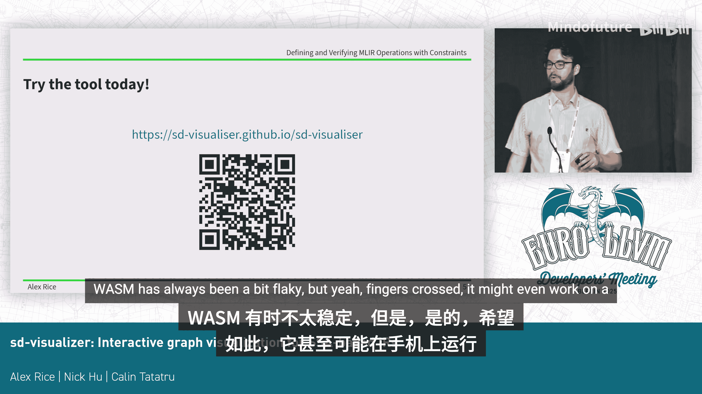

# 027：基于SSA的IR交互式图可视化工具

在本教程中，我们将学习一个用于可视化多种SSA形式中间表示的程序工具。该工具并非专为LLVM或MIR设计，但它们是展示其可视化能力的良好示例。

## 工具目标 🎯

上一节我们介绍了工具的基本背景，本节中我们来看看它的核心目标。

该工具旨在获取程序的中间表示，并以多种方式将程序中的数据流动和运行状态展示给用户。其最终目标是生成图形化视图，帮助用户直观地理解程序内部发生的情况。

以下是该工具当前重点实现的两个主要可视化方面：

*   **数据流路径建模**：在左侧的图表中，黑色线条代表数据流。例如，可以看到第一个加法操作的输出，成为了第二个加法操作的输入。
*   **控制流图集成**：除了数据流，该工具还在同一图表中表示控制流图。图表中的绿色部分即代表控制流。

## 面临的挑战与解决方案 ⚙️

上一节我们了解了工具的目标，本节中我们来看看实现这些可视化时遇到的具体挑战及其解决方案。

LLVM和MIR等IR具有一些特性，使得绘制其图形变得复杂。主要挑战在于它们包含**基本块**和**区域**，这些结构对图形布局施加了许多约束。例如，需要将某些操作分组，并且数据流被允许从一个基本块流出并进入另一个基本块。

这导致图形中会出现被视为大节点的块，而块内部又包含许多进出的连接，容易显得混乱。

该工具旨在自动处理所有这些布局问题，用户无需进行任何手动调整。

另一个需要原生支持的特性是SSA值可能被多次使用或完全不被使用。在可视化程序时，用户不应被要求手动插入显式的节点来复制值，这一切都应该是自动发生的。

正是这两点——自动处理块/区域约束和隐式值复制——使得本工具区别于使用Graphviz等通用图形可视化程序来处理此类问题。

## 可视化流程 🔄

上一节我们探讨了工具解决的挑战，本节中我们来看看实现可视化的具体流程。

以下是该工具实现可视化的步骤：

1.  **从IR开始**：工具目前支持将LLVM IR、MIR以及一个用于展示工具特性的玩具语言（SD语言）进行转换。
2.  **映射为层次图结构**：所有IR都被映射到一个**层次图结构**。这个结构是可视化的基础，描述了可视化中将要发生的一切。
3.  **定义转换规则**：如果用户想要可视化一种新的IR，或者想以不同方式显示某种IR，他们需要做的就是定义如何将这种IR转换到上述的层次图结构。
4.  **执行绘图流水线**：一旦转换完成，工具会经过一个复杂的绘图流水线，自动决定所有节点的垂直和水平位置，处理值的复制，将节点分组到块中，并进行布局优化。
5.  **生成输出**：最终，工具会生成一系列图形形状。这些形状可以直接绘制成SVG图像，也可以使用我们提供的交互式前端进行查看。

## 交互式前端功能 🖱️

上一节我们介绍了可视化的生成流程，本节中我们来看看交互式前端提供的具体功能，这些功能能帮助用户更好地探索图形。

交互式前端提供了以下便利功能来探索图形：

*   **连线高亮**：将鼠标悬停在任意连线上，会高亮显示整条边，包括它进入或离开块的所有路径。
*   **块折叠**：可以将块和区域折叠成一个单一点。当用户暂时不想关注某个区域时，这个功能非常有用。
*   **节点搜索**：可以使用查找功能搜索特定的节点。

## 总结 📝

本节课中我们一起学习了一个用于可视化基于SSA的中间表示的工具。我们了解了它的设计目标：同时展示数据流和控制流。我们探讨了它如何解决IR中基本块和隐式值复制带来的可视化挑战。我们还梳理了从IR转换到最终图形输出的完整流程，并介绍了交互式前端提供的高亮、折叠和搜索等实用功能。该工具旨在通过自动化的图形布局和交互式探索，降低理解复杂程序结构的难度。

