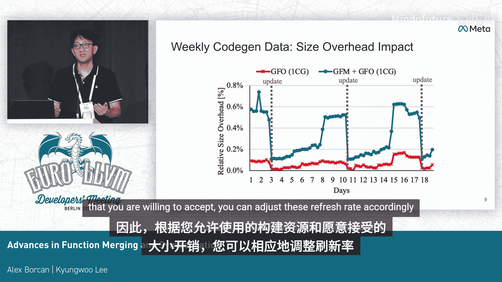
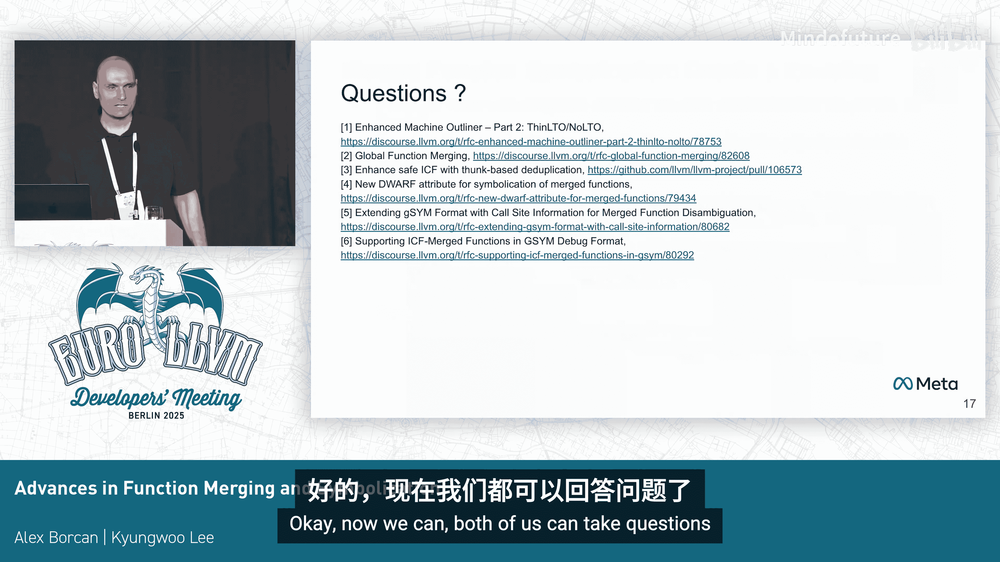

# 029：全局函数合并与安全符号化


## 概述

在本节中，我们将学习LLVM编译器中两项关键的代码优化技术：**全局函数合并**与**安全符号化**。这些技术旨在减少移动应用二进制文件的大小，同时确保在函数被合并后，调试信息（如崩溃堆栈）依然准确可用。我们将从全局函数合并的原理开始，然后探讨链接器层面的安全合并，最后解决合并函数带来的符号化挑战。

---

## 全局函数合并：超越模块边界

上一节我们介绍了传统函数合并的局限性。传统方法（如LLVM的MergeFunctions）通常只能在单个模块内合并相同或相似的函数。当使用**链接时优化**时，虽然可以将所有代码合并到一个模块，但这在分布式编译（如ThinLTO）环境中并不高效。

本节中，我们来看看**全局函数合并**如何解决这个问题。它允许在独立的编译模块之间合并函数，即使在使用ThinLTO进行分布式编译时也能工作。

其核心思想基于**代码生成数据**框架，该框架最初为全局函数外联而设计。整个过程分为两步：

1.  **写入阶段**：在编译时分析函数，生成一个“摘要”，描述函数的稳定形态。
2.  **读取阶段**：在后续编译（或链接时）消费这些摘要，乐观地创建合并后的函数。

以下是该过程的一个简化示例。假设有两个模块，包含相似函数：

```cpp
// 模块1
int func1() {
    return 100; // 常量 F1
}
// 模块2
int func2() {
    return 200; // 常量 F2
}
```

全局函数合并会分析这些函数，生成一个不依赖于具体中间表示的“稳定函数形式”摘要。在链接时，它识别出这些函数的相似性（仅常量不同），并创建一个参数化的合并函数：

```cpp
// 合并后的函数
int merged_func(int param_x) {
    return param_x;
}
// 原函数变为跳板
int func1() { return merged_func(100); }
int func2() { return merged_func(200); }
```

需要注意的是，由于ThinLTO后端编译是并行且独立的，我们无法在编译时直接合并。因此，编译时的转换只是将函数“具体化”为跳板形式，最终的合并与重复项消除在链接时完成。

通过启用全局函数合并，我们在ThinLTO构建中观察到了显著的二进制大小缩减。然而，合并摘要对源代码变更比外联摘要更敏感，可能导致一定的二进制大小波动（通常在1%以内），这需要在构建资源与收益之间进行权衡。

---




## 链接器中的安全函数合并

上一节我们介绍了编译器实现的全局函数合并。本节中，我们来看看链接器如何通过**相同代码折叠**技术进一步合并函数，并确保程序行为正确。

链接器可以执行**ICF**，但它只能合并二进制完全相同的函数。直接合并会带来一个问题：如果两个函数的地址被获取并比较，合并它们会改变程序语义。

例如，有以下源代码：
```cpp
void A() {}
void B() {} // 二进制代码与A完全相同
int main() {
    return (&A == &B) ? 1 : 0; // 应始终返回0（false）
}
```

如果链接器将`B`合并到`A`，那么`main`中比较的就是`A`的地址和`A`的地址，结果变为1（true），导致程序错误。

为了解决这个问题，我们引入了**安全跳板**模式。在此模式下，链接器只保留一个函数的完整本体，其他相同函数则被替换为一个包含单一跳转指令的**跳板**。

以下是启用安全ICF后的行为：
*   保留函数`A`的完整本体。
*   函数`B`被替换为一个跳板`B_thunk`，其内容仅仅是跳转到`A`。
*   在`main`中，`&A`获取的是A的地址，`&B`获取的是`B_thunk`的地址，两者不同，程序行为得以保持正确。

这种安全的ICF在真实应用中带来了约0.45%的二进制大小节省，并且已在LLVM的ld64链接器（用于macOS arm64）中实现，可通过一个标志启用。

---

## 合并函数的符号化挑战与解决方案

之前的优化带来了代码大小的减少，但也引入了调试信息方面的挑战。当函数被合并后，我们可能会丢失其中一部分函数的调试信息，导致崩溃报告中的堆栈信息错误。

考虑以下场景：函数`A`和`B`二进制相同但源代码不同，它们被ICF合并。合并后，调试信息可能只保留了函数`A`的信息。如果程序在函数`B`中崩溃，符号化工具只能看到地址属于合并后的函数，并错误地将其报告为函数`A`，这会给开发者调试带来极大困惑。

为了解决这个问题，我们需要在最终的二进制文件和调试信息中保留所有被合并函数的符号和调试信息，即使它们指向相同的地址。同时，我们还需要保留所有调用点的信息（即从哪里调用了哪个函数）。

以下是实现正确符号化的新流程，它采用**自底向上**的符号化方式，并利用调用点信息作为上下文过滤器：

1.  客户端提供原始的堆栈地址序列。
2.  符号化工具从最底层（最后一个调用）的帧开始。
3.  在调试信息中查找该地址。除了找到对应的函数（如`main`），还会找到此地址是一个**调用点**，例如“调用了函数A”。
4.  正确符号化当前帧为`main`，并将“调用了A”这个信息作为**上下文过滤器**保留。
5.  处理上一帧地址时，应用保留的上下文过滤器。在调试信息中查找该地址时，可能会匹配到多个合并函数（如`A`和`B`），但过滤器能帮助我们筛选出正确的那个（即`A`）。
6.  重复此过程，直至完成整个堆栈的符号化。

通过这种方法，即使函数`A`和`B`被合并，我们也能正确区分出崩溃究竟发生在`A`还是`B`中，从而为开发者提供准确的堆栈信息。

此实现目前已集成到上游LLVM中。要使用它，需要向Clang和LLD传递特定的标志以生成和保留必要的额外调试信息，并在使用`llvm-symbolizer`等工具进行符号化时，采用支持自底向上解析的新方式。

---



## 总结

本节课中我们一起学习了LLVM生态中为减少应用体积并保持可调试性所做出的两项重要进展。

首先，**全局函数合并**允许在分布式编译环境下跨模块合并相似函数，有效减少了代码体积。其次，链接器的**安全ICF**技术通过引入跳板，在合并相同函数的同时保证了程序语义的正确性。最后，针对合并函数导致的调试信息混乱问题，我们介绍了一种创新的**符号化方案**。该方案通过保留所有合并函数的符号和调用点信息，并采用自底向上的上下文过滤解析，确保了崩溃堆栈能够被准确无误地还原。


这些技术的结合，使得开发者在追求极致应用性能与体积的同时，无需牺牲可观察性与调试体验。