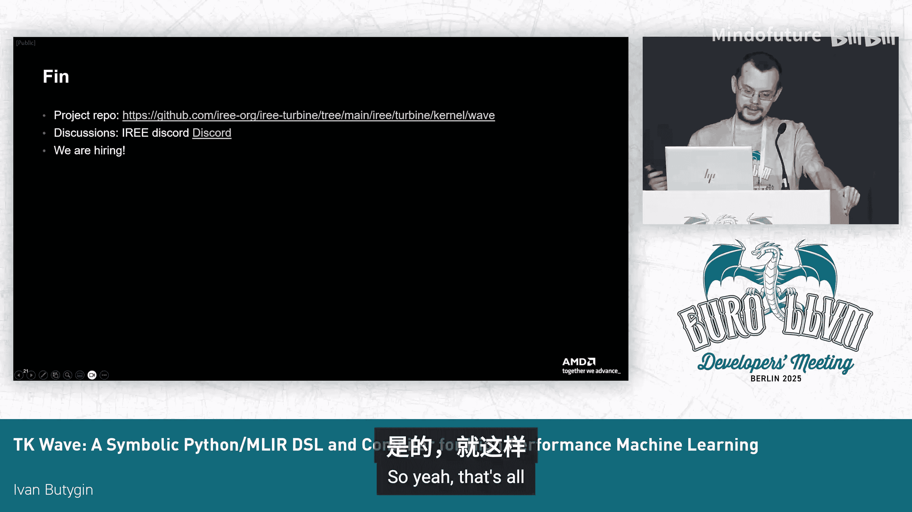
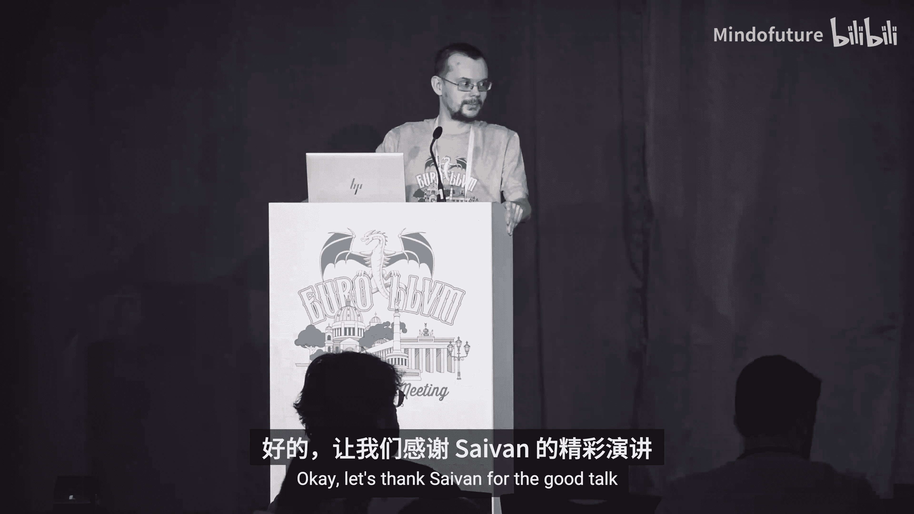

# 030： 高性能机器学习符号化Python DSL与编译器


## 概述
在本教程中，我们将学习 Wave，一个用于高性能机器学习的符号化领域特定语言及其编译器。我们将了解其设计动机、核心概念、架构以及如何简化高性能GPU内核的编写。

---

## Wave： 1： 动机与简介

现代机器学习工作负载需要利用GPU来获得良好性能。然而，直接使用CUDA或HIP等语言进行GPU编程非常复杂且耗时。这些编程模型涉及底层硬件指令、跨线程协作、非标准数据布局以及寄存器/内存调度，这些都不符合常规的C++编程模型。

因此，我们需要一种更便捷的方式来编写高性能内核。虽然存在其他语言（如Triton）致力于此，但Wave旨在提供一种新颖且更便利的方法。

Wave是一个针对高性能机器学习的符号化领域特定语言。它目前主要面向AMD GPU，但其设计也支持扩展到其他硬件供应商。Wave使用Python语法和简单的符号表达式来描述内核，并明确分离了高级内核逻辑与数据分布策略。它利用MLIR进行代码生成，主要使用上游方言，并借助IREE作为“最后一英里”优化器和运行时来启动内核。

---

## Wave： 2： 核心设计理念

上一节我们介绍了Wave的动机，本节中我们来看看其核心设计理念。

Wave的设计基于几个关键原则：

*   **逻辑与策略分离**： 高级内核描述操作于整个张量级别，而分块（Tiling）和分布策略则与之分离。这意味着可以更改分布策略而无需修改核心内核逻辑。
*   **分层执行模型**： 语言在GPU的线程块（Block）和线程组（Wave）级别描述计算和分布，随后编译器会透明地决定块和线程的内存访问模式。
*   **符号化数据类型**： Wave使用符号化数据类型来表示张量形状、分布模式等。这允许编译器进行高级优化。
*   **通用硬件支持**： 通过使用掩码（Masking）和向量化操作来处理非规整的形状，Wave能够灵活地针对2026年及以后的各种新硬件进行测试和优化。

---

## Wave： 3： 一个简单示例：逐元素复制

让我们通过一个简单的逐元素复制内核来了解Wave的基本结构。

一个Wave内核通常包含三个基本部分：
1.  **分布描述（约束）**： 指定如何将整个工作负载划分为块（Blocks）和波（Waves）。
2.  **内核主体**： 描述实际的计算逻辑。
3.  **符号值**： 提供具体的符号值，然后编译并运行内核。

以下是一个简单的逐元素复制内核的示意性代码框架：
```python
# 1. 分布约束 (示意)
constraints = Tile(block=(128, 128), wave=(32, 32))

# 2. 内核主体 (示意)
@wave.kernel
def copy_kernel(input: Tensor[(M, N), f32], output: Tensor[(M, N), f32]):
    output = input

# 3. 编译与运行 (示意)
compiled_kernel = compile(copy_kernel, constraints)
result = compiled_kernel.run(input_tensor)
```
在这个例子中，内核读取一个`M x N`的输入张量，并写入到另一个相同形状的输出张量中。

---

## Wave： 4： 深入内核组件

上一节我们看了一个简单示例，本节我们来深入看看内核中更重要的组成部分。

以下是一个类GEMM（通用矩阵乘法）内核的关键组件描述：

*   **硬件特性（Hardware Traits）**： 描述每个Wave（波前）的线程数（Wave Size）以及用于矩阵乘累加（MMA）操作的指令。可以全局设置MMA操作，有时这比逐个操作设置更方便。
*   **假设（Assumptions）**： 对于动态维度，可以指定一些属性（如可整除性），编译器可以利用这些属性进行优化。
*   **张量描述（Tensor Descriptions）**： 指定张量的形状、数据类型和内存空间（例如，控制是否应将其提升到共享内存）。
*   **临时存储**： 可以使用寄存器分配临时存储。这是虚拟寄存器，可以具有完整的`M x N`形状。
*   **归约循环**： 支持跨K维度的归约循环，这是标准的GEMM操作模式。内核读取两个参数，调用MMA操作（该操作将连接到实际的硬件指令），然后写入结果。

---

## Wave： 5： 更复杂的示例：卷积与注意力

现在，我们来看两个更复杂的示例，以展示Wave处理复杂操作的能力。

**卷积（通过隐式GEMM实现）**
卷积内核本身看起来几乎与普通的GEMM内核完全相同，只是输入和输出是4维张量。它使用一个称为“映射（Mapping）”的特殊组件。

> **映射（Mapping）**： 描述如何将卷积输入自动映射到MMA操作所期望的2D输入。这类似于`linalg.generic`中的迭代器映射，将输出映射到`(i, j)`，输入映射到`(k, l)`，并指定如何从输入和输出位置转换元素索引。

**注意力（Attention）内核**
注意力内核更为复杂，无法完全放入一页幻灯片中。它包含以下高级特性：
*   在归约循环内有两个MMA操作。
*   跨线程组（Workgroups）进行归约。
*   包含全局掩码和全局求和操作。
*   支持直接内存访问和一些更高级的功能。

---

## Wave： 6： 编译器架构

上一节我们看到了Wave能表达的内核类型，本节我们来看看其编译器如何工作。

Wave编译器遵循典型的三段式架构：前端、中端和后端。

*   **前端**： 使用Torch FX进行跟踪（Tracing）。跟踪只需使用特殊的代理对象调用内核函数体，即可在内部构建计算流。这使得快速原型设计和内核组合成为可能，但缺点是需要为控制流编写特殊的处理逻辑。
*   **中端**： 使用TOSA（Tensor Operator Set Architecture）作为中间表示。在此阶段进行重要的转换，包括：
    *   **索引同步与形状传播分析**： MMA指令需要非标准的数据布局。编译器从执行图中的MMA节点开始，向前向后传播形状信息，以解决来自不同路径（如多个MMA操作）的布局冲突。
    *   **扩展（Expansion）**： Wave允许设置任意分块大小，但硬件指令（如MMA）通常有固定大小（如16x16x16）。因此，编译器可能需要展开循环并生成一系列硬件指令调用。
    *   **其他优化**： 共享内存布局优化、屏障插入、非连续读写分区、公共子表达式消除等。
*   **后端**： 使用上游MLIR方言（如`vector`、`scf`、`gpu`、`amd`）进行 lowering。关键步骤包括：
    *   使用`affine.apply`和`affine`表达式将符号类型和计算 lowering。
    *   生成向量化索引计算（当前`affine`方言对此支持有限，有改进提案）。
    *   调用表达式简化函数。
    *   将操作 lowering 到具体的硬件指令（如`gpu`方言的加载/存储、`amd`方言的MMA和shuffle指令）。
    *   使用IREE作为“最后一英里”优化器和运行时来启动内核。最终输出是GPU代码（如`gpu.func`），IREE提供了必要的主机端基础设施来运行内核，并与PyTorch等框架交互。

---

## Wave： 7： 关键优化与经验总结

在编译器后端（或更准确地说，在MLIR lowering 阶段），Wave应用了一系列关键优化：



*   **使用标准MLIR优化**： 如向量化、循环展开、常量传播等。
*   **利用IREE的整数范围分析**： 初始生成的索引计算通常是64位（i64）。通过整数范围分析，可以将其降级为更小的整数类型（如i32），如果值域允许的话。
*   **可除性分析**： 例如，如果知道线程数是64，并且某个表达式是`thread_id % 64`，那么这个取模操作可以被完全消除。

在开发Wave过程中，我们积累了一些重要经验：

*   **语言与编译器实现**： Wave语言本身完全用Python编写，用户用Python写内核。编译器本身也主要用Python编写（利用MLIR的Python绑定和TOSA），这带来了开发便捷性，但编译速度会受到影响。通过缓存编译结果（内存或磁盘）可以部分缓解此问题。
*   **中间表示的选择**： TOSA作为最小化的IR，有利于快速实现前端和优化流程。但我们不得不在TOSA之上实现一些通用工具（如公共子表达式消除），理想情况下更希望直接使用MLIR。
*   **符号类型的挑战**： Wave严重依赖符号表达式，但MLIR中缺乏良好的符号表达式和符号张量类型。`affine`表达式覆盖了一些情况，但还不够。如何在MLIR中高效地设计和使用符号类型是一个开放性问题。
*   **IREE的集成价值**： IREE极大地简化了端到端流程的启用。只需几行自定义的流程（flow）和流（stream）方言代码，以及一些API调用，就能实现从PyTorch张量传递到内核运行的全过程。在MLIR上游提供类似的支持将非常有益。

---

## Wave： 8： 总结与资源

在本教程中，我们一起学习了Wave符号化Python DSL及其编译器。我们了解了其设计动机：为高性能机器学习内核提供一种比直接CUDA/HIP编程更便捷的方法。我们探讨了其核心设计理念，如逻辑与策略分离、符号化类型。通过简单和复杂的示例，我们看到了Wave代码的结构。我们还深入了解了其三层编译器架构，以及在后端进行的关键优化。最后，我们分享了在实现过程中获得的经验教训。

**项目资源**：
*   Wave是一个开源项目，代码托管在GitHub上。
*   在IREE的Discord服务器上有相关的讨论频道，可以加入并提问。
*   项目团队目前正在招聘，欢迎感兴趣的同学加入。

**与Triton的对比**： Wave旨在提供比Triton更彻底的抽象分离（内核逻辑与分布策略），让用户无需手动处理指针、掩码等底层细节。在性能上，Wave目前与AMD的rocBLAS和Triton性能相当，有时略快或略慢。




**未来方向**： 包括改进符号类型在MLIR中的支持、提升编译性能、扩展对更多硬件的支持等。