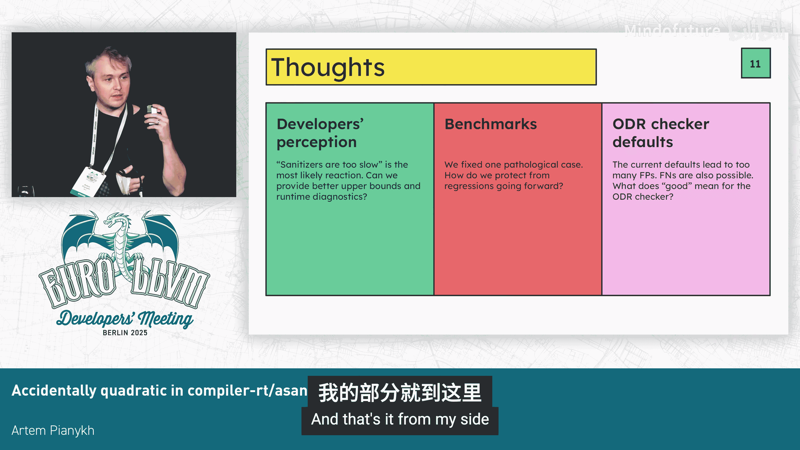

# 032：一个意外的二次方复杂度问题


## 概述

在本节课中，我们将要学习一个在LLVM编译器运行时库（compiler-rt）的地址消毒器（AddressSanitizer，简称Asan）中发现的、有趣的性能问题。这个问题会导致程序在启动时产生意外的严重延迟。我们将详细探讨问题的现象、根本原因、调试过程以及最终的解决方案。

## 问题现象：启动延迟之谜

上一节我们介绍了课程概述，本节中我们来看看具体的问题表现。

我们有一个非常简单的程序，它仅仅打印“hello URL LVM”。然而，这个程序的启动时间却严重依赖于它所链接的动态共享库（shared libraries）的数量。

每个共享库都包含一些唯一的符号（unique symbols）和一些在不同库中重复定义的共享符号（shared symbols）。虽然这些符号大小相同，并不构成严格意义上的ODR（单一定义规则）违规，但程序启动却异常缓慢。

在修复之前，这个简单的打印程序需要超过5秒钟才能将信息输出到屏幕。而在修复之后，启动几乎是瞬间完成的。这是一个简化后的例子，但它真实地反映了我们在生产环境中观察到的情况：开发者的构建过程会在实际工作开始前，无谓地消耗2到20秒的时间。

## 调试之旅：定位性能热点

了解了问题现象后，我们来看看如何定位这个性能问题的根源。由于这是我第一次深入接触compiler-rt代码库，我将分享一些调试和排查的经验。

查看性能分析（Perf）报告时，可以清楚地看出问题与Asan和全局变量（globals）的处理有关，但除此之外，调用堆栈信息并不十分明确。当开发者遇到此类问题时，一个很自然的反应是考虑关闭消毒器（sanitizer）。事实上，我们也观察到一些项目开始因为这个性能问题而切换到未消毒的构建模式。

然而，在开发基础设施团队中，我们非常看重Asan带来的安全性。我们希望更多地使用Asan来保障代码安全，因此解决这个性能问题、确保开发者能够顺畅地使用安全工具至关重要。

继续分析性能数据，如果我们对热点函数进行标注，就能获得更多信息，比如一些函数名。但我们面对的是经过优化的代码，直接从汇编跳转回原始源代码并不直观。

不过，如果仔细观察，可以发现热点循环看起来像是在迭代一个链表（linked list）。代码从第二个字（word）加载数据，然后进行测试等操作。这些线索足以让我们将性能热点追溯到源代码中 `checkODRViolationByIndicator` 函数内的一个 `for` 循环。

## 根本原因：链表遍历的代价

上一节我们通过性能分析定位到了热点函数，本节中我们来深入分析其根本原因。

问题的核心在于：当Asan检测到一个潜在的ODR违规时，它会触发一个遍历程序中所有全局变量的链表的操作。

以下是导致性能问题的核心代码逻辑的简化表示：

```cpp
// 伪代码：修复前的遍历逻辑
for (Global *G = AllGlobalsListHead; G != nullptr; G = G->Next) {
    if (G->ODRIndicator == CurrentGlobal->ODRIndicator) {
        // ... 检查其他条件，可能报告ODR违规
    }
}
```

如果程序中有数百万个全局变量，这种线性查找（`O(n)` 复杂度）会变得极其昂贵，从而导致了2到20秒的启动延迟。代码会比较ODR指示器（ODR indicator），检查是否为同一个全局变量，并在报告ODR违规前验证其他一些条件。

## 解决方案：用映射替换链表

找到了问题的根本原因，解决方案就变得非常直接。我们只需要将低效的链表数据结构替换为高效的映射（map）数据结构。

修复方法非常简单，其核心思想可以用以下公式描述：

**将查找复杂度从 `O(n)` 降低为 `O(log n)` 或 `O(1)`。**

具体实现是，我们创建了一个以ODR指示器为键（key）的映射（例如 `std::map` 或 `std::unordered_map`）来索引全局变量，从而避免了每次检查都进行全量遍历。

以下是修复思路的代码对比：

```cpp
// 修复前：线性扫描链表
Global* FindGlobalByIndicator(IndicatorType ind) {
    for (Global* G = ListHead; G; G = G->next) {
        if (G->odr_indicator == ind) return G;
    }
    return nullptr;
}

// 修复后：通过映射快速查找
std::map<IndicatorType, Global*> GlobalMap;
Global* FindGlobalByIndicator(IndicatorType ind) {
    auto it = GlobalMap.find(ind);
    return (it != GlobalMap.end()) ? it->second : nullptr;
}
```

这个修复代码量很小，几乎可以完整地显示在屏幕上。虽然理论上仍可以构造出导致变慢的极端用例，但根据我们的实践经验，这个修复完全解决了之前遇到的性能问题。

## 思考与启示

问题虽然解决了，但它给我们带来了一些更深层次的思考。

首先，**开发者的感知非常重要**。对于不深入参与LLVM或工具链开发的普通开发者来说，“消毒器太慢了”可能是最直接的反应。他们通常没有足够的时间去细致分析，因此即使不想关闭所有消毒功能，也可能不知道应该调整哪部分来规避此类性能问题。这就引出一个问题：我们能否提供更好的性能上限保证，或者运行时诊断信息，来引导开发者得出正确的结论？

其次，关于**基准测试（Benchmarks）**。我们这次修复了一个极端情况，但如何防止未来出现类似的性能回归（regression）呢？作为一个compiler-rt代码库的新手，我当时并不清楚（现在也未必完全清楚）其性能是如何被追踪以及回归是如何被发现的。这或许涉及到文档完善或基准测试套件的改进，我认为这一点非常重要。

## 总结




本节课中我们一起学习了LLVM compiler-rt中Asan运行时的一个性能问题。我们从程序启动异常缓慢的现象出发，通过性能分析工具定位到热点代码，发现其根本原因是ODR违规检查时对全局变量链表进行了低效的线性遍历。最终的解决方案是将链表数据结构替换为以ODR指示器为键的映射，从而将查找复杂度从 `O(n)` 降为 `O(log n)`，彻底解决了启动延迟问题。这个案例提醒我们，即使在底层系统工具中，数据结构的正确选择对性能也至关重要，同时也凸显了持续的性能监控和基准测试的重要性。