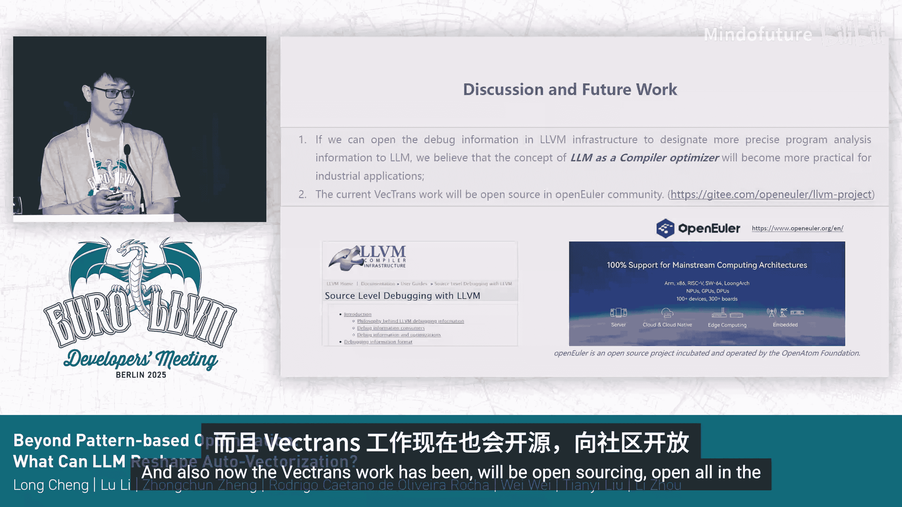

# 034：超越基于模式的优化——LLM如何重塑自动向量化

## 概述

在本节课程中，我们将探讨如何将大型语言模型集成到LLVM编译器中，以增强其自动向量化的能力。自动向量化对于高性能计算和移动应用至关重要，但现有方案在面对复杂代码时仍存在局限。我们将介绍一个名为“Veterans”的模型编译代理框架，它通过引导源代码转换来突破这些限制。

## 自动向量化的重要性与挑战

自动向量化对于许多工业应用，例如高性能计算以及一些移动应用程序，都相当重要。例如，华为开发的基于LLVM的编译器就高度优化了CPU，特别是针对Neon和SVE指令集。

然而，即便是这类工业级的LLVM编译器，其自动向量化能力也可能不够充分。以一个非常简单的基准测试TSVC2为例，我们发现仍有约34%的案例无法被很好地向量化。

如果我们利用分析工具来寻找原因，会发现问题主要源于对内存依赖性和规约操作的分析能力有限。对于现实中的工业应用，例如HPC应用，它们有很大可能无法在自动向量化方面表现良好。

## 引入Veterans框架

因此，我们尝试引入Veterans。这是一个模型编译代理框架，旨在大规模增强自动向量化的能力。

该框架具有一些基本特性。例如，它支持引导源代码转换，因此适用于C、C++或Fortran语言。它采用解释与范式，并由于源代码转换而天然支持交叉验证。

从以下结果可以看出，它能够生成有效的优化代码。

## Veterans框架工作流程

以下是Veterans框架的一个粗略工作流程。

想象一下，你是一名性能工程师。你给出一个提示：“我想向量化这段源代码”，而这段代码很难被传统的LLVM编译器（如Bi）向量化。

接着，框架会利用深度模型，结合多种来源的反馈，生成经过优化的源代码。这段新代码将更容易被下游的编译器（如Bi）向量化。

## 效果评估与对比

以下是初步的结果和快速对比。

与之前的工作（如原生Bi编译）以及原生的Arm向量化方案相比，我们的方法在成功率上取得了良好的成果。这也证明了编译器反馈信息的重要性。

## 应对现实应用的复杂性

然而，仅处理简单代码是不够的。现实中的应用通常非常复杂且相互关联。仅从LLVM获取的备注信息可能不足以应对。

因此，我们尝试进一步开放调试信息。目前，Veterans框架也将在开源社区中开放。

## 总结

本节课中，我们一起学习了如何利用大型语言模型来增强LLVM编译器的自动向量化。我们了解到现有工业级编译器在分析复杂内存依赖和规约操作时的局限性，并介绍了一个名为Veterans的模型编译代理框架。该框架通过引导源代码转换，接收多源反馈，生成更易于向量化的代码，从而显著提升了向量化的成功率。对于处理现实世界中的复杂应用，开放更详细的调试信息是未来的关键方向。