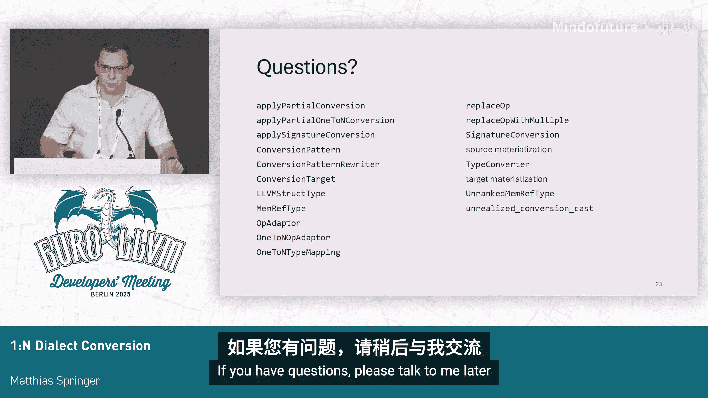

# 035：MLIR 中的一對多方言轉換框架


在本節課中，我們將學習 MLIR 中一對多方言轉換框架的核心概念、使用方法及其重要性。我們將通過具體的 `memref` 到 `LLVM` 降級示例，來理解如何從舊的轉換模式遷移到新的、更高效的一對多轉換。

## 概述

MLIR 中的方言轉換框架是兩個主要的模式驅動器之一，它比模式重寫器更為強大。最近，該框架新增了對一對多轉換的完整支持，這意味著一個操作結果現在可以被替換為多個 SSA 值，從而顯著簡化降級過程並減少生成的中間表示數量。

## 為什麼需要一對多轉換？

在深入細節之前，我們先了解為什麼一對多轉換如此重要。在現有的框架中，當需要將一個複雜類型（如多維數組描述符）降級為多個基本類型時，開發者不得不使用變通方法。這些方法通常效率低下，會生成大量僅用於打包和解包數據的冗餘操作，增加了編譯開銷並使 IR 難以調試。

例如，在 `memref` 到 `LLVM` 的降級中，一個 `memref` 值目前必須被封裝到一個 `LLVM` 結構體中，然後在後續的每個操作中再解包出來進行計算，最後又重新打包。一對多轉換允許我們直接將一個 `memref` 值替換為多個 `LLVM` SSA 值，從而消除這些冗餘操作。

## 如何使用一對多轉換框架

接下來，我們來看看如何具體使用這個新框架。遷移過程主要涉及兩個組件的更新：類型轉換器和操作適配器。

### 1. 更新類型轉換器

在類型轉換器中，你需要使用 `addConversion` API 來指定如何將源類型轉換為多個目標類型。這通過一個回調函數實現，該函數返回一個 `SmallVector<Type>`。

**代碼示例：**
```cpp
typeConverter.addConversion([](MemRefType type) -> SmallVector<Type> {
  // 例如，將一個 memref 轉換為 7 個 LLVM 類型
  return SmallVector<Type>(7, llvmPointerType);
});
```

### 2. 使用一對多操作適配器

對於你的轉換模式，不能再使用普通的 `OpAdaptor`。你必須使用新的 `OneToNOpAdaptor` 類。這個適配器的關鍵區別在於，當你查詢操作數或結果時，你得到的是一個 `ValueRange`（可能包含多個值），而不是單個 `Value`。

**代碼示例：**
```cpp
struct MyLoweringPattern : public OpConversionPattern<MyOp> {
  using OpConversionPattern::OpConversionPattern;
  LogicalResult matchAndRewrite(MyOp op,
                                OneToNOpAdaptor adaptor,
                                ConversionPatternRewriter &rewriter) const override {
    // adaptor.getOperands() 返回的是 ValueRange
    ValueRange operands = adaptor.getOperands();
    // ... 你的轉換邏輯
  }
};
```

### 3. 替換操作

在重寫邏輯的最後，當你需要替換原始操作時，使用新的 `replaceOpWithMultiple` 方法。這個方法允許你為原始操作的每個結果指定多個替換值。

**代碼示例：**
```cpp
// 假設原始操作有 1 個結果，我們用 3 個新值來替換它
SmallVector<Value> replacementValues = {val1, val2, val3};
rewriter.replaceOpWithMultiple(op, replacementValues);
```

## 遷移注意事項與常見錯誤

從舊的轉換模式遷移時，有幾個關鍵點需要注意。

如果你在類型轉換器中定義了一對多轉換，但某個模式忘記更新，仍然使用了舊的 `OpAdaptor`，MLIR 將會報錯。這實際上是一個有用的調試工具，可以幫助你快速定位哪些模式尚未遷移。

**錯誤信息示例：**
```
LLVM FATAL ERROR: Pattern expects a single replacement value, but multiple values are available.
```

此外，之前存在的一個獨立的、不兼容的一對多轉換框架（位於 `one-to-n-type-conversions`）現已被棄用，並將在不久後刪除。如果你在使用它，必須遷移到新的統一框架。遷移要點包括：
*   將 `OneToNConversionPattern` 替換為常規的 `ConversionPattern`。
*   使用 `applyPartialConversion` 代替 `applyPartialOneToNConversion`。
*   必須顯式定義一個 `ConversionTarget`。
*   使用 `replaceOpWithMultiple` 並通過 `SignatureConversion` 對象來管理類型映射。

遷移後，由於新的框架是純粹的方言轉換（而非貪婪模式重寫），它不會自動執行公共子表達式消除或折疊優化。這可能導致測試用例失敗。一個快速的解決辦法是在轉換後運行規範化傳遞。

## 示例：`memref` 降級對比

讓我們通過一個具體的例子來直觀感受一對多轉換帶來的好處。考慮一個 `memref.subview` 及其後續的 `memref.load` 操作。

在當前的降級流程中，首先需要一個 `expand-strided-metadata` 預處理傳遞來分解操作，然後再應用降級模式。這個過程會生成大量僅用於打包和解包 `LLVM` 結構體的操作，導致 IR 急劇膨脹（例如從 5 個操作變成 34 個操作）。

**當前流程的冗餘操作：**
```
// 函數邊界：一對多轉換（已支持）
// 函數內部：
%packed = llvm.mlir.undef : !llvm.struct<...> // 目標物化：打包
%elem1 = llvm.extractvalue %packed[0]          // 解包
%elem2 = llvm.extractvalue %packed[1]          // 解包
// ... 實際計算 ...
%new_packed = llvm.insertvalue %elem1, %new_packed[0] // 重新打包
%new_packed = llvm.insertvalue %elem2, %new_packed[1] // 重新打包
// 下一個模式又會解包 %new_packed ...
```

使用一對多轉換後，`memref` 值在整個函數體內部都保持為多個獨立的 SSA 值。降級模式直接對這些值進行操作，完全消除了中間的打包和解包步驟。生成的 IR 簡潔明了，與運行規範化器優化後的效果相當，但避免了額外的編譯開銷。

## 總結




在本節課中，我們一起學習了 MLIR 中一對多方言轉換框架的核心內容。我們了解了它通過允許一個操作結果被多個 SSA 值替換，從而簡化降級流程、減少冗餘 IR 生成並提升編譯效率的重要性。我們詳細介紹了如何使用新的類型轉換器 API 和 `OneToNOpAdaptor`，並指出了從舊框架遷移時的關鍵步驟和常見陷阱。最後，通過 `memref` 降級的實例，我們直觀地看到了新框架所帶來的顯著改進。掌握這一框架將有助於你編寫更高效、更簡潔的 MLIR 降級通道。