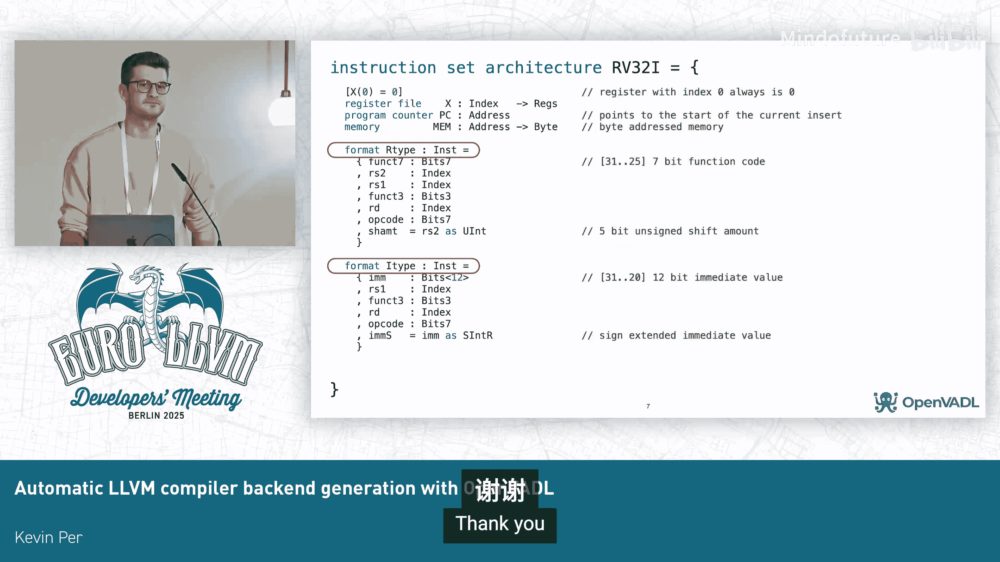

# 036：使用OpenVADL自动生成LLVM编译器后端


在本教程中，我们将学习如何使用名为OpenVADL的工具自动生成LLVM编译器后端。我们将了解VADL语言的基本元素，探讨编译器生成器中最核心的指令选择器生成原理，并分析当前实现的性能与未来的工作方向。

## 概述

OpenVADL代表维也纳架构描述语言，由维也纳技术大学开发。其目标是拥有一份规范，并自动生成模拟器、硬件描述语言和编译器。本课程重点介绍编译器部分。

## 语言基础

上一节我们介绍了OpenVADL的目标，本节中我们来看看VADL语言本身。我们将以RISC-V 32位版本为例，展示几个核心语言元素。

初始声明如下所示：

```vadl
register_file GPR[32] constraint (GPR[0] == 0);
program_counter PC;
memory MEM;
```

这里定义了一个寄存器文件，并带有约束：地址为0的寄存器（`Rega[0]`）值必须为0。此外还定义了程序计数器`PC`和内存`MEM`。

可以定义指令格式，例如R型和I型：

```vadl
format RType {
    bits<7> funct7;
    bits<5> rs2;
    bits<5> rs1;
    bits<3> funct3;
    bits<5> rd;
    bits<7> opcode;
}

format IType {
    bits<12> imm;
    bits<5> rs1;
    bits<3> funct3;
    bits<5> rd;
    bits<7> opcode;
}
```

这些格式包含用于二进制表示的字段，以及称为字段访问函数（`field access function`）的组件。可以将字段访问函数视为解码函数，可以在指令行为中引用它们，因为它们本身不属于指令行为逻辑。

## 指令定义

以下是定义指令的方式：

```vadl
instruction ADD of RType {
    behavior {
        GPR[rd] = GPR[rs1] + GPR[rs2];
    }
    encoding {
        funct7 = 0b0000000;
        funct3 = 0b000;
        opcode = 0b0110011;
    }
    assembly { "add"; }
}
```

在`behavior`部分定义了指令行为：读取`rs1`和`rs2`字段的值，相加后写入`rd`。还可以定义编码和汇编打印函数（注意是打印，而非解析）。

以下是定义立即数加法的示例，其中引用了字段访问函数：

```vadl
instruction ADDI of IType {
    behavior {
        GPR[rd] = GPR[rs1] + imm;
    }
    encoding {
        funct3 = 0b000;
        opcode = 0b0010011;
    }
    assembly { "addi"; }
}
```

这里的`imm`字段可能只存储高位，并在行为中进行移位，这是字段访问函数的典型用例。

以下是从内存加载的示例：

```vadl
instruction LW of IType {
    behavior {
        GPR[rd] = MEM[GPR[rs1] + imm];
    }
    encoding {
        funct3 = 0b010;
        opcode = 0b0000011;
    }
    assembly { "lw"; }
}
```

注意这里使用了之前声明的`MEM`变量。如果要存储值，则需要将`MEM`函数调用放在赋值左侧。

最后是跳转指令的示例：

```vadl
instruction JAL of JType { // 假设已定义JType格式
    behavior {
        GPR[rd] = PC + 4; // 存储返回地址
        PC = PC + imm;    // 跳转
    }
    assembly { "jal"; }
}
```

这里通过写入`PC`来改变程序计数器，并将返回地址存入`rd`寄存器。

## 指令选择器生成

在考虑本演讲内容时，我认为编译器生成器最有趣的部分是指令选择器的生成。但首先，我们需要讨论中间表示。

我们的中间表示称为VM，基于CDFG（控制数据流图）节点的思想。它是一种图数据结构，同时结合了控制流和数据流。图中白色节点表示控制流，蓝色节点表示数据流，绿色节点是用于字段、字段访问函数和常量的叶节点。

我们想要的是类似以下模式匹配表的东西：

```tablegen
def : Pat<(add GPR:$rs1, GPR:$rs2), (ADD GPR:$rs1, GPR:$rs2)>;
```

括号的第一部分表示要在程序中匹配的模式，第二部分是要作为机器指令发射的内容。这里我们只关注指令选择器。

如果我们查看程序的数据流，例如查看副作用节点（如写入寄存器文件），并递归向下遍历，我们基本上可以看到匹配模式。我们称之为**朴素方法**。这种方法对于算术、逻辑和比较指令效果尚可。

但对于无条件跳转、条件跳转和更复杂的指令，效果就不太理想。让我们考虑一个例子，回到之前的`JAL`（跳转并链接）指令。

在LLVM中，我们可能希望有这样的模式：

```tablegen
def : Pat<(br bb:$dest), (J bb:$dest)>;
```

但如果我们查看VM表示，情况就变得复杂了。现在我们有两个副作用节点（写入`PC`和写入返回地址）。朴素方法在这里遇到了问题：我们不知道从哪个节点开始匹配。如果只选择一个，得到的只是无用的匹配。因为LLVM生成的SelectionDAG与指令的原始行为并不相同（例如，它可能包含位掩码操作），存在语义鸿沟。

## 我们的方法

我们知道自己需要一种分支指令，也了解跳转并链接指令的属性。其属性是：写入`PC`，并将旧`PC`值写入寄存器。如果这两个条件都满足，我们可以将这个未知的指令标记为`JAL`。

但这还不够。对于LLVM的情况，它不喜欢返回地址有输出，因此必须与某些“吸收”指令结合。我们的方法是查看这些吸收指令，因为它们会标记其中的所有机器指令。这样我们就知道了指令的作用。

因为我们知道吸收指令的作用，就知道如何发射这种特殊模式（唯一变化的是指令名称）。让我们总结一下这个过程：

1.  你编写了一份规范，包含许多指令及其行为。
2.  编译器生成器使用一组静态属性进行遍历。
3.  如果找到匹配（如跳转链接情况），我们知道模式并可以直接发射指令。
4.  如果没有找到，则检查是否存在“红色标志”。例如，存在多个针对特定寄存器（如`PC`）的副作用。如果存在，我们尝试过滤，但若不够好，则无法生成模式。
5.  如果没问题，就使用朴素方法。

当然，细节决定成败。朴素方法有时也会失效。例如，考虑一个结合加法和除法的例子：我们想处理除数为0的边缘情况，此时希望存储0值。我们尝试查看这个条件，如果发现它限制为一个值或可能引发异常，我们可以直接“修剪”掉这个条件分支。通过修剪，我们能够再次应用朴素方法。这就是我们尝试生成更好模式的方式。

## 性能评估

目前，我们用于评估编译器和编译器生成器的基准测试套件仅限于汇编打印。我们的评估方法是：打印汇编代码，使用上游工具进行汇编和链接，然后用Spike模拟器运行二进制文件，统计执行的机器指令数，最后与上游LLVM的结果进行对比。

阅读下图的方式是：平均而言，我们的编译器生成的代码多执行了19.4%的指令。在个别案例中，甚至高达近50%。这个结果目前并不理想。



为什么会出现这种情况？原因之一是我们大量使用了复杂结构。例如，在ISelLowering类中，有一个将地址转换为SelectionDAG值的方法。编译器生成器生成的版本只是发射一条地址指令，而上游的手动优化版本则更早地完成了相同的工作。当我们应用这个优化后，平均开销降至13.6%，那个巨大的异常值也降到了37.5%。

## 常量序列与未来优化

在规范中，可以指定常量序列。常量序列是一种仅供编译器生成器内部使用的指令，它告诉我们如何实现常量。生成的代码会检查常量是否匹配，然后发射相应的指令。同样，上游有一个优化版本更早地完成这个工作。应用此优化后，平均开销进一步降至9.9%，那个异常值也几乎降至零。

异常值消失的原因是，有一个名为“机器循环归纳代码移动”的优化遍。基准测试使用了大量全局变量，而该优化遍不擅长将它们移出循环，因此生成了大量代码。目前，我们的编译器生成器生成的是蓝色条（优化前）的性能，但我们正努力达到灰色条（优化后）的水平。

## 未来工作

未来的工作方向包括：
1.  **性能提升**：如前所述，继续优化。
2.  **支持RISC-V 64**：正在开展相关工作。
3.  **支持更复杂指令集**：如AArch64。目前提出的解决方案尚不完善，需要进一步验证。
4.  **编译器部分**：有两个重要的补丁正在进行中。
5.  **ABI相关问题**：即使汇编器和链接器补丁完成，与上游的协作仍存在问题。
6.  **重要功能**：浮点数和向量支持目前仍然缺失，这是重要的功能需求。

## 总结


本节课中，我们一起学习了使用OpenVADL自动生成LLVM编译器后端的基本流程。我们从VADL语言的基础元素讲起，了解了如何定义寄存器、内存和指令格式。我们深入探讨了编译器生成的核心挑战——指令选择器的生成，分析了朴素方法的局限性以及我们采用的基于属性匹配和模式修剪的改进方法。最后，我们评估了当前原型的性能，并展望了包括性能优化、对新指令集架构（如AArch64）的支持以及添加浮点与向量功能在内的未来工作方向。通过本课程，你应该对如何利用架构描述语言自动生成编译器后端有了初步的认识。