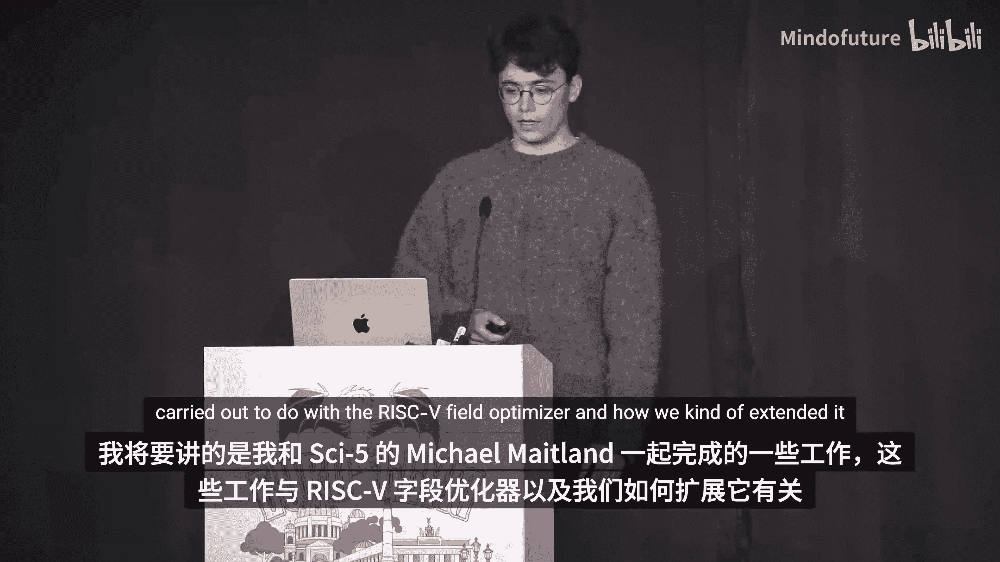
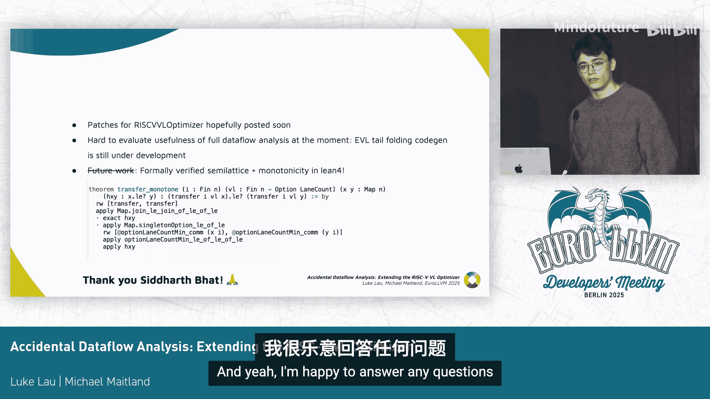

# 037：意外的数据流分析——扩展 RISC-V VL 优化器

## 概述

在本教程中，我们将探讨如何扩展 LLVM 中的 RISC-V VL 优化器，以支持尾循环折叠特性。我们将从问题背景出发，逐步介绍优化器的设计、遇到的挑战、解决方案，并最终揭示其背后的数据流分析原理。整个过程旨在让初学者理解编译器后端优化的一个实际案例。

## 动机：启用 RISC-V 尾循环折叠

我们希望为 RISC-V 后端（更准确地说，是在中端）启用 EVL 尾循环折叠特性。尾循环折叠是指将循环向量化器生成的尾部循环合并到主向量化循环体中，从而只生成一个向量化循环。

循环向量化器最初生成两个循环的原因在于，向量指令每次处理固定数量的元素（例如四个，称为向量化因子）。如果循环的迭代次数不能被向量化因子整除，就需要一个标量循环来处理剩余的元素。

尾循环折叠的思想是，像 RISC-V 这样的向量架构支持通过掩码来屏蔽向量指令中不需要的通道。利用这个特性，就可以消除尾部的标量循环，在向量循环中通过掩码处理最后一次迭代中不需要的元素。

RISC-V 的独特之处在于，它有一个专用的标量寄存器，称为向量长度寄存器。这意味着我们不需要计算掩码。对该特性的支持已于去年合入主线，这是一个历时很久、工作量巨大的补丁。目前，该特性需要通过一个标志手动启用，因为其中涉及一些显著的代码生成问题，仍需评估和完善。

我们的目标是找到方法，使其能够默认启用。

## 评估与问题发现

评估一个特性是否就绪的最佳方法是观察它在真实代码上的运行情况。LLVM 测试套件非常适合这项工作。

我们首先构建并运行测试，发现了错误编译的问题。由于这是新特性引入的错误，无法简单地通过二分查找定位，只能通过对比二进制文件来排查。

我们使用了一个名为 `bisect` 的脚本工具。它允许我们提供一个能复现错误编译的脚本，并在已知的正确构建和错误构建之间进行二分查找，最终定位到导致错误编译的最小对象文件集。通过这种方法，我们成功修复了错误编译。

修复后，我们进行了性能测试，看到了显著的性能提升。但我们仍需仔细检查生成的代码，确保没有隐藏的性能回归。

## 发现性能回归与 VP 内部函数

我们使用 `t-diff` 脚本对比启用和禁用尾循环折叠的构建，发现了一些性能回归。例如，优化器无法匹配一个扩展乘法指令。

通过检查 LLVM IR，我们发现差异在于：启用了尾循环折叠的循环向量化器会发射一个带有许多复杂参数的 `llvm.vp.*` 内部函数调用，而不是原来的乘法指令。这些是向量谓词内部函数，循环向量化器使用它们来控制尾循环折叠和其他循环折叠中的掩码和谓词。

这些内部函数的问题是，它们会阻碍许多优化和指令组合。后端需要为这些 VP 内部函数提供正确的模式匹配，这正是问题的根源：RISC-V 后端没有为这个扩展乘法在 VP 内部函数级别提供模式。

循环向量化器必须为可能陷入的指令（如加载和存储）发射 VP 内部函数，以确保不会在屏蔽的通道上执行。但对于不会陷入的指令，为什么也需要呢？原因在于，在某些 RISC-V 微架构上，即使对于不会陷入的指令，减少 VL 也能带来优化，减少执行周期。

## RISC-V VL 优化器的引入

Michael Milan 在 SciFi 也在研究 EVL 尾循环折叠，但他遇到了另一个问题：没有用于 `getelementptr` 指令的 VP 内部函数。这意味着对于任何向量化的聚集加载循环，我们都在不必要地计算地址，没有减少这些通道的 VL，做了额外的工作。

为了解决这个问题，他向上游提交了 RISC-V VL 优化器补丁。这个优化器在 RISC-V 后端运行，其工作方式非常优雅：它从基本块的底部开始向上遍历（类似于逆后序），对于每条指令，查看其使用者，然后取所有使用者所要求的最大 VL，并尽可能地减少该指令的 VL。这个过程会重复进行，VL 减少的效果会向上“冒泡”，从而能够优化整个计算树。

这个算法的关键在于它在机器指令级别工作。虽然它减少 VL 的方式与 VP 内部函数类似，但因为它作用于 MIR 级别，所以能够同时优化常规的 LLVM IR 指令和 VP 内部函数，因为它们最终都会被降低为相同的机器指令。

这意味着，在这个优化器生效后，循环向量化器不再需要发射 VP 内部函数，只需发射常规的 LLVM IR 指令即可。我们同时获得了良好的代码生成和减少的 VL，几乎是无成本的。

## 扩展 VL 优化器：处理 Phi 节点

我们再次考虑默认启用尾循环折叠，并检查回归。这次发现的问题更多是错失优化机会，而非性能倒退。VL 优化器在大多数情况下表现良好，但在某些涉及 Phi 节点的场景中无法优化。

例如，一个 Phi 节点的使用者是 A 和 B 两个值，而它们最终被一个 VL 为 2 的存储指令使用。理论上，我们应该能将 A 和 B 的 VL 减少到 2。但存储指令和加法指令是 RISC-V 特定的机器指令，带有 VL 操作数；而 Phi 指令是通用的机器指令，没有 VL 操作数。当 VL 优化器遇到 Phi 指令时，就无法继续向上传播 VL 减少的信息。

为了解决这个问题，我们首先将优化器拆分为两个部分：

1.  创建一个映射，将指令映射到它们所需求的 VL。
2.  先进行分析阶段，计算每条指令从其使用者那里所需的最大 VL。
3.  在单独的阶段，根据映射实际进行指令修改。

这样，当我们遇到 Phi 节点时，就能在需求映射中减少其需求 VL，并将这个信息传播到其操作数 A 和 B，从而在后续的修改阶段完成优化。

## 扩展 VL 优化器：处理循环依赖

我们遇到的第二个例子是循环依赖：一个 Phi 节点使用了定义在其下方的值 B。显然，之前那种自底向上的单遍扫描方法无法处理这种情况。

我们切换为使用工作列表算法：

*   将指令加入工作列表。
*   在循环中弹出指令，处理它，然后将其输入指令重新加入工作列表。
*   关键在于，只有当指令的需求 VL 实际发生变化时，才将其上游指令加入工作列表，以确保算法能收敛到不动点，避免无限循环。

然而，即使这样，问题仍未解决。因为 Phi 节点的需求 VL 初始值被设为最大值，而它又是 B 的一个使用者，这阻止了 B 的 VL 被减少。

我们需要修正初始需求映射过于保守的问题。现在，我们不再将每条指令的初始需求 VL 设为其 VL 操作数的值，而是假设初始时没有任何需求。这显然不完全正确，但我们可以先在此基础上运行。

算法变为：每条指令计算自身需要什么，然后将其需求传播给它的输入。例如，存储指令会声明它需要 VL=2，并将其传播给输入 B，B 再传播给 Phi 节点。由于算法是单调的，最终会达到一个稳定的不动点并终止。

## 理论洞察：数据流分析

至此，我们意识到这个问题具有编译器理论中数据流分析的特征。我们退一步审视已有的设计：

*   **状态**：一个将指令映射到需求 VL 的“需求映射”。
*   **初始状态**：所有指令的需求 VL 初始化为 0（“底部”）。
*   **转换函数**：在循环中，根据指令使用者的需求，更新指令自身及其输入的需求 VL。

我们意识到，这本质上就是一个**数据流分析**。我们定义了转换函数和“底部”元素。这是一个**稀疏的**数据流分析，因为我们不在基本块边界或程序每个点计算状态，只沿使用链传播。同时，它是一个**乐观的**、**前向的**分析，因为它从“无需求”的乐观假设开始，必须运行到完成才能保证正确性。

状态形成了一个**半格**。分析从底部开始，随着处理指令和发现需求，状态沿着格向上移动，直到最坏情况下所有需求都被满足（“顶部”）。格中的偏序关系定义为：如果一个状态中所有定义的需求 VL 都大于等于另一个状态，则前者序高于后者。

## 算法终止性证明

利用这个理论框架，我们可以回答一个关键问题：这个工作列表算法是否会终止？

我们可以用定义的半格来证明。分析总是从底部（无需求）开始。黄色的转换函数部分，每次读取指令并传播需求 VL 时，我们都在沿着格向上移动。关键在于，我们**只会向上移动，永远不会向下**。因此，我们不可能进入循环。算法要么达到一个稳定状态（不动点）并终止，要么一直上升到顶部（所有需求都被满足）并终止。

更形式化的推理：
1.  **格是有限的**：因为从底部到顶部的最长链长度，由程序中定义的数量和 VL 操作数可能取值的唯一数量决定，这两者都是有限的。
2.  **转换函数是单调的**：根据定义，新的需求 VL 是旧值与其使用者需求最大值的最大值，因此应用转换函数永远不会减少需求 VL。

因此，该算法保证终止。

## 总结与未来工作

本节课我们一起学习了如何扩展 RISC-V VL 优化器以支持尾循环折叠。我们从实际问题出发，经历了发现问题、引入优化器、处理 Phi 节点和循环依赖的挑战，最终将解决方案抽象为数据流分析理论，并证明了算法的正确性。

目前，仍有一些补丁需要合入上游，并进行完整的评估。一个有趣的未来工作是形式化验证。值得一提的是，在本次演讲当天，Saar Baten 已经使用 Lean 定理证明器为这个算法完成了机械化验证，证明了其终止性。这确保了 RISC-V VL 优化器永远不会导致无限循环。

