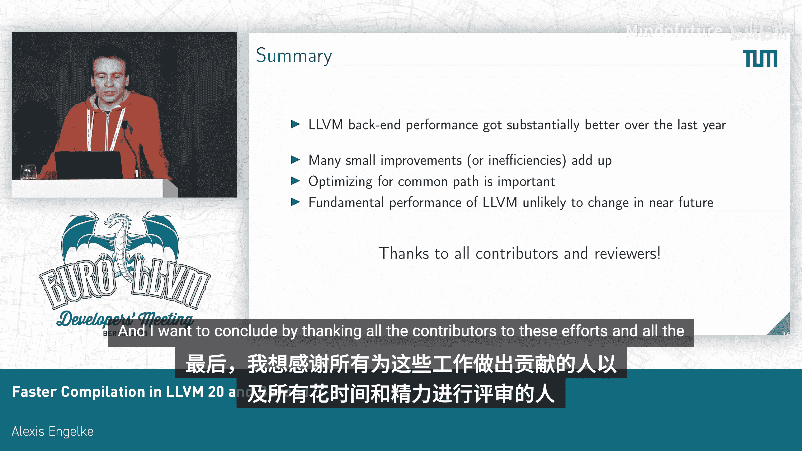

# 038：更快的编译——LLVM 20及未来的改进

在本教程中，我们将探讨如何提升LLVM后端的编译速度。我们将回顾LLVM 20中实现的性能改进，分析其背后的原理，并展望未来的优化方向。内容将涵盖哈希表优化、内存分配、指令选择、寄存器分配等多个方面，旨在帮助初学者理解编译器后端性能优化的核心思路。

## 为什么需要关注编译速度？

编译速度主要影响两类用户。第一类用户是即时编译器。例如，某些数据库和WebAssembly运行时会使用LLVM作为其优化编译器框架。当系统已经有一个编译器后端时，将其同时用作基线编译器是合理的，这样可以避免维护独立的基线编译器后端。

第二类用户是开发者。更快的编译速度意味着更快的开发、测试和启动周期，从而提升开发效率。这对于关注编译错误或测试结果反馈延迟的开发者体验至关重要。需要注意的是，开发者体验也涉及编译器前端，但本教程将主要聚焦于后端。

## 性能优化的一般性原则

上一节我们介绍了关注编译速度的原因，本节中我们来看看进行性能优化时的一些通用准则。

### 哈希表的优化

哈希表虽然具有O(1)的平均时间复杂度，但常数因子不容忽视。频繁访问哈希表会带来显著的运行时开销。因此，应尽可能避免使用哈希表。

在LLVM中，一种常见的哈希表类型是从指针映射到其他值。对于这种映射，CPU有一个非常高效的内置特性：**解引用指针**。一个优化实例是SelectionDAG的Combiner。它管理着一个待合并节点的工作列表，并使用一个哈希表将节点映射到工作列表中的索引，以便删除或修改列表项。这个哈希表被频繁使用。通过将工作列表索引直接存储在节点本身，而不是使用哈希表，我们获得了约3%的端到端编译速度提升。

当然，并非所有情况都能这样优化。例如，当需要将LLVM基本块映射到其他值时，并不总是能在基本块中添加额外字段并让所有用户承担开销。对于这种情况，更好的替代方案是使用密集编号和数组。这催生了“块编号”的引入，它显著提升了支配树计算的性能，该计算之前被哈希表查找所主导。

另一个优化点是避免在同一个或不同哈希表中对同一键进行冗余查找。例如，在MC汇编器中，创建一个符号时，它曾被插入到四个不同的哈希表中。我们成功将需要插入的哈希表数量减少到一个，这也带来了显著的性能影响。

需要说明的是，LLVM使用的`DenseMap`和`StringMap`数据结构本身是相当高效的。但哈希表固有的开销是难以完全消除的。

### 内存分配的考量

内存分配是有成本的，尤其是大量的小内存分配。其开销取决于分配器，例如`mimalloc`可能更快，而像`malloc`这样被广泛使用的分配器性能则稍差。因此，减少内存分配次数通常是个好主意。

一种方法是对于内存使用单调递增的情况使用**指针碰撞分配器**。这使得分配更廉价，并改善了空间局部性。我们在MC汇编器的MCFragment中应用了此方法。MCFragment是机器代码或数据的片段，其大小可以是固定的或可增长的。但这种方法可能导致内存使用总量增加，因此并非总是最佳选择。

未来，拥有一个支持指针碰撞分配器后备存储的小向量将非常有用。这对于MCFragment尤其相关，因为MCFragment为其内容和需要应用的“fixups”预留了小的内联存储空间。这里存在一个权衡：过大的内联缓冲区常常被浪费，而频繁使用外联存储则开销较大。一个具有更高效外联存储的小向量可能是一个好主意。

### 其他次要考量

间接调用和虚函数调用有一定开销，特别是当这些虚函数默认什么都不做时。在这种情况下，应尽量避免此类调用，尤其是在调用非常频繁时。例如，在LLVM MC层，每条编码指令会进行半打虚函数调用。如果其中一些调用是无操作的，避免这些调用也能带来可观的性能提升。

`raw_svector_ostream`是另一个问题案例，目前每次写入都经过慢速路径，即一个虚函数调用。我们尝试让慢速路径更快一些，但这仍然不够理想。理想情况下，我们能够使用小向量本身作为`raw_svector_ostream`快速路径及其缓冲逻辑的缓冲区。不幸的是，这实现起来并不容易，因为有一些用户依赖`raw_svector_ostream`保持小向量即时更新。这可能需要添加一个类似`buffered_ostream`的新类型。

计时器即使被禁用也相当昂贵。拥有太多计时器并不总是好事。仅仅检查是否需要计时也不是零开销操作。

## LLVM后端各阶段性能分析

上一节我们介绍了一些通用的性能优化原则，本节中我们将具体分析LLVM后端各个阶段的性能表现和改进。

下图展示了LLVM 18在X86和AArch64架构上后端各阶段的大致耗时分布，我们将在后续详细查看各个阶段。对于LLVM 20，我们看到在X86上几乎所有部分都有改进，最终在CTMark基准测试上实现了总计18%的提速。

最大的改进来自X86的汇编打印器和寄存器分配器。在AArch64上，指令选择器稍慢一些，因为全局指令选择在O0优化级别是默认开启的。我们在汇编打印器和指令选择器上也看到了显著的改进。

寄存器分配器的更改主要影响X86和其他一些平台。具体来说，一些目标特定的过程变慢了一些。这是在LLVM 18时期的情况。

### IR处理阶段

在开始阶段，有15到20个遍处理与降低内部函数和一些复杂操作相关的工作。但观察发现，对于许多函数，尤其是在O0优化级别，它们并没有这些内部函数或复杂操作，但这些遍仍然会处理它们，即它们什么都不做。

我们开始通过将其中一些遍合并到大的预指令选择内部函数降低遍中来修复这个问题，以避免过于频繁地迭代LLVM IR，因为迭代本身不是零开销操作。我认为进一步合并这些遍是一个好的方向，最终可能只保留一个或两个预指令选择合法化遍，例如一个用于内部函数，另一个用于复杂操作。

在这些遍之后，后端主要操作机器IR。机器IR是一个非常功能丰富的中间表示，可以为我们支持的各种目标架构呈现机器代码。

### 机器IR的效率问题

机器IR本身在修改方面并不十分高效。性能分析中经常出现的一个问题是`MachineInstr::addOperand`。

机器指令操作数是有序的：首先是显式操作数，然后是隐式操作数；首先是定义操作数，然后是使用操作数。`addOperand`会迭代或查找正确的位置来插入操作数，并查找一些标志位，这相当耗时。曾考虑添加一个不检查或快速添加操作数的方法，以避免一些搜索和标志更改操作，但目前还没有人完成这项工作。

另一个问题是管理寄存器的使用-定义列表也不是零开销的，但LLVM IR也存在类似的考量。我认为这不会改变，因为我们可能希望保持急切更新的使用-定义列表。

此外，机器IR支持为特定且很少使用的功能内联或外联存储额外信息，但检查某些额外信息是否可用及其位置经常会导致一些分支预测失败，我认为这可以相对容易地避免。

### 指令选择器

我们如何得到机器IR？这正是指令选择器的工作。目前LLVM中有三种指令选择器。FastISel可能是我们拥有的最快的指令选择器，因为它在一个步骤中完成所有工作。而SelectionDAG和较新的GlobalISel则是增量式地降低IR，直到得到机器IR。

总的来说，有两个观察结果是开销较大且难以避免的。第一是调用约定降低，这在性能分析中经常出现。但由于需要考虑各种属性和ABI细节，我认为那里没有太大的改进空间。

第二是SelectionDAG回退对于FastISel来说仍然且将继续是昂贵的。在这一点上，可能建议前端改变生成LLVM IR的方式，生成对FastISel友好的IR。我们可以启用优化备注来找出FastISel在何处回退到SelectionDAG。

### GlobalISel的改进

GlobalISel在最近两个版本中有了相当大的改进。它采用多遍方法进行翻译、合法化和指令选择，中间运行组合器进行一些优化。

第一个观察是，定点迭代通常并不真正有益，尤其是在O0级别。因此添加了一个可选标志，只执行单遍全局指令组合，而不是定点迭代。这与早期对SelectionDAG组合器的类似更改一致，当时也放弃了定点迭代。

另一个观察是，死代码消除并不廉价，也不总是必需的。合法化器已经执行了死代码消除，因此组合器不需要再次执行。

另一个更改是让合法化器生成更少的糟糕IR，例如针对像i1算术这样不合法的操作。使用非位操作可以避免生成此类伪指令。尽管非位操作并不完全廉价，但它总是有益的。即使在O0级别，它也使用减少的递归深度。

尽管有这些明显的改进，GlobalISel仍然比FastISel慢47%。曾有过添加一个更快的、直接生成目标机器IR的翻译器的想法，但这需要更多的工作。虽然这会是有益的，但我不认为它会在未来几个版本中出现。

### 寄存器分配器

寄存器分配器相当复杂。我认为主要的启示是，针对常见情况的快速路径很重要，同样，使用快速数据结构也很重要。例如，通过直接使用向量来拓宽干涉位图的内部表示。

我认为在处理寄存器单元的方式上也有改进的空间。寄存器单元存储为由TableGen生成的密集编号，当迭代一个寄存器的寄存器单元时，这会导致很多数据依赖。我测量过，并怀疑这些依赖也会导致一些性能开销。

### 目标特定遍

同样，这里有一个类似的观察：许多这些遍在典型的O0输入上什么都不做。

一个更改是，O0编译X86不再需要支配树。我们更改了使用它的遍，使其首先检测是否真的需要支配树，然后按需计算它。我希望随着新遍管理器的引入，实现此类更改会变得更容易。

此外，针对某些ISA特性（如MMX）的特定遍，如果这些特性未被使用，应该什么都不做。对于AMX，我们在指令选择和降低期间跟踪AMX指令是否实际出现。如果它们没有出现，我们就在这些遍中添加提前退出，以便在非常常见的、未使用该ISA扩展的情况下，它们什么都不做。

## 汇编打印与MC层

上一节我们分析了后端核心阶段的优化，本节我们来看看编译的最后一步：汇编打印和MC层。

汇编打印器和MC层将机器IR首先降低到MCInst，然后将其编码到目标文件中。它非常灵活且高度可定制，支持各种目标文件格式，为各种功能钩入指令，内置了完整的汇编器。为了这种灵活性，其大部分功能都围绕虚函数调用构建。但也很明显，它的设计初衷是功能，而非性能。

在最近的版本中，Fwisson做了大量工作来重构MC以提高性能。其中一些更改与减少虚函数调用或减少数据和指令被复制的次数有关。但我认为，当聚焦于常见路径时，仍然存在优化潜力。我认为在典型的O0输入不需要的路径上仍然花费了大量时间。

## 关于LLVM后端性能的总体思考

我认为LLVM有一个根本性的性能问题，不幸的是，这也是它最大的优势：即增量的IR重写方法。这对可组合性非常有利，但也非常昂贵。

另一个问题是，编译时间通常不是首要关注点。其他关注点，例如生成代码的质量、生成代码的大小、可维护性、内存使用等也同样重要。因此总是需要做出权衡。

另一个考量是关于前端的。前端有时会生成相当糟糕的IR。随着后端变得更快，我们也发现Clang在C++编译时间中的占比越来越大，并且Clang随着时间的推移有变慢的趋势，消耗了我们实现的一些性能改进。我认为Clang确实需要一些优化。

关于后端，我认为一个独立的、专注于常见情况的O0后端，正如我们一直在努力并希望很快开源的那个，其速度可能是LLVM O0后端的10倍。与试图从LLVM O0后端再挤出10%或15%的性能相比，投资于这样的后端将是时间上更明智的投资。

## 总结

在本教程中，我们一起学习了LLVM后端编译速度优化的多方面知识。

我们了解到，LLVM后端性能在过去一年中得到了显著改善，许多小的改进累积起来效果显著。优化常见路径非常重要。但我不认为LLVM会有根本性的改变或2倍的性能提升即将到来。

最后，感谢所有为这些努力做出贡献的人以及花费时间和精力进行代码审查的评审者们。

## 问答环节

**问：** 你提到前端时间主导了编译时间。你是指从解析到IR生成的整个前端，还是仅仅指IR生成很慢？根据我的记忆，IR生成并不是最大的部分，最大的部分确实是解析和语义分析。对于C++，模板实例化通常也是个问题。

**答：** 对于C++，解析和到达可以发出LLVM IR的阶段确实是主导时间。在我们的数据库中，仅仅发出LLVM IR就花费了大约5%到10%的编译时间。但对于Clang，我认为解析和到达可以发出LLVM IR的阶段确实是主导时间。

**问：** 你列出的许多改进与O0关系不大。你是否有关于它们如何影响，比如说，O2编译时间的数据？

**答：** 在X86上，O2编译时间改进了9%。在AArch64上，没有改进。

**问：** 你是否考虑过为指令选择或类似功能设置持久化缓存？

**答：** 我们没有在缓存方面工作。我知道有其他人在研究缓存方案，但我不清楚其中是否有任何方案目前已经可以使用或有明确的上游路径。我对此不了解。

**问：** 你提到计时器即使不活动也可能非常昂贵，但我觉得编译时间的一个大问题是程序员无法了解时间花在了哪里。我发现像timetrace这样的工具真的很有帮助。如果计时器很贵，你对于如何为程序员提供更多关于编译器正在做什么的可见性有什么想法，以便他们能参与到优化自己构建的过程中？

**答：** 我认为问题是如果你以过于细的粒度放置计时器，例如每条指令一个计时器，这些计时器也并没有真正的帮助，因为此时测量开销也会使你的结果价值降低。我认为对于像遍或分析这样的更高粒度，拥有计时器是很好的，并且TimePasses的开销也相当低，大约只有2%到3%。对于其他情况，我结合使用带帧指针的LLVM和分析工具取得了一些成功。这通常是我处理那些在计时器中不显示的问题的方法。

**问：** 非常有趣的演讲。你提到前端占主导地位，这也符合我们的经验。我好奇你在前端方面认为最重要的两个热点是什么？你有什么想法吗？

**答：** 我认为我从未向Clang提交过代码，并且我对代码库并不十分熟悉。直观地说，我认为AST并不像它应有的那样好，而且我认为它是一个相当昂贵的数据结构。我认为至少对于C语言，有可能写出更快的、拥有更快方法的编译器。对于C++，我不知道，我从未写过自己的C++编译器。

**问：** 你是否考虑过让每个函数在自己的线程中进行代码生成？

**答：** 在LLVM中实现并行性非常困难，因为所有东西基本上都塞在同一个上下文中。我们考虑过一点。但正如我简要提到的，我们选择编写自己的LLVM后端，它处理常见情况的速度要快10到20倍。如果快20倍，那么我认为并行性就不那么重要了，尤其是在翻译单元级别仍然有并行性的情况下。对于即时编译，可能无关紧要，因为可能只有一个函数。对于大型项目，像`make`这样的工具并行运行任务，这也不重要。也许有一个最佳点，但我没有做过任何分析来指出在哪个点影响编译器会是一个好主意。

