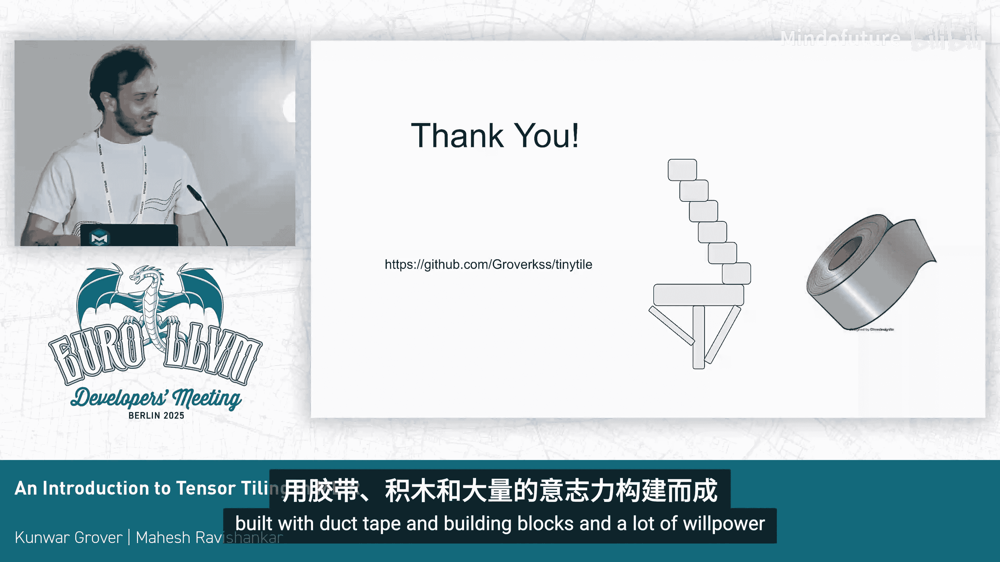

# 039：MLIR 中张量分块简介


## 概述

在本教程中，我们将学习如何在 MLIR 中为张量操作实现分块和融合。我们将从一个现有的、使用 Transform Dialect 构建的编译流水线开始，理解其核心构建模块。然后，我们将利用这些模块，构建一个仅用约 400 行代码的、能够处理任意卷积融合的简单编译器。最后，我们会探讨如何扩展这个编译器以支持新的操作，并简要介绍一些更高级的构建模块。

## 第一部分：现有分块流水线分析

首先，我们来看一个由他人构建的现有分块流水线，理解他们使用了哪些构建模块。

上一节我们介绍了本教程的目标，本节中我们来看看一个具体的例子。Alex 在两年前做了一个关于 Transform Dialect 的精彩演讲。在他的演讲末尾，他展示了如何利用 Transform Dialect 和 MLIR 操作构建一个调度器，该调度器能够击败 cuDNN 的卷积实现。这似乎是展示上游 MLIR 已有可用工具的绝佳案例。

我们将从一个简单的计算图开始：一个卷积操作，后面跟着一个 ReLU 激活函数，以及一个偏置的广播加法。如果直接降低这个图，其循环结构会先进行广播，然后是卷积，最后是 ReLU，没有进行任何融合。为了获得良好的性能，我们需要进行融合，目标循环结构应该在一个循环内完成所有计算，使用合适的瓦片大小，避免中间缓冲区，并尽量使用寄存器。

### Transform Dialect 简介

Transform Dialect 是一种元 IR，允许你指定如何转换你的操作。例如，你可以指定“使用瓦片大小 [1, 1, 5, 64] 通过 forall 循环来分块这个卷积操作”，这个转换就会被应用到 IR 上。

以下是该教程中使用的调度步骤：

1.  **并行维度分块**：使用 `forall` 循环对并行维度进行分块。
2.  **融合到循环**：使用 `fuse_into_containing_op` 将其他操作融合到这个循环中。
3.  **归约维度分块**：对卷积的归约维度进行分块。
4.  **向量化**：将循环内的计算转换为向量操作。
5.  **缓冲区化**：将张量转换为内存缓冲区。

通过这个流程，我们得到了期望的融合循环结构。这个流水线在性能上可以超越 cuDNN 约 10%。

### 核心观察

从这个例子中，我们得到的关键观察是：
*   真正可变的部分是**分块和融合策略**，即如何决定代码的循环结构。
*   其他部分（如向量化、缓冲区化）基本上是固定的，可以直接应用。

因此，本教程将主要关注分块和融合部分。实现分块和融合主要依赖于三个核心方法：
*   `tile_using_scf`：使用 SCF 方言（结构化控制流）对操作进行分块。
*   `producer_fusion`：将生产者操作（通过 `extract_slice`）融合到循环中。
*   `consumer_fusion`：将消费者操作（通过 `insert_slice` 或 `forall` 的 `yield`）融合到循环中。

## 第二部分：构建自己的分块编译器

理解了核心构建模块后，我们现在尝试用它们构建自己的编译器。

上一节我们分析了现有流水线，本节我们将动手构建一个简单的编译器。目标是复制之前看到的卷积融合功能，但将其实现为一个通用的、可处理任意融合的 Pass 流水线。

### 分块实现

分块的核心是 `tile_using_scf` 方法。我们可以创建一个 `TilingOptions` 结构体，设置好瓦片大小，然后对目标操作调用此方法。它会自动生成分块后的计算。

```cpp
TilingOptions tilingOptions;
tilingOptions.setTileSizes({tileSizeX, tileSizeY, ...});
FailureOr<TilingResult> tilingResult = tileUsingSCF(rewriter, targetOp, tilingOptions);
```

### 融合策略

融合策略可以设计得很简单：贪心融合。我们维护一个工作列表，不断尝试将操作融合到已分块的循环中。

以下是融合算法的核心逻辑：

1.  初始化工作列表，包含最初分块操作产生的 `extract_slice` 和 `insert_slice` 操作。
2.  循环处理工作列表：
    *   如果遇到 `extract_slice`，尝试进行生产者融合 (`producer_fusion`)。
    *   如果遇到 `insert_slice` 或 `parallel_insert_slice`，尝试进行消费者融合 (`consumer_fusion`)。
3.  新生成的分片操作会自动加入工作列表。

为了跟踪新生成的操作，我们可以使用 MLIR 的 `Listener` 机制。每当有新的操作被插入到 IR 中时，监听器会将其加入到我们的工作队列。

### 指定瓦片大小

一个简单的方法是为操作附加一个可丢弃的属性（discardable attribute），例如 `lowering_config`，在其中指定并行和归约的瓦片大小。在分块时，查询这个属性即可。

```cpp
// 示例：为操作设置瓦片大小属性
op->setAttr("lowering_config", ...);
```

### 完整的编译流水线

结合以上部分，我们可以构建一个两阶段的编译流水线：

1.  **并行层分块 Pass**：对并行维度进行分块。
2.  **归约层分块 Pass**：对归约维度进行分块，并运行贪心融合算法。

之后，可以附加固定的后续处理：
*   向量化 Pass
*   缓冲区化 Pass

这个流水线可以自动处理类似“卷积 + 偏置广播 + ReLU + 其他逐元素操作”的融合，并且性能优异。

### 处理特殊情况

为了让编译器更健壮，我们可以增加一个机制：如果函数上附加了特定的属性（如 `use_transform_spec`），则直接运行对应的 Transform Dialect 脚本，否则使用我们默认的贪心融合流水线。

## 第三部分：扩展编译器以支持新操作

现在我们已经有了一个可工作的编译器，但如何让它支持新的张量操作呢？

上一节我们构建了一个基础编译器，本节我们来看看如何扩展它。关键在于实现 MLIR 的 **TilingInterface**。

假设我们定义了一个新的操作 `tutorial.dequant`（一个简化的反量化操作）。编译器目前不知道如何分块或融合它。我们需要教编译器，方法就是为这个操作实现 `TilingInterface`。

### TilingInterface 关键方法

要实现分块和融合，主要需要实现以下方法：

**1. 获取迭代域 (`getIterationDomain`)**
这个方法返回包围该操作的循环边界。对于一个逐元素操作，迭代域就是输入张量的每个维度从 0 到对应大小。

**2. 获取循环迭代类型 (`getLoopIteratorTypes`)**
这个方法指明每个循环是并行的还是归约的。对于逐元素操作，所有维度都是并行的。

**3. 获取分块实现 (`getTiledImplementation`)**
这是核心方法。给定一个“瓦片”的偏移量和大小（即要计算输出张量的哪一部分），生成计算这个瓦片的代码。对于逐元素操作，只需提取输入张量的对应瓦片，克隆原操作，并计算即可。

**4. 获取结果瓦片位置 (`getResultTilePosition`)**
给定输入瓦片的位置，告诉我输出的结果瓦片在结果张量中的位置。对于逐元素操作，输入和输出位置相同。



**5. 生产者融合相关方法 (如 `getIterationDomainTileFromResultTile`)**
这些方法用于实现生产者融合。例如，`getIterationDomainTileFromResultTile` 告诉我们在已知输出瓦片位置时，需要读取输入张量的哪个瓦片。

**6. 消费者融合相关方法 (如 `getIterationDomainTileFromOperandTile`)**
这些是生产者融合的逆过程，用于消费者融合。

对于大多数逐元素操作，这些方法的实现都非常直接。一旦你的操作实现了这些接口（通常主要是前4个），它就能无缝接入我们之前构建的贪心融合编译器流水线。

通过这种方式，你可以不断向编译器中添加新的操作（如新的激活函数、新的规约操作等），而无需重写整个分块和融合逻辑。

## 第四部分：高级构建模块与总结

最后，我们简要探讨一些更高级的构建模块，它们可以将简单的分块编译器提升到新的水平。

### 分布与映射

`scf.forall` 循环不仅用于分块，还可用于**分布**。你可以为其设置 `mapping` 属性，将循环迭代映射到 GPU 的线程块（block）或线程束（warp）上。通过这种方式，你可以在分块的同时完成计算在加速器硬件上的分布，从而构建 GPU 编译器。

### 高级归约分块策略

对归约操作进行分块时，有多种策略：
*   **普通归约**：在循环内累加。
*   **Split-K (部分归约-外层并行)**：将归约维度拆分，各部分并行计算部分和，最后合并。这对矩阵乘法等操作非常有用。
*   **GPU 风格归约**：采用交错步长加法等优化模式。

MLIR 的 `TilingOptions` 允许你设置 `reductionTilingStrategy` 来选择不同的归约分块策略。

### 总结

在本教程中，我们一起学习了：
1.  **分析现有工具**：我们首先剖析了一个使用 Transform Dialect 构建的高性能分块融合流水线。
2.  **理解核心模块**：我们识别出三个核心方法 (`tile_using_scf`, `producer_fusion`, `consumer_fusion`) 是构建分块编译器的基石。
3.  **动手构建编译器**：利用这些模块，我们构建了一个约 400 行代码的贪心融合编译器，能够自动处理复杂的操作融合。
4.  **扩展编译器**：我们学习了如何通过实现 `TilingInterface` 来让编译器支持新的张量操作，使其易于扩展。
5.  **展望高级功能**：我们简要介绍了利用 `scf.forall` 进行分布以及高级归约分块策略，展示了这些基础概念的强大扩展能力。

总而言之，MLIR 提供了一套强大而灵活的抽象和接口，使得构建高性能、可扩展的张量编译器不再是遥不可及的任务。希望本教程为你开启了探索 MLIR 编译技术的大门。


