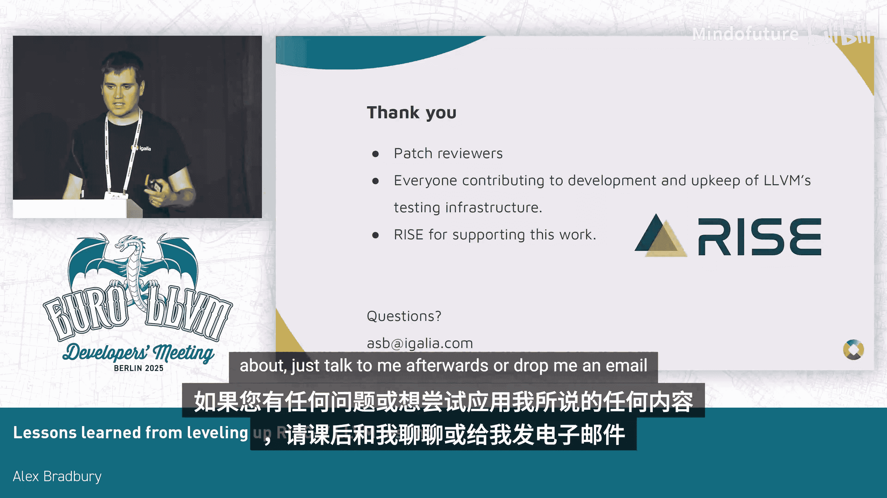
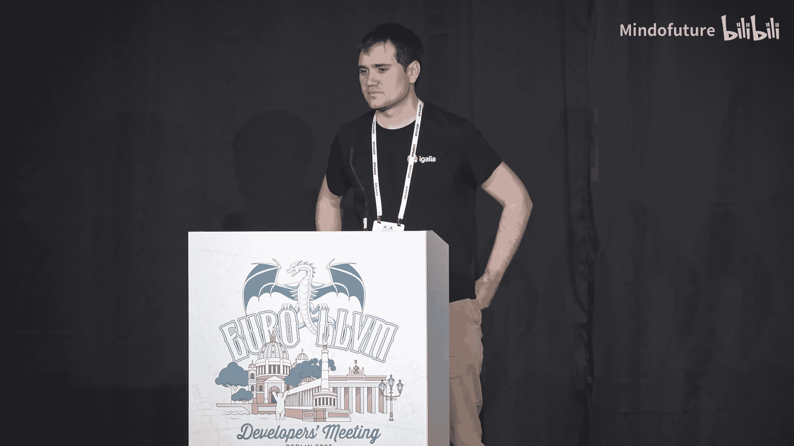

# 042：提升 RISC-V LLVM 测试的经验教训 🚀

## 概述
在本节课中，我们将学习如何为 RISC-V 架构改进 LLVM 的持续集成（CI）流程。课程内容基于实际经验，涵盖了从硬件限制、仿真方案选择到构建脚本优化和测试策略等多个挑战。虽然以 RISC-V 为例，但其中大部分经验也适用于其他 LLVM 后端目标。

---

## 挑战一：硬件限制与仿真方案 🖥️

上一节我们介绍了课程背景，本节中我们来看看第一个具体挑战。

RISC-V 架构目前拥有相当数量的开发板，但缺乏可放入机架、能快速完成 Clang 和 LLVM 引导构建的服务器级系统。

**解决方案**是使用在快速商用 x86-64 主机上运行的 QEMU 进行仿真。虽然牺牲了速度，但获得了灵活性。初始设置此基础设施的主要成本是工程时间，硬件本身相对便宜。例如，可以每月花费数百元租用高性能服务器。在 QEMU 下运行还提供了更多灵活性，可以测试尚未在硬件中可用的指令扩展或扩展组合，甚至测试真实硬件中可能不存在的扩展选项，这有助于发现错误。

---

## 挑战二：仿真速度与测试运行 🐌

我们建立了基于 QEMU 的仿真环境，但在全系统模式下运行速度较慢。这种模式模拟完整的 RISC-V 系统，包括运行编译为 RISC-V 的 Linux 内核，完成完整的两阶段引导构建，并运行单元测试，整个过程大约需要 16 小时。

以下是几种应对方案：
*   **交叉编译**：可以在 x86 上尽可能快地编译所有内容。
*   **QEMU 用户模式**：这是 QEMU 的另一种使用模式，它在用户级别进行翻译，比全系统模式稍快，可扩展性更好。在全系统模式下，跨多核的可扩展性尚可，而用户模式在独立的进程构建设置中表现更佳。

然而，用户模式在仿真保真度方面存在问题。这意味着，当你发现一个错误时，很难判断它是测试环境本身的问题，还是真正的问题。

---

## 挑战三：最终的解决方案：交叉编译与虚拟机 🔄

我最终采用的解决方案，可能对其他人也很有帮助。相关脚本可以在 LLVM 的 `Zorg` 仓库中找到。

具体流程如下：
1.  进行交叉编译。
2.  启动一个基于 RISC-V 的“设备”虚拟机。
3.  将生成的构建产物作为文件系统挂载到该虚拟机上。
4.  切换到该环境运行测试。

我们有一个围绕 `llvm-lit` 的包装脚本，使其对 LLVM 构建系统透明。这个方案运行良好，并且没有 QEMU 用户模式在支持 `ptrace` 或处理消毒剂（sanitizers）等方面的限制。

---

## 挑战四：扩展测试覆盖范围 📊

编译 Clang 和 LLVM 并运行单元测试是一个具有挑战性的工作负载，但它并不能代表用户使用编译器的所有场景。为了扩大测试池，至少应该加入独立的 LLVM 测试套件仓库，构建并运行其中的测试。我实际上使用 QEMU 用户模式来运行这部分测试，因为其要求相对较低，并且运行良好。总的来说，我为 LLVM 在 QEMU 用户模式下的使用上游化了一些修复，使其在基础单元测试中能较好地工作。

---

## 挑战五：构建脚本的迭代与本地测试 🔧

这个挑战可能有点令人惊讶，除非你是比我优秀得多的工程师。前面描述的概念虽然合理，但你不太可能第一次就写出完美运行的构建脚本。LLVM Buildbot 长期存在的一个问题是，很难在下游测试更改，而无需将其提交到 `llvm-zorg` 仓库并等待部署到暂存构建主控机。

解决方案是上游化对本地测试模式的支持，并编写文档。现在，设置新构建器、在本地测试或修改现有构建器并推送上游变得非常容易。这对我的工作流程是一个巨大的改进。此外，我们还为 CI 添加了一些简单的 GitHub Actions，用于检查对核心 `llvm-zorg` Python 脚本的修改是否仍能通过一些简单测试。

---

## 挑战六：构建器配置的复用与定制 ⚙️

`llvm-zorg` 基础设施有一系列可复用的“配方”，用于构建例如 `clang-stage1`。你可以通过几个选项来参数化它。这很棒，如果你只想做一个与现有构建器类似但略有不同的构建器。但当你开始改变一件事，接着改变另一件事时，你可能需要向该函数添加新参数，并将其传递下去，这可能会以意想不到的方式影响其他人的使用。

这主要是对**注解构建器**基础设施的一个推广。它允许你提交一个执行所需构建步骤的 Shell 脚本，非常易于迭代和更改。并且，与下一个挑战相关，它使其他人可以轻松地直接检出该 Shell 脚本。如果你以允许的方式编写它，他们可以在不关心 Buildbot 基础设施其余部分的情况下直接运行它。

---

## 挑战七：交叉编译的文档化 📖

我们遇到的另一个问题是交叉编译缺乏良好的文档。现在已经有上游文档提供了现代的工作流程，指导如何以有效的方式进行交叉编译。

---

## 挑战八：部署新型构建器：快速“考验” 🏃

一个更近期的变化是部署了一种新型构建器。我们从 16 小时（全系统仿真）减少到大约 1.5 到 2 小时（交叉编译后运行 QEMU 系统）。但这仍然意味着单批提交通常包含多个提交。我们能否做得更好？

我的观察是，当我发现构建器标记的回归时，我倾向于遵循一套相似的调试步骤。为什么不设置一个自动执行这些步骤的构建器呢？因此，我设置了所谓的“考验”构建器。它交叉编译一个新的 Clang 和 LLVM，然后以多种配置编译和运行 LLVM 测试套件，并将测试限制在相对较短时间内可以运行的部分。这为大约五种不同的 RISC-V 配置提供了约 25 到 30 分钟的运行时。这个想法是增加一些额外的测试。

---

## 挑战九：组合测试策略：没有万能方案 🧩

显然，没有一种放之四海而皆准的方法。我谈到了从 6 小时到 1.5 小时再到 25 分钟的运行时间。这些都是在测试不同的事物，在覆盖范围和保真度方面有不同的权衡。我发现，组合使用这些方法效果非常好。

---

## 挑战十：构建器界面的可视化 📈

Buildbot 界面功能强大，但对于浏览来说并不理想，特别是如果你只关心少数几个构建器。因此，设置一个漂亮的仪表板来查看是很有用的。就我而言，我主要关心 RISC-V 相关的构建器，以查看它们的运行时间和状态。

---

## 总结与致谢 🙏

本节课中我们一起学习了为 RISC-V 改进 LLVM CI 所面临的十大挑战及其解决方案，涵盖了从硬件仿真、构建优化到测试策略和工具链改进等多个方面。

最后，感谢所有帮助完成这项工作的人，特别是审阅者和维护 Buildbot 基础设施的贡献者。这是一项相当吃力不讨好的任务。同时，感谢 RISC-V 国际基金会对这项工作的支持。如果你有任何问题，或者想尝试应用我谈到的任何内容，请在课后与我交谈或给我发邮件。