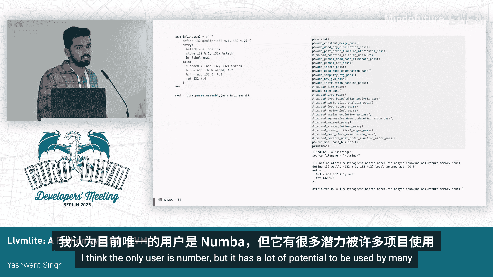

# 045：llvmlite - 一个用于 LLVM 的 Python 训练场


在本教程中，我们将学习如何使用 **llvmlite**，这是一个连接 Python 与 LLVM 编译器的桥梁库。我们将了解它的核心组件，并通过实际例子演示如何用它来构建 LLVM IR、运行优化、可视化分析以及直接执行 IR。本教程旨在让初学者能够轻松上手，利用 Python 的简洁性来探索 LLVM 的强大功能。

## 概述：什么是 llvmlite 和 Numba？

llvmlite 是连接 Numba（一个基于 LLVM 的 Python 编译器）前端与 LLVM 后端的桥梁。Numba 被广泛用于加速 Python 代码，其原理是绕过 Python 解释器，将 Python 代码转换为 LLVM IR，经过优化后，通过 LLVM 的即时编译引擎在机器上直接执行。

其工作流程可以概括为：
1.  Python 代码被转换为 Numba IR。
2.  Numba IR 被进一步转换为 LLVM IR。
3.  使用 LLVM C++ API（通过 llvmlite）对 IR 进行优化。
4.  生成机器码并执行。

以下是一个使用 Numba 加速的简单示例，它展示了装饰器 `@jit` 如何将函数编译执行，从而获得远超解释执行的性能。

```python
import numpy as np
from numba import jit

@jit(nopython=True)
def sum_array_jit(arr):
    result = 0
    for i in arr:
        result += i
    return result

def sum_array_py(arr):
    result = 0
    for i in arr:
        result += i
    return result

# 执行速度对比：jit 编译版本远快于纯 Python 解释版本
```

## 第一部分：使用 IRBuilder 构建 LLVM IR

上一节我们介绍了 llvmlite 的基本概念。本节中，我们来看看它的核心组件之一：**IRBuilder**。IRBuilder 充当了编译器前端角色，允许你将任何编程语言降级（lower）为 LLVM IR。我们将通过构建一个简单的加法函数来学习其基本用法。

首先，我们需要导入必要的模块并创建一个空的 LLVM 模块。

```python
from llvmlite import ir

# 创建一个名为 “my_module” 的空模块
module = ir.Module(name="my_module")
```

接下来，我们定义一个函数类型，并将其添加到模块中。我们的函数将接收两个 32 位整数参数，并返回一个 32 位整数。

```python
# 定义函数类型：返回类型为 i32，参数为两个 i32
func_type = ir.FunctionType(ir.IntType(32), [ir.IntType(32), ir.IntType(32)])
# 将函数添加到模块中，命名为 “add2”
func = ir.Function(module, func_type, name="add2")
```

现在，我们需要为函数添加基本块（Basic Block）和指令。IRBuilder 在三个抽象层级上工作：`builder.block`（基本块级）、`builder.function`（函数级）和 `builder.module`（模块级）。

```python
# 在函数中创建一个名为 “entry” 的基本块
entry_block = func.append_basic_block(name="entry")
builder = ir.IRBuilder(entry_block)

# 获取函数的参数
a, b = func.args
# 创建加法指令：将参数 a 和 b 相加，结果存入变量 c
c = builder.add(a, b, name="c")
# 创建返回指令：返回变量 c 的值
builder.ret(c)
```

以下是完整的代码及其生成的 LLVM IR 输出：

```python
from llvmlite import ir

module = ir.Module(name="my_module")
func_type = ir.FunctionType(ir.IntType(32), [ir.IntType(32), ir.IntType(32)])
func = ir.Function(module, func_type, name="add2")

entry_block = func.append_basic_block(name="entry")
builder = ir.IRBuilder(entry_block)

a, b = func.args
c = builder.add(a, b, name="c")
builder.ret(c)

print(module)
```
**输出 IR 示例：**
```
; ModuleID = "my_module"
target triple = "unknown"
target datalayout = ""

define i32 @add2(i32 %".1", i32 %".2") {
entry:
  %"c" = add i32 %".1", %".2"
  ret i32 %"c"
}
```

你还可以进一步设置模块属性，例如目标平台和函数属性。

```python
module.name = "test_module"
module.triple = "x86_64"
func.attributes.add("noinline")
```

此外，一个模块可以包含多个函数。以下是添加第二个函数 `add3` 的示例：

```python
# 定义接收三个参数的 add3 函数
func_type3 = ir.FunctionType(ir.IntType(32), [ir.IntType(32), ir.IntType(32), ir.IntType(32)])
func3 = ir.Function(module, func_type3, name="add3")

entry_block3 = func3.append_basic_block(name="entry")
builder3 = ir.IRBuilder(entry_block3)

x, y, z = func3.args
sum1 = builder3.add(x, y, name="sum1")
sum2 = builder3.add(sum1, z, name="sum2")
builder3.ret(sum2)
```

## 第二部分：使用 llvmlite 进行日常编译器工作

我们已经学会了如何构建 IR。本节中，我们来看看如何利用 llvmlite 简化日常的编译器开发和实验工作，特别是在需要快速原型设计时，它可以避免直接使用 C++ 的复杂性。

首先，我们可以从字符串直接解析 LLVM IR 到一个模块对象中。

```python
from llvmlite import binding as llvm

ir_string = """
define i32 @count_zeros(i32 %n) {
entry:
  %cmp = icmp eq i32 %n, 0
  br i1 %cmp, label %if.then, label %if.end
if.then:
  ret i32 1
if.end:
  ret i32 0
}
"""
# 将字符串解析为 LLVM 模块
module = llvm.parse_assembly(ir_string)
```

在操作模块之前，需要进行一些初始化，例如设置目标和 Pass 管理器。

```python
# 初始化 LLVM 目标等
llvm.initialize()
llvm.initialize_native_target()
llvm.initialize_native_asmprinter()

# 创建目标机器对象（用于当前主机）
target = llvm.Target.from_default_triple()
target_machine = target.create_target_machine()

# 创建 PassBuilder 和模块 Pass 管理器
pass_builder = llvm.PassBuilder()
mpm = pass_builder.build_module_optimization_pipeline(llvm.OptimizationLevel.O3)
```

### 运行优化 Pass

以下是使用 llvmlite 运行单个优化 Pass（如 `simplifycfg`）的步骤：

```python
# 创建模块 Pass 管理器
pm = llvm.ModulePassManager()
# 添加 simplifycfg pass
pm.add_pass(llvm.PassManagerBuilder().populate_module_pass_manager())
# 对模块运行该 pass
pm.run(module)
print(module)
```

你也可以方便地运行标准的优化管道，例如 O3：

```python
# 获取针对 O3 优化级别配置好的 Pass 管理器
pm_o3 = pass_builder.build_module_optimization_pipeline(llvm.OptimizationLevel.O3)
# 运行优化
pm_o3.run(module)
print(module)
```

### 可视化分析

LLVM 提供了丰富的可视化 Pass，用于生成控制流图、支配树等图表。我们可以用 llvmlite 轻松调用它们。以下是生成控制流图 PNG 图像的函数示例：

```python
import subprocess

def render_module_to_png(module, filename):
    """将模块的控制流图渲染为 PNG 图像。"""
    # 创建 Pass 管理器并添加 CFG 打印机 Pass
    pm = llvm.ModulePassManager()
    # 注意：此处需要 llvmlite 支持对应的 Pass 包装
    # pm.add_pass(“cfg-printer”) # 示例，实际 API 可能不同
    pm.run(module)
    # 假设 Pass 生成了 .dot 文件，将其转换为 PNG
    # subprocess.run([“dot”, “-Tpng”, f”{filename}.dot”, “-o”, f”{filename}.png”])
    print(f”控制流图已生成到 {filename}.png”)

# 调用函数
render_module_to_png(module, “count_zeros”)
```

类似地，你可以创建函数来生成支配树或后支配树图。

### 构建自定义优化管道

llvmlite 允许你灵活地组合各种 Pass，构建自定义的优化管道，这对于研究特定优化序列的效果非常有用。

```python
# 示例：创建一个自定义的 Pass 序列
custom_pm = llvm.ModulePassManager()
# 添加一系列 Pass（此处为示例，实际 Pass 名称需参考 llvmlite 支持列表）
# custom_pm.add_pass(“loop-rotate”)
# custom_pm.add_pass(“licm”)
# custom_pm.add_pass(“simplifycfg”)
custom_pm.run(module)
print(module)
```

### 查看汇编代码

你还可以使用 llvmlite 为不同的目标平台生成汇编代码。

```python
# 为不同目标创建目标机器
triple_riscv = “riscv64”
triple_x86 = “x86_64”
# 注意：需要 LLVM 已编译对应后端的支持
# target_riscv = llvm.Target.from_triple(triple_riscv)
# target_machine_riscv = target_riscv.create_target_machine()

# 生成本机目标的汇编
asm_native = target_machine.emit_assembly(module)
print(“本机平台汇编代码：”)
print(asm_native[:200]) # 打印前200个字符作为示例
```

## 第三部分：直接执行 LLVM IR

最后，我们将学习如何使用 llvmlite 和 LLVM 的即时编译引擎来直接执行我们构建或解析得到的 LLVM IR 函数。

首先，我们从一个包含 `add2` 函数的 IR 字符串创建模块。

```python
ir_string_add2 = “””
define i32 @add2(i32 %a, i32 %b) {
entry:
  %sum = add i32 %a, %b
  ret i32 %sum
}
“””
module_to_execute = llvm.parse_assembly(ir_string_add2)
```

接着，创建目标机器和即时编译器实例。llvmlite 目前主要依赖 LLVM 的 MCJIT 引擎。

```python
# 创建目标机器（用于当前主机）
target = llvm.Target.from_default_triple()
target_machine = target.create_target_machine()

# 创建 MCJIT 编译器实例
compiler = llvm.create_mcjit_compiler(module_to_execute, target_machine)
```

编译模块后，我们可以获取函数的地址，并通过函数指针调用它。

```python
# 获取编译后函数 add2 的地址
add2_ptr = compiler.get_function_address(“add2”)
# 将地址转换为可调用的 Python 函数（需使用 ctypes）
import ctypes
add2_cfunc = ctypes.CFUNCTYPE(ctypes.c_int, ctypes.c_int, ctypes.c_int)(add2_ptr)

# 执行函数
result1 = add2_cfunc(1, 2)  # 应返回 3
result2 = add2_cfunc(-1, 5) # 应返回 4
print(f”add2(1, 2) = {result1}”)
print(f”add2(-1, 5) = {result2}”)
```

## 总结与展望

本节课中，我们一起学习了 **llvmlite** 这个强大的工具。我们从构建 LLVM IR 开始，探索了如何将其用于日常的编译器开发任务，例如运行优化 Pass、进行可视化分析以及直接执行 IR。llvmlite 通过 Python 绑定，大大降低了使用 LLVM 进行实验和原型设计的门槛。

llvmlite 的未来发展方向包括更新以支持 LLVM 最新的稳定版本，以及吸引更多项目使用。它不仅在支持 Numba 方面至关重要，也为在 Python 生态中构建新的编译器前端、开发调试和模糊测试工具提供了极大的便利。

希望本教程能帮助你开始使用 llvmlite 探索 LLVM 的世界。



