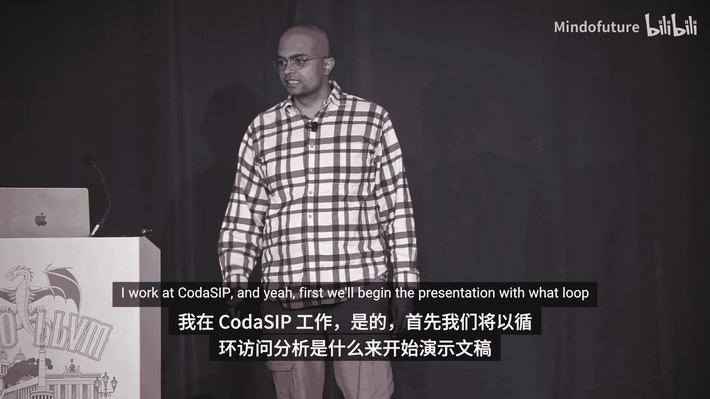
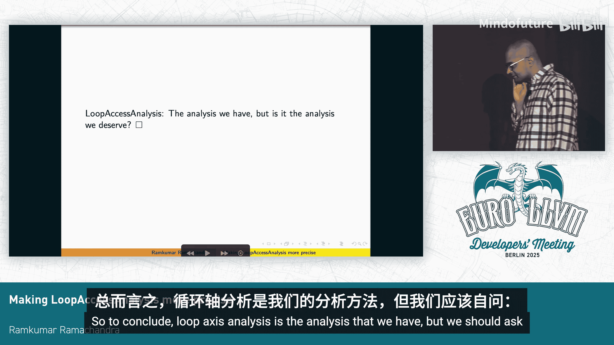

# 046：提升循环访问分析精度 🔍




在本节课中，我们将学习 LLVM 中的循环访问分析。我们将了解它的基本概念、工作原理、主要用户以及当前存在的局限性。通过本次学习，你将理解该分析在循环向量化等优化中的关键作用。

## 什么是循环访问分析？ 🤔

上一节我们介绍了课程概述，本节中我们来看看循环访问分析的具体定义。

循环访问分析最初是为循环向量化而构建的。这是构建该分析的主要原因。在其他用户中，例如 SPV 也会使用它，但并未使用其全部功能。SPV 并非循环访问分析的重度用户。

本质上，它是一种基于标量演化的依赖关系分析，旨在证明某些操作是否可以安全地进行向量化，或者是否需要在运行时进行检查。如果分析发现依赖关系不安全，则不会进行向量化。

## 循环访问分析的主要用户 🛠️

了解了基本定义后，我们来看看哪些编译器优化会使用循环访问分析。

以下是循环访问分析的主要用户：
*   **循环向量化**：这是其主要服务对象，用于判断循环是否可向量化及是否需要运行时检查。
*   **循环版本化**：该优化会为循环创建多个版本，我们稍后会简要讨论。
*   **循环负载消除**：该优化直接使用循环版本化后的循环本身。
*   **循环分布**：该优化在 LLVM 中默认未开启，但其在 GCC 中的等效优化（`loop split`）功能强大。我们应当思考为何 LLVM 的循环分布不如 GCC，以及它是否有助于向量化更多场景。

## 循环访问分析的核心功能：运行时检查 ⚙️

上一节我们介绍了分析的用户，本节中我们来看看它的一个核心功能——生成运行时检查。

循环访问分析构建的主要原因是为了能够发出运行时检查。例如，在代码 `const float* x; const float* y;` 中，编译器不知道这两个数组是否别名。如果它们别名，则向量化会存在问题。

循环访问分析的主要功能是沟通需要哪些运行时检查。循环向量化器会基于此合成这些约束条件。这些约束本质上是标量演化表达式。分析会指出，如果这些运行时检查不满足，则不进行向量化；如果满足，则进行向量化。

当然，如果使用 `restrict` 关键字（如 `float* restrict x`）指明指针不别名，那么分析会直接判定为绝对安全，这是最简单的情况。

但分析也能执行非平凡的分析。以下是一个非平凡分析的例子：
```c
for (int i = 0; i < n; ++i) {
    y[2*i] = x[i];
}
```
分析可以判定此循环是安全的，因为它识别出访问模式。原演讲中使用了 `i` 和 `i-1` 来模拟 `memcpy`，此处改为 `2*i` 以便于理解示例。

## 理解依赖关系 🔗

在深入更多功能前，我们需要明确循环访问分析中“依赖关系”的含义。

依赖关系存在于**存储与加载**或**存储与存储**之间。如果只是从内存读取（即只读循环），则不存在依赖关系。只有当向内存的冲突部分进行存储，或者加载与存储以某种方式（在循环术语中，指存在循环携带依赖或间接的不安全依赖）相互影响时，才会产生依赖问题。

## 依赖类型与步长分析 📊

现在，让我们看看循环访问分析能识别哪些具体的依赖模式。

以下是两种重要的依赖类型：
1.  **前向依赖**：例如 `A[i] = A[i-1] + ...`。这意味着当前迭代的值依赖于前一次迭代的值，这种模式通常是可归约的。
2.  **后向循环携带依赖**：例如 `A[i] = A[i + stride] + ...`。这里的“步长”是一个关键概念。

**步长**是指与归纳变量相乘的某个常量或符号值。在实际程序中经常见到步长，例如归纳变量乘以某个因子。在之前的非平凡分析例子中，`2` 就是一个常量步长。而在后向依赖的例子中，`stride` 是一个符号步长，意味着它是一个变量（例如函数参数），分析时并不知道其具体值。

对于符号步长，循环访问分析还有另一个功能：**版本化**。它会生成循环的两个版本：一个假设步长为 1 的版本，另一个保持符号步长的版本。这正是**循环版本化**优化所利用的机制，它在某些情况下（如**循环负载消除**）非常有用。

## 循环访问分析的局限性 🚧

上一节我们看到了分析的能力，本节中我们必须正视它的局限性。

以下是分析无法处理或处理不佳的几种变体（这些循环实际上不可向量化，但分析本身作为独立的依赖分析，理论上应能报告依赖关系）：
*   复杂的跨迭代访问模式。
*   涉及多个数组或非线性索引的情况。

这些例子说明了循环访问分析并非一个完整的依赖关系分析。它不会报告循环中所有的依赖关系。它的效用在于：对于大多数实际案例，基于简单标量表达式进行推理是足够有效的。它虽非绝对完美，但对向量化而言通常“足够好”。

## 内部数据结构与约束 🧱

为了理解分析如何工作，我们需要窥探其内部用于沟通信息的结构。

分析内部使用一种结构来传达其分析得出的信息，主要包含以下字段：
*   **依赖距离**：例如 `(IV - (IV-1)) * typeByteSize`。如果指针是 `int*`，则 `typeByteSize` 是 `sizeof(int)`，代表指针每次加一实际移动的字节数。
*   **最大步长**
*   **公共步长**
*   **是否需要运行时检查**

一个值得注意的限制是：对于循环访问分析，**每个依赖只关联一个步长**。即使存在多级索引，它也只识别一个与归纳变量相乘的常量或符号。这反映了其设计的简洁性：它通过标量表达式相减，来沟通是否需要运行时检查、最大向量化宽度是多少、依赖距离是多少，从而判断是否可归约。

## 标量演化的能力与挑战 ⚖️

循环访问分析建立在标量演化之上，因此其能力受限于标量演化。

标量演化本身有其限制。它不使用任意精度整数，有一定的位宽限制。当你向它查询循环次数等信息时，它会返回一个有符号或无符号的扩展表达式，可能附带一些条件和最大回跳次数，这中间存在计算成本。

更重要的是，当处理复杂的表达式时（例如包含嵌套加法、乘法或更复杂结构的表达式），标量演化的处理能力是有限的。虽然有一些论文描述了标量演化的理论基础，但循环访问分析在从标量演化表达式中恢复索引信息方面显得较为简单。

步长版本化也依赖于从标量演化中获取“步长”（`getStep`）。如果无法获取，分析就不知道步长。

另一个问题是，它**主要只分析最内层循环**。这意味着任何需要推理外层循环、循环嵌套或嵌套循环间携带的依赖关系的情况，它都无法有效处理。

## 与经典依赖分析的对比 🆚

为了更全面地认识循环访问分析，我们可以将其与 LLVM 中另一个依赖分析工具进行对比。

LLVM 中存在一个**经典依赖分析**（默认未开启），它基于 1991 年的论文《Practical Dependence Testing》，更侧重于理论。它使用 GCD 测试、Banerjee 不等式测试等，理论上能在更多情况下工作。但它是一个“完整”的分析，旨在报告所有依赖关系，而**不生成运行时检查**。它的用户是**循环控制与压紧**和**循环交换**等优化（这些优化同样因依赖分析默认关闭而未被默认启用）。要进行循环交换或压紧，本质上需要分析外层循环，这正是经典依赖分析所擅长的。

## 循环访问分析的成功案例 ✅



尽管存在诸多限制，循环访问分析在许多实际场景中表现良好。

以下是一个它表现出色的例子，该例子来自循环访问分析的测试集：
```c
for (int i = 32; i < 36; ++i) {
    for (int j = 0; j < 56; ++j) {
        A[i][j] = B[i][j] + 1;
    }
}
```
在这个嵌套循环中，分析能感知向量化宽度。它可以生成运行时检查，或者声明对于某个最大向量化宽度是安全的。这里巧妙地将外层归纳变量起始值设为 32，使其范围较小，内层循环范围也有限，从而在满足一定条件下可直接向量化。

我们可以通过命令 `opt -passes=loop-accesses -analyze` 来查看循环访问分析的调试输出。对于简单循环，它会打印出依赖方向等信息。对于更复杂的、需要合成运行时检查的循环，其输出会包含标量演化表达式、访问的低/高边界范围、用于步长版本化的相等谓词，以及基于谓词标量演化假设重写后的表达式。

## 总结与未来方向 🎯

本节课中，我们一起学习了 LLVM 循环访问分析的方方面面。

我们来总结一下循环访问分析的主要问题：
1.  无法推理外层循环。
2.  处理多索引访问时能力有限，需要像经典依赖分析那样处理更复杂的标量演化表达式，但这也不完美。
3.  另一种思路是使用完整的线性规划求解器，但这会显著增加编译时间。

目前看来，没有完美的解决方案能处理所有情况。但我们可以在以下方面进行改进：
*   **减少错误的运行时检查和虚假的依赖关系**：我们可以通过工程改进，避免分析发出不必要的运行时检查和错误的依赖判定。
*   **增加贡献者**：该分析目前贡献者很少，需要更多开发者关注和投入。

总而言之，循环访问分析是我们当前拥有的分析工具，但我们或许应该思考：这是我们应得的分析工具吗？是否有办法让它变得更好？

---
**附：问答环节摘要**

*   **问**：标量演化是否类似于一个值范围分析或求解器？
    *   **答**：标量演化不是一个完整的求解器。它在实践中足够强大，能很好地处理循环次数等问题，但在判断表达式是否非负、非正或为零等方面并不完美。它是一个在编译时不爆炸且在实践中非常有用的折中方案。
*   **问**：如果数组没有使用 `restrict` 修饰符怎么办？
    *   **答**：这不是问题。循环访问分析会为可能别名的情况发出运行时检查。向量化器会在循环前导块中插入这些检查。只要支付这个小的运行时开销，循环就能完美向量化。
*   **问**：是否有考虑将循环访问分析与经典依赖分析结合？
    *   **答**：主要难点在于如何将运行时检查机制“嫁接”到经典依赖分析上。此外，经典依赖分析代码复杂、庞大，且默认关闭导致缺乏贡献者动力。目前两者完全不兼容，结合是一个难题。


本节课中，我们一起学习了 LLVM 循环访问分析的目的、工作原理、能力与局限。理解这些是进行循环优化和编译器开发的重要基础。