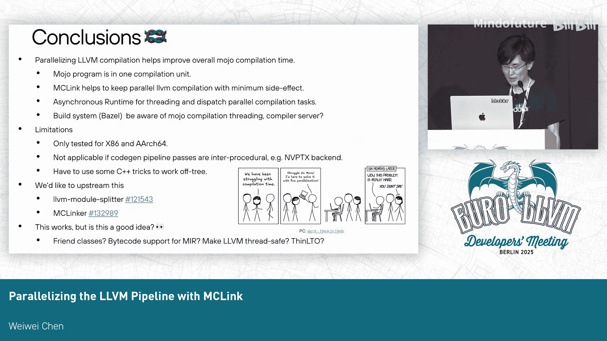
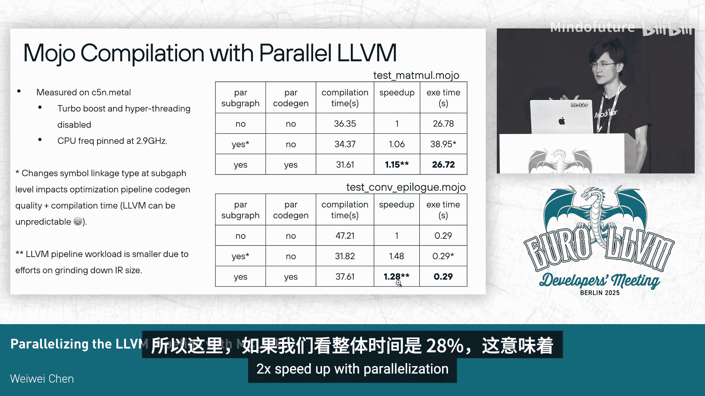

# 047：使用MCLink并行化LLVM编译流水线

在本教程中，我们将学习如何利用MCLink来并行化LLVM编译流水线，以显著提升编译速度，同时保证生成代码的性能，并最小化副作用。我们将从模块化编译的背景出发，深入探讨实现细节，最后从系统设计的角度进行总结。

## 概述

本次分享基于模块化计算的背景，这是去年LLVM开发者大会上讨论过的主题。今天，我们将重点聚焦于LLVM部分，详细讲解如何借助MCLink并行化LLVM流水线，从而实现快速的编译时间和高性能的生成代码，同时将副作用降至最低。最后，我们会将一切放回模块化编译的上下文中，展示一些数据并从系统设计角度进行讨论。

## 模块化编译回顾

模块化编译器构建在MLIR和LLVM之上。我们使用MLIR构建前端和中端，即解析器和部分中端优化。然后，我们使用LLVM进行代码生成，以生成目标代码。我们以一种非传统的方式使用LLVM，即并行化LLVM流水线以获得快速的编译时间，同时确保生成的代码性能。这极大地帮助我们缩短了整个模块化编译时间中的LLVM流水线耗时。

使用LLVM的一个原因是其功能强大，非常适合生成特定目标的结果。同时，我们也不想从头构建所有优化。然而，LLVM也有一些限制，最大的限制是其框架并非为并行化设计，通常不是线程安全的，这成为基于LLVM的系统在编译时间上的一个瓶颈。

此外，一些优化行为难以预测，包含大量启发式方法，就像编译器魔法一样，其效果很难预测。因此，在构建流水线时，我们遵循两个原则：一是尽可能简化流水线，目前模块流水线只包含大部分函数级Pass和一个IPO Pass（内联器）；二是主要部分，即尝试并行化流水线。

## 并行化策略：模块拆分

我们并行化流水线的方式是：将一个模块作为输入，将其拆分为多个子模块，每个子模块运行自己的流水线，从而实现两级并行。

第一级拆分是基于锚点函数（即外部可见函数）将模块拆分为子图。拆分图时，我们会将函数调用栈上的所有函数保留在同一个子图中，这样我们就可以运行包括IPO Pass在内的转换Pass，并获得几乎相同的效果。

在转换完成后，我们会进一步将子图按函数拆分开，并行地为每个函数进行代码生成。

如果将其放入流水线上下文中（如右侧所示），主要包括四个部分：前端、优化Pass、转换Pass、代码生成和发射。我们不太关心前端，因为我们有自己的前端。因此，子图级拆分主要应用于优化Pass部分，而代码生成部分则按函数级进行并行化。

## 拆分示例

这是一个来自去年演讲的快速示例，用于展示这种拆分在具体例子中的样子。

假设我们有一个包含两个外部可见函数（`foo`和`bar`）和两个内部函数（`g`和`h`）的模块。`g`和`h`被`foo`和`bar`调用。在第一级子图拆分中，我们将模块拆分为两个子图：一个用于`foo`，一个用于`bar`。我们会在每个子图中复制`g`和`h`，以便看到完整的函数调用栈。

进一步地，在完成所有转换后，我们将子图按函数拆分为独立的子模块。你可能还会注意到，我们必须将这些内部函数的链接类型从`internal`改为`weak`。因为在代码生成时，如果它们在自己的独立模块中且无人使用，同时又是`internal`的，它们就会被优化掉，我们不希望这种情况发生。

## 合并挑战与MCLink方案

拆分后我们可以并行运行任务，但最终需要将它们合并起来。最简单的方法是运行整个流水线直到代码发射结束，得到目标文件，然后将它们全部打包成一个归档文件。如果我们只想为模块程序生成二进制目标输出，或者只想为即时执行发送代码，这种方法基本可行。

但如果我们想生成汇编输出（例如用于调试或生成PTX代码），将多个汇编文件合并成一个就比较困难。另一个大问题是，如果我们只是归档已生成的代码发射结果，我们可以修复符号链接类型，但这会导致一些内部函数暴露为外部符号，这并不理想，同时也存在重复函数的问题。

理想情况是：我们有一个LLVM模块作为输入，最终只有一个输出，就像中间什么都没发生一样。并行化应该只是一个实现细节，是一种瞬态，我们希望最小化副作用，特别是符号链接类型的改变。我们需要确保这只是内部发生，不会反映在输出中。

本质上，这是一个针对拆分的Map-Reduce问题。我们将所有内容映射到一些模块中以实现并行运行，并且必须复制一些上下文，以确保即使它们不是线程安全的，每个拆分副本也能安全运行。但最终，我们需要将每个拆分的结果归约成一个输出。

因此，流水线看起来更像左侧所示。我们需要将代码生成流水线分成两部分：代码生成和代码发射。这样我们可以并行运行代码生成，以优化的M模块作为代码生成流水线的输入。在代码生成流水线结束时，我们得到机器码结果，这些结果大多存在于内存数据结构中。在调用汇编打印器发射代码之前，我们需要进行一些归约操作。

有多种方法可以实现这一点。逻辑上更直接、更容易理解的方法是使用MIR，因为MIR是代码生成结果的序列化格式，我们可以使用链接器来链接MIR。但我们的实验和原型表明，这对于当前用例来说不够稳定。同时，它是基于YAML的文本格式，性能不高。

因此，我们引入了名为MCLink的新组件。我们直接管理和操作内存数据结构中的生成代码以进行归约。幸运的是，我们需要管理的归约操作并不多，主要是在将每个拆分合并时，需要对那些全局性的东西进行去重。例如，常量需要去重。对于x86，我们需要对基于PC的符号进行去重（这是位置无关代码符号），外部符号也需要去重。基本上只需要做这三件事。

然后，我们还需要一个链接后的M模块来指导最终的汇编打印器进行打印。因此，我们仍然使用链接器将子模块链接成一个链接版本，并可以在链接版本中修复符号链接类型，从而解决符号链接类型改变的问题。最终，我们可以使用这个链接后的模块来指导汇编打印器进行代码发射。

## 实现细节

我们引入了两个Pass来进行去重操作，主要是为了操作函数机器函数ID以对常量等进行去重。我们还可以尝试对M符号（即外部符号）进行去重。

除此之外，我们实际上必须将代码生成结果中的私有数据结构移动到集中位置，以便进行最终的代码发射。具体来说，对于每个拆分，在代码生成后，模块在机器模块信息中包含了所有代码生成信息，每个函数都有一个机器函数，一切都位于MC上下文中。这些是针对每个拆分的。

但对于代码发射，我们希望将这些机器函数全部移动到一个属于汇编打印器的机器模块信息中，并且汇编打印器只有一个MC上下文。然后，我们使用这里的链接版本来指导汇编打印器进行代码发射。

## 内存优化

另一个实现细节上的意外发现是峰值内存的跳跃。左侧（使用MCLink）和右侧（不使用MCLink）展示了一个示例的内存占用情况。你可以看到左侧的峰值内存持续增加并在某个点下降。主要原因是，由于使用了MCLink，我们必须在内存屏障处持有所有代码生成结果。而不使用MCLink时，我们可以运行代码生成、进行代码发射，然后释放所有这些数据结构，只需要持有目标文件缓冲区到内存屏障，这比内存数据结构中的代码结果要小得多。

幸运的是，我们找出了原因。从插装结果来看，我们发现目标机器是一个可变的数据结构，这意味着我们必须让每个拆分拥有自己的副本。但它们共享一个名为`SubtargetMap`的数据结构，该结构对于每个拆分都包含完全相同的信息，因为我们是为一个初始模块和特定目标进行编译。每个拆分的代码生成都需要这些信息，但一旦代码生成完成，就不再需要了。我们只需要一个副本来进行最终的代码发射。因此，我们实际上可以在每个拆分完成代码生成后立即释放这个数据结构。

通过这样做，我们也尝试减少重复函数，因为我们最终只需要一份重复函数的副本，特别是对于那些内部函数。通过这些修复，我们可以将峰值内存占用降低约三分之一（对于这个测试用例，从2.5GB降至1.7GB）。

## 放回模块化编译上下文

现在，让我们将所有内容放回模块化编译的上下文中。这里展示了两个测试用例的编译时间：一个是Mamo，一个是Con。这是我们内部运行的两种基准测试，编译时间曾是开发迭代的痛点，因此我们努力改进这些测试用例的编译时间。

这里展示三组数字：没有任何并行化、仅使用子图级并行化、同时使用子图和函数级并行化。

好消息是，通过并行化，我们可以改进编译时间。对于Mamo，我们获得了约15%的加速；对于Con，获得了约30%的加速。同时，我们没有牺牲生成代码的质量，执行时间与没有任何并行化时相同。

第二行数据有点意思。这里我们进行了较低级别的并行化，但编译时间更快，而执行时间却更慢。我的猜测是，这与完全编译不完全相同，因为这里有重复的符号。为了让MCLink工作，我必须更改符号链接类型。我猜这影响了转换Pass的质量，导致我们实际运行的优化更少，所以编译时间更快，但生成的代码质量更差。

你可能还会注意到，编译时间的加速可能不那么令人印象深刻，主要是因为现在我们的LLVM流水线相对于整个模块编译时间来说要小得多。因为与此同时，我们也努力减少了IR的大小。所以现在，前端部分在整个模块编译时间中占据了更大的比重。

## 经验总结与讨论

现在，让我们退一步看看从这次实践中我们学到了什么。

首先，我们了解到并行化编译确实有助于提高整体模块编译时间。这主要与模块编译模型有关，因为它不同于C++。通常一个C++项目有多个CPP文件，我们将它们编译成目标文件然后链接。但对于模块，我们在不同的模块文件中编写不同的内容，并相互导入。在解析完成后，整个模块项目位于一个编译单元中，因此我们通常在一个编译单元中拥有整个世界，这就是为什么并行化确实有助于加速编译时间。

借助MCLink，我们可以并行化流水线，同时将副作用降至最低：没有符号链接类型改变，没有生成代码性能损失。虽然我不能说它与没有并行化时100%相同，但已经非常接近，副作用非常小。

关于编译器内部如何实现线程和并行化，编译器本身并没有处理太多实现细节。我们实际上依赖异步运行时来处理线程。编译器只是创建不同的任务，设置依赖关系，然后将所有内容发送到运行时。由运行时决定如何分派工作负载。从这个意义上说，如果我们想控制并行化级别，我们可以通过控制运行时的线程池大小来控制单个模块程序编译的并行化级别。

但还有一个问题：如果在构建系统中我们想要并行编译多个模块程序（例如在Bazel系统中），该怎么办？这是一个正在进行的内部讨论话题，也许我们可以使用编译器服务器或其他方案。但根本上，我们需要某种全局监管者，能够看到整体情况，并尝试决定如何平衡资源和如何进行线程调度。

需要说明的是，这种方法有局限性。我们只在x86和AArch64后端上进行了测试。如果代码生成流水线是过程间的（例如NVPTX后端），函数级并行化就不适用。我们确实将相同的基础设施用于GPU编译，但主要是在子图拆分级别，以便将不同的内核拆分成不同的子模块并行编译。目前，我们还没有为GPU编译解决归约问题。

此外，我还必须使用一些C++ Pass的技巧来在树外工作，因为当我移动那些代码生成结果的数据结构时，这些数据结构大多是私有或受保护的成员。为了将它们移出树，我们必须使用C++友元来实现。

我们很乐意将这项工作上游化。我创建了两个上游PR：一个用于LLVM模块拆分，一个用于MCLink。我希望有人能审查它们，看看是否对社区有益。我可能应该为此写一个RFC，以便如果大家喜欢，我们可以通过正式流程将其上游化。

这就是我们尝试在不做大手术的情况下解决这个问题的方法。它对我们有效。这是最好的主意吗？我希望得到更多讨论和反馈。

## 总结

本节课中，我们一起学习了如何利用MCLink并行化LLVM编译流水线。我们从模块化编译的背景和挑战出发，详细探讨了通过两级拆分（子图级和函数级）实现并行的策略，并深入介绍了使用MCLink进行内存中归约以最小化副作用的实现细节。我们还讨论了相关的内存优化技巧，并将结果放回实际编译上下文中进行了性能评估。最后，我们总结了从这次实践中获得的经验，并探讨了该方法的适用范围和未来上游化的可能性。通过并行化，我们能够在保证代码质量的同时，有效提升大型模块项目的编译效率。

**问：** 在幻灯片17中，你比较了编译时间。我好奇峰值内存开销（如果有的话）会是什么样子。

**答：** 这是一个很好的问题。肯定存在内存开销，因为我们必须复制很多东西。例如，在没有并行化的情况下，我们只有一个模块和一个LLVM上下文。当我们尝试并行化时，我们必须复制上下文。这些都是我们必须承受的额外内存压力。对于代码生成，我们实际上还必须复制MC上下文。在第一级子图拆分中，我们也有重复的函数。所以这些都是潜在的内存压力，具体取决于模块的大小以及我们需要复制多少内容。

**问：** 是的，我想对于一些编译时间的例子，如果也能有一些大的内存比较数据就更好了。

**答：** 明白了，同意。谢谢。

**问：** 你能评论一下仅限于后端本身的加速情况吗？根据我的理解，你在这里展示的数字是端到端的编译时间。那么，你能评论一下仅针对LLVM部分的加速吗？

**答：** 是的，这是端到端的加速。根据我目前的记忆，对我们来说，Pass大约占整个编译时间的30%。解释器（是elaborator的一部分）约占30%。所以后端约占不到40%。因此，如果我们看这里28%的整体时间改善，这意味着后端可能通过并行化实现了大约2倍的加速。

**答：** 好的，谢谢你。