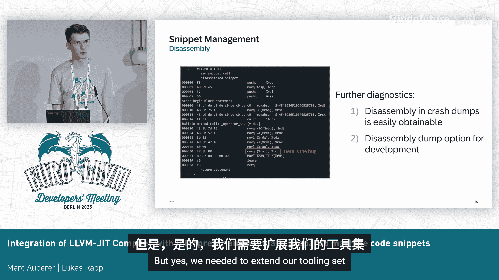

# 049：集成概述


在本节课中，我们将学习SAP HANA数据库如何将其基于LLVM的JIT编译器与自定义解释器以及手动准备的机器码片段进行集成，以在查询执行的编译时间和运行时间之间取得最佳平衡。

## 背景与挑战 🏢

上一节我们介绍了课程背景，本节中我们来看看SAP HANA数据库面临的具体挑战。

SAP HANA是SAP的旗舰内存数据库。它通过一个复杂的多阶段管道处理SQL查询，该管道的最后一步是生成L程序并执行它们。L语言是SAP为HANA数据库专门设计的编程语言，专注于性能并针对数据库用例进行了定制。

为了执行这些SQL查询和程序，我们采用了分层编译解释器的方法。

以下是该方法的核心组成部分：

*   **L编译器**：使用LLVM作为编译器后端。目前使用MCJIT进行机器码的即时编译，但正在讨论转向ORC JIT，因为它是当前维护的版本。
*   **编译管道**：拥有默认的O0管道、用于生产环境的自定义O1管道（禁用了一些在大程序中扩展性不佳的优化，如循环优化），以及默认的O2和O3管道。
*   **编译服务器**：IR在主进程（称为索引服务器）中构建，但在进行中端和后端编译时，会将IR序列化为位码并发送到另一个称为编译服务器的进程。这样做是因为我们无法保证中端和后端编译是内存安全或异常安全的。如果编译器崩溃，只会影响编译服务器，可以快速重启并继续编译，从而避免因索引服务器崩溃而导致数据丢失和长时间的数据重载风险。
*   **L解释器**：这是一个定制的C++实现，专为内存数据库用例设计。它采用顺序的、逐块的执行方式，类似于IR解释。在L编译器不适用时（例如程序非常大超过25万行，或要处理的数据记录非常少时），会使用L解释器作为后备方案。

我们的核心目标是：从端到端（即用户）的角度，尽可能快地执行所有查询。为了实现这一目标，我们希望尽早开始执行以保持编译时间较低，同时也希望快速完成执行以保持运行时间较低。平衡延迟和吞吐量是关键。

另一个绝对重要的前提条件是：在内存数据库的上下文中，我们绝不能在任何情况下崩溃。这不仅适用于编译时（通过编译服务器隔离实现），也适用于运行时，因为代码最终在拥有内存数据记录的索引服务器上执行。

## 初始性能基准 📊

在介绍优化方案之前，我们先了解一下初始的性能状况。

我们在一个128核、256线程的x86_64机器上进行了基准测试，使用了TPC-H查询集（一个知名的数据库分析查询基准）。我们批量运行了全部22个查询，并收集了编译时间和运行时间。

**编译时间对比**：我们测量了四种执行策略的编译时间。
*   **编译（O1）**：完全使用编译器（O1优化级别）。
*   **编译（O0）**：完全使用编译器（O0优化级别）。
*   **仅解释**：完全使用解释器，关闭编译器。
*   **混合执行**：使用解释器开始执行，当编译结果就绪后，切换到编译后的代码。

结果显示，与O0编译相比，仅使用解释器带来了约93%的编译时间改善。但同时，仅解释模式的运行时间比O0编译模式慢了约20倍。

让我们再深入分析一下编译时间的构成。以一个约4.8万行代码的示例程序（包含许多跳转、循环和数学表达式）为例：
*   在**O0编译**中，指令选择、寄存器分配和活跃区间分析占据了编译时间的主导地位。
*   在**O1编译**中，应用一些中端优化可以减少送入后端的IR数量，从而显著降低后端编译时间。
*   **原始解释器**的编译时间极短（在图表中几乎看不见）。

## 解释器的性能瓶颈 🔍

那么，为什么我们的解释器在运行时如此之慢呢？

以下是解释器主循环的简化表示：
```cpp
while (has_next_instruction) {
    Instruction* instr = get_next_instruction();
    instr->execute(); // 虚函数调用
}
```
解释器通过指令指针获取下一条指令，并调用其虚函数`execute`来执行。在我们的案例中，大多数指令（如加法、乘法、成员选择）都非常简单。

我们注意到，**虚函数调用的开销主导了运行时间**，这对性能非常不利。

另一个问题是存在大量的**冗余加载和存储**。解释器使用称为`LValue`的通用容器在内存中存储值。指令之间是隔离的，因此一条指令不知道前一条指令做了什么。例如，一个加法指令后跟一个使用加法结果的乘法指令，会先加载加法的操作数，执行加法，将结果存储到`LValue`，然后乘法指令立即再次加载同一个`LValue`来执行乘法。这显然不是高效的，因为本可以将中间结果保存在寄存器中并直接重用。

因此，我们面临两个核心问题：
1.  如何消除这种执行开销？
2.  能否以增量化的方式实现这一点，还是必须采用“全有或全无”的方法？

## 解决方案：汇编片段（ASM Snippets）💡

我们对这两个问题的答案是：**汇编片段**。

基本思想是：对于那些足够简单的指令，我们可以为其生成简单的机器码，然后将这些机器码集成到现有的解释器执行机制中。这允许增量集成，因为我们可以简单地重新定义什么是“简单指令”以及哪些指令序列是简单的，并可以按节点类型启用或禁用代码生成。我们专注于语言中最基本的方面（历史上是算术表达式和赋值等），这有助于保持低编译时间和低复杂度，从而避免错误。

集成工作原理如下：假设我们有一个包含一系列解释器节点的基本块，这些节点代表一个算术表达式。我们有一个机制来检测这个简单指令序列，并将其转换为一个单独的节点。

这个**ASM片段节点**可以很好地与现有执行机制集成，因为它本身就是一个普通的节点，也实现了虚函数`execute`。当调用这个函数时，它会转而调用我们预先准备好的机器码片段。这个片段实际上是一个可以从C++调用的函数，它封装了被替换节点（左侧）的逻辑。

## 代码生成机制 ⚙️

上一节我们介绍了ASM片段的概念，本节中我们来看看其背后的两种主要代码生成机制。

**1. 编译化**
这包括所有显式的机器码翻译（例如，为加法、减法、成员选择等准备的代码），以及一个**代码生成器状态**，该状态跟踪节点之间的数据依赖关系和寄存器内容，以优化加载和存储操作。

以前面的例子来说，原本需要6次加载和3次存储。通过代码生成器状态的分析，我们可以减少到仅需4次加载和1次存储。因为一旦第一个操作完成，中间值就保存在一个寄存器中，后续操作只需加载额外的操作数即可，直到不再需要该中间值时才将其存储。

**2. 去虚拟化**
假设我们有一个本可以成为一个片段的序列，但中间夹杂着一些不可翻译的节点（我们没有为其准备显式的机器码翻译）。我们如何将它们也纳入片段中呢？如果不处理，我们仍然需要对这五个节点进行虚函数调用，这对性能不利。

解决方案是：我们将这些不可翻译的节点**解析为其`execute`函数的函数地址**，然后获取这个地址并进行普通的函数调用，并将其“烘焙”到片段中。这样我们就消除了碎片化。当然，显式的机器码翻译可能更好，但这是一个后备机制。任何不可翻译的节点仍然可以在这些片段中表示为函数调用，从而避免了虚函数调用。

目前，我们的实现涵盖了大约30条x86和AArch64指令，覆盖了相当广泛的语言特性，包括一元/二元操作、成员选择、赋值、逻辑跳转等。

## 代码生成的具体规则 📝

现在您已经了解了片段的工作原理，我们可以更深入地看看代码生成的具体细节。

代码生成器状态负责跟踪寄存器内容。我们首先需要定义实际使用哪些寄存器。我们决定仅使用两个主寄存器来存放二元操作的操作数（操作数1和操作数2），一个额外的辅助寄存器，以及两个用于函数参数的寄存器。所有这些寄存器都是调用者保存的，这意味着我们不必担心之前的寄存器内容，可以直接使用它们。

这是一组简化代码生成的简单规则中的第一条。其他规则包括：
*   左操作数始终在第一个寄存器（操作数1）中。
*   右操作数始终在第二个寄存器（操作数2）中。
*   如果二元操作产生结果，结果始终放在第一个操作数寄存器中，这样代码生成器就知道值在哪里。
*   如果下一个操作需要该值作为右操作数，我们只需在寄存器之间移动它。
*   我们采用**惰性数据移动**策略，只在绝对必要时才进行加载和存储，这有助于减少加载/存储操作，也是将单个机器码片段串联成连贯的机器码片段背后的驱动机制。

去虚拟化的整个代码生成实现非常简洁，几行代码就能为一次函数调用生成右侧所示的机器码：准备`execute`函数的参数，将其存入寄存器，将节点解析为函数地址并写入寄存器，最后执行调用。

## 片段管理与诊断 🔧

使用动态生成代码的一个问题是，你几乎得不到编译器的帮助，会缺失大量信息。例如，没有用于正确C++异常处理的展开表，也没有像函数名、位置这样的基本元数据。

我们需要发挥创造性。例如，在堆栈跟踪中，动态生成的函数会被标记为“dynamic”，并附加其所在的L函数名，以便于识别。

此外，在开发或崩溃时，我们可以查看生成的机器码的反汇编。我们诊断工具的一个优点是，可以将机器码指令映射回生成它的原始操作，这为调试提供了更好的概览。

## 优化后的性能结果 📈

让我们看看引入汇编片段优化后获得的性能结果。

在我们的两个条形图中，新增了一个柱状条：**“仅解释 + 汇编片段”**（浅绿色）。可以看到：
*   与O0编译相比，我们仍然在编译时间上有非常可观的改进（86%）。
*   同时，我们将运行时间降低了3到4倍。现在，“仅解释 + 汇编片段”模式与O0编译模式之间的运行时间差距只有约6倍（之前是20倍）。这帮助我们能够以解释器快速启动查询执行。

再次查看示例程序的编译时间，“解释器+汇编片段”的编译时间确实比纯解释器要长，但仍然远优于O0的编译时间。

## 结论与对LLVM的启示 🎯

我们开发了一个简单的机制，通过以极小的代价在运行时生成汇编片段，显著改善了查询延迟。这是一个我们自主开发的、稳健且量身定制的解决方案。它略微增加了编译时间，但带来了巨大的性能收益。

虽然我们仍然比完整的编译器慢一个数量级，但对于TPC-H查询，我们看到了大约7倍的性能提升，这绝对是可接受的，足以让我们快速启动查询执行。对我们来说，最重要的是它支持**增量翻译**——我们可以简单地按指令级别启用或禁用AST节点/指令的编译化或去虚拟化。



从LLVM的角度，我们得到以下启示：
*   对于我们的延迟敏感型应用，**LLVM O0的编译时间（至少在LLVM 20时）是不够的**。O0的大部分编译时间花在了寄存器分配、指令选择和活跃区间分析上。
*   我们曾希望LLVM能提供一种**超低延迟的编译模式**，这在当时和现在都不可用。
*   我们本可以想象LLVM后端提供更多的配置选项，例如允许实现自定义的寄存器分配策略（就像我们在解释器中只使用两个寄存器那样），或者限制可使用的指令子集来简化指令选择。我们知道有“fast-isel”，但尝试后发现帮助不大。

我们也对上游定制的O0后端版本充满期待。

## 问答环节 💬

**问：** 采用自定义解决方案会失去围绕LLVM的所有工具支持（如调试信息、性能剖析）。你们是如何应对的？需要替换这些工具吗？
**答：** 我们引入了一些自有工具，例如Lucas展示的、可以将反汇编映射回指令的开发用反汇编转储工具。展开表生成器目前由于其他问题尚未使用。我们目前仅对可能抛出C++异常的指令禁用编译化和去虚拟化。是的，我们需要扩展我们的工具链。

**问：** 你们是否评估过其他代码生成器，比如Rust中常用的Cranelift？
**答：** 是的，我们考虑过，也考虑过AsmJit这样的JIT汇编库。但在SAP这样的大公司，使用无法保证长期维护的依赖项是个问题。我们需要保证内存安全和异常安全。因此我们决定自己实现，因为相对容易。

**问：** 你们提到的O0、O1是指从LLVM IR到机器码的 lowering 吗？是否考虑过使用LLVM的KLEE作为初始解释方案？
**答：** O0/O1指的是后端编译（IR到机器码），前端编译时间未包含在测量中。我们不熟悉KLEE，没有考虑过它。关于ORC JIT，我们正在讨论从MCJIT迁移过去，ORC支持代码模型small/medium，这对我们有益。感谢关于ORC后台编译和热交换的建议。

**问：** 虚函数调用开销是你们自定义解释器的问题。你们有很深的继承链吗？是否尝试过CRTP模式或C++20的新特性来避免虚表？
**答：** 我们没有尝试过，但这可能是我们可以研究的方向。

**问：** 是否探索过在O0和O1之间创建自定义的LLVM Pass管道，例如运行像`mem2reg`这样的廉价Pass来大幅减少IR数量，从而让后端再次变快，而无需在中端花费大量时间？
**答：** 是的，我们尝试过创建类似的自定义中端管道，但这并没有带来显著的性能提升。O0和O1的编译时间仍然不够快。

本节课中，我们一起学习了SAP HANA如何通过集成LLVM JIT编译器、自定义解释器和手动准备的机器码片段，在数据库查询执行的编译延迟和运行性能之间取得了有效平衡。关键点在于增量式的汇编片段生成机制，它显著提升了解释器的执行速度，同时保持了极低的启动开销。