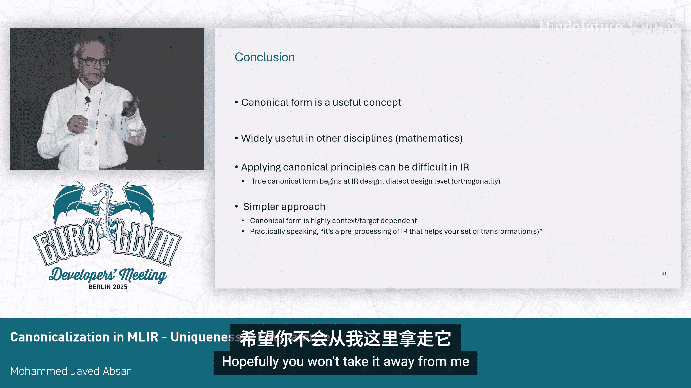

# 050：规范化 (Canonicalization) - 唯一性与等价性

## 概述

在本节课中，我们将学习 MLIR 中的规范化概念。我们将探讨什么是规范化形式，它在 MLIR 中如何实现，以及当前面临的主要问题和挑战。通过理解规范化的核心思想及其在实践中的应用，我们可以更好地利用这一工具来简化和优化中间表示。

## 什么是规范化形式与规范化

规范化形式是在与原始 IR 相同的抽象级别上，将 IR 重写为更简单形式的过程。

例如，你有一个向量广播操作，将一个值从 `1 x f32` 广播到 `8 x 1`。然后，这个值被转置，从 `8 x 1` 变为 `1 x 8`。你可以很快看出，也许更简单的方式是直接将单个值广播到 `1 x 8`。如果你运行规范化器，它就会这样做。

那么，如果你想为你的操作实现类似的功能，你需要做什么呢？

## 如何实现规范化

在你的操作（Op）的 TableGen 描述中，你可以指定它具有规范化器。

例如，在转置操作的定义中，你可以设置 `hasCanonicalizer = 1`。然后，TableGen 后端会生成 C++ 类描述，并填充 `getCanonicalizationPatterns` 方法，该方法接收一个重写模式集作为参数。

在你的实现中，你需要添加这些模式。对于之前的例子，你可以在 `vector.transpose` 操作的 `getCanonicalizationPatterns` 方法中添加一个模式。这个模式会匹配一个转置操作，并检查其输入是否是一个广播操作。如果是，它将用一个新的广播操作替换原来的转置操作，从而得到更简单的代码。

另一种方法是使用声明式模式匹配。

假设你有表达式 `(-x) / (-y)`。根据基本算术，我们知道这等价于 `x / y`。你可以编写一个声明式重写模式，其中灰色的代码是你匹配的模式，蓝色的代码是重写后的结果。这样，你可以用直接的除法操作替换两个操作数的取负操作。

你编写这个声明式模式，TableGen 后端（在这种情况下是 `rewrite_gen` 或 `cpp`）会自动为你生成之前看到的 `matchAndRewrite` 代码。这减少了需要编写的样板代码。

对于许多算术和数学操作，折叠（Folding）是更受青睐的方式。声明式模式匹配不仅仅是关于如何编写规范化模式，还有相关的文档说明。这里只是为了让每个人都理解我们讨论的内容。

你可能在你构建的许多 Pass 中大量使用了它。

例如，有一段代码为了特定目的包含了很多内容，因为我即将展示它如何被清理。在这个例子中，有一个 `linalg.generic` 操作接收一堆输入（这些是动态形状）。它需要创建一个 `tensor.empty`，因此需要知道大小。所以，它探测并获取张量维度等信息。然而，`generic` 内部真正做的是以相反的顺序使用它得到的输入。如果你运行规范化器，你会得到更简洁、更好的代码。

## 规范化的问题

如果你一直在关注 RFC 和讨论，你会发现这是一个非常有争议的话题。

为什么？因为简单的形式很容易达成一致。你重写它，得到更小的代码，大多数人在某些事情上能达成共识。

但是看看左边的例子。你有一个转置操作，将 `1 x 5` 的张量转置为 `5 x 1`。你也可以通过 `tensor.collapse_shape` 操作达到相同的效果。

右边的例子更复杂。你正在执行一个 `insert_slice` 操作，将某些内容插入到目标张量中，这本质上是覆盖了目标张量的一部分，从而得到一个新的张量。但你可以通过扩展原始切片（`expand_shape`）来达到相同的效果。

哪一个才是更规范的（Canonical）形式？关于这一点有很多争论，因为它取决于上下文。假设你正在寻找某种 `extract_slice` 模式，你可能更喜欢第一种形式。如果你从不同的角度看，你可能会说，`expand_shape` 才是你希望的形式。所以这是一个来回争论的问题。

正如底部所示，Matthias 指出，这仅仅是两个例子，实际上还有更多。我们一直在反复争论哪个才是规范形式。

所以，我们打开了一个“蠕虫罐”。我没有打开它，因为我们刚吃完午饭，不想弄得一团糟。

## 定义规范化形式的问题

房间这边的人对特定情况有一种定义，那边的人有另一种定义。什么是简单的规范形式？大多数人会说，哦，根本没有规范形式。

它是规范化还是优化？哪个更好？为什么你的 Pass 要依赖规范化器，而它本不应该这样？它很好，但耗时太长，因为所有东西都被塞进了规范化器。

也许我们可以退一步说，让我们采取一些行动。

消除操作是一个好主意。例如，`x + 0` 就是 `x`。你可以把它看作一个 `linalg.generic` 操作，它只是接收输入并转发到输出，基本上是一个无操作（no-op）。你可以把它们折叠起来。

在不同的实例级别，你可以开始思考，什么是恒等元？什么是逆元？`x` 和 `x` 的逆元可以折叠。或者，排列操作：如果你做了一个转置接着另一个转置，我可以折叠它们。

或者，规范化以减少值的数量。这里变得棘手了，更少的值并不总是意味着更好。但如果你从某个角度想，是的，如果你传递 `x` 和 `x`，只传递 `x` 就行了。

引入新的或不同的操作来减少代码的多样性。是的，你真正希望在规范化器中做的一件事就是减少多样性。因为这样，你编写的 Pass 只需要处理特定风格的代码。

我们是否在快速走向一个方向，即我们希望代码变成非常紧凑的形式？就像压缩图复杂度一样，我们希望一个非常紧凑的形式。

不，因为如果你想想 LLVM，循环的规范形式有前导块和循环退出块，你可能不是在压缩它。实际上，你是在将其重写为一种更适合其他操作（如代码提升）的形式。所以，紧凑不等于简单。

那么它到底是什么呢？

## 重新审视规范化的定义

让我们退一步。什么是规范形式？我们不是发明这个词的人，它来自数学和计算机科学。也许我们只是用词不当，或者用对了词但定义很松散。

规范形式是一个抽象对象的唯一表示。抽象对象可以是一个操作或一个实例等。唯一性很重要，这种唯一性来自某些数学属性。

你有了这个唯一的规范形式，但所有东西都需要能转换到它，否则就没有意义。这是闭合性部分。然后，如果两个东西的规范形式相同，我们必须同意它们是相同的。

所有这些都有助于构建转换、优化和查询。一旦我们同意这是规范形式，我们就可以进行这些操作。

所以，有两个属性。我们甚至从操作或整数等具体事物中抽象出来。

规范化意味着，一旦你得到了规范形式，如果你再次运行规范化器，你不会得到别的东西，这体现了收敛性。另一个属性是等价性：如果两个东西的规范表示相同，那么我们必须同意它们在本质上是相同的。

本质上发生的是，你有一个 IR，你可以用 10 种不同的方式重写它，你试图找到那个唯一的东西，那就是它的规范形式。这取决于上下文，因为表示方式取决于上下文。

举个例子。我们知道，任何大于 1 的整数都可以用一种方式表示为素数的乘积，这是算术基本定理。上下文是你想用乘法来表示它。

同样的数字 10000，你可以表示为 `1 + 1 + 1 + ...`（一万次），这也是唯一的规范形式，但那是不同的上下文。所以，上下文很重要。

实际上，我们在许多不同的学科中都见过规范形式。所以这在 MLIR 中并不新鲜。我认为我们在这方面做得很好。

那么，我们在这里遗漏了什么？为什么当涉及到操作和 IR 时，它似乎对我们没有帮助？

因为如果你仔细想想，我们寻找的是什么？我们寻找的是正交性。意思是，如果你有一个操作做某件事，这个操作不应该能用 10 种不同的方式做同一件事。

对于单个操作来说，这很容易。但当你有一堆操作，一堆 IR 时，如果你能用 10 种不同的方式重写，那么你就没有规范形式。你拥有的是相互竞争的简单 IR 形式。

## 问题的根源

为了更深入地探讨这一点。对于一个操作来说，根据定义很容易。只有一种方式来表示 `add` 操作。它在构造时就是规范的。

如果你有一个 `generic` 操作（或者不是 `generic`），那么它可能有未使用的参数可以丢弃，或者默认的映射实际上是恒等映射，你也可以丢弃。在构造时，你可以创建一些可以称为规范的东西。

但是，当涉及到你的方言中的一堆操作时，如果你有两个操作在本质上做相同的事情，那么你就会遇到这个问题。这就是这个问题的根源。

因此，关于这个问题有很多讨论。我只是想向听众介绍不同的观点。

操作有一个规范形式，要么是通用的（这很难），要么是针对每个 Pass 或每个阶段的。没有上下文时，你制定规范形式，会有更多共识。这是我的规范表示。

在更高的抽象层次上，比如一个 `linalg.generic`，很难就规范形式达成一致。在更低的抽象层次上，因为它只做一件小事，可能更容易。

有些人认为规范化实际上是一种预处理。基本上是你为你的 Pass 或一组 Pass 所做的事情。一个全局的规范化器并不现实。

规范化不应是正确性所必需的，不应改变语义等。

规范化经常运行，因此不应计算量太大。这些是一些共识点。人们同意规范化不应是正确性所必需的（除了某些情况），规范化应该具有高效性（意味着不是任何东西都放进去），并且应避免循环（即，如果我们设计的整个 IR 使得有许多操作在做本质上相同的事情，你就会遇到这些问题）。

## 总结与观点

这是我的观点。追求一个规范形式是不现实的。重叠的操作确实存在，这是现实。

我们可以将规范化器视为一个简化器。它帮助我。我运行它，看到代码变小了。它使用折叠等方式清理代码，或者为不同的上下文重构代码。

我不是在向你强加我的观点。让我们做个投票。

第一个问题：规范化器应该被移除吗？（请举手）应该保持现状吗？（请举手）应该改进吗？（当然，我们都喜欢改进）

现在我们有了一些论点。应该如何改进？它应该有像优化那样的级别吗？或者为了更符合上下文而重构？这是一个想法。实际上，是我的同事给我的建议：为了更符合上下文而重构它。我们需要弄清楚具体如何实施。但我认为大多数人会喜欢这个想法。在问答环节，我们可以更多地讨论它。

本次演讲的目的并不是真正呈现一个关于规范化器的教程。我们想要的是改进，就像 Alex 今天早上说的那样。不要只是接受一切现状。

这是一件好事。我们希望规范化器做得更好。我们发现它很有用，但有时我们发现它非常烦人，因为它会破坏东西。那么我们如何改进 MLIR 呢？这就是本次演讲的重点。

## 问答环节总结

在问答环节中，讨论进一步深入。主要观点包括：

*   **合流性**：在重写系统中，一个理想的属性是合流性，即无论以何种顺序应用规范化模式，最终都应到达相同的规范形式。目前 MLIR 的规范化模式没有这个要求，实现和测试它都很困难，但这被认为是一个有用的属性。
*   **定制化需求**：普遍认为当前的规范化器需要改进而非移除。一个强烈的共识是，MLIR 是“混沌”的，单一的规范化器无法满足所有需求。规范化器需要是可定制、可扩展的，允许下游用户或特定 Pass 选择或添加不同的“风味”的模式，而不是全有或全无。
*   **当前实现的问题**：
    1.  **非确定性停止**：当前的规范化器基于贪婪重写，如果迭代次数太多，它会突然停止，并且 Pass 报告成功，但 IR 可能并未达到真正的规范形式，用户无法知晓。
    2.  **隐式依赖**：当其他方言添加了新的规范化模式时，你的编译器行为可能会意外改变，即使你没有使用那些方言。这使得编译行为非确定且不可控。
*   **改进方向**：需要使规范化器更加灵活和明确。例如，Pass 可以声明其需要的特定规范化前提条件。同时，需要解决非确定性停止和隐式依赖的问题，使规范化过程更加可控和可预测。

## 本节课总结

在本节课中，我们一起学习了 MLIR 中规范化的基本概念、实现方式以及当前面临的核心挑战。我们了解到规范化旨在为 IR 提供一种更简单或更唯一的表示形式，但在实践中，由于操作语义的重叠和上下文的多样性，定义一个全局的“规范形式”非常困难。

当前的规范化器作为一个实用的简化工具被广泛使用，但它存在合流性难以保证、行为不可预测、缺乏定制性等问题。社区共识是保留并改进它，改进方向集中在提高其可定制性、可扩展性和可控性上，例如允许分层的、上下文相关的规范化，以及解决其非确定性行为。

通过理解这些讨论和挑战，我们可以更明智地使用规范化器，并参与到使其变得更强大、更灵活的工作中。