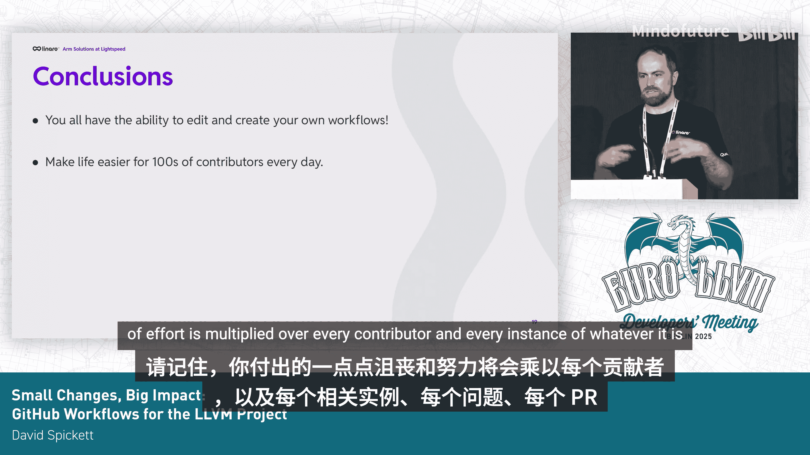

# 051：小改动，大影响 - 为 LLVM 项目编写 GitHub 工作流 🚀


在本教程中，我们将学习如何为 LLVM 项目编写和贡献 GitHub Actions 工作流。我们将从基本概念入手，逐步介绍工作流的构成、编写方法、测试策略以及实际应用场景。即使你是初学者，也能通过本教程理解如何利用自动化工具提升项目协作效率。

## 什么是 GitHub Actions 与工作流？🤔

GitHub Actions 是一项高层次功能，它在你的 GitHub 仓库后台添加了一个自动化服务器。工作流则是你定义在这些自动化任务中执行哪些操作的方式。

工作流运行在 GitHub 提供的远程云机器上，这些机器被称为 `runner`。工作流使用 `YAML` 格式定义，并存储在仓库根目录下一个名为 `.github/workflows` 的特殊文件夹中。

即使你从未查看过工作流内部，你也可能已经见过它的运行效果。例如，当你创建 Issue 或 Pull Request 时，通常就会有工作流与之交互。

## 工作流的结构 📝

工作流采用声明式语法，你需要回答一系列问题来定义它：
*   在什么事件触发时运行？
*   它需要访问什么资源？
*   它应该做什么？
*   在哪里运行（使用哪个操作系统）？
*   如何通过一系列步骤完成工作？

一个基本的工作流结构如下所示：

```yaml
name: Example Workflow
on: [push] # 触发事件
jobs:
  build:
    runs-on: ubuntu-latest # 运行环境
    steps:
      - uses: actions/checkout@v2 # 步骤1：检出代码
      - name: Run a script
        run: echo "Hello, World!" # 步骤2：运行命令
```

本教程的核心信息是：**每个人都可以编写工作流**。这虽然是 CI/CD 的一部分，但你不需要特殊账户、管理员权限，也无需向 GitHub 支付额外费用或拥有专业版账户。你只需要一些耐心，以及我们将要介绍的一些技巧。

## 如何开始编写工作流 🛠️

大多数开发者可能已经 Fork 了 LLVM 仓库。如果你还没有，请先完成这一步。

通常，你不需要手动启用 Actions。在 LLVM 项目中，大多数工作流默认不会运行，因为它们受特定条件触发。少数会运行的工作流也有额外检查，导致它们在 Fork 的仓库中默认跳过。我们稍后会介绍如何让它们运行。

YAML 语法以敏感著称，加上 GitHub 自定义的 YAML 架构，情况可能更复杂，并且缺乏良好的验证。因此，即使你要编写全新的工作流，也建议从复制一个现有的工作流开始修改。

在分析现有工作流时，重点关注三个方面：
1.  **触发条件**：什么事件启动了工作流？
2.  **操作对象**：工作流查看什么内容？例如，是迭代评论、Issue 还是 PR？
3.  **运行结果**：根据在评论或 PR 中发现的内容，仓库将如何被改变？

## 实战案例：新建 PR 工作流 📬

我们将以每个贡献者都见过的“新建 PR 工作流”为例。每当一个 PR 被创建或从草稿状态转为评审状态时，这个工作流就会启动。它最显著的功能是为每个 PR 添加标签。

例如，一个 PR 修改了某些特定文件夹，工作流会将这些修改路径翻译成对应的标签。这些标签随后用于通知相关团队，从而为你找到合适的代码评审者。

另一个不那么常见但部分贡献者会遇到的功能是：如果你是 LLVM 的新贡献者，你会收到一条评论，内容包含“感谢提交 PR”，并说明后续流程以及如何获取帮助。

需要指出的是，用于此功能的脚本是 LLVM 项目特有的，位于 monorepo 中。但它本质上只是 GitHub API 的一个封装。你并不一定要使用特殊脚本才能实现类似功能。

## 启用与测试工作流 ✅

之前提到，在 Fork 的仓库中，工作流可能被跳过。你需要在仓库的 `Actions` 标签页中启用它们。启用后，你可能会看到一些任务显示“此任务被跳过”。用户界面通常不会显示跳过原因，但这通常是由于一些指向上游 LLVM 仓库的检查条件导致的。

为了让工作流在你的 Fork 中运行，你可以将这些检查条件中的仓库引用改为你的用户名。修改后，工作流就会开始执行。

在工作流中，你能做的事情几乎是无限的。但由于时间有限，这里提供一些顶层建议：
*   如果能找到理解 YAML 的编辑器，请使用它。
*   进行小幅度编辑并频繁提交。这样，如果出现问题，你或许不知道原因，但能知道是哪个改动导致了问题。
*   如果需要实现复杂逻辑（多个“与”/“或”条件、大量括号），建议将这些逻辑写在脚本步骤或单独的脚本文件中，而不是直接写在 YAML 里。
*   GitHub 官方文档非常有用。尽管存在一些重叠（因为访问 API 有不同方式），但文档通常能提供帮助。
*   由于所有这些都是 GitHub 特定的代码，如果你在使用一个非常小众的 API，可以直接使用 GitHub 的代码搜索功能。从数十亿行代码中，你很可能会找到一些好的示例。

## 工作流的测试策略与挑战 🧪

接下来，你需要确保工作流的行为符合预期。这时我们会遇到一个主要障碍：我们不控制远程的 `runner`，也不控制 GitHub 的基础设施。目前，你无法在本地运行工作流，甚至没有一个合适的集成测试框架来描述你的测试。

另一个问题是，虽然工作流查看的某些内容（如打开一个模拟 PR、添加模拟标签）很容易设置，但创建模拟用户账户会涉及灰色地带（需要购买新账户或违反服务条款）。因此，我们需要折中方案。

目前的折中方案（虽然希望有更好的方法）是**手动测试**，并意识到：虽然无法模拟所有输入，但可以通过临时微调代码来模拟输入变化，并以此进行测试。

理论上，测试流程如下：
1.  制定一个手动测试计划，列出工作流可能经过的所有路径。
2.  思考能否通过一组更改来模拟每条路径。
3.  不断分解，直到得到可以通过一组更改进行测试的代码段。
4.  测试该代码段，使其正常工作，然后重置仅为测试所做的更改。
5.  重复此过程。

## 测试案例：新建 PR 欢迎语 🔄

以“新建 PR 欢迎语”功能为例，有两条基本路径：收到欢迎评论，或收不到。

在测试时，我的用户账户对我的 LLVM Fork 来说并非“新账户”。在不创建新账户的前提下，我无法模拟新用户。因此，我直接删除了检查用户是否为新账户的代码，运行工作流，确保收到了评论且格式正确。然后，我恢复检查代码，确保它不会尝试发布评论。

这样，我们测试的并非最终上线的版本，但在许多场景下，这已经是能做到的最好测试了。

## 贡献工作流 📤

完成所有测试并认为覆盖充分后，保存你进行测试的那个分支副本。这个分支可能会很混乱，但在这类开发中是正常现象。

然后，移除你的测试性修改，将仓库检查指回上游 LLVM，压缩提交历史。最后，贡献一个工作流就像贡献任何其他 LLVM 更改一样：提交 PR。事实上，你提交的 PR 也会触发“新建 PR 工作流”，并为你添加标签以找到评审者。

## 工作流的应用与展望 💡

以下是一些现有或潜在的工作流应用场景：

**已在运行的功能：**
*   **PR 自动标签**：如前所述。
*   **自动化反向移植**：使用工作流处理。
*   **代码格式化检查**：如 `clang-format` 和 Python 代码风格检查。
*   **提交权限管理**：通过工作流自动化请求和释放提交权限。

**正在开发的功能：**
*   **预合并测试**：目前 Buildkite 上的预合并测试正在迁移到 GitHub Actions。
*   **清理上游仓库的用户分支**：相关工具正在开发中。
*   **协助无提交权限者合并 PR**：作者正在开发一些工具来帮助这类贡献者。

**尚未构建的想法：**
*   **维护者备注**：当 PR 修改特定文件时，自动显示维护者留下的注意事项。
*   **按需特殊构建**：许多贡献者希望在提交前，能为可能破坏特殊配置的更改请求一次特殊构建。
*   **推荐测试**：评审者可以请求作者运行某些特定的测试配置。
*   **领域特定检查清单**：目前有一个针对 `libc++` 的清单，但其他领域也有扩展空间。

## 总结 🎯

编写 GitHub 工作流可能会有些许挫折感，但本质上，你不需要任何额外的特殊权限。请记住，你所付出的小小挫折感和努力，会乘以每位贡献者、每个 Issue、每个 PR 实例。因此，自动化带来的效率提升回报巨大。



教程到此结束，感谢阅读。


