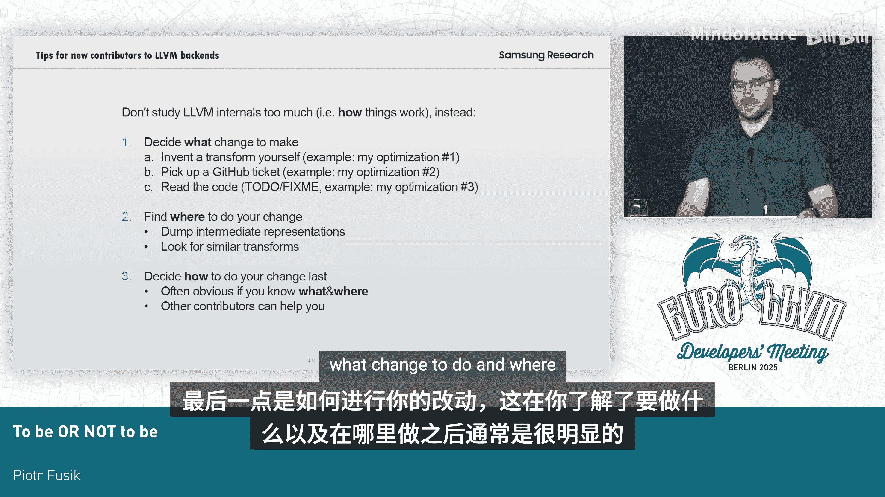

# 052：RISC-V位运算取反指令优化


## 概述

在本节课中，我们将学习针对RISC-V架构中五种位运算取反指令的优化方法。这些指令包括 `orn`（或非）、`andn`（与非）等，它们不包含异或非指令，也不处理向量与向量、或向量与标量的操作。我们将通过三个具体的优化案例，了解如何在LLVM编译器中实现这些优化，以生成更高效的机器码。

## 核心概念与初始模式

首先，我们介绍这五种位运算取反指令。对于位宽为 `W` 的位运算，当其操作数之一是取反的，编译器会直接生成对应的取反指令。例如，对于 `A & (~B)` 这样的操作，会直接生成 `andn` 指令。

**代码示例：**
```cpp
// 原始操作
result = A & (~B);
// 优化后生成的RISC-V指令
andn rd, rs1, rs2
```

当然，实际指令选择决策比这个简单的映射表要复杂得多。

## 优化一：针对常量的优化 🎯

上一节我们介绍了基本的指令生成模式，本节中我们来看看第一个优化点：针对与常量进行位运算的场景。

RISC-V指令的立即数字段是12位，这不足以加载任意32位常量。因此，根据常量的具体值，编译器可能需要使用 `lui`（加载高位立即数）指令，或 `lui` 后接 `addi` 指令的组合来加载常量。

如果取反后的常量需要更少的指令来加载，那么生成取反指令并使用取反后的常量就是更优的选择。

一个典型的32位常量例子是 `0xFFFFFF00`。我们避免将低8位设置为1。优化后，我们不再需要三条指令来加载原始常量 `0x000000FF` 再取反，而是直接用更少的指令加载取反后的常量 `0xFFFFFF00` 并执行 `and` 操作。

**公式示例：**
```
优化前：A & (~0x000000FF) -> 需加载 0x000000FF 再取反
优化后：A & 0xFFFFFF00 -> 直接加载 0xFFFFFF00
```

对于64位常量，情况更为复杂。LLVM中有一个专门的代价模型，包含超过500行代码，用于评估加载一个常量到寄存器所需的一系列不同指令的代价。

为了实现这个优化，我让编译器分别评估加载原始常量和加载取反后常量的代价。只有当加载取反后常量的指令数更少时，才应用这个转换。

## 优化二：循环内的优化 🔄

接下来，我们探讨第二个优化，它针对循环结构。

如果在循环之前有一个取反操作，而循环内部有一个位运算，我们可以将取反操作“沉入”循环内部，从而在循环内直接生成取反指令，避免在每次迭代前重复计算取反值。

我目前仅为RISC-V架构实现了这个优化。如果你在X86或ARM等其他平台上工作，这个优化思路同样值得考虑。

## 优化三：启用现有转换 ⚙️

我的最后一个改动是启用一些现有的、但未完全支持的转换。

我在代码中发现了一条 `FIXME` 注释，指出因为没有测试用例，所以某个转换未被实现。我为此添加了测试，并为向量类型实现了相应的处理函数。

## 给LLVM新开发者的建议 💡

如果你刚接触LLVM开发，不要花太多时间进行前期理论学习。相反，应该从一个具体的修改点开始实践。

以下是几种可行的入门方式：

*   **分析汇编输出**：查看编译器生成的汇编代码，寻找可以改进的低效模式。
*   **处理Github工单**：在LLVM的issue列表中挑选一个感兴趣的任务。
*   **解决`TODO`或`FIXME`注释**：就像我做的第三个优化一样，修复代码中标注的问题。

决定修改方向后，中间表示（IR）的知识会对你很有帮助。你可以寻找相关的通用转换（`DAG combines` 或 `IR transforms`）作为参考。

最后一步是如何实现你的修改。一旦明确了要改什么以及在哪里改，实现方法通常就显而易见了。在这个过程中，你可以随时向其他贡献者寻求帮助。



## 总结


本节课中我们一起学习了针对RISC-V位运算取反指令的三项优化：1）通过评估加载代价，智能选择是否对常量取反以生成更优代码；2）将循环外的取反操作移至循环内，减少重复计算；3）通过补全测试和实现，启用编译器中已有的潜在优化转换。这些优化共同提升了RISC-V目标代码的生成效率。


