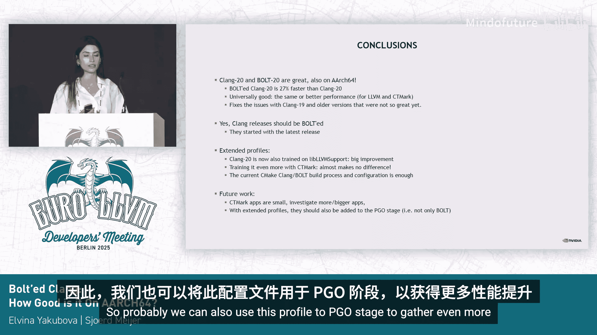

# 053：使用BOLT优化AArch64平台的Clang/LLD工具链性能

## 概述

在本节课中，我们将学习如何通过BOLT（Binary Optimization and Layout Tool）工具来优化AArch64（ARM64）平台上的Clang/LLD编译器工具链。我们将探讨BOLT带来的性能提升，分析不同代码库（C++与C）对优化效果的影响，并研究通过扩展性能分析数据（Profiles）来进一步提升性能的可能性。

---

## 性能提升的初步探索

上一节我们介绍了课程目标，本节中我们来看看最初的性能测试结果。我们的目标是构建一个更快的编译器，使其在更短的时间内完成相同的工作量。

我们首先对Clang 18和19进行了实验，当Clang 20发布后，我们也将其纳入了测量范围。

下图展示了性能对比结果：
*   蓝线代表原始的Stage 1 Clang构建。
*   橙线代表经过LTO（链接时优化）、PGO（基于性能分析的优化）和BOLT流水线优化后的Clang构建。

从图表中可以看出，对于Clang 18和19，性能提升大约在12-15%之间。而对于最新发布的Clang 20版本，速度提升达到了27%。

这些结果令人印象深刻，但问题是：这种优化对所有工作负载都有效吗？

事实证明，并非如此。在实践中，我们发现经过BOLT优化的Clang在编译SQLite（一个C语言代码库）时，出现了4%的编译时间倒退。

我们推测出现倒退的原因可能有几个，我们的假设是：经过BOLT优化的Clang主要使用C++代码库进行分析训练，这对于SQLite这样的C代码库可能不够充分。

---

## 深入调查：C代码库的回归现象

我们想知道这仅是个例，还是能发现更多类似情况。为了验证这一点，我们决定运行C-Ray基准测试。

C-Ray是一个用于测量编译时性能的应用程序集合，其中超过一半的基准测试基于C代码。

从这张图表（基于Clang 19）可以看到，所有基于C代码的基准测试实际上都出现了性能倒退，最高可达6%。

然而，当我们将实验扩展到Clang 20时，我们得到了一个惊喜。性能倒退消失了，取而代之的是高达20%的性能提升。C-Ray基准测试也显示了相同趋势，基于C代码的基准测试不再出现倒退，反而有高达20%的改进。

这并非我们开始工作时所预期的结果，但问题依然存在：我们能否做得更好？

---

## 提出新假设：扩展性能分析数据

我们在最新Clang版本上看到的显著改进可能来自不同源头：可能有人更改了CMake配置、传递了不同的选项、BOLT学习了新的优化方式，或者添加了更多更好的性能分析数据。

考虑到所有这些因素，我们的新假设是：通过扩展性能分析阶段，我们可以进一步提高性能。

当前BOLT优化构建仅使用C++代码库的性能分析数据。也许我们可以通过加入C代码库来扩展分析阶段，收集不同的性能分析数据，将它们全部合并，并与已有的原始分析数据融合，然后输入给BOLT，从而进一步改进Clang。

---

## 实验验证：扩展性能分析数据的效果

我使用BOLT插桩来为C-Ray基准测试收集性能分析数据。

从图表中可以看出，这对于Clang 19版本确实有帮助。
*   绿色柱状图代表原始Stage 1构建的Clang 19与经过BOLT优化的Clang 19的对比。
*   灰色柱状图代表经过BOLT优化的Clang 19与使用了**扩展性能分析数据**的BOLT优化Clang 19的对比。

结果显示，性能倒退被修复了，并且我们能看到高达6%的额外提升。

但是，当我们查看Clang 20时，结果并不那么令人印象深刻。平均而言，我们只有1%的改进。同样，灰色柱状图代表使用了扩展性能分析数据的Clang 20。

让我们再看看Clang构建自身的编译时间变化。下图展示了在AArch64 Graviton CPU上编译LLVM所需的时间（秒）。
*   蓝线代表标准构建。
*   橙线代表BOLT优化构建。
*   绿线代表使用了**扩展性能分析数据**的BOLT优化Clang构建。

对于Clang 19版本，我们获得了额外的6%提升。但不幸的是，对于Clang 20，我们没有看到差异。

---

## 结论与总结

基于所有这些数据，我们可以得出以下结论：

1.  **Clang 20和BOLT 20表现卓越**：在AArch64平台上，经过BOLT优化的Clang 20比原始的Clang 20 Stage 1构建快了近30%。它在Clang自身构建和C-Ray构建上都提供了相同水平的性能提升，并修复了我们在Clang 19及更早版本中遇到的问题。

2.  **是否应该对Clang发布版本使用BOLT？** 答案是肯定的。据我所知，目前上游社区已经开始在最新的提交中这么做了。

3.  **扩展性能分析数据的实验**也证明了其有效性。Clang 20经过BOLT优化后性能显著提升的主要原因是，它当前使用了**LLVM测试套件**的性能分析数据进行分析训练，这带来了巨大改进。当前被性能分析数据覆盖的函数百分比从6%增加到了15%。不幸的是，用更多数据（如C-Ray基准测试）进行训练几乎没有什么区别，这使我们得出结论：当前的Clang BOLT构建流程和配置已经足够。

---

## 未来工作方向

关于未来还能做些什么：
1.  C-Ray基准测试规模相对较小，因此可能值得研究更多、更大的应用程序，以覆盖更多函数。
2.  另一个方向是，当前我们仅在BOLT阶段使用性能分析数据。也许我们也可以将这些数据用于PGO阶段，以获取更大的性能提升。

本节课中，我们一起学习了BOLT在优化AArch64平台Clang/LLD工具链中的应用、其带来的性能收益、不同代码库的影响，以及通过扩展性能分析数据进一步优化的尝试和结论。