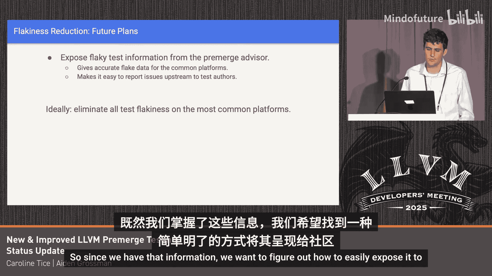

# 001：LLVM 预合并测试新系统 🚀

在本节课中，我们将学习 LLVM 项目全新的预合并测试系统。这个系统旨在提升代码提交前的测试速度、可靠性和易用性，帮助开发者更高效地发现和修复问题。

## 系统概述与背景

上一节我们介绍了课程主题，本节中我们来看看新系统的背景和目标。

预合并测试在开发者创建或更新拉取请求时，会自动触发一系列检查和测试。这些测试包括在不同平台上运行 Ninja 检查测试。Linux 和 Windows 测试由 Google 在 Google Cloud Platform 上运行和支持。最近，亚马逊 AWS 上也启动了针对 AArch64 架构的测试，这些测试也能从我们的工作中受益。

预合并测试对开发者非常有用，因为它帮助你在代码实际提交到上游之前发现和识别错误。特别有用的是，它在一系列平台上运行测试，而你个人可能无法访问所有这些平台。当预合并测试通过时，你对你的更改不会意外破坏上游内容更有信心。

LLVM 的预合并测试自 2019 年就已存在。旧系统运行在 Buildkite 上，速度慢、不稳定、不可靠，结果不一定正确，并且维护不佳。我们认为这不是一个理想的状态，因此我们一直在开发一个新系统。今年五月，我们正式推出了新系统。它运行在更快、更专用的机器上，并且由于具备自动扩缩容功能，效率更高。我们使用的机器数量会根据实际运行的测试数量动态增减。

我们还在工作时间设有专门的待命支持轮换，因此有人实际监控预合并测试系统。如果出现问题，我们会立即识别并处理，确保系统得到良好支持和修复。

我们还为系统添加了指标和性能跟踪功能，并在仪表板上展示。现在我们可以看到使用了多少台机器、运行了多少作业、作业耗时、任务在真正启动前排队了多久等信息。当然，我们也将这些信息用于待命轮换的跟踪。

我们于七月初将 libc++ 的预合并测试迁移到了新系统，这解决了 libc++ 社区在测试中遇到的许多问题，libc++ 的维护者对我们的系统特别满意。

这个新预合并测试基础设施的总体目标是：**速度**、**可靠性**和**易用性**。

我们理想的目标是让 80% 到 90% 的测试在 30 分钟或更短时间内完成。我们希望确保没有误报的错误报告，即如果测试系统告诉你你的拉取请求破坏了某个特定测试，那么你的拉取请求确实破坏了该测试，而不是因为测试不稳定或主线上的其他故障。此外，我们还希望让你能非常容易地找到失败原因并理解其根源，以便更快地调试和修复。

## 新功能：失败摘要与自动合并

上一节我们了解了系统的目标，本节中我们来看看两个提升体验的新功能。

以下是两个我们添加的、我们认为有助于实现上述目标的新功能。

第一个是**失败摘要**。这里有一个显示某些测试失败的拉取请求的屏幕截图。你可以点击三个点，这会弹出“查看详情”选项。点击“查看详情”后，会跳转到失败详情页面。在“构建和测试”部分，你可以看到所有来自脚本日志和 Ninja 日志的日志行，你可以滚动浏览这些内容来查找所有构建失败。但这些日志可能长达数千行，滚动浏览非常耗时，并且很难找到你真正需要的信息。

因此，我们添加了“摘要”按钮。点击“摘要”后，会跳转到针对不同架构的测试摘要页面。向下滚动到你感兴趣的架构，例如 Linux，我可以立即看到哪些测试在 Linux 上失败了。我甚至可以点击其中一个测试来获取实际的测试错误信息。这比试图滚动浏览数千行 Ninja 构建日志要快得多，也容易得多。

我想指出的另一个功能是，我们增加了**无需等待和监控测试**的能力。我们提供了两种方式，让你不必坐着等待测试完成。如果你确信想要合并你的更改，并且不需要等待测试结果（例如你正在进行一个非常快速和简单的还原操作），你可以点击“无需等待要求即可合并”，然后立即合并你的更改。

另一方面，如果你确实关心测试结果，但仍然不想坐着等待拉取请求的测试完成，你可以点击“启用自动合并”。这将允许测试运行完成，如果测试通过，它会自动将你的更改推送到代码库，你无需自己操作。但如果测试失败，则不会进行合并。这些是我们添加的一些功能。

## 性能优化与改进

上一节我们介绍了提升用户体验的功能，本节中我们来看看系统在性能方面的具体改进。

现在我们在性能方面的一大改进是，我们建立了一个 **Grafana 仪表板**来跟踪所有这些指标，这样我们就能立即看到是否有性能回退。待命轮换的人员可以查看仪表板，了解发生了什么，例如是否有任务长时间排队。我们为 libc++ 仪表板也设置了同样的支持。此外，我们还支持查看随时间变化的趋势，以判断我们是否做出了真正有意义的改进。这些图表中有很多噪音，因为如果有人修改了一个 ADT 头文件，缓存命中率就会突然变化，或者当天人们提交的代码内容也会带来很多噪音。

尽管如此，我们仍然可以看到一些显著的性能改进。例如，在七月中下旬，我们显著改进了编译缓存的架构，这是一个相当大的改进。当我们迁移时，Buildkite 系统会在本地缓存所有内容，因为它会在多次运行之间保留一些状态，但这并不是最佳方式。根据 GitHub 的工作方式，我们必须使用一个干净的环境。我们曾使用 GitHub 缓存，但效果不佳，因为它无法在拉取请求之间有效地共享编译缓存。因此，我们将其设置为使用 **Google Cloud Storage**，将所有内容存储在一个云存储桶中。这最终显著提高了缓存命中率。

现在，大多数拉取请求（假设你没有修改某些公共头文件）的缓存命中率约为 **99% 以上**，这导致整体测试时间减少了 **30% 到 35%**。现在编译时间通常只占很小一部分。因此，测试时间现在在预合并测试的实际运行时间中占主导地位。我们一直在努力将测试迁移到 LLVM 的内部 shell，这减少了一些进程启动开销。这在 Linux 端带来了 **10% 到 15%** 的性能提升。Windows 默认已经在使用它，因为那里的进程启动开销更为显著。所有使用它的主要测试套件（除了 compiler-rt 之外的所有测试）目前都默认使用它。我有一个补丁堆栈需要提交以使 compiler-rt 正常工作，clang 方面还有一些问题我们正在解决。这样，你在预合并测试中就能获得性能提升，在本地运行 `check-llvm` 时也能获得，这对本地开发周期甚至更有益。

我们还致力于在 Windows 上改用 **clang**。如果你获得了高缓存命中率，那么具体使用的编译器速度并不太重要。但当你需要重新构建大量内容时，编译时间就很重要了，这里的“长尾”效应可能相当显著。在 Windows 上使用 clang 而不是 MSVC 导致编译时间减少了 **40% 到 50%**。我认为这主要是因为工具链的构建方式，实际上 Windows 上的发布版工具链是专门为构建 LLVM 进行了 PGO 优化的，这肯定有帮助。

## 减少测试不稳定性与未来展望

上一节我们讨论了性能提升，本节中我们来看看如何减少测试的不稳定性。

正如之前提到的，我们的目标是确保在你的拉取请求上报告的失败确实是由你的拉取请求引起的。因为 LLVM 是一个大项目，存在不稳定的测试和由于“空中碰撞”导致的失败（即使预合并测试通过，但当你提交时，它与之前提交的更改发生冲突）。

我们设置了 **Buildbot**，目前它只连接到暂存的构建主服务器，这使我们能够轻松查看主线代码的当前状态。然后，我们将这些数据以及来自拉取请求的失败信息输入到我们称为 **“预合并顾问”** 的系统中。这个系统目前大部分已实现，我们只需要做一些收尾工作，然后实际在摘要视图中（可能也在拉取请求的评论中）展示这些信息。

如果你的拉取请求遇到了已知的不稳定测试或主线已经失败的测试，系统会将其标记为“主线失败”，而不是“你的拉取请求内失败”。这样，预合并测试就会通过，并且我们消除了所有误报的测试报告。同时，它可能会给你一些链接，指向实际失败的后置提交运行，如果你有兴趣，可以确认这确实是一个不稳定的测试。

不稳定的测试通常很难发现，除非你从整体上查看所有基础设施。既然我们拥有这些信息，我们希望找出如何轻松地向社区公开这些信息的方法。以前我遇到过不稳定的测试，通常是有人在 Discord 上私信告诉我。拥有一个更好的方式来处理这个问题会很有帮助。最终，理想情况下是消除所有测试的不稳定性。

本节课中我们一起学习了 LLVM 全新的预合并测试系统。我们了解了其背景、目标、提升用户体验的新功能（如失败摘要和自动合并），以及通过改进缓存架构、迁移到内部 shell、使用 clang 等带来的显著性能提升。最后，我们还探讨了旨在减少误报和测试不稳定性的“预合并顾问”系统。这些改进共同为 LLVM 开发者提供了更快、更可靠、更易用的代码提交前测试体验。