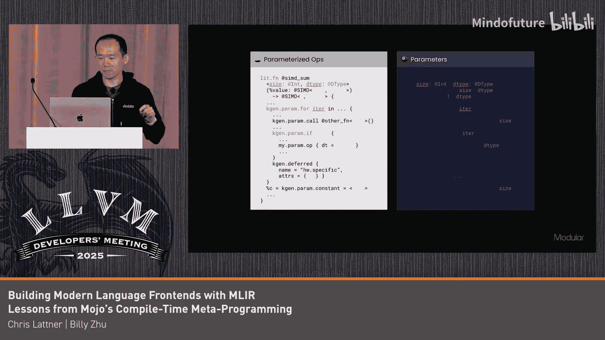

# 003：Mojo的经验教训


在本教程中，我们将学习如何使用MLIR构建现代编程语言的前端，并以Mojo语言作为案例。我们将重点探讨Mojo中元编程的实现方式，以及如何利用MLIR的独特能力来支持复杂的参数化类型系统和编译时计算。

## 😊 概述：Mojo与元编程

Mojo是一种为异构、分布式和加速计算设计的通用编程语言。它建立在MLIR之上，旨在提供零成本抽象和安全性。Mojo的一个核心特性是其强大的元编程能力，这允许开发者将许多传统上由编译器处理的逻辑（如针对特定形状的代码特化、自动调优等）转移到库中实现。

上一节我们介绍了Mojo的基本目标和背景，本节中我们将深入了解其元编程的工作原理。

## 😊 Mojo元编程基础

Mojo的函数风格与Python类似，接受运行时参数。但Mojo还引入了**编译时参数**，我们称之为“参数”，它们用于参数化代码。

**核心概念**：
*   **运行时参数**：在函数调用时确定值的普通参数。
*   **编译时参数**：在编译时已知的参数，用 `参数` 关键字声明，为代码提供了“超能力”，例如保证完全展开的循环。

以下是一个简单的幂函数示例，展示了参数的使用：

```mojo
fn power[base: Int, exp: Int]() -> Int:
    var result = 1
    for i in range(exp):
        result *= base
    return result
```

在Mojo中，不仅函数可以被参数化，任何结构体都可以。参数可以是类型、函数闭包甚至任意表达式。

## 😊 在MLIR中实现参数化IR

Mojo利用MLIR的属性系统来构建其参数化中间表示。理解这一点需要区分两个概念：
1.  **基础IR**：承载运行时应用逻辑的基本IR构建块。
2.  **元IR**：操作嵌套在其中的任何基础IR。

我们可以将**定义参数**视为在结构中“挖洞”，而**实例化**则是用正确类型的值“填充这些洞”。

### 定义参数化类型与操作

在传统方言中，定义类型（如静态大小的张量）可能会直接指定具体属性。而在参数化方言中，我们希望抽象掉具体细节，只约束其类型。

例如，一个参数化的张量类型可能将其大小定义为一个类型化的“洞”，仅在C++验证中确保其类型为索引类型，而不限制具体值。

操作也是如此，任何希望被参数化的操作属性或性质都可以进行相同处理。这是实现程序化代码生成的关键部分。



### 参数化函数与内联实例化

有了基础的IR构建块后，我们可以将它们封装到函数中。参数化声明（如参数化函数）将一段参数化IR封装在一组输入参数之上。

在函数体内，可以引用这些输入参数，并保证它们具有声明的类型。这允许我们使用不同的具体输入参数来复用该函数体。

此外，Mojo提供了典型的元编程指令，如 `参数 if` 和 `参数 for`，用于指定何时以及多少次内联实例化嵌套的参数化IR。

综合来看，参数化IR由两层组成：底层是带有许多“洞”的参数化操作，上层是参数层。这些参数被填入底层的洞中。MLIR的伟大之处在于，它允许元IR操作和基础IR操作自然地交织在一起，从而保持了方言的可组合性。

## 😊 参数计算与规范化

仅仅拥有参数引用还不够，我们还需要能够对这些属性进行计算。这带来了类型相等性判断的挑战。

在Mojo中，类型本身也是编译时值，因此存在依赖类型。判断两个依赖类型是否相等，实际上需要判断它们的参数表达式是否相等。

我们通过**规范化**来解决这个问题。将参数表达式规范化为一种标准形式，使得本应相等的表达式最终具有相同的标准形式。这意味着我们需要一个非常强大的表达式规范化器。

在实践中，我们将参数表示为**类型化属性**。属性在MLIR上下文中是唯一的，这使得参数相等性检查简化为指针相等性检查，无论表达式多复杂，都是常数时间。同时，它还减少了内存占用，并提供了清晰的打印表示。

即使参数表达式存在于上层的参数域中，它仍然可以引用底层用户声明的函数。这形成了一个完整的循环：不仅是元代码，代码也可以是元代码。用户可以在参数表达式中调用函数。

## 😊 实践优势与总结

我们进行所有这些工作的主要目的是实现真正强大的库。开发者可以构建高级抽象（如基于瓦片的编程模型）作为库，这大大简化了编程模型。

此外，调试器可以正常工作。如果你想调试元程序，只需在运行时调用它并单步执行。这与C++模板等机制有巨大区别。

参数化IR的另一个关键优势是，基于图的编译器和其他上层工具可以处理这种参数化的、可移植的表示形式，使得整个系统能够很好地组合在一起。

**本节课总结**：
我们一起学习了Mojo如何利用MLIR构建其现代语言前端，特别是其元编程系统。关键点包括：区分编译时参数与运行时参数；在MLIR中使用属性系统表示参数化IR，形成基础IR与元IR的双层结构；通过表达式规范化解决依赖类型的相等性判断；以及这种设计带来的强大库支持、简化编程模型和良好调试体验等实践优势。Mojo的经验表明，MLIR是构建支持复杂元编程和异构计算的现代语言的强大基础。