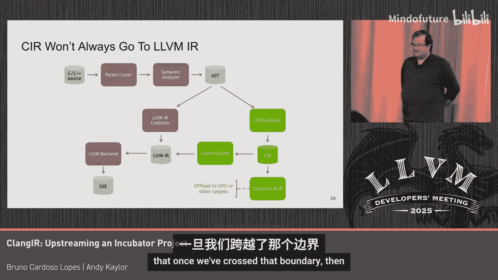

# 004：一个孵化器项目之旅 🚀

在本教程中，我们将学习ClangIR项目如何从一个独立的开源项目，经过社区孵化，最终成功上游化到LLVM主仓库的完整历程。我们将探讨孵化器的运作模式、社区协作的挑战与收获，以及上游化过程中的关键策略和经验。

## 概述 📋

ClangIR项目源于优化和分析C++代码的愿景。在传统的Clang编译流程中，AST（抽象语法树）层级过高，而LLVM IR层级又过低，缺乏对C++语义的丰富表达。ClangIR旨在填补这一空白，提供一个更丰富的中间表示（IR），以便进行更深入的语义分析和优化。

---

## 从RFC到孵化器 🏗️

上一节我们介绍了ClangIR项目的起源。本节中，我们来看看它是如何从一份RFC（征求意见稿）进入LLVM孵化器的。

项目时间线始于2021年底，最初在Mantta的GitHub上作为开源项目启动。经过约8个月的初步开发，团队向LLVM社区提交了RFC，寻求反馈。社区讨论的成果是成立了一个“C++ MIR前端工作组”，该工作组每月举行会议，持续了三年，汇集了行业专家共同探讨。

基于RFC的积极讨论，项目被接纳进入LLVM的“孵化器”。孵化器是LLVM GitHub组织下的一个独立目录，本质上是一个项目分支，为实验性项目提供了发展空间。

以下是孵化器的主要优势与挑战：

**优势：**
*   **可见性提升**：作为LLVM伞形项目的一部分，能吸引更多关注和贡献者。
*   **基础设施支持**：可以继承LLVM主项目的CI（持续集成）等基础设施，便于测试和代码规范检查。
*   **实验自由**：由于审查者相对较少，在遵循LLVM实践的前提下，有更多空间进行实验和快速迭代。

**挑战：**
*   **非主线状态**：对于下游公司或用户来说，依赖一个孵化器分支仍存在风险，且不如主仓库有吸引力。
*   **流程不明确**：孵化器项目何时、如何能“毕业”进入主仓库，缺乏正式化的标准流程。
*   **同步负担**：需要不断变基以跟上LLVM主项目的快速变化，维护成本高。

---

## 孵化器内的协作与成长 🤝

在孵化器中，项目的社区生态逐渐形成。贡献模式呈现出有趣的特点：初期有贡献爆发，随后趋于平稳，在2024年初因上游化进程而再次获得持续贡献。

贡献者来来往往是开源项目的常态。为了帮助新贡献者快速入门，项目将一些工作（如内置函数或内部指令的实现）设计为入门任务。这些任务通常只需10-15行代码和一个测试用例，让贡献者能快速获得成就感并理解代码库。

这种策略虽然有效，但也带来挑战：难以积累长期、深入的审查专家。项目贡献者“寿命”图显示，虽然有长期贡献的核心成员，但更多是短期贡献者。

一个积极的转变是，贡献来源从最初由Mantta主导，逐渐扩展到更广泛的社区，包括NVIDIA等公司的工程师、Google Summer of Code学生以及独立开源爱好者。这证明了社区协作的价值。

回顾孵化器阶段，尽管存在各种挑战和激烈讨论，但最终通过沟通找到了共同点，建立了合作关系，整体是一次非常积极的经历。

---

## 上游化：从零开始的艺术 🎨

随着项目在孵化器中逐渐成熟，团队于2024年初提交了上游化RFC，并获得了多家公司和项目的支持。2024年4月，第一个PR成功合并到LLVM主仓库。

上游化过程的一个关键策略是：**由与原始孵化器开发不同的贡献者群体来主导上游化工作**。这看似意外，实则带来了巨大好处。它类似于“重写《堂吉诃德》”——新贡献者必须深入理解每一行代码，仿佛第一次开发一样，从而带来了全新的视角和更深的理解。结果是，对代码有深刻理解的人数翻了一番。

上游化必须遵循LLVM的高质量标准：
*   每个提交都必须功能完整、可测试，且足够小以便审查。
*   贡献者需要彻底理解代码，能在代码审查中为其设计辩护。
*   必须符合编码规范，保持提交历史清晰。

因此，团队将大约10万行代码，分解成小块，逐一上游。自2025年2月以来，项目保持了约每周1500行代码的稳定上游进度。

---

## 上游化策略与当前进展 📈

目前，上游化工作主要遵循经典的代码生成路径，专注于Linux/x86平台，以确保基本功能的正确性和可测试性。长远来看，ClangIR的潜力在于其“MLIR消费者”环节，它可以为异构计算、特定领域优化等打开新路径。

以下是推动进展的具体方法：
*   **测试驱动**：使用LLVM测试套件中的“单源”测试作为工作清单，逐个解决阻碍编译的语言特性问题。
*   **对齐经典CodeGen**：ClangIR的代码生成在结构上刻意模仿现有的LLVM IR生成路径（称为“经典CodeGen”），以降低学习成本。
*   **对比测试**：在测试中同时输出ClangIR路径和经典CodeGen路径产生的LLVM IR，进行可视化对比，确保语义等效，并及时发现经典CodeGen的变更。

一个核心挑战是**代码重复**。ClangIR生成和LLVM IR生成的代码结构高度相似，仅因操作的值类型不同（CIR Value vs LLVM Value）而无法直接共享。团队正在探索使用模板或概念来抽象IR底层，以实现代码复用，这是长期可持续发展的关键。

---

## 总结与展望 🌟

本节课中我们一起学习了ClangIR项目从孵化到上游的完整旅程。

**总结要点：**
1.  **孵化器价值**：为项目提供了可见性、协作平台和实验自由，是培育社区和验证想法的宝贵阶段。
2.  **社区力量**：广泛的社区贡献是项目成功的基石，来自不同背景的贡献者带来了活力和深度。
3.  **上游化艺术**：高质量的上游化需要将大代码库分解，遵循严格标准，并由新鲜视角进行“重写式”迁移，这反而加深了社区对代码的理解。
4.  **当前状态**：ClangIR已具备一定语言支持，适合开发者开始在其上构建优化实验。项目正稳步推进，致力于实现与经典CodeGen的语义对齐和未来代码复用。

ClangIR的上游化不仅是代码的迁移，更是一个社区构建、知识传递和工程卓越的过程。它为未来更强大的C++编译优化能力奠定了基础。