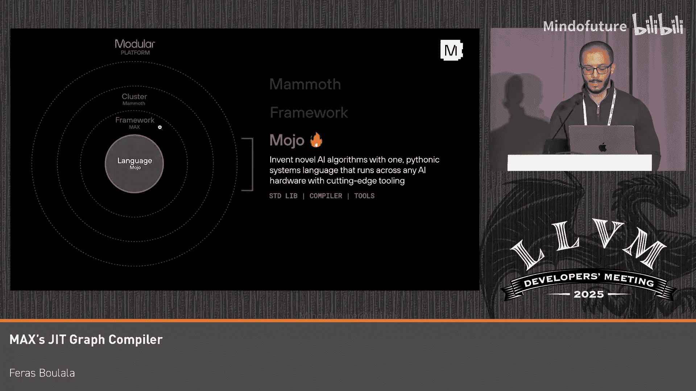
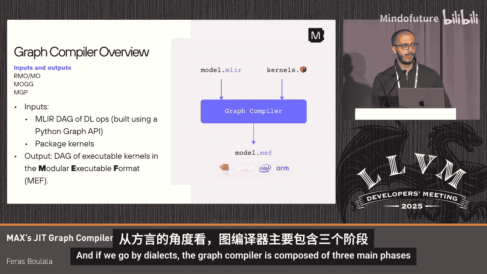
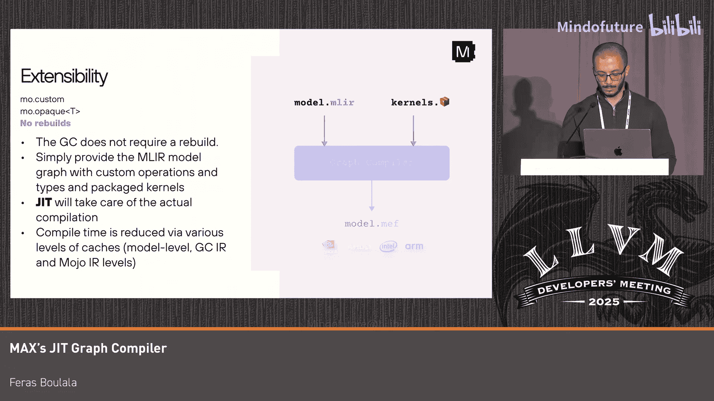
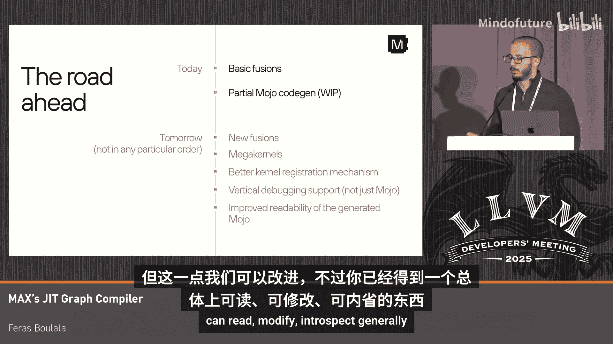
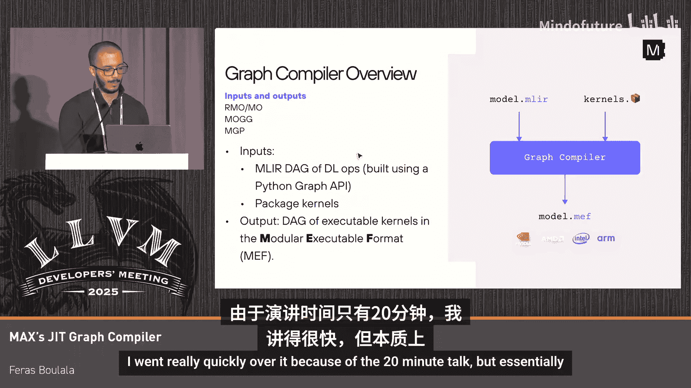

# 005：Modular的MAX即时图形编译器

## 概述

在本教程中，我们将学习Modular公司MAX框架中的图形编译器。这个编译器是深度学习推理平台的核心组件，负责将高级深度学习算子图转换为高效的、可执行的代码。我们将了解其设计哲学、核心架构、扩展机制，以及它如何通过生成Mojo代码来实现高性能和可调试性。

## 图形编译器高层架构 🏗️

上一节我们概述了图形编译器的目标，本节中我们来看看它的整体架构。

图形编译器接收两个主要输入：
1.  一个由高级深度学习算子组成的计算图。
2.  一组用Mojo编写的、参数未绑定的预编译内核包。

其输出是一个符合Modular可执行格式（MEF）的可执行文件，你可以将其理解为专为任意计算图设计的ELF文件。

从方言（Dialect）的角度看，图形编译器主要包含三个处理阶段：
*   **RMO/MO阶段**：处理模块化算子。RMO是MO的宽松版本，允许更多隐式行为（如自动广播）。
*   **MUG阶段**：即模块化图生成器，这是进行算子融合等优化的核心阶段。
*   **MGP阶段**：即模块化粘合原语，它负责对运行时行为以及与设备的交互进行建模。

## RMO/MO阶段：高级算子与优化 🔧

上一节我们介绍了编译器的三个阶段，本节我们深入第一个阶段——RMO/MO。

RMO/MO方言定义了约135个核心深度学习算子，例如矩阵乘法（`matmul`）、激活函数（如`relu`）和二元运算（如`add`）。图中的顶点代表这些高级算子，边则代表张量。

该方言原生支持动态形状。例如，在算子属性中，维度`N`、`M`、`K`可以作为符号值存在。为了在静态单赋值形式中维持操作顺序，我们通过`chain`显式支持副作用。此外，通过可变张量（`mutable tensors`）的概念支持原地操作。

以下是该阶段典型的优化：
*   **符号折叠**：例如，将 `add` 操作数与零相加的操作折叠掉。
*   **形状推断**
*   **常量折叠**
*   **MLIR提供的通用优化**：如公共子表达式消除（CSE）和死代码消除（DCE）。

## 应对快速演进的行业：可编程性与可扩展性 🛡️

上一节我们了解了基础优化，但深度学习基础设施日新月异。本节我们来看看如何设计一个能适应这种快速变化的编译器。

传统的深度学习编译器设计可以看作一个光谱：
*   **内核中心系统**：性能好、易于扩展、可调试、行为可预测，但覆盖率低，任何模型变更都需要人工编写新内核。
*   **编译中心系统**：覆盖率高，但通常难以获得峰值性能，编译时间长，行为不可预测，且如果需求超出其编程模型则难以扩展。

Modular的结论是：不存在一个万能的领域特定语言或编程模型能可靠地满足所有不断演进的深度学习推理需求。

因此，我们的解决方案是：**通过对可编程性和可扩展性进行投资来规避风险**。具体到图形编译器：
1.  **让内核编写成为高效的任务**：我们使用专为内核设计的Mojo语言，能够快速实现新硬件的顶尖性能。
2.  **将图形编译器设计为编写内核的基础设施**：使其能够支持内核编写。
3.  **为专家让路**：硬件专家最了解如何发挥硬件峰值性能，编译器必须允许他们做想做的事。这是图形编译器可扩展性的关键。

## 核心扩展机制：`mod.custom` 与 `mod.opaque` ⚙️

上一节我们提到了为专家让路，本节我们来看看实现这一目标的具体构建模块。

`mod.custom` 和 `mod.opaque` 是图形编译器中可扩展性的基石。
*   **`mod.custom`**：这是一个高度抽象的操作，可以接受任意数量的操作数和结果，并拥有一个映射到Mojo参数的属性字典。通过它，你可以在图形编译器中做任何你想做的事，只需提供内核实现即可。
*   **`mod.opaque`**：类似于 `mod.custom` 之于内核，`mod.opaque` 用于处理任意的不透明模块类型。它允许你操作图形编译器本身不理解的数据结构（如非张量类型的缓存），从而实现无需修改编译器本身的扩展。

这种扩展性得益于之前提到的JIT阶段：编译器接收预编译的、参数未绑定的内核包，并在MGP的最后阶段根据输入模型为这些参数提供具体值。

## MUG阶段：通过内省实现融合 🔄

上一节我们介绍了扩展机制，本节我们看看如何弥合Mojo内核与融合表示之间的鸿沟。

左边是Mojo中`matmul`内核的签名，右边是MUG中用于融合的结构化内核表示。如何从前者得到后者？答案是：**内省Mojo代码**。

Mojo代码被解析后会转换为LIT方言的IR。作为编译器工程师，你可以在Mojo中构建各种抽象（如装饰器、类型），它们会出现在LIT IR中。通过编程方式检查内核签名，我们就可以生成对应的结构化融合表示。

例如，一个包含`matmul`、`bias_add`和`relu`的图，可以在MUG中被融合成一个大的内核。重要的是，这种降低到结构化内核的方式**仅基于内核的编写方式，而不关心具体是什么操作**。因此，它对于用户通过`mod.custom`添加的任何自定义操作同样有效。

## 最终阶段：生成Mojo代码与未来展望 🚀

上一节我们看到了融合如何工作，本节我们来看一切如何最终汇聚为Mojo代码。

图形编译器的最后阶段是生成Mojo代码。输出的Mojo文件会引用用户提供的原始内核。生成的代码几乎是一一对应的，易于理解。此外，编译器还会自动生成运行时样板代码（如异步值的解包），这些代码对用户透明但可供调试。

生成Mojo代码的好处包括：
*   **人类友好**：可读、可内省、可调试、可修改。
*   **强大的可能性**：任何你能想象在Mojo中实现的优化或模式，理论上都可以通过图形编译器生成。这为未来功能打开了大门。

目前我们已经实现了基础融合（如元素级融合、prologue/epilogue融合）。未来，通过生成Mojo，我们将能够：
*   添加新的融合类型。
*   实现Mega Kernel。
*   改进内核注册机制。
*   增强垂直调试体验（从Python前端到生成代码）。
*   优化生成的Mojo代码的可读性。

## 总结

在本教程中，我们一起学习了Modular MAX图形编译器的核心设计。我们了解了其三层架构（RMO/MO, MUG, MGP），认识了它通过`mod.custom`和`mod.opaque`实现的可扩展性设计哲学。我们重点探讨了编译器如何通过内省Mojo内核签名来实现与操作无关的融合优化，并最终生成可读、可调试的Mojo代码。这种强调可编程性、可扩展性并为硬件专家让路的设计，旨在构建一个能够适应深度学习领域快速变化、同时持续提供峰值性能的编译系统。