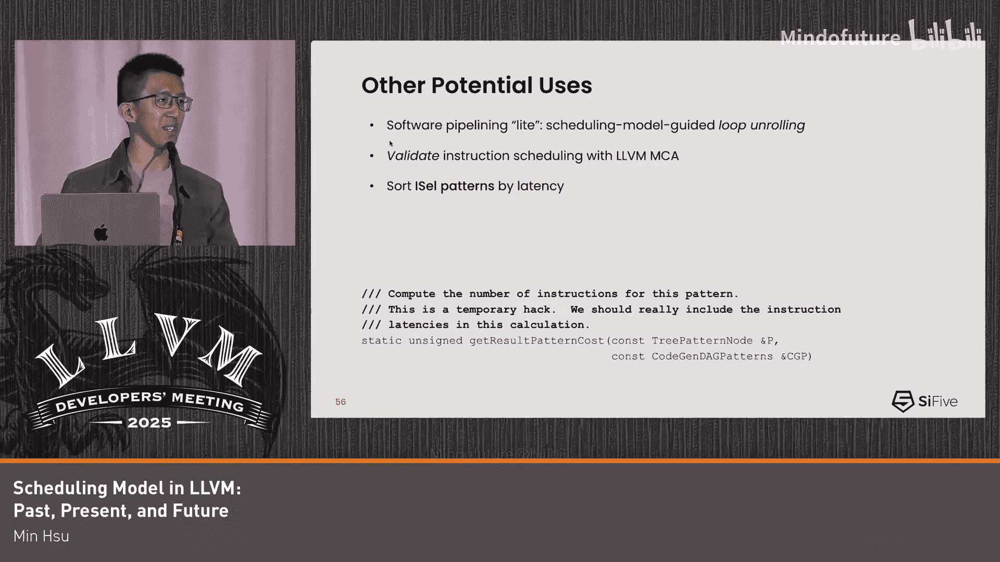

# 006：过去、现在与未来 🚀


在本节课中，我们将要学习LLVM中的调度模型。我们将了解它的基本概念、它如何被编译器其他部分使用、它与实际硬件的联系，并探讨其未来的改进方向。

## 概述 📋

调度模型是LLVM编译器框架中的一个核心组件，它为指令调度器提供了关于指令执行特性的关键信息。理解调度模型对于编写高效的代码生成后端至关重要。

## 什么是调度模型？ 🤔

调度模型最初是为指令调度而发明的。为了理解它，我们首先需要了解指令调度器的目标。

指令调度器主要有两个任务：第一是提高指令级并行性，第二是减少寄存器溢出。本节课我们主要关注第一个任务。

我们可以通过一个例子来解释。假设我们有一个数据依赖图，箭头表示从数据生产者到消费者的依赖关系。我们的目标是减少流水线停顿。

例如，一个加载指令通常有加载延迟。如果我们什么都不做，流水线就会在加载指令完成前浪费很多周期。我们希望做的是，在加载指令和它的消费者（比如一个加法指令）之间，填充一些无关的指令。

另一个例子是，如果有三条可以独立调度的指令，但它们竞争相同的硬件资源，我们就需要知道如何安排它们以避免冲突。

## 指令调度需要的关键信息 🔑

从上面的例子，我们可以总结出指令调度需要从调度模型获取的三个核心要素：

1.  **延迟**：指令执行完成所需的总周期数。
2.  **资源**：指令执行时需要使用哪些硬件执行单元。
3.  **占用时间**：指令占用特定资源的时间长度。

一个最简单的调度模型可以是一个巨大的表格，其中列出了每条指令的延迟、使用的资源和占用时间。

## 从硬件视角看调度模型 ⚙️

上一节我们介绍了指令调度需要的信息，本节中我们来看看这些概念如何映射到实际的硬件。

最初的调度模型称为“行程模型”。它将指令建模为多个阶段，每个阶段都定义了占用时间和使用的资源。整个指令的执行时间就是所有阶段时间的总和。

这很容易让人联想到传统的处理器流水线模型。延迟对应指令流经各个流水线阶段的总时间。占用时间特指指令在执行阶段花费的时间。

当我们引入超标量架构时，情况变得更有趣。超标量意味着复制多个相同的执行流水线（称为执行单元），以便同时执行指令。

*   **资源**：现在，“资源”具体指代哪个执行单元。例如，指令A可能只能在单元0上运行，而指令B可以在单元0或单元1上运行。
*   **占用时间**：含义保持不变，指指令占用特定执行单元的时间。

## 现代的调度模型：基于读写操作 🆕

现在，我们来看看当前一代的调度模型。它不再将指令拆分为多个阶段，而是从单个指令出发，专注于其操作数。

它将操作数分为“写”和“读”。对于“写”操作，会分配一个令牌，并用这个令牌映射到一个称为 **WriteRes** 的实体。这个WriteRes包含了我们之前提到的三个要素：使用的资源、延迟和占用时间。

占用时间由两个字段表示：`AcquireAtCycle` 和 `ReleaseAtCycle`。我们稍后会详细解释。

以下是一个定义指令及其WriteRes的示例代码：
```tablegen
def : InstRW<[MyWriteRes], (instrs MY_INSTR)>;

def MyWriteRes : WriteRes<[PipeA, PipeB], [1, 33]>;
```
*   `MyWriteRes` 定义了该指令使用 `PipeA` 和 `PipeB` 资源。
*   `[1, 33]` 表示延迟。通常，延迟值等于最长的占用时间。

### 资源的表示

资源通过 `ProcResource` 声明。有时，一条指令可以在多个资源上执行，这时使用 `ProcResourceGroup`。如果一条指令需要同时使用多个资源，则在WriteRes记录中列出所有资源。

### 占用时间的表示

占用时间通过 `AcquireAtCycle` 和 `ReleaseAtCycle` 这两个数组来表达。数组的元素数量等于该指令可使用的资源种类数。

例如，对于使用两种资源的指令，数组有两个元素。第一个元素（比如对应PipeB）的 `AcquireAtCycle` 是0，`ReleaseAtCycle` 是1，表示它在PipeB上占用1个周期。第二个元素（对应PipeA）的 `AcquireAtCycle` 是0，`ReleaseAtCycle` 是33，表示它在PipeA上占用33个周期。

`AcquireAtCycle` 不一定从0开始，它可以是非零值，用于表示更复杂的流水线行为。

## 调度模型如何指导调度？ 🧭

将WriteRes信息整合后，调度器就可以工作了。

*   **防止数据冒险**：对于加载指令，调度器知道其延迟，因此会将依赖其结果的加法指令适当推后执行，避免加法指令空等数据。
*   **防止结构冒险**：对于竞争相同资源的两条乘法指令，调度器知道第二条必须等待第一条释放资源后才能开始。而对于使用不同资源的乘法和减法指令，它们可以被安排在同一时间执行。

硬件也有自己的机制来避免这些冒险，即**乱序执行**。

## 乱序执行与调度模型 🔄

乱序执行的核心是在执行单元前增加一个缓冲区（重排序缓冲区）。指令先被分派到缓冲区，等到其所有数据依赖和资源冲突解决后，才被发射到执行单元。

工具 `llvm-mca` 可以模拟这种行为，它同样使用调度模型来预测指令在CPU上的执行时间线。在模拟中，我们可以看到，没有数据依赖的指令即使代码顺序在后，也可能先开始执行。

对于结构冒险，如果多条乘法指令只能在一个特定单元上执行，而加法指令可以在任何单元上执行，那么加法指令可能先于后面的乘法指令开始执行，因为它们不竞争资源。

## 调度模型中的缓冲区建模 📊

为了对乱序执行进行建模，调度模型需要描述缓冲区。

*   **统一重排序缓冲区**：所有流水线共享一个大的缓冲区。在模型中，这通过设置 `BufferSize = -1` 来暗示，并使用 `MicroOpBufferSize` 表示缓冲区总大小。
*   **分离的重排序缓冲区**：每个执行单元有自己的缓冲区，通过 `BufferSize` 属性指定大小。
*   **共享缓冲区**：多个执行单元共享一个缓冲区，这提供了更大的调度灵活性。统一缓冲区可以看作是这种模式的最通用形式。

对于**顺序执行**核心，通常设置 `BufferSize = 0`，表示没有缓冲区。但有一种特殊的“顺序核心”会将 `BufferSize` 设为1，表示有一个微小的暂存区。虽然两者在硬件上都是顺序执行，但在调度模型中的表示不同，这引出了下一个关键点。

## 不同使用者对调度模型的解读 👀

调度模型本身只是提供数据，关键在于不同的使用者如何解读它。`llvm-mca` 和机器指令调度器（编译器的一部分）对模型的解读就有显著不同。

最大的区别在于对**缓冲区大小**的解读：
*   `llvm-mca` 的解读与硬件一致，用于模拟指令在缓冲区中的行为。
*   **机器调度器**则完全**不使用**缓冲区大小信息。因为它无法在编译时预测硬件调度器在运行时的具体行为。

对于顺序调度，机器调度器会尝试在编译时预测停顿。它使用内部数据结构来模拟指令流，并严格检查数据冒险和结构冒险。只有当前没有冒险的指令才会被考虑调度。

而对于乱序核心（或 `BufferSize=0` 的顺序核心），机器调度器则乐观得多。它假设硬件会处理好冒险，因此几乎不设限制地允许指令进入可调度队列。

这种差异可能导致机器调度器对某些硬件过于乐观，期望硬件具备其实际没有的能力（比如对 `BufferSize=0` 的核心进行乱序调度）。但有时，这种乐观也有用处，例如，它可能允许一条会带来轻微停顿但能极大降低寄存器压力的指令被调度，从而避免更严重的性能损失。

## 调度模型的其他潜在用途 💡

除了指令调度和 `llvm-mca`，调度模型还可以在其他地方发挥作用：

以下是当前已经使用或未来可能使用调度模型的一些场景：

1.  **机器轨迹度量**：这是一个未被充分利用的强大工具。它利用块概率信息，估算代码路径的延迟和资源使用情况。目前仅用于机器指令组合器和早期If转换优化。
2.  **机器流水线化器**：用于软件流水线优化，它使用所有调度模型信息来重叠循环不同迭代的指令。
3.  **TTI成本模型**：`TargetTransformInfo` 目前为LLVM IR指令提供代价信息。未来可以考虑让其基于调度模型来提供延迟等数据，实现“单一事实来源”。挑战在于LLVM IR指令和机器指令之间存在巨大差异。
4.  **指导循环展开**：利用调度模型信息来指导循环展开策略，以改善展开后的指令调度。
5.  **验证调度结果**：在机器调度器完成调度后，使用 `llvm-mca` 来验证调度结果的质量。
6.  **改进指令选择模式排序**：目前指令选择模式的顺序可能影响调度结果。一个存在了20年的想法是利用调度模型中的延迟信息来对这些模式进行排序，可能带来性能提升。



## 总结 🎯

本节课中我们一起学习了LLVM调度模型的核心内容。

我们了解到调度模型为指令调度提供了延迟、资源和占用时间这三个关键信息。我们看到了这些概念如何映射到处理器的流水线和执行单元。更重要的是，我们认识到调度模型的精髓不在于模型本身的数据，而在于不同的工具（如编译器调度器和性能分析工具）如何解读和运用这些数据。

最后，我们探讨了调度模型当前的应用以及未来可能的改进方向，例如统一代价模型、验证调度结果和优化指令选择等。理解这些将帮助我们更好地利用调度模型来生成高性能的代码。