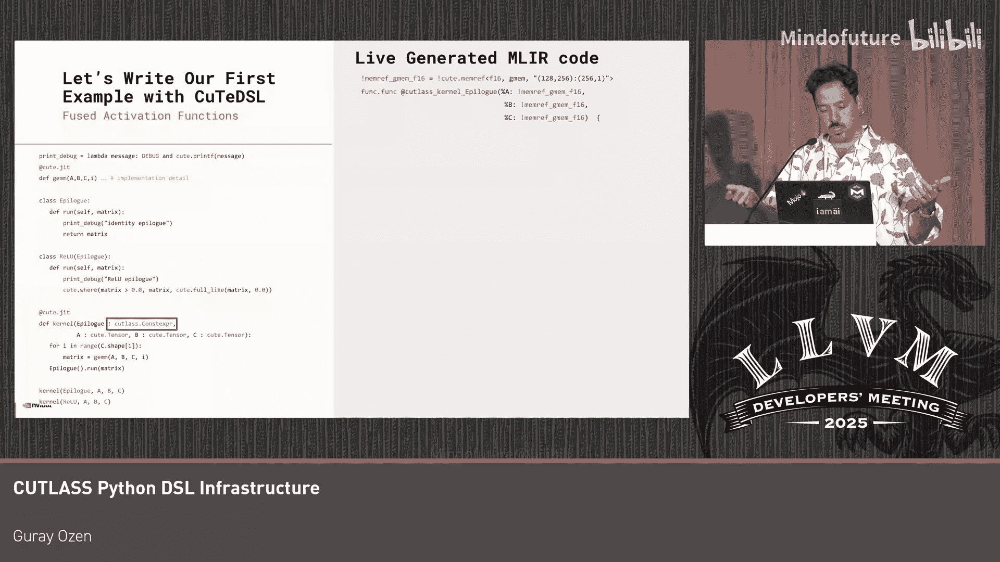

# 007：核心设计与实现

在本教程中，我们将探讨为 CUTLASS 实现的 Python 领域特定语言（DSL）及其底层基础设施。我们将了解其设计动机、核心架构、编译流程以及如何平衡 Python 的灵活性与高性能计算的需求。

## 设计动机与目标

大家好，我是郭藏，在英伟达担任编译器工程师。今天我们将讨论我们为 CUTLASS 实现的 Python DSL 及其基础设施。

你可能会问，CUTLASS 的 Python DSL 是什么？CUTLASS 不是一个 C++ 库吗？是的，它曾经是一个库。但当这个项目变得非常重要时，我们为其实现了一个编译器，并在其之上构建了 DSL。我们的 DSL 称为 CUTLASS DSL（CUTLASS DSL），它是一个基于装饰器的 DSL。你基本上可以通过 `pip install` 安装并立即开始使用。我们为主机和设备代码提供了不同的装饰器。

由于这是英伟达 GPU 和 CUTLASS，你可能会问它的速度如何，加速效果怎样？你可以获得非常快的速度，因为这种 DSL 的设计理念是为你提供完全的控制和抽象。通过使用这些功能，你确实可以获得峰值性能。我们已经为不同架构提供了许多示例内核，并提供了像 Jupyter Notebook 这样的教程。我相信你会找到大量材料来理解如何使用这个 DSL。

但今天的讨论重点不在于此，因为这是一个编译器会议。我想告诉你我们为什么实现这个 DSL，以及在实现过程中做了哪些设计选择。我不会展示任何性能数据，请不要失望。

## 核心架构：基于 MLIR 的编译栈

那么，让我们开始吧。这是我们的起点，即我们的蓝图。我们认为 MLIR 层是实现抽象的好地方，因为我们可以实现方言。我们从 `MLIR Affine` 和 `MLIR SCF` 方言开始。

然后我们对其进行了扩展。扩展意味着我们将 CUTLASS 代数建模为 MLIR 中的一个方言，位于 MLIR Affine 和 SCF 方言之上。从这个方言出发，我们实现了转换，最终生成 MLIR NVVM 方言。因此，我们的关键方言是 NVVM 方言。我们实际上正在朝这个方向推进。这是一个完整的方言，不再有内联汇编。我们直接生成 LLVM IR。之后，我们当然会转到 LLVM 方言，然后生成 PTX。

这就是我们当前的工作流程。现在我们希望使其可编程。为了实现这一点，我希望从 Python 中交付这个功能。当我想要这样做时，我看到了 Python 语言的庞大性。它非常庞大，可能超出了子集的范围，而且我没有任何工具可以将任何 Python 语言映射到我的 MLIR，因为我们还没有构建这样的工具。

那么，我的问题是：如何将 MLIR 捕获到 Python 中？如何在 Python 中对 MLIR 进行建模？实际上，这甚至不是我的问题，因为我不是在开发一门新语言，这不是我们的目标。我们的目标是交付用于 CUTLASS 的 DSL。而 CUTLASS 关乎性能。所以我的问题是：哪些 Python 特性能够让我快速编写 GPU 内核，同时又不牺牲性能？我不能为了使用所有 Python 特性而牺牲性能。这就是我们的目标。

## DSL 实现方法对比

在开始之前，让我先谈谈 DSL 的实现方式。实现 DSL 有多种方法，我将讨论其中的三种。

第一种是基于 **Python 抽象语法树（AST）** 的方法。你基本上获取 Python AST，然后将其映射到你的 MLIR 或类似的中介表示（IR）。

第二种是基于 **字节码** 的方法。你获取 Python 字节码，然后生成 IR。如果你来自 C++ 或 Rust/Fortran 背景，这通常被称为编译器，是大家常用的方法。

第三种是 **追踪（Tracing）** 方法，它根本上是不同的。你不处理抽象语法树，而是运行程序并在执行过程中捕获信息。这是非常不同的。

让我们深入探讨一下。我想向你展示基于 AST 的 DSL 思路：你有一个 Python 装饰函数，通过解释器生成 AST，然后将其映射到 IR。这就是整个想法。

但是，让我们看一个更现实的例子。这里我展示了一个例子。它非常简单，但在机器学习中非常典型和复杂。我们所做的就是执行一个通用矩阵乘法（GEMM）。在 GEMM 之后，我们有一个收尾操作（epilogue），例如，我对结果进行一些处理。

在这个例子中，对于收尾操作，我有两个类。一个类基本上什么都不做，但另一个类执行 ReLU 激活函数。我使用了多态风格，因为它们是很好的概念，使我的代码可读性强。

现在，让我们为这个函数生成 AST。这是为装饰函数生成的 AST（不是所有代码的 AST，因为我只对实现基于装饰器的 DSL 的装饰函数感兴趣）。

这是我的 AST。让我们逐行理解这些节点。

第一行是 `for` 循环。`for` 循环存在于 AST 中。这很好，因为我不需要理解循环周期和做其他事情。它就在那里，非常酷。所以它对我有用。

对于 GEMM，我有一个函数调用。为简单起见，我们假设 GEMM 已经在一个函数中实现，并且速度非常快。这对于 AST 来说没问题。

对于收尾操作，糟糕的事情发生了，因为 Python 是动态类型的，我无法在 AST 层面理解这个 `epilogue` 是什么。我在调用什么并不清楚。我需要做的是插入更多的装饰器，为每个 `epilogue` 相关的东西进行分析。这非常困难。

让我们总结一下基于 AST 方法的优缺点。

**优点**：你的程序结构清晰。循环、控制流都在那里，一切都很清晰，这很好。

**缺点**：你无法免费获得 Python 的特性。你必须在你自己的 Python AST 中实现所有你想要的功能。当你这样做时，我确信它将不再是 Python，而是变成了别的东西，变成了 DSL。人们将不得不在你的 DSL 中思考，而不是在 Python 中思考。而且你的 DSL 发展会很慢，因为你必须先实现功能，然后才能映射到 DSL，这需要时间。所以这可能不是最好的主意。

现在，让我们转到第二种方法，即基于字节码的方法，因为它与 AST 方法非常相似，只是层次更低。但第三种方法是根本不同的，我想解释一下。

在这里，我们不处理 AST，而是用解释器执行程序。让我们执行一下。由于是解释执行，我也会展示解释器在做什么。

首先，它读取所有代码，如果遇到内核函数调用，我们的装饰器就会介入。在右侧，我展示了生成的 MLIR 代码，因为我们在执行过程中生成代码。

对于你的函数，我们生成某种 MLIR 函数。这很酷。然后对于 `for` 循环，我们执行它，但糟糕的事情又发生了。现在 Python 解释器执行了我的循环，因为在这种情况下，Python 正在执行 Python 代码，而我正在捕获我所捕获的内容。`for` 循环是 Python 的，所以我的循环消失了。如果我有一个控制流，它也会消失。所以这并不好。

但是，当我们运行 `epilogue` 时，神奇的事情发生了，发生了很多很多事情。这里发生的是：我构建了类，构造了类，并且有一个多态函数调用，它起作用了。此外，函数调用是内联的。所以我生成的代码非常简洁漂亮。我没有为此付出任何代价。一切都生成得很好，我免费获得了 Python 的特性，因为 Python 解释器比任何人都更懂 Python。我免费获得了这些特性。

现在让我们转到第二个内核的调用。在这种情况下，我有一个不同的激活函数。我将保留所有步骤，但直接看最后一步。在最后一步，你会看到一切照常运行。我们重新生成了 IR，但 `epilogue` 部分不同了。现在我可以使用 ReLU 激活函数了。

那么，我们也来总结一下这种方法。

**优点**：很酷，因为我可以免费使用 Python 的特性，并且可以使用 Python 进行元编程。

**缺点**：解释器运行得太自由了，我无法控制它，它吞噬了我的程序控制流和所有函数调用。是的，这可能也不是最好的主意。

那么，我需要选择哪一种呢？我卡在这里了，但我并没有，因为在英伟达，我可以询问编写内核的人他们需要什么。我收集了两个事实。

第一个事实非常明显：快速的 GPU 内核算法非常简单。没有函数调用，没有面向对象编程，没有多态，没有复杂的分支或深度嵌套的逻辑。你可以在 GPU 上拥有所有这些，但不是在快速内核中，因为我们追求的是峰值性能。

但是，当我们查看内核代码时，它们使用了元编程等概念，比如使用类，因为这很好。它使我们的代码可读性强，就像 C++ 一样，同时也保持了代码的整洁，提高了可读性。我们喜欢这些东西，但我们不想为此付出性能代价。

## 我们的解决方案：结合 AST 与追踪

因此，我们的想法是结合这两种方法，即结合 AST 和追踪。我们让用户与 Python 解释器成为朋友。解释器不会随意运行，你可以阻止它，这意味着捕获 IR。如果你想让 Python 运行，那么你可以让它运行。我们如何做到这一点呢？我们引入了 **常量表达式** 的概念。如果你有常量表达式，我们将在 Python 解释器上运行它。

那么，什么可以是常量表达式呢？函数参数可以是，变量可以是，控制流可以是，形状（如果你关心的话）也可以是常量表达式。但由你选择，而不是我，因为你知道什么必须被捕获，什么不需要被捕获。

那么，我们的编译流程是怎样的呢？我们有两个阶段和一个预阶段。让我从头开始解释。

从 Python 代码开始，我们进入预阶段。在这个预阶段，我们读取你的 Python AST，并生成另一个 Python 代码，这有点像元 Python。在这里，我们理解你的控制流和程序结构，并生成回调函数。然后你进入元阶段。在这个元阶段，我们有了元 Python 程序，并用 Python 解释器执行它。在这个过程中，我们进行常量折叠、实现回调、进行追踪、执行部分求值、类型推断等，所有事情都在这里完成。然后，这个阶段产生一个对象，比如 MLIR（MLIR 是静态类型的），这个对象基本上就是 CUTLASS 方言。接着我进入 MLIR 对象阶段。在这里，我们最终确定代码，生成二进制文件。

让我们举一些例子来理解如何在元阶段调试或理解发生了什么。调试工具并不令人惊讶，就是 `print`，因为 `print` 在追踪阶段（即我们的元阶段）工作。

我将展示三个例子。让我们从头开始。

第一个例子：我们有 `a` 和 `b`，它们不是常量表达式，它们是动态的。我有一个结果 `c`，并用它们进行计算。当我打印 `c` 时，我看不到数据结果，因为 `c` 在元阶段没有被求值，它没有在 Python 解释器中求值。你必须在目标架构上执行这个程序才能看到结果。

第二个例子：我们再次有 `a` 和 `b`，但 `b` 是一个常量表达式（因为你可能这样标记它）。`a` 是一个 Python 值，因此根据定义也是常量表达式。当你进行求值时，你立即在打印中看到它的值，因为我们在元阶段用 Python 解释器对它进行了求值。所以你的结果 `c` 有其值。

第三个例子是混合的：其中一个 `b` 是常量，`a` 是动态的。在这种情况下，我们显然会将常量提升为动态，你看不到结果。

当然，我们也有常规的 `printf` 或 CUTLASS 的 `printf`。如果你使用这个 `printf`，它将在二进制文件执行后打印结果，可能来自你的 GPU。所以这是不同的。

## CUTLASS DSL 应用示例

现在，让我们用 CUTLASS DSL 来写我之前展示的例子。我们实际上不会改变太多东西。但我们在这个程序中真正想要的是两件事：我想使用 `epilogue`，并且我希望这个 `epilogue` 在 Python 解释器中运行，因为我使用了一些元编程；对于 `for` 循环，我实际上想捕获它。这并不难。

对于 `epilogue`，我将其注释为常量表达式，因为我想使用 Python 解释器。对于 `for` 循环，在循环中，我不对其进行任何注释，因为我想捕获这个值。如果我们不注释任何东西，并且使用 Python 的常规 `range`，你会看到循环变量 `i`。目前，我们使用 SCF 方言来处理它。

但如果你想将其标记为常量表达式，也可以。在这种情况下，你的循环将由 Python 运行，因此会自动展开。

对于 `epilogue`，是的，由于它是常量，我们将由 Python 解释器进行求值。

这就是我们的 DSL 代码生成部分的基本工作原理。

## 扩展性与多方言支持

现在我想谈谈这个 DSL 如何与英伟达内部的其他方言协同工作，因为在英伟达，我们内部有多个方言，我们希望使用相同的 DSL 来编程这些方言或其他方言。

当我们查看 DSL 的特性时，我在这里展示的特性实际上是目标无关的。我的意思是，当你从一个目标转到另一个目标时，它们并没有太大差异。例如，AOT 编译在某种程度上是目标相关的，或者像 GPU 缓存这样的特性是目标无关的。或者你需要运行 MLIR 执行引擎和即时编译，所有这些事情，比如 LLVM，都是目标无关的。

有两件大事不是目标无关的，它们是类型推断和由 Python AST 生成的回调函数。

但我们确保它们是可扩展的。

例如，让我们看看类型推断。我们有内置类型，这些内置类型被每个其他方言共享，因为每个人都使用标量类型。

但是当你有自己的 DSL 实现时（在这种情况下，我们讨论的是 CUTLASS DSL），你将拥有自己的类型，这些类型可以与现有的 DSL 类型一起工作。所以我们的类型推断是可扩展的。

另一个是生成回调函数。之前我展示了编译流程，并提到我们有 Python 代码，然后进入预阶段，在那里我们读取 AST 并生成元代码（元 Python 代码）。在这种情况下，我们的元 Python 代码会生成回调函数。你必须为你自己的 DSL 实现这些回调函数。例如，对于 CUTLASS DSL，我们实现了这些回调函数来生成 SCF 方言以处理控制流。对于其他事情，你可以实现任何其他功能。例如，如果你想实现另一个 DSL（假设叫 `my_dsl`），你可以实现这些回调函数，生成存在于你方言中的任何其他控制流，这完全没问题。因为我们希望确保这个元 Python 代码是相同的，并且可以与我们希望使用此 DSL 基础设施的任何类型的方言一起工作。

最后我想谈谈调用约定，因为你可能会问：你的 DSL 到底有多 Python？我们确保你可以从任何地方调用 Python。这是我们的调用约定。我提到我们有两个装饰器：一个装饰器是内核（GPU 函数），另一个装饰器是设备函数（可以是主机或设备函数）。正如你在表格中看到的，我们基本上可以从任何地方调用任何地方。这里缺少两件事：例如，最后一个“内核调用内核”我们不支持，我们没有找到任何有用的用例，所以不支持。另一个是 Python 函数直接调用内核，我们也不支持，同样因为没有找到有用的用例，因为我们总是需要经过主机来生成线程束脚本，然后再回到设备。但我的意思是，如果你找到有用的用例，我们可以实现这两个功能。所以这并不是根本性的困难。

## 总结

好了，让我总结一下我的演讲。

我们已经实现了这个基础设施，并在 CUTLASS 仓库下交付了 DSL CUTLASS DSL。它是目标无关的，可以与许多方言协同工作，目前内部已与多个方言一起工作。

我们的 DSL 分为两个阶段和一个预阶段。在预阶段，我们读取 Python AST 以捕获程序结构。在元阶段，我们运行 Python 解释器。在对象阶段，我们使用 MLIR 编译静态类型代码。

谢谢大家，我的演讲到此结束。

---

**本节课中我们一起学习了** CUTLASS Python DSL 基础设施的核心设计。我们探讨了其结合 AST 分析与运行时追踪的独特编译流程，理解了常量表达式在平衡 Python 灵活性与生成高性能 GPU 代码之间的关键作用，并了解了该 DSL 如何设计为可扩展、目标无关的系统，以支持多种 MLIR 方言。