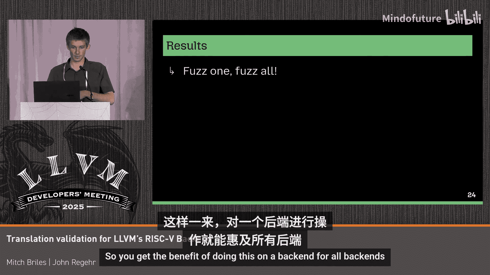

# 008：P08-P07_针对LLVM的RISC-V后端的翻译验证


在本教程中，我们将学习如何使用翻译验证工具来检查LLVM的RISC-V后端是否存在编译错误。我们将介绍工具的工作原理、具体步骤，并通过一个实例来理解如何发现和修复后端优化中的问题。

## 概述：什么是翻译验证？🔍

翻译验证是一种形式化验证方法，用于确保编译器优化或代码转换的正确性。具体来说，它验证转换后的目标代码是否是源代码的一个“精化”。这意味着目标代码的行为必须与源代码一致，或者更精确（例如，不会引入未定义行为）。

LLVM社区有一个名为Alive2的工具，它使用Z3求解器来验证中间表示（IR）层面的优化。然而，我们的重点是将这种方法应用于后端，特别是针对RISC-V架构的机器码生成。

## 翻译验证的工作流程🔄

上一节我们介绍了翻译验证的概念，本节中我们来看看针对RISC-V后端的具体验证流程是如何分步进行的。

整个验证过程可以概括为四个主要步骤：

1.  **调用LLVM后端**：输入LLVM IR，让后端生成RISC-V汇编代码。
2.  **将汇编代码提升回IR**：使用一个专门的“提升器”，将生成的RISC-V汇编代码转换回LLVM IR形式。这一步是关键，它创建了一个与原始IR可比较的中间表示。
3.  **优化提升后的IR**：使用`opt`工具对提升得到的IR进行简化，去除不必要的细节（如寄存器分配、栈操作），得到一个更干净、更核心的IR用于比较。
4.  **进行精化验证**：使用Alive2工具验证第3步得到的目标IR是否是第1步原始源IR的一个精化。

如果验证通过，说明整个后端转换过程（IR -> 汇编 -> 提升后的IR）是保持语义正确的。如果Alive2报告错误，则意味着其中某一步转换不是精化，可能存在编译错误。

## RISC-V后端验证工具：RISC-V TV🛠️

我们基于上述流程开发了RISC-V TV工具。它与之前用于ARM64后端的RTV工具思路类似，但主要区别在于“提升器”的实现。

RISC-V的提升器实现起来相对简单，主要原因是RISC-V指令集架构没有状态标志位（如x86的EFLAGS）。因此，我们不需要像处理x86那样去模拟和撤销标志位的计算，这大大简化了提升过程。

接下来，我们深入了解一下提升器是如何工作的。

## 提升器的工作原理🧩

提升器的核心任务是模拟一个RISC-V函数的执行环境，并将每条机器指令映射到语义等价的LLVM IR操作。以下是其工作步骤：

1.  **分配存储空间**：首先，在内存中分配空间来模拟RISC-V的寄存器文件。同时，分配一个栈空间用于处理函数调用约定（ABI）。
2.  **翻译每条指令**：对于汇编代码中的每条RISC-V指令：
    *   从模拟的寄存器文件中加载（`load`）操作数。
    *   使用语义等价的LLVM IR指令执行操作。
    *   将结果存储（`store`）回目标寄存器。

以下是一个简单的例子，展示了提升器内部如何处理`add`指令：

```llvm
; 假设 %reg_file 是模拟寄存器文件的基础指针
%val1 = load i32, i32* %reg_file_offset_1 ; 加载第一个操作数
%val2 = load i32, i32* %reg_file_offset_2 ; 加载第二个操作数
%sum = add i32 %val1, %val2                ; 执行LLVM的add操作
store i32 %sum, i32* %reg_file_offset_dest ; 存回目标寄存器
```

这个例子很简单，因为LLVM的`add`指令语义与RISC-V的`add`指令完全相同。但并非所有指令都如此。

有时会遇到边缘情况，或者某些RISC-V指令在LLVM中没有直接对应的IR操作。这时，我们需要用一系列LLVM指令来完整实现该指令的语义。在这个过程中，我们的目标不是生成高性能代码，而是生成对求解器（如Z3）“友好”的、易于验证的IR序列。通常，这意味着一连串清晰的位操作指令，而不是循环或复杂的向量操作。

## 提升后代码的结构📊

经过提升，我们会得到大量的LLVM IR代码。其中大部分代码（例如黄色的寄存器分配、栈操作、ABI包装等）是用于构建模拟环境的样板代码。如果我们过滤掉这些，就能看到核心的指令映射。

最终得到的目标函数结构清晰：
*   **序言**：分配和初始化模拟的寄存器与栈。
*   **主体**：每个RISC-V指令通常对应一个基本块，其中包含加载操作数、执行操作、存储结果。
*   **尾声**：处理ABI要求，如位宽扩展（零扩展或符号扩展），然后返回。

有了这个系统，我们就可以开始用测试用例来寻找后端bug了。

## 测试用例的来源与模糊测试🔬

为了有效地发现bug，我们需要大量的、多样化的测试输入。我们主要从以下几个来源获取测试：

以下是我们的测试用例来源：

*   **LLVM测试套件**：包含大量专门设计用于测试后端模式的用例。
*   **YARPGen**：生成随机的C函数，编译成IR后作为输入。
*   **Yuf**：对现有的IR进行细微变异，例如插入指令、修改参数或改变位宽，以探索边缘情况。
*   **Elegant Mutation-Based Bug Seeding**：另一个有效的变异生成器，帮助我们发现了许多问题。

## 实例分析：发现并修复一个Bug🐛

让我们通过一个具体的例子来看看如何发现和修复bug。考虑以下LLVM IR代码，它使用了`cttz`（计数尾随零） intrinsic：



```llvm
define i8 @example(i8 %x) {
  %iszero = icmp eq i8 %x, 0
  %cttz = call i8 @llvm.cttz.i8(i8 %x, i1 false) ; false 表示输入为0时返回poison
  %result = select i1 %iszero, i8 0, i8 %cttz
  ret i8 %result
}
```

这个模式的意图是：如果输入是0，则返回0；否则返回尾随零的个数。然而，RISC-V的`ctz`指令在输入为0时的行为是返回数据的位宽（对于i8就是8），而不是LLVM IR中`poison`或我们期望的0。

在早期的RISC-V后端优化中，编译器试图用一种巧妙的方式处理这个差异。它生成的汇编可能包含设置标志位、进行掩码操作来模拟`select`行为。但是，当模糊测试工具将`i8`类型变异为`i7`（非2的幂次方位宽）时，问题暴露了：用于计算的掩码值错误，导致一半的输入结果出错。

根本原因是，掩码的计算方式（`位宽 - 1`）只对2的幂次方位宽有效。我们随后提交了一个PR，修改了后端的代码生成逻辑，现在这个优化对于非2的幂次方的类型也能正确工作了。

## 成果与总结📈

通过大规模的翻译验证和模糊测试，我们取得了以下成果：

*   **对于ARM64后端（RTV项目）**：发现了45个此前未知的编译错误。
*   **对于RISC-V后端（RISC-V TV）**：目前只发现了1个RISC-V特有的编译错误。

这个数量差异可能令人惊讶，但有几个原因：
1.  许多后端代码是共享的。在ARM64后端上通过模糊测试发现的bug，在被修复后，也惠及了RISC-V等其他后端。
2.  RISC-V社区（如Craig Topper等开发者）已经积极修复了许多已知问题。
3.  我们的测试可能尚未覆盖所有RISC-V扩展（例如V向量扩展）。

这项工作告诉我们，对一个后端进行深入的翻译验证和模糊测试，由于代码共享，实际上对所有LLVM支持的后端都有益处。它不仅帮助发现bug，也使得翻译验证本身变得更容易实施。

## 未来方向🚀

本节课中我们一起学习了针对LLVM RISC-V后端的翻译验证方法。展望未来，可能的工作方向包括：

*   支持更多的RISC-V ISA扩展（如V扩展）进行测试。
*   改进模糊测试的变异策略，以生成更有效、更复杂的测试用例。
*   进一步分析当前方法可能遗漏的bug类别。

---


