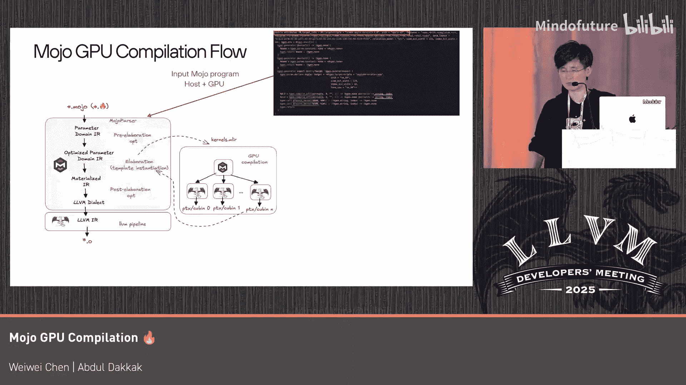

# 009：Mojo的GPU编译


在本节课中，我们将要学习Mojo语言如何实现GPU编译。Mojo是一种Python风格的系统编程语言，它结合了Python的易用性与C++级别的性能，并提供了对CPU和GPU的统一编程模型。

## 概述

Mojo是Modular公司正在构建的一种Python风格的系统编程语言。它看起来像Python，但拥有支持泛型编程、强类型系统和内存安全等强大特性。我们认为它是将Python扩展到CPU和GPU的最佳方式。Mojo非常快，具备类似C/C++的性能。它也是Modular Max推理引擎的基础之一。Mojo提供了一个统一的编程模型，可以同时用于CPU和GPU，从而释放标准CUDA和ROCm的全部能力，但用户无需直接使用这些供应商工具链。

## Mojo的GPU编程模型

上一节我们介绍了Mojo的基本概念，本节中我们来看看Mojo如何实现GPU编程。

Mojo的大部分GPU功能实际上是Mojo标准库的一部分，这意味着它们是Mojo代码，而非编译器魔法，这也使得编译过程更加快速。

以下是一个统一的Mojo程序示例，其中定义了GPU内核函数和CPU驱动代码：

```mojo
# 定义一个GPU内核函数
fn kernel_function(...):
    # GPU内核代码

# CPU驱动代码
fn main():
    # 获取设备上下文
    context = get_device_context()
    # 在设备上创建缓冲区
    buffer = create_buffer_on_device(context)
    # 调用内核编译和启动函数
    result = inQ_function(kernel_function, buffer)
    # 将缓冲区数据带回主机
    host_data = bring_buffer_back_to_host(buffer)
```

在这个模型中，程序开头定义了GPU内核，CPU驱动代码负责获取设备上下文、在设备上创建缓冲区，然后通过`inQ_function`调用内核函数。编译器在底层会编译并启动该内核，之后可以将缓冲区数据带回主机。

## GPU编译流程

了解了编程模型后，我们深入探讨Mojo的GPU编译流程。Mojo编译包含多个主要阶段。



Mojo源代码首先经过解析器，进入参数化中间表示（IR）领域，在此进行语义检查和初步优化。随后进入实例化阶段，类似于C++模板实例化。在此之后，所有参数都会被具体化，然后进行更多优化，最终生成二进制代码。

GPU编译发生在实例化阶段。这是因为，如前一张幻灯片所示，GPU内核函数是作为参数提供给`inQ_function`进行编译的。

在实例化之前，GPU代码和主机代码都位于同一个MLIR模块中。在实例化期间，当我们知道需要将某些内核编译到NVIDIA后端时，我们会将这些内核切片到一个单独的MLIR模块中，并将目标信息（此处是NVIDIA）附加到该模块。然后，我们会运行与CPU端相同的完整编译流程，只是目标信息不同。接着，我们使用并行化后端将不同的内核切片到单独的LLVM模块中，进而生成内核代码。

在此过程之后，假设我们尝试编译两个内核，我们将为每个内核获得一个PTX（并行线程执行）文件。然后，我们将这个编译结果作为`KGn_compile_offload`函数的返回值插入，以便主机端可以消费它，无论是用于打印还是启动内核运行。

## 编译控制与调试支持

Mojo的编译流程还支持对编译过程的控制，以方便调试。

我们可以控制希望在哪个阶段停止内核的编译。例如，我们可以选择查看MLIR中间表示、汇编IR或最终的目标代码。这一切都可以在库级别进行控制，库会告诉编译器何时停止。

## 总结与优势

本节课中我们一起学习了Mojo的GPU编译机制。作为总结，Mojo提供了一种统一的方式，使用同一种语言编写CPU和GPU内核。其大部分功能由Mojo库驱动，这使得编译器更加简单，无需进行大量复杂的魔法操作来适应编程模型。

MLIR在这里对我们非常有帮助，它实现了无缝的编译器集成，我们可以通过添加不同的操作来扩展编译器的能力，而无需改变语言本身。我们还可以直接使用上游的方言（如NVVM、ROCm DL和LLVM），并将它们作为Mojo方言插入到库中，因为Mojo也是MLIR方言的语法糖。

这种方法不仅限于GPU。我们相信它普遍适用于任何其他加速器，只要它们有一个后端，其流程将与上述流程非常相似。或者，如果它基于MLIR，我们可以将其作为Mojo的领域特定语言（DSL）插入以提供支持。

目前，所有的Mojo GPU内核都是开源的。你可以在Mojo代码中查看我们如何实现这些高性能内核。我们将在明天的会后讨论环节进行交流，如果你想了解更多，欢迎前来与我们交谈。

谢谢大家。