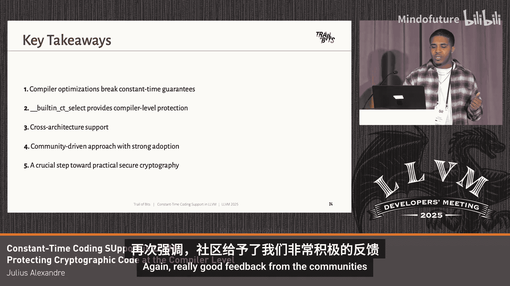

# 010：LLVM中的时序抗干扰编码支持


## 概述
在本节课中，我们将要学习编译器如何无意中破坏密码学代码的安全性，并介绍LLVM中引入的一种新内建函数（builtin intrinsic），它能为密码学操作提供跨优化级别和架构的恒定时间保证，从而抵御时序侧信道攻击。

## 编译器优化：一把双刃剑 🛡️
编译器在优化代码方面表现得极其出色，甚至可能过于出色。近年来，其优化能力持续增强，涌现出许多广为人知的特性，例如：
*   循环向量化
*   死代码消除
*   常量传播

对于大多数代码库而言，这些优化特性如同魔法。然而，对于密码学库或密码学算法而言，它们却可能成为一种负担，并从根本上破坏其安全性。

## 一个破坏性的例子 🔓
密码学家编写的代码是经过精心设计的位操作代码，期望其执行时间是恒定的（constant time）。这段代码进入LLVM编译流水线，经过中端和后端的多次优化传递后，生成了如下的x86汇编代码。

```assembly
; 示例：存在数据依赖分支的汇编
cmp    %rax, %rbx
je     .Lsecret_block    ; 条件跳转指令
```

正如你所见，这里有一条`JE`（Jump if Equal）指令，这实质上意味着代码中存在**数据依赖的分支**。这为**时序侧信道攻击**打开了大门。攻击者能够测量不同指令执行时间的微小差异。

具体来说，如果变量`i`等于秘密索引`secret_index`，程序就会发生跳转。这次跳转比不跳转需要多几个CPU周期。正因为如此，攻击者本质上能够推断或**泄露秘密信息**。

## 问题的严重性 ⚠️
虽然这看起来是一个相对简单的优化问题，但它却导致了影响数百万乃至数十亿系统的灾难性漏洞。

我们可以更进一步了解。苏黎世联邦理工学院的一个研究小组进行了一项名为“Breaking VAd”的研究。他们编译了八个密码学库，针对不同版本的LLVM和GCC编译器、不同的优化级别和不同的处理器架构进行了测试。结果显示，在超过44,000个测试配置中，存在**编译器引入的漏洞**，影响了诸如BoringSSL、OpenSSL、HHL等主流密码学库。

这从另一个角度说明，存在大规模漏洞快速影响整个生态系统的可能性。

## 现有的缓解措施及其不足 🚧
业界已有一些尝试缓解此问题的工作，但均未能成功并入LLVM主线，因此我们从未能从中受益。

你可能会想，密码学家如今是如何应对的呢？他们的解决方案并不理想：
*   使用内联汇编：这种方法**不可移植**，也**难以维护**。
*   采用位操作技巧：希望借此绕过优化，但已被证明并不可靠，有时仍会被优化折叠，导致时序侧信道漏洞。
*   最终手段：直接**禁用优化**，但这会严重**牺牲性能**。

## 解决方案：`__builtin_constant_time` 内建函数 🛠️
那么，我们该如何解决呢？我们在Chlippis的团队创建了`__builtin_constant_time`内建函数。它能在所有优化级别和多种架构上提供**恒定时间保证**。

它本质上充当了一个**优化阻断器**或**屏障**。像指令合并（instcombine）这样的优化传递会知道这个内建函数是“禁区”。

它是**规定性**的，而非描述性的。我们是在告诉编译器要做什么，而不是向它描述要做什么。

让我们回顾之前看到的那个存在漏洞的Go代码示例，但这次使用了我们的内建函数。它进入LLVM流水线，经过那些优化传递后，生成了如下的x86汇编代码。

```assembly
; 使用内建函数后生成的汇编
; ... 无数据依赖分支的恒定时间代码 ...
```

正如你所见，这里没有发生分支或数据依赖的分支。我们只是生成了与之关联的x86恒定时间代码。

我们内建函数的一大优点是：对于拥有原生条件移动（conditional move）或条件选择（conditional select）指令的架构（如x86_64, arm64），我们直接使用这些指令。对于没有此类指令的架构（如arm32），我们则生成位操作，仍然提供恒定时间保证。

## 实现架构与流水线 ⚙️
我们可以看一下我们已支持架构的流水线，例如x86_64、arm64和arm32。

1.  代码进入存储（Storage）。
2.  经过Clang前端处理。
3.  `IRBuilder`创建与我们的内建函数关联的LLVM内部表示（IR）内建函数。
4.  进入选择DAG（SelectionDAG）阶段。
5.  在**寄存器分配后**（Post-RA）或**指令选择后**（Post-isel）阶段进行扩展——**魔法就在这里发生**。

我们在所有优化之后进行Post-RA扩展，因此不必担心优化传递折叠或扰乱我们的代码，从而能够为相应架构生成所需的恒定时间代码。我们也支持Thumb/Thumb1和Thumb2模式。

i386架构遵循类似的流水线，但情况有些特殊。我们有两个阶段：一个自定义选择器（custom selector）来帮助缓解一些标志位（EFLAGS）问题以及类型合法化（type legalization）。但我们仍然在Post-RA阶段进行扩展，以生成位操作。对于arm32也是同样的道理，它没有条件移动指令，因此我们同样生成位操作来提供恒定时间保证。

## 通用后备方案 🔄
我们实现的另一个优点是，对于那些我们尚未添加原生支持、或者本身就没有原生条件移动/选择指令的架构，我们仍然能提供恒定时间保证。

这条通用流水线采用了不同的策略：我们不是在Post-RA阶段操作，而是在**选择DAG阶段**实施恒定时间保证。我们进行**DAG链式操作**，本质上在指令之间创建了**人工依赖关系**。一旦它进入LLVM流水线并被降低（lower），LLVM便不会触碰这些依赖关系，因此不会破坏它们。

## 社区反馈与协作 🤝
我们收到了社区非常积极和有力的反馈。之前有过尝试解决此问题的提案，但如前所述，没有一个被上游采纳。我们得到了来自密码学家和LLVM开发者的宝贵意见。

我们还与苏黎世联邦理工学院的研究小组合作，在他们的测试套件中使用我们的内建函数。结果显示，在所有架构上都取得了非常好的成果，同时也表明密码学家现在有了比使用各种古怪技巧更简单的方法来绕过优化问题。

## 未来展望 🚀
除了C++支持，我们正在研究将这些内建函数添加到Rust语言中。同样，由于Swift使用LLVM，它也可以使用我们的内建函数。鉴于我们已经支持WebAssembly，基于浏览器的密码学也能从中受益。

GCC和Cranelift编译器也可以考虑跟进，引入类似的恒定时间保证机制。

我们还在探索为某些算术操作（例如除法和乘法）提供此类内建函数，并为整个表达式提供恒定时间保证。

## 总结
本节课中我们一起学习了：
1.  **问题根源**：编译器激进的优化会破坏密码学库的完整性，引入时序侧信道漏洞。
2.  **解决方案**：`__builtin_constant_time`内建函数提供了编译器层面的保护，是一种“编译器优先”的安全概念。
3.  **核心优势**：它在多种架构上工作，提供可靠的恒定时间保证，得到了社区的积极反馈。
4.  **重要意义**：这是在缓解分支类时序侧信道攻击的安全领域迈出的重要一步。



