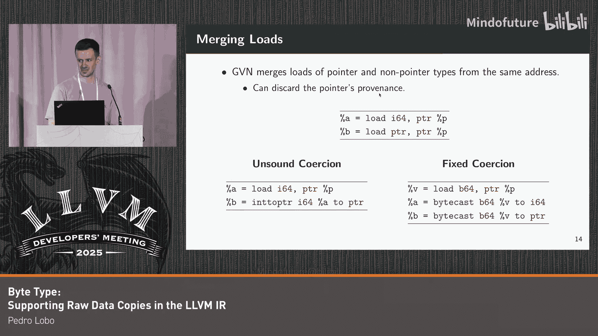

# 011：支持 LLVM-IR 中的原始数据拷贝的字节类型

## 概述

在本节课中，我们将要学习 LLVM 中间表示（IR）中的一个新概念——字节类型。我们将探讨当前 LLVM IR 在实现内存拷贝（如 `memcpy`）时遇到的问题，并了解字节类型如何通过更准确地表示原始内存值来解决这些问题，从而构建一个更正确的编译器。

---

## 当前 `memcpy` 实现的挑战

上一节我们介绍了课程的主题。本节中我们来看看当前 LLVM IR 在实现内存拷贝时面临的根本问题。

考虑 C 语言中的 `memcpy` 实现，它使用 `unsigned char` 类型按字节进行拷贝。C 标准保证，任何值都可以被拷贝到一个 `unsigned char` 数组中，并且我们可以访问和操作该值的对象表示。

在右侧的 LLVM IR 中，通过 `unsigned char` 类型的加载和存储操作被表示为通过 `i8` 整数类型的加载和存储。这导致 IR 实现无效，因为 LLVM 中的整数类型不具备 `unsigned char` 类型的相同属性。

当前 `memcpy` 实现存在两个主要问题：
1.  拷贝填充位的问题。
2.  跨指针拷贝时保留指针来源信息的问题。

接下来，我们将深入探讨每个问题。

---

## 问题一：拷贝填充位

上一节我们提到了两个核心问题。本节中我们先来详细看看第一个关于填充位的问题。

考虑一个由 `short` 和 `int` 组成的结构体。编译器可能会在两个字段之间插入两个字节的填充以满足对齐要求。

在 LLVM IR 中，这两个填充字节通过一个包含两个 8 位整数值的数组显式表示。目前，LLVM 使用 **毒值** 来表示填充位，这构成了 `memcpy` 实现的第一个问题。

目前，整数值在单个值的基础上跟踪信息。这意味着，如果我们尝试将整个结构体作为一个 `i64` 加载（这在执行加载拓宽优化时经常发生），即使 64 位中只有一位是毒值，整个结构体也会被加载为毒值。这会导致问题，因为我们会将整个结构体作为毒值拷贝到内存中。

---

## 问题二：拷贝指针与指针来源

上一节我们讨论了填充位的问题。本节中我们来看看第二个问题，它涉及指针拷贝和指针来源的概念。

首先，简要介绍指针来源的概念。在 LLVM 中，指针并非简单的整数值，它们还包含一些额外的元数据，用于证明优化的合理性。

我们可以将一个指针表示为一个对象标识符和一个偏移值。不同的内存分配会返回指向唯一对象标识符的指针。

以下是描述指针来源的核心概念：
*   **对象标识符**：每次内存分配（如 `malloc`）产生一个唯一的对象 ID。
*   **偏移值**：指针算术运算只修改偏移量，保持对象标识符不变。

**公式表示**：`指针 = <对象标识符， 偏移量>`

跟踪指针来源的主要优势是简化别名分析，从而启用其他优化。例如，编译器可以假设基于不同对象的指针不会相互别名，即使它们的底层地址可能相同。

然而，当前 `memcpy` 实现的第二个问题就在于跨指针拷贝时无法保留这种来源信息。

---

## LLVM IR 的当前内存语义

上一节我们了解了指针来源的重要性。本节中我们看看 LLVM IR 当前如何处理内存中的不同类型字节。

目前，LLVM IR 具有类型化内存，意味着我们可以区分两种字节：
1.  **指针字节**：除了值之外，还持有指针来源信息。
2.  **整数字节**：包含数值。

当前 IR 语义规定，为了避免将指针强制转换为整数并丢弃其来源信息，**通过整数类型加载指针会导致结果为毒值**。因此，当我们将指针作为整数从内存加载时，结果是毒值。

这意味着，如果我们试图在 `memcpy` 中拷贝一个指针值，整个指针字节都会被作为毒值加载。

---

## 解决方案：引入字节类型

上一节我们看到了当前语义的局限性。本节中我们介绍解决这些问题的方案：为 IR 添加一个新的**字节类型**。

这个新类型能够按原样表示原始内存值，既可以加载指针也可以加载整数内存，而不会丢弃指针的来源信息。此外，加载带有填充位的值不会污染加载结果，因为字节类型可以在位粒度上维护和表示单独的毒值位。

我们的计划是将 C/C++ 中的原始内存访问类型（包括字符类型和 C++ 的 `std::byte`）都降低为字节类型。这种新的 lowering 方式使得 `memcpy` 的 lowering 变得正确，因为我们现在可以存储和加载字节类型，而无需引入隐式强制转换。

---

## 字节类型的实现细节

上一节我们介绍了字节类型的概念。本节中我们来看看它的一些具体实现细节。

我们的提案还添加了字节常量，用于初始化全局变量。这些字节常量严格等同于其对应的整数常量。

我们还添加了一个新的 **`bytecast`** 指令，允许将字节值转换为其他基本类型。我们允许两种版本的转换：
1.  **默认版本**：执行类型擦除，这意味着它通过丢弃来源信息将可能的指针重新解释为整数。
2.  **精确版本**（通过指定 `exact` 标志）：如果字节所持有的值的类型与转换目标类型不匹配，则返回毒值。

**代码示例**：`%val = bytecast b8 %byte_val to i32` （默认，类型擦除）
**代码示例**：`%val = exact bytecast b8 %byte_val to i32` （精确，类型不匹配则返回毒值）

此外，我们还扩展了 `trunc` 和逻辑右移指令以接受字节操作数，这有利于实现存储转发优化。

---

## 字节类型的应用示例

上一节我们了解了字节类型的指令。本节中我们通过一些例子看看它的实际应用。

考虑一个简单的 C 函数，它将 `char` 值加上常数 1。目前，LLVM 将 `char` 值降低为 8 位整数，然后进行符号扩展、加法，最后根据 C 标准的要求将结果截断回 8 位整数。

使用字节类型后，`char` 值被表示为 `b8` 类型的字节值。然后通过 `bytecast` 的类型擦除变体将其转换为整数，可能将指针重新解释为其整数表示形式。之后像以前一样执行加法，然后将截断结果转换回字节，因为该函数返回一个 `char` 值。

字节类型的另一个应用是修复当前由 GVN 等优化执行的一些不安全的值强制转换。通过字节类型，我们可以加载原始内存值而无需引入隐式强制转换，然后使用 `bytecast` 指令将其转换为整数或指针，从而避免这种不安全的类型擦除。

---

## 性能评估与测试结果

上一节我们看了字节类型的应用。本节中我们来看看引入它带来的实际影响。

我们在 SPEC 2017 套件中选取了一组 20 个 C/C++ 应用程序，对解决方案进行了实现和基准测试。
*   **编译时间**：未观察到有意义的性能回归（在 -1% 到 1% 之间）。
*   **运行时间性能**：未观察到任何重大回归。
*   **峰值内存使用率**：变化范围在 -0.5% 到 0.5% 之间。
*   **二进制文件大小**：最初发现了一些回归，主要是由循环向量化成本模型的差异引起的。

我们还在 Alive2 中实现了字节类型，并在 LLVM 测试套件上运行。通过将字节类型引入 LLVM IR，我们修复了之前被报告为不安全的测试。这些测试主要由于 `memcmp`、`memcpy` 到 load-store 对的不安全 lowering，以及主要由 GVN 执行的不安全值强制转换引起。

---

## 总结

在本节课中，我们一起学习了 LLVM IR 中引入的新**字节类型**。我们探讨了当前 IR 在表示原始内存拷贝（如 `memcpy`）时遇到的问题，包括处理填充位和保留指针来源信息的困难。

字节类型的引入解决了这些长期存在的问题，使得 IR 能够在不引入隐式强制转换的情况下表示原始内存值。此外，新类型实现了各种内置函数（如 `memcpy`、`memmove`、`memcmp`）的原生实现，并用于修复现有的不安全优化。

我们的实现大约有 2600 行代码，约占 LLVM C++ 代码库的 0.05%。重要的是，字节类型没有导致任何重大的性能回归，并且是迈向更正确编译器的重要一步。