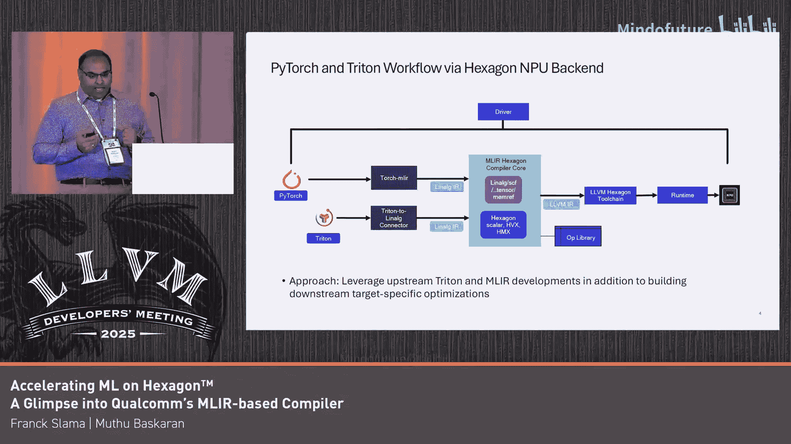

# 014：高通基于MLIR的技术一瞥

## 概述
在本节课中，我们将学习高通公司如何利用MLIR框架，为其Hexagon NPU构建一个全新的机器学习编译器。我们将了解其整体工作流程、核心优化策略，以及如何应对大模型编译的挑战。

---

## 章节 1：编译器架构与目标

上一节概述了课程内容，本节中我们来看看高通MLIR编译器的整体架构与设计目标。

我们正在构建一个基于MLIR的编译器。尽管高通内部有一些遗留的编译器，但我们正在基于从这些遗留编译器中学到的经验，以及MLIR开源社区的先进成果，构建一个全新的、基于MLIR的编译器。

我们主要关注三个领域：
1.  构建编译器核心：这意味着从我们的入口方言（`linelang`）开始，逐步将其降低到LLVM IR，然后使用后续的工具链。
2.  前端支持：我们目前专注于PyTorch和Triton。PyTorch用于完整模型编译，Triton用于内核编写。
3.  硬件目标：目标是Hexagon NPU。

到目前为止，我们已经取得了非常令人鼓舞的成果。我们拥有一个功能完整的端到端工作流，可以展示LLM（如GPT、Llama）的完整模型编译与执行。我们也成功编写并映射了一些从简单到非平凡的Triton内核到我们的硬件上。我们认为，达到未优化代码性能的70%到80%是一个良好的开端。

---

## 章节 2：硬件特性与工作流程

上一节我们介绍了编译器的架构，本节中我们来看看目标硬件Hexagon NPU的特性以及对应的编译工作流程。

Hexagon NPU是一种VLIW（超长指令字）多线程硬件。它包含标量单元、向量单元和矩阵单元。它拥有专用内存、向量寄存器和暂存器。编译器的复杂性在于需要妥善处理所有这些硬件特性，确保正确编排所有计算和数据移动，并充分利用硬件提供的优势。

以下是我们为PyTorch和Triton设计的工作流程：

我们专注的核心代码是MLIR Hexagon编译器，它接收`linelang`输入并生成LLVM IR。我们所有的优化都发生在这个代码的Pass管道中。为了实现端到端流程，我们依赖社区工具链。例如，对于PyTorch，我们使用Torch-MLIR转换器将PyTorch模型转换为`linelang`。对于Triton，我们是开发Triton共享中间层的少数团队之一，该层是Triton到`linelang`的转换器。然后，我们使用编译器代码将`linelang`降低到LLVM。

需要指出的一点是，我们的关键方法是构建自己的、针对特定硬件的优化，但同时重用并利用社区中发生的所有技术进步。我们也利用高通内部多年开发的手写Triton内核库。如果存在手写内核，我们就利用该库；如果不存在，我们就自动生成代码。因此，这是一种自动代码生成和重用现有手写库的混合模式。

---

## 章节 3：核心优化策略

上一节我们了解了工作流程，本节中我们来看看编译器实现的核心优化策略。

我们构建的许多优化都是针对特定目标的，旨在利用我们的硬件特性，并根据硬件约束来编排计算和数据移动。我们的方法是在上游可用组件的基础上进行构建。

我们进行的优化包括融合（Fusion）和分块（Tiling）。分块出于多种原因：你希望将计算分布到并行单元上；你需要确保计算的数据占用适合你的暂存器容量；分块也有助于向量化等。

数据移动对性能至关重要。你需要确保使用正确数量的缓冲区，将它们放置在正确的位置，并以能够适时预取的方式进行数据移动，确保计算过程中成本得到分摊。因此，融合、分块、向量化、数据移动等编译器中常见的优化一直是我们的重点。

此外，我们拥有用于向量矩阵计算的特殊硬件单元，它们需要特殊的数据布局。我们也利用上一讲演讲者提到的`linelang`打包（pack）和解包（unpack）操作来进行数据分块，确保数据被转换成我们硬件所需的布局。利用上游方言，但将其转化为我们硬件能够使用的方式，这就是我们的方法。

以下是一个简明的示例说明：
*   在左侧，你可以看到代码经过一定程度的融合，以最大化带入暂存器的数据。
*   融合完成后，进行分块。分块出于多种目的：分配并行性、使数据适应暂存器、确保最内层循环能够向量化。
*   同时，为创建的每个分块，将数据移入缓冲区，并在适当时机将数据移出缓冲区，放置DMA操作以实现数据预取。

所有这些都需要妥善编排和执行，以获得优化代码。在这个过程中，我们重用了许多上游方言，但也创建了自己的目标特定方言。

另一个来自Triton的示例：我们尝试获取他人编写或我们自己编写的Triton代码，这些代码对目标硬件是通用的。然后使用我们的编译器，将任何通用的Triton代码映射到硬件上，并在此过程中执行我刚才谈到的所有优化。

此外，正如之前提到的，存在许多已经编写多年的库。这个示例具体展示了，如果你有一个手动优化的库，Pass管道可以确保映射到这个手动优化的库，而不是自动生成代码。因此，拥有这种功能可以兼得自动代码生成和使用现有库的优势。

---

## 章节 4：面向大模型的优化扩展

上一节我们讨论了核心优化，本节中我们来看看为增强编译管道可扩展性，以应对当前及未来大模型的一项优化。

我们最近必须开发这项优化的起点是：对于大型语言模型，我们希望能够将模块拆分成多个部分，由操作系统独立加载。也就是说，我们不是只生成一个大的二进制文件，而是希望生成一堆二进制文件并分别加载它们。

为了实现这一点，考虑到超过99%的内存占用来自于常量参数（通常是权重、偏置等），如果我们要拆分模块，就需要将常量与代码分开降低。

我们已在MLIR层面将其实现为一个Pass。这个Pass的工作方式如下：它从一个包含代码和常量的原始MLIR模型开始，然后将其拆分成 N+1 个模块。第一个模块（模块0）只包含代码，而模块1到N只包含数据（即常量参数）。

这个MLIR Pass有点特殊，因为它不是一对一的转换。它接收一个输入模块，但产生一堆输出模块。它主要负责两件事：
1.  动态创建多个MLIR模块。
2.  修改原始代码模块，主要是将 `I.constant` 操作替换为引用其他模块中定义的常量的操作。这些常量模块将被独立编译。

接下来需要做一些工作来适当地编译和链接所有这些模块。可以想象，第一个代码模块需要链接到所有其他常量模块，因为它使用了在其他模块中定义的常量。但对于常量模块来说则更容易，它们不需要链接任何依赖项。

最终，我们能够将一个模块拆分成一堆共享对象文件，并在Hexagon DSP使用的QuRT操作系统上独立加载它们。

---

## 章节 5：总结与展望

在本节课中，我们一起学习了高通公司基于MLIR为Hexagon NPU构建机器学习编译器的技术概览。

我们正在高通构建一个面向ML模型的、基于MLIR的编译器，目标硬件是Hexagon NPU。正如Matt所说，我们既利用了开源社区的进步，也借鉴了高通内部遗留编译器的经验。

我们能够使用同一个编译器来降低PyTorch模型和Triton内核，并且已经能够为多种模型（如GPT系列、Llama系列等）生成代码。我们目前正在提高所生成代码的效率。

目前，我们仅支持一个NPU，但我们计划在未来支持多个NPU。更重要的是，我们将把所有成果开源并贡献到上游，预计在今年12月发布。欢迎大家前来与我们交流。

## 总结
本节课中我们一起学习了高通基于MLIR的Hexagon NPU编译器架构，其融合PyTorch与Triton的工作流程，针对硬件特性的核心优化策略（如融合、分块、数据移动编排），以及为支持大模型而设计的模块拆分Pass。该编译器旨在兼得自动代码生成与手写优化库的优势，并计划开源以贡献社区。