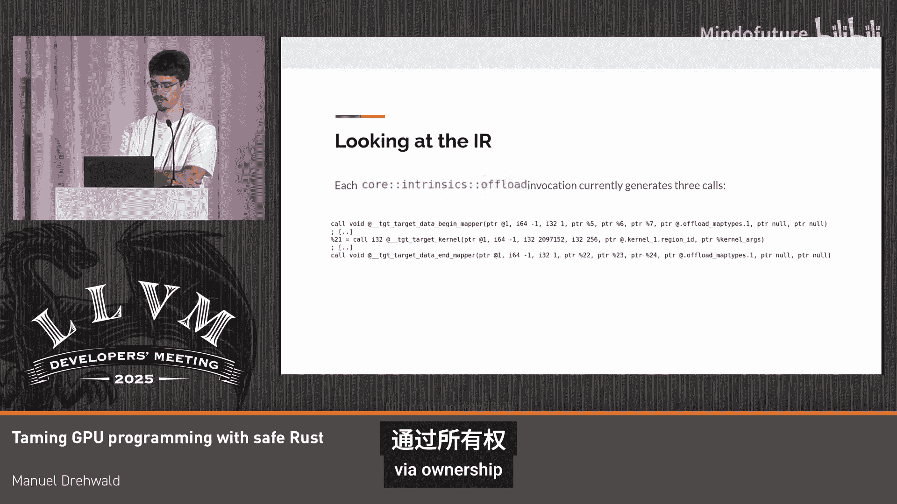

# 015：用安全的Rust驯服GPU编程


## 概述
在本教程中，我们将探讨如何利用Rust语言的安全特性来简化并增强GPU编程。我们将从Rust安全与不安全代码的核心差异出发，分析GPU编程面临的主要挑战，并介绍一个基于LLVM的解决方案——`offload`。我们将详细讲解其工作原理、当前实现状态以及如何利用Rust的所有权系统来实现安全的数据并行访问。

---

## 章节 1：Rust中的安全与不安全代码

Rust语言通过借用检查器（borrow checker）强制执行严格的内存安全规则，这能防止大量错误代码，但也限制了某些操作。另一方面，这种限制为我们向LLVM中间表示（LLVM IR）添加属性和传递信息带来了信心。

上一节我们提到了Rust的安全哲学，本节中我们来看看安全与不安全代码在LLVM IR层面的具体差异。

### 安全Rust函数
一个简单的安全Rust函数定义如下，其中包含两个指向`f64`类型的引用（`&f64`）：
```rust
fn safe_function(x: &f64, y: &f64) -> f64 {
    *x + *y
}
```
从该函数生成的LLVM IR中，可以看到参数`x`和`y`都带有`noalias`属性，以及其他一些对齐（align）和`noundef`信息。这表明编译器可以假设这两个指针不会指向重叠的内存区域。

### 不安全Rust函数
不安全Rust通过`unsafe`关键字启用额外功能，如解引用裸指针（raw pointer）。这对于底层编程或与其他语言交互非常有用，但编译器无法提供安全保障，需要开发者自行确保代码正确性。
```rust
unsafe fn unsafe_function(x: *const f64, y: *mut f64) -> f64 {
    *x + *y
}
```
从不安全函数生成的LLVM IR中，`noalias`属性消失了。这意味着使用不安全Rust可能会错过一些性能优化机会。与C/C++中的`restrict`关键字不同，Rust没有直接等效的关键字。

**核心概念**：安全Rust的引用在LLVM IR中默认带有`noalias`属性，而不安全Rust的裸指针则没有。这是影响性能的关键差异。

此外，即使是在安全Rust中，也存在一些特殊的“魔法”类型（如`UnsafeCell`），它们允许在拥有不可变引用的情况下修改底层数据，在这种情况下也可能不会生成`noalias`信息。

---

## 章节 2：GPU编程的核心挑战

从上一节对Rust内存安全模型的讨论中，我们已经可以窥见GPU编程面临的主要挑战。本节我们将通过一个具体的向量加法示例来分析这个问题。

以下是CUDA编程指南中一个经典向量加法的Rust直译版本：
```rust
// 理想化的安全Rust GPU内核（目前无法编译）
fn vector_add(a: &[f32], b: &[f32], c: &mut [f32]) {
    let idx = thread_index(); // 获取当前线程索引
    if idx < c.len() {
        c[idx] = a[idx] + b[idx];
    }
}
```
这里的问题在于Rust严格的别名规则：**你可以同时拥有多个对同一数据的不可变引用，但只要存在一个可变引用，就不能有任何其他引用（可变或不可变）**。这是为了在LLVM层面保证`noalias`。

显然，我们希望内核在多个线程上并行运行，并且需要将计算结果写入某个可变的状态（`c`）。如果尝试用普通的Rust编译器编译这段代码，或者通过类似Rayon的库进行并行化，代码将无法通过编译，因为借用检查器会阻止这种并行可变访问。

那么，我们如何才能安全地实现GPU编程呢？

---

## 章节 3：Rust GPU编程基础设施现状

在深入探讨解决方案之前，我们先了解一下Rust目前为GPU编程提供了哪些基础设施。

以下是当前Rust生态中与GPU相关的主要目标和支持状态：
*   **NVIDIA GPU**：通过`nvptx64`目标支持，目前为第2级（Tier 2）支持，意味着可以编译，但功能有限。标准库（`core`）的一部分已被移植，提供了一些内部函数，如获取线程ID和共享内存操作。
*   **AMD GPU**：通过`amdgpu`目标支持，目前为第3级（Tier 3）支持，状态更不完善。之前甚至存在编译问题，例如尝试为不支持的目标生成`f128`浮点数。
*   **`rustc`代码生成器**：Rust编译器内部有一个GPU内核ABI，它会根据编译目标（NVIDIA或AMD）选择对应的ABI，并进行基本的健全性检查，确保Rust代码适合该目标。

总的来说，当前的基础设施处于可用但功能有限的阶段。

---

## 章节 4：目标与现有方案

我们为Rust GPU编程设定的目标是：**安全、便捷、支持原生Rust类型和多后端**。具体来说：
1.  **默认安全便捷**：利用Rust的所有权信息，实现自动内存传输。
2.  **提供不安全逃生舱**：允许有经验的开发者为了性能或功能进行底层控制，例如手动管理内存传输。
3.  **支持原生Rust类型和函数**：旨在支持绝大多数Rust函数和类型在GPU端运行。
4.  **支持多厂商后端**：不局限于单一硬件平台。

基于这些目标，我们评估了现有方案：

以下是现有Rust GPU编程方案的对比：
*   **RustaCUDA**：仅支持NVIDIA，并且由于之前提到的别名问题，它迫使用户到处编写不安全代码。
*   **cuberuby等DSL方案**：大多在Rust之上实现了一个领域特定语言，绕过了编译器，因此不支持原生Rust类型。
*   **`offload`（我们的方案）**：基于LLVM，能够支持多厂商（目前支持NVIDIA和AMD）。它底层依赖于经过OpenMP和C++/Fortran测试的特性，有望在合理时间内稳定。由于基于LLVM，它可以与其他有趣的特性（如基于Enzyme和LLVM插件的自动微分）协同工作。此外，通过集成`GPU libc`项目，我们甚至可以在GPU上进行基本的I/O操作，这对调试非常有帮助。

我们选择了`offload`作为实现路径。

---

## 章节 5：`offload`方案的工作原理

现在，让我们深入探讨`offload`方案的具体实现。我们将从用户接口开始，逐步了解其编译流程。

### 用户接口
目前，我们首先实现一个普通的CPU函数。例如，一个对包含256个`f32`值的数组进行操作的函数：
```rust
fn cpu_function(data: &mut [f32; 256]) {
    for i in 0..256 {
        data[i] = data[i] * 2.0;
    }
}
```
为了在GPU上运行它，我们提供了一个核心内部函数`offload`。它首先注册函数名，以便在后续编译步骤中识别哪些函数需要为GPU目标编译，然后转发参数。
```rust
// 使用 offload 内部函数
#![feature(offload_intrinsics)]
use std::intrinsics::offload;

fn main() {
    let mut data = [0.0f32; 256];
    unsafe {
        offload::kernel_launch(cpu_function, &mut data);
    }
}
```
我们计划扩展这个接口，目前诸如线程块大小等参数是硬编码的，未来应该能方便地随参数传递。

### 编译流程
当前的编译流程分为两步，并且还依赖一些实验性功能。
以下是`offload`的编译步骤：
1.  **编译主机代码**：使用 `cargo build --target <host-target>` 或直接调用 `rustc`。
2.  **编译设备代码**：直接调用底层编译器 `rustc`，为其提供源码，并启用实验性的 `#![feature(offload_intrinsics)]` 和 `-Z unstable-options`。我们指定GPU目标（例如 `--target nvptx64-nvidia-cuda` 或 `--target amdgpu`）。
3.  **链接与打包**：目前仍需手动使用 `clang-offload-packager` 和 `clang-offload-wrapper` 进行链接和打包，我们正在努力自动化这一过程。

为了稳定此功能，我们需要消除对实验性功能的依赖，例如稳定 `build-std` 功能，或者将AMD和NVIDIA目标提升到更高级别的支持等级。

---

## 章节 6：实现安全的数据并行访问

回到最核心的安全性问题。我们之前看到，通过多个线程并行访问可变引用 `&mut` 是未定义行为。`offload` 如何解决这个问题呢？

我们有两种主要策略来修复这个特定的用例。

#### 策略一：通过裸指针和手动索引
由于裸指针没有别名保证，我们可以安全地在多个线程间共享。每个线程获取自己的线程索引，然后基于该索引对裸指针进行偏移计算，最后从偏移后的裸指针创建一个安全的引用。
```rust
// 简化示例：每个线程处理一个元素
fn vector_add_unsafe(a: *const f32, b: *const f32, c: *mut f32, len: usize) {
    let idx = thread_index();
    if idx < len {
        // 对裸指针进行偏移计算，不通过它进行读写
        let c_ptr = c.add(idx);
        // 从偏移后的指针创建唯一引用
        let c_ref = unsafe { &mut *c_ptr };
        *c_ref = unsafe { *a.add(idx) } + unsafe { *b.add(idx) };
    }
}
```
**关键点**：即使可变引用 `c_ref` 和原始裸指针 `c` 指向的数据有重叠，但只要我们不通过原始裸指针 `c` 进行读取或写入，这段代码就是安全的（sound）。我们只是用 `c` 来做地址计算。

#### 策略二：创建非重叠切片（Slice）
如果每个线程负责处理输出数组中的一个连续子区间，我们可以为每个线程创建一个独立的切片（`&mut [T]`），这些切片在编译时或运行时确保互不重叠。
```rust
// 概念性示例：将数组分块给不同线程
fn process_chunk(data: &mut [f32], chunk_id: usize, total_chunks: usize) {
    let chunk_size = data.len() / total_chunks;
    let start = chunk_id * chunk_size;
    let end = start + chunk_size;
    let my_slice = &mut data[start..end];
    // 安全地处理 my_slice
}
```
显然，这种索引逻辑可以被自动生成。Rust编译器拥有所需的所有信息：数组长度、切片大小以及线程数量。

---

## 章节 7：处理复杂索引与不安全抽象

然而，我们无法期望编译器永远能自动推断出正确的索引模式。用户可能需要更复杂的索引逻辑，而不仅仅是简单的逐元素或连续块处理。

根据对 `rust-perf` 基准测试的分析，大约三分之二的测试用例可以通过简单的标量或批量索引逻辑覆盖。对于剩下的部分，我们需要更灵活的机制。

这就是不安全抽象（unsafe abstraction）的用武之地。我们提供一个不安全的接口，让用户自己定义如何将输入数据划分为不重叠的部分，同时确保其划分逻辑在语义上是正确的（例如，确保索引是单射的，即不同的输入索引映射到不同的输出位置）。

以下是 `rust-perf` 基准测试中遇到的复杂索引模式示例：
*   **标量索引**：大多数简单情况。
*   **基于查找表的索引**：使用一个索引 `i` 从数组 `A` 中查找值 `j`，再用 `j` 作为索引访问数组 `B`。这需要确保 `A` 中的值是单射的，否则会导致数据竞争。
*   **多重嵌套循环**：目前尚未覆盖。

对于这些复杂情况，用户可以通过实现特定的 `unsafe trait` 来提供自定义的、经验证的数据划分逻辑，并将其封装在安全的接口之后共享给社区。

---

## 章节 8：未来优化方向

目前，每次 `offload` 调用都会产生三次数据移动（到设备、内核启动、回主机）。我们计划进行多项优化以提升性能。

以下是计划中的主要优化方向：
*   **按需拷贝**：利用“默认不可变”的特性，很多情况下数据无需拷贝回主机。
*   **设备端直接分配**：对于常见场景（如预先分配大量GPU内存），支持直接在设备上分配变量，避免在热路径中分配。
*   **内核间数据驻留**：如果数据在主机端未被使用，则让其保留在设备上，避免不必要的来回拷贝。这需要分析主机代码中的数据流。
*   **共享内存支持**：目前仅通过实验性方式在AMD端暴露，需要与社区合作使其稳定可用，并探索如何提供尽可能安全的接口。
*   **内核融合**：将多个连续的内核调用融合，减少启动开销和数据传输。

此外，为了支持现有的生态系统（许多线性代数库在底层使用不安全代码），我们正在探索一种方案：通过检查这些库实现的 `Copy`/`Clone` trait 的LLVM IR，并将其中的内存拷贝操作替换为设备与主机间的拷贝。这在大多数情况下应该是安全的。

---

## 章节 9：总结与问答摘要

本节课中我们一起学习了如何利用安全的Rust来进行GPU编程。

### 内容总结
1.  **安全与不安全Rust**：安全Rust通过借用检查器和LLVM IR中的`noalias`属性提供内存安全保证和优化潜力；不安全Rust则提供更多控制但牺牲了部分编译器保障。
2.  **GPU编程挑战**：Rust严格的别名规则与GPU数据并行编程中需要多线程写入同一数组的需求存在根本冲突。
3.  **`offload`方案**：我们介绍了一个基于LLVM的`offload`方案，它支持多后端、原生Rust类型，并旨在提供安全便捷的默认体验。
4.  **安全并行策略**：通过使用裸指针进行地址计算，然后创建唯一的引用或切片，可以实现安全的数据并行访问。编译器可以自动处理简单情况，复杂情况则通过不安全抽象由用户提供验证过的划分逻辑。
5.  **未来工作**：重点在于性能优化（如减少数据移动、支持共享内存、内核融合）和生态集成（支持现有不安全库）。



### 问答摘要
*   **关于共享内存的安全性**：目前认为很难提供完全安全的共享内存接口，因为无法防止用户引入数据竞争。可能最终会将其标记为 `unsafe`。技术上，可以通过OpenMP类似的接口（如额外的 `dyn_ptr` 参数）来提供支持。
*   **关于动态索引的支持**：对于运行时决定的、非单射的索引模式，无法保证安全，必须通过不安全接口。在某些情况下可以加入运行时检查。
*   **关于内核间数据驻留**：基本思路是跳过中间的数据回传操作，只在所有`offload`调用开始和结束时进行整体数据传输。这需要分析数据在主机代码中是否被使用。
*   **关于线程数据所有权的推理**：核心是**通过裸指针计算偏移，但不通过该裸指针进行读写**。然后从偏移后的地址创建引用，这个引用是唯一的。只要遵守“不通过原始共享裸指针进行访问”的规则，即使引用与裸指针指向的区域重叠，也是安全的。

---

通过本教程，我们希望为你展示了在Rust中实现安全、高效的GPU编程不仅是可能的，而且能充分利用Rust语言本身的优势来构建更可靠的系统。