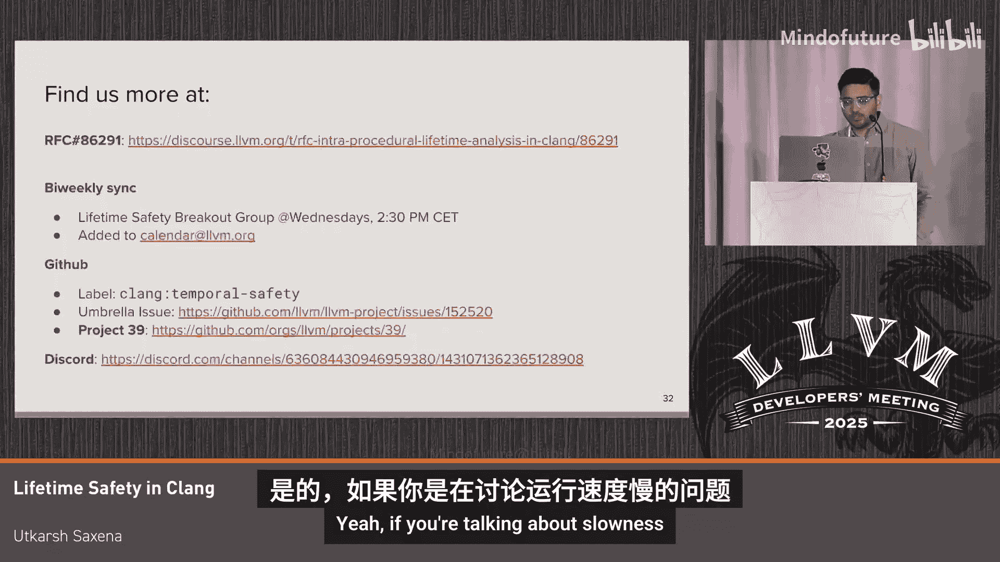

# 016：Clang中的生命周期安全性分析

## 概述
在本教程中，我们将学习Clang中引入的生命周期安全性分析。该分析旨在编译时发现C++程序中的“释放后使用”等时序内存安全问题。我们将了解其核心概念、工作原理以及如何帮助开发者编写更安全的代码。

---

## 问题背景：时序内存安全

上一节我们介绍了本教程的主题，本节中我们来看看该分析旨在解决的核心问题。

时序内存安全问题是指：访问已被释放或回收的内存是一种未定义行为。这通常表现为悬垂指针，并可能导致程序崩溃、数据损坏甚至安全漏洞。

其影响不容小觑。例如，在Chromium项目中，超过三分之一的关键安全漏洞是由“释放后使用”这类经典的时序安全问题导致的。

让我们快速看一个“释放后使用”问题的例子：
1.  程序在某个时刻创建了一块内存（可能在栈、堆或由栈对象管理的堆上）。
2.  在该对象存活期间，程序获取了指向它的指针（别名）并将其存储在某个变量中。
3.  在之后的某个时间点，该内存被释放（例如，对象离开作用域）。
4.  在此之后，任何通过之前持有的指针访问该内存的行为都属于“释放后使用”，是未定义行为。

## 分析概述

上一节我们了解了问题的严重性，本节中我们来看看解决方案的总体思路。

生命周期安全性分析试图在编译时发现这些时序内存安全问题。这是一种基于别名的分析，属于“左移”方法，旨在在开发早期识别问题。

该分析的目标是：
*   提出一个直观的生命周期模型。
*   通过渐进式类型等机制，实现增量式的时序内存安全保障。

## 核心分析维度

上一节我们介绍了分析的目标，本节中我们将深入探讨程序员如何推理“释放后使用”问题，这引出了分析的三个关键维度。

考虑之前的例子，程序员通常会关注以下几点：
1.  对象在何时被销毁？（验证操作）
2.  有哪些指针指向了刚被销毁的对象？（别名分析）
3.  这个指针（悬垂指针）的值后续是否被使用？（活性分析）

以下是每个维度的详细说明：

### 1. 无效化操作
我们首先关心的是对象何时被销毁。更广泛地说，我们关心的是验证哪些操作会使内存失效。

以下是无效化操作的例子：
*   普通的`delete`操作。
*   管理堆内存的栈对象在其作用域结束时调用的析构函数。
*   在代码中手动调用的析构函数（通常很糟糕）。
*   隐藏在抽象背后的操作，例如函数调用：
    *   向`vector`执行`push_back`操作会使之前持有的迭代器失效。
    *   `clear`、`insert`等容器操作同样会导致失效。
    *   这不是容器操作独有的特性，而是任何C++对象固有的属性。

### 2. 别名分析
其次，我们关心别名。我们想知道一个存储位置有哪些别名。

在示例中，`p = &x;`这行代码负责创建指向`x`所支持存储的别名，并将其存入`p`。因此，我们说`p`是`x`的别名。

别名分析需要考虑控制流和任意赋值。例如：
*   当我们将指向`x`的指针`q`赋值给新指针`p`时，`p`和`q`都成为`x`的别名。
*   即使引入任意复杂的控制流（如循环、函数调用、条件语句），我们仍然需要回答“`x`有哪些别名？”这个问题。

### 3. 活性分析
最后一个维度是：该指针持有的值是否在后续被实际使用？这可以通过活性分析来回答。

活性本质上是用于判断变量持有的值在程序后续是否会被读取的预计算。它也是流敏感的。

例如：
*   如果有两个赋值创建了别名，第二个赋值`p = &y;`会覆盖`p`之前的值（即指向`x`的引用）。我们说它“杀死”了旧值，旧值不再存活。
*   在后续有使用`p`的情况下，`p`的新值（指向`y`）是存活的，而旧值（指向`x`）则不是。

## 生命周期模型与术语

上一节我们明确了分析的三个维度，本节中我们将定义一个生命周期模型和相关术语来回答这些问题。

该模型灵感来源于Rust的Polonius借用检查模型，但根据C++的需求进行了调整。它旨在拥有类似Rust的生命周期语义，并可能在未来支持类似Rust的语法。

以下是核心概念：

### 1. 借用
借用表示从内存位置借用的行为。它由“借用创建于何处”和“借用了什么内存”来定义。

例如，当你将整数的地址赋值给指针时：`p = &x;`，我们就在右侧创建了一个借用`L1`，它借用了路径`x`（`x`可以是任何存储位置，如栈变量、结构体字段等）。

### 2. 借用过期
借用会过期。当存储位置失效时，指向它的所有借用都会过期。这代表了之前我们关心的“无效化”操作。

例如：
*   `p = &x;` 创建了指向`x`的借用`L1`。
*   `q = &x;` 创建了另一个借用`L2`（即使指向同一存储，但借用地点不同，故为不同借用）。
*   当`x`离开作用域被析构时，`L1`和`L2`同时过期。

### 3. 起源
起源是与指针类类型关联的符号化标识符。例如，`int* p`具有一个起源属性（如`origin01`），它代表了指针的别名部分。

具体来说，一个起源是一个实体可以持有的**借用集合**。可以将其视为指针可能引用的所有数据来源。

例如：
*   初始时，`int* p`有一个起源`O1`，不包含任何借用。
*   当处理`p = &x;`时，创建的借用`L1`成为起源`O1`的一部分。

起源可以包含流敏感信息，并遵循子类型规则进行流动。例如：
*   `int* p, *q;` 有两个不同的起源`O1`和`O2`。
*   当执行`q = p;`时，右侧起源`O1`中的借用`L1`会流入左侧起源`O2`。此时，`O1`和`O2`都包含借用`L1`。

### 4. 起源的活性
如果`p`先借用自`x`，然后`p`又借用自`y`，新的赋值会覆盖旧的借用。后续的读取使得最新值存活，而旧的借用被“杀死”，不再存活。

## 定义生命周期违规

上一节我们介绍了模型的基础构件，本节中我们将它们组合起来，定义什么是生命周期违规。

在程序点`P`，如果有一个借用`L`在点`B`过期，并且一个起源包含该借用`L`，同时该起源在点`P`是存活的，那么我们就说发生了生命周期违规。

更具体地说，生命周期策略是：**一个存活的起源绝不能包含一个已过期的借用**。

在示例中：
*   在作用域结束时，借用`L1`过期。
*   起源`O1`包含了借用`L1`。
*   起源`O1`是存活的。
因此，这构成了一次生命周期违规。

## 实现与诊断

该分析的简易版本已在LLVM上游实现，可通过某些标志启用。它能够提供类似Rust的三点诊断：
1.  **借用点**：识别有问题的借用是在何处创建的。
2.  **无效化点**：识别该借用是在何处失效的。
3.  **使用点**：指出是哪个使用使得该起源保持存活。

## 处理抽象（函数调用）

上一节我们讨论了单函数内的分析，本节中我们来看看如何处理函数调用带来的复杂性。

函数调用可能引入新的别名，也可能使其通过参数接收的存储失效。

一种方法是过程间分析，但这扩展性不佳，且函数定义并非在编译期始终可用（可能直到链接时）。

因此，我们需要一种组合性好的分析，能够独立分析每个函数。这可以通过让函数表达其生命周期契约、别名契约和无效化契约来实现。Clang注解和API契约等语言扩展已用于此目的。

### 1. 函数与别名
函数可以通过参数接收引用并返回其别名。目前，可以使用`clang::lifetimebound`等一系列注解来表达有限的别名契约，但尚无法表达所有复杂的别名关系。

### 2. 函数与无效化
函数调用可能引入无效化操作，常见的例子是容器的`push_back`、`clear`、`insert`等。目前尚无标准方法告知函数会无效化哪些内容，但未来可能引入类似`clang::invalidates`的注解。

**注意**：此分析功能仍在开发中，请关注LLVM 20.6及以后的更新。

## 分析的范围与限制

在结束之前，需要澄清此分析**不是**什么：
*   它**不是**C++的严格时序内存安全解决方案，仍然可能写出“释放后使用”的bug。
*   它**是**一种机会主义的缺陷发现方法，旨在实现增量式的时序内存安全。
*   它**不是**C++提案`N`的实现。

## 总结

在本教程中，我们一起学习了Clang中的生命周期安全性分析。我们从时序内存安全问题出发，探讨了该分析旨在解决的三个核心维度：无效化操作、别名分析和活性分析。接着，我们介绍了基于借用、起源和活性概念的生命周期模型，并定义了生命周期违规的条件。我们还了解了该分析如何通过诊断指出问题，以及如何处理函数调用带来的挑战。最后，我们明确了该分析的定位和限制。这项分析是迈向更安全C++代码的积极一步，目前仍在积极开发中。

---
**相关资源**：
*   RFC: H6291
*   双周会议（周三），已加入LLVM日历
*   GitHub项目与标签
*   Discord频道（用于讨论生命周期安全）