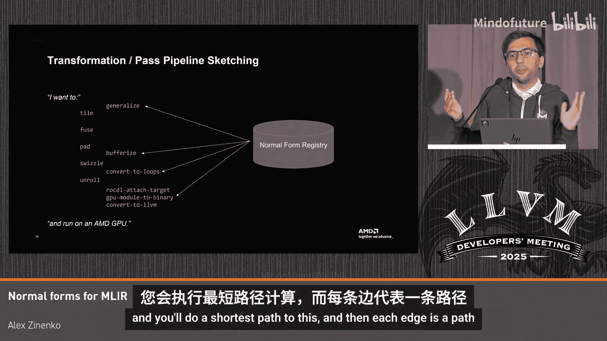

# 019：MLIR 的正规形式 🧩

## 概述
在本节课中，我们将要学习 MLIR 中“正规形式”的概念。我们将探讨为什么需要一个比“规范化”更灵活、更明确的机制来描述中间表示的各种状态，以及如何通过定义和验证“正规形式”来优化编译器流程、减少不必要的转换并明确传递前提条件。

---

## 问题引入：漫长的编译时间

上一节我们介绍了课程背景，本节中我们来看看一个具体问题。

我在 AMD 担任编译器工程师，负责机器学习编译器相关工作。我曾参与一个大型海洋模拟项目，该项目对气候研究等领域很有用。

为了让模拟代码在硬件上高效运行，我们决定使用编译器。我们有一个项目，它使用 Enzyme 和基于 MLIR 的 Poly 等项目来编译一个庞大的海洋模型，并在超级计算机上运行。

当我尝试编译这个大型代码库时，遇到了问题。代码库规模很大，有数百万行。我启动编译后，等待了很长时间。在等待了两个半小时后，我终止了任务，编译仍未完成。

我开始分析性能。MLIR 有一个 `-mlir-timing` 选项，可以显示每个过程花费的时间。分析结果显示，在长达约四小时的编译过程中，**88% 的时间（约三小时）都花在了规范化操作上**。

---

## 什么是规范化？

为了理解问题根源，我需要弄清楚“规范化”到底是什么。

我查阅了各种资料，包括 AI 助手、维基百科和相关博客文章。它们给出的定义基本一致：**规范化是一种将程序转换到“规范形式”的变换**。

那么，下一个问题是：**MLIR 的“规范形式”是什么？**

我查阅了 MLIR 官方文档。文档提到，MLIR 有一个单一的规范化过程，它会迭代应用所有已注册操作的规范化模式。这是一个“尽力而为”的过程，并不保证整个 IR 都能达到某种规范形式。

文档依然没有明确定义这个“规范形式”具体是什么。实际上，MLIR 社区内部对于什么应该被视为“规范”也存在很多争论。

关键在于，**MLIR 本身并没有一个固定的、全局的“规范形式”**。MLIR 支持多种方言、操作和属性，谈论一个统一的规范形式意义不大。

---

## 从“规范化”到“正规形式”

上一节我们看到了“规范形式”概念的模糊性，本节中我们来看看一个更实用的思路。

我们需要认识到，不同的编译器优化过程可能需要 IR 处于不同的、特定的状态。例如，在循环优化中：
*   有些优化（如公共子表达式消除）希望**循环不变式代码被提升到循环外**。
*   而另一些优化（例如为 GPU 等加速器进行 outlining）则希望**循环不变式代码保留在循环内**。

在 LLVM 中，人们甚至需要专门编写 Pass 来“撤销”循环不变代码外提。

因此，我们需要的不是单一的“规范形式”，而是多种**正规形式**。一个程序可以处于形式 A、形式 B，或者两者都不是。编译器变换应该能够声明其所需的前提形式，并能将 IR 从一种形式转换到另一种形式。

我的建议很简单：**让我们开始为模块标注其所处的正规形式**。

例如，我们可以给模块添加一个属性，声明“本模块中所有循环不变式代码均已提升”。MLIR 设计精良，我们可以为这种属性附加一个验证器。这样，我们就获得了一种额外的验证机制，它能保证 IR 满足某些对特定变换有用的不变式，而这些不变式并非 IR 的根本属性。

---

## 正规形式的定义与价值

以下是正规形式的核心定义：

**正规形式是一组关于 IR 组件的附加不变式集合。**

它类似于数据库中的“范式”，但在这里特指编译器 IR 的约束条件。这些约束之所以重要，是因为它们可以为我们对 IR 所做的假设命名。

我们并非首创。LLVM IR 中已有类似概念，例如：
*   **循环简化形式**：为运行循环 Pass 而准备的标准形式。
*   **旋转循环形式**：便于进行循环不变代码外提等形式。
*   **循环闭 SSA 形式**：确保 SSA 值的生命周期限定在循环内，便于内存分析和并行化。

正规形式可以作为变换的**前置和后置条件**。一个变换可以声明：“我要求输入 IR 处于‘循环不变式已提升’形式”。如果该形式的验证器已通过，变换就无需再为此做任何检查。

---

## 实例：Linalg 方言的正规形式

上一节我们了解了正规形式的抽象概念，本节中我们通过一个具体方言来看看它的实际应用。

以 **Linalg** 方言为例，它用于表示线性代数运算（如矩阵乘法、张量收缩）。

Linalg 运算有多种表现形式，构成了一个正规形式的演进链条：
1.  **命名形式**：例如 `linalg.matmul`，表示一个具体的矩阵乘法操作。
2.  **泛化形式**：通过 `linalg.generic` 操作表示，它像一个通用的多维循环，描述了数据访问和计算模式。
3.  **分块形式**：在循环内嵌套 `linalg.generic` 操作，便于进行分块优化。
4.  **融合形式**：对分块后的操作进行融合，结构上仍保持“循环+泛化操作”的形式，因此可以继续应用同类变换。
5.  **循环形式**：最终将 `linalg.generic` 降级为基本的循环和内存操作，以便进一步降低到低级 IR。

在一个实际的 Pass 管道中，为了在这些形式间切换并满足每个 Pass 的前置条件，我们不得不频繁地插入规范化 Pass，形如：`generalize` -> `canonicalize` -> `tile` -> `canonicalize` -> `fuse` -> `canonicalize` ...

如果我们将每个变换（Pass 或操作）都**赋予类型**，声明其输入和输出的正规形式，那么我们就可以构建一个清晰的变换图：
*   `generalize` 变换：**命名形式** -> **泛化形式**
*   `tile` 变换：**泛化形式** -> **分块形式**
*   `fuse` 变换：**分块形式** -> **分块形式**（同构变换）

这样，我们就不再需要那些防御性的、频繁的规范化步骤了。

---

## 构建正规形式注册表

我们可以设想一个**正规形式注册表**，类似于方言注册表或接口注册表。

这个注册表可以回答以下问题：
*   **查询路径**：“我的 IR 处于形式 A，如何到达形式 C？” 注册表可以给出需要应用的变换序列（例如，先 `generalize`，再 `tile`）。
*   **诊断状态**：“这个 IR 目前满足哪些正规形式？” 一个 IR 可以同时满足多个不相关的正规形式（例如，既满足某个 Linalg 形式，又满足某个循环优化形式）。

这极大地简化了非平凡的 Pass 管道管理。用户只需要声明目标（例如，“我要分块、融合、填充、然后运行在 GPU 上”），系统就可以根据注册表自动推导出需要插入的必要形式转换步骤，生成完整的、正确的 Pass 管道。

---

## 正规形式带来的好处

以下是采用正规形式方法的主要优势：

*   **明确性与可验证性**：正规形式是附加的、可验证的不变式集合，不再是“尽力而为”的模糊状态。
*   **承认现有实践**：我们实际上已经有多个“规范化器”，只是没有给它们正式命名。正规形式将其具体化。
*   **自动化前提/后置条件**：使得 Pass 的编写和管道组合更安全，可以避免 Pass 间的无效规范化。
*   **减少争论**：社区无需再争论某个模式是否属于“全局规范化”。每个人都可以定义自己的正规形式（例如，“Alex 正规形式”、“Matthias 正规形式”），并在需要时使用。
*   **解耦方言依赖**：目前，方言之间会因为规范化模式产生操作而相互依赖。将特定形式转换放入独立的“正规形式转换”中，可以减少这种人为的编译时依赖。

---

## 总结

本节课中我们一起学习了 MLIR 中“正规形式”的概念。

我们首先从一个耗时的编译实例出发，指出了单一“规范化”概念的局限性。然后，我们提出了“正规形式”作为一种更灵活的替代方案，它是一组可验证的附加 IR 不变式。我们通过 Linalg 方言的例子展示了正规形式如何清晰地描述编译降级过程，并探讨了通过正规形式注册表来自动化管理 Pass 管道、明确变换前提条件的愿景。

总而言之，正规形式旨在将 MLIR 中隐含的、零散的“最佳状态”实践，转化为显式的、可命名、可验证和可组合的实体，从而提升编译器的可靠性、性能与开发体验。