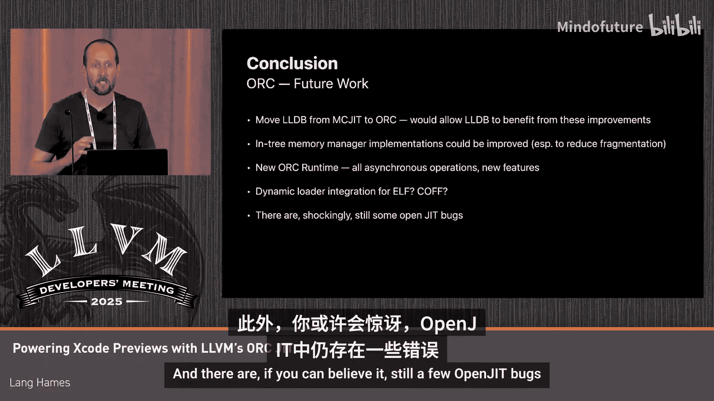

# 020：为Xcode预览提供动力

## 概述

在本节课中，我们将学习Apple如何利用LLVM的JIT（即时编译）技术来驱动Xcode的预览功能。我们将探讨如何将原本为静态链接设计的程序动态加载并运行，以支持Swift UI代码的实时预览，并深入了解为实现这一目标而对LLVM JIT系统所做的各项改进。

## Xcode预览功能简介

Xcode是Apple的集成开发环境。Xcode预览是一项功能，当你的应用程序包含Swift UI代码时，你可以使用预览宏来获取UI的实时预览。其核心理念是，在你编辑UI代码时，能快速获得代码更改对实际运行UI的反馈。这个预览是真正运行的程序，而非解释执行。我们运行你的程序，并将UI反射到Xcode的画布上，因此你可以与之交互，就像使用你的应用一样。

## 从双重构建到JIT方案

最初，我们通过双重构建来实现此功能。除了常规的调试构建，还会有一个独立的预览构建，其中添加了一层间接层以实现快速函数替换。这种方式效果良好，意味着编辑代码时可以快速交换函数以显示新UI，但也意味着我们需要构建两次。

从去年开始，我们改用基于LLVM JIT的方案。在新方案中，我们从常规调试构建中加载目标文件，并使用LLVM JIT链接器API来添加快速函数更新所需的间接层。这消除了第二次构建，但也意味着LLVM JIT必须能够加载和运行动态链接模式下原本需要静态链接和运行的任何应用程序。

## 面临的挑战

这些程序可能非常庞大，包含数千个文件、数百兆字节的代码和数据，以及数十万个重定位项。在macOS上，程序通常被拆分为多个框架和库，因此UI代码可能并不全在主可执行文件中。这些程序也可能非常复杂，混合语言编程非常普遍，例如Swift、Objective-C、C/C++等。项目还可能包含预编译的静态归档文件，需要能够链接。我们可能需要启用多个架构切片，并处理改变执行环境行为的非标准授权，如macOS强化运行时。此外，还需要支持有趣的链接器选项和手写或机器生成的汇编代码。

## 整体架构设计

我们使用的JIT架构设置如下：
*   我们始终利用ORC（LLVM的JIT库）在跨进程模式下运行的能力。这包括一个包含预览JIT的控制进程和一个独立的执行进程，JIT编译的用户应用程序将在其中运行。这可以避免JIT及其依赖库的细节污染执行进程。
*   我们仅从调试构建的产物目录中加载目标文件，在预览中没有惰性加载。
*   我们在JIT链接器中安装了一个覆盖插件，允许我们在目标文件流经JIT时修改它们，以添加快速函数更新所需的间接层。
*   我们使用自定义内存管理器将代码和数据从控制进程传输到执行进程。
*   在执行进程中，我们使用一种新颖的动态加载器集成技术，使JIT编译的代码表现得像预编译的一样。
*   为了处理大型应用程序，我们始终利用ORC并发生成符号的能力，即并发链接多个目标文件。

接下来，我们将更详细地探讨这些部分。

## 覆盖插件：实现快速函数替换

覆盖插件相对独立。我们能够实现它，是因为JIT链接器API在设计上提供了处理流经JIT的机器代码的极大灵活性。特别是，JIT链接器API可以重命名和添加代码与数据，因此添加间接层很容易。

以下是其工作原理：
1.  首次看到一个函数时，我们将其重命名，确保其名称不与程序中的任何其他符号冲突。
2.  然后，我们引入一个使用原始名称的存根，并将存根指针指向原始实现。
3.  所有引用该函数的代码都将绑定到这个存根。
4.  在运行时，我们可以根据需要重定向这个存根。例如，要替换函数体，我们可以加载第二个定义（同样会重命名以避免冲突），然后只需更新存根指针。

何时进行函数替换是安全的，这个决定超出了预览JIT的范围，我们将其交给客户端处理。客户端有办法知道在程序仍在运行时是否可以动态替换函数，或者是否需要重启进程。

## 内存管理器：支持代码签名

我们为此项目对内存管理器所做的更改，主要是为JIT编译的代码应用代码签名。我们这样做并非出于安全考虑，而是在IDE环境中工作，其核心理念是允许执行任意代码。我们进行签名的原因是为了不影响启用了macOS强化运行时的应用程序的行为。

强化运行时是一项可选的授权，它声明进程不应加载未签名的代码。默认情况下，它会禁用JIT，意味着你无法加载没有有效代码签名的库。这对于防止部署应用时的代码注入攻击非常有效，但当我们想要“注入”整个应用程序时，就带来了挑战。

我们通过引入一种与强化运行时兼容的自定义签名类型来解决这个问题，而不是禁用它或寻找变通方法。这种签名类型仅适用于可以附加调试器的程序，因此不会削弱强化运行时的安全性。这意味着当我们为JIT预览加载代码时，我们加载的是有效签名的代码，强化运行时对此感到满意。

JIT链接器API足够灵活，可以轻松表示这一点。我们的内存管理器API允许我们拆分链接后的代码和数据。链接后的数据通过共享内存发送，而为附加代码签名，我们必须创建文件，因为在macOS上，签名附加在文件上。因此，每个链接后的代码段都被写入磁盘作为一个文件，签名后，再映射到执行进程的指定地址。

这部分内容非常macOS特定，但我分享这个故事是因为，如果你曾对使用LLVM JIT感兴趣，但又担心在受限环境中JIT API可能无法工作，那么通常可以通过自定义内存管理接口来处理这类问题，从而使JIT正常工作。

## 动态加载器集成：核心创新

这个项目中最有趣的部分是动态加载器集成。这源于一个看似边缘情况的问题：如果符号`foo`在JIT编译的代码中，`dlsym(foo)`应该返回什么？

对于那些不了解的人，`dlsym`是一个API，允许你通过名称查找C符号。如果你调用`dlsym`并传入字符串`"main"`，你期望它返回指向你的`main`函数的指针。

答案是，`dlsym(foo)`应该返回`foo`的地址。如果它是预编译的，这就是它应该返回的结果，我们不希望这种行为改变。问题在于，这个对`dlsym`的调用可能本身就在预编译的代码中，这超出了JIT的控制范围。在macOS上，`dlsym`由系统动态加载器实现，因此我们需要系统动态加载器的帮助。

我们解决这个问题的方法是，教导系统动态加载器将JIT编译的代码视为预编译的代码。你可以将其视为一个伪动态库，其行为由API和回调提供，而不是由动态加载器从磁盘上读取已知格式的文件，并且在这种情况下，回调将由ORC JIT编译器实现。

这样做的好处是，像`dlopen`和`dlsym`这样的POSIX API得到了原生支持。但更有趣的是，在这个世界中，预编译的代码可以与JIT编译的代码绑定，这意味着你可以选择性地仅JIT编译单个动态库。

为了理解这对预览用例的优势，考虑一个包含多个库的应用程序，我们想要编辑位于依赖树底部的`LibUI`库中的UI代码。在旧世界中，预编译代码无法看到JIT编译的代码，我们将不得不JIT编译从根库到目标库的每一个库，这不是因为我们真的想JIT编译它们，而是因为这是它们绑定到下层符号的唯一方式。在这个新世界中，JIT编译的代码对预编译代码可见，我们可以只JIT编译我们想要的部分。性能上的机会在于，你JIT编译正在变化的部分，预编译其余部分，从而获得两全其美的效果。我们永远无法在加载不变的预链接代码方面击败系统动态加载器，但我们可以直接重用它的成果，并将JIT的注意力集中在正在变化的代码上。

如果你想知道，当磁盘上可能没有`LibMyUI`时，如何静态链接`LibBar`库，这正是LLVM TAPI（文本API）库解决的问题。它们允许你仅使用一个简单的表（本质上代表一个动态库）来进行链接，而无需拥有完整的已编译动态库。

## 伪动态库的操作与实现

伪动态库的操作可以归结为几个核心步骤：
1.  **创建**：对应`register` API。它接受一组回调、一个地址范围和一个“可加载路径”谓词。你可以将其视为向系统动态加载器引入了一个虚拟文件系统。
2.  **打开**：当系统动态加载器遇到一个它可能想要打开的路径时，如果该路径在磁盘上没有文件，它可以询问已注册的伪库：“你在这个路径可加载吗？”如果其中一个回答“是”，动态加载器就可以说：“好的，运行你的初始化器，你被打开了。”
3.  **查找符号**：如果动态加载器需要在伪动态库中查找任何符号，它可以调用查找回调，该回调将转发到我们实现中的`orc::lookup`。
4.  **关闭**：运行反初始化器。
5.  **注销**：相当于删除，意味着你不能再打开这个伪动态库。

在ORC运行时中实现这些功能变得简单，因为我们在JIT运行时中已经模拟了这些操作。对于这个项目，我们只需要添加粘合代码来对齐接口，修改内部以添加一些缓存以提高性能，并适应DYLD的锁定方案。我们还添加了自动注册和注销功能，这样当你在控制进程中创建JIT编译的动态库时，相应的伪动态库会立即在执行进程中变为可打开状态。

## 绑定过程示例

让我们看一个预编译代码如何绑定到JIT编译代码的示例。假设我们正在打开一个名为`LibFoo`的预编译库，它包含一个需要绑定的外部引用符号`bar`。`bar`将定义在一个名为`LibBar`的伪动态库中，但还没有人查找过它，因此它在进程中还没有地址。`bar`的定义位于构建产物目录中的一个目标文件中，它已注册到预览JIT，但尚未为其完成任何其他工作。

接下来会发生的是：
1.  系统动态加载器会遇到对`bar`的引用，并说：“我需要找到这个符号的地址。”
2.  它将调用伪动态库上的查找回调，该回调由JIT运行时实现。
3.  JIT运行时将跨进程调用预览JIT，说：“我需要这个符号的地址。”
4.  像在ORC JIT中一样，符号查找将触发具体化。因此，我们将把`bar`的定义链接到我们的执行进程中。
5.  此时，JIT知道了它的地址，可以将其返回给ORC运行时，ORC运行时再返回给动态加载器，动态加载器就可以绑定地址。
6.  现在，我们可以完成预编译代码的打开，并且预编译代码已经绑定到这个JIT编译的定义上。

## 性能优化与改进

在性能方面，我们首先启用了并发链接。这之所以容易，是因为我们从2018年就开始致力于并发支持。尽管如此，面对我们处理的代码规模，我们还是发现并修复了一些竞态条件，特别是在macOS平台上。

我们还必须为此引入一个自定义调度器。当JIT发现需要做一些工作时，它不会只在当前线程上运行，而是会将工作交给ORC调度器，这是一个你可以自定义的类。在这个项目中，我们引入了一个具有固定数量链接线程，但无限数量“请求处理”线程的调度器。这是因为ORC和ORC运行时之间的许多请求仍然被表述为阻塞操作，固定的线程池可能会被饿死。我们不喜欢这样，认为这是一个bug，并将动态线程池任务调度器视为一种临时方案。但到目前为止，这是一个经过实战检验的方案。

我们还为此项目改进了许多实用函数。例如，`LinkGraph`的`splitBlock`操作在链接器中拆分内容。对于重复应用，它原本是O(N²)复杂度，以前从未成为问题，但面对我们处理的代码规模，它突然变得耗时。我们添加了缓存，使其变为O(N log N)，现在不再是问题。LLVM JIT中的许多其他函数也得到了同样的优化处理。

最大的性能变化发生在一个名为“等待图”的数据结构中。这是允许ORC并发的数据结构，它通过跟踪JIT中每个符号当前正在等待哪些符号来确保查找安全。我们能够通过合并LLVM JIT中的两个旧API——`addDependencies`和`emit`——来使其变为二分图。现在，你只在发出符号时告诉JIT它们的依赖关系，并且你可以划分该图，说有一组已发出的节点正在等待一组未发出的节点。这种二分图在实践中比旧的任意图更容易处理。

我们还开始对这些节点应用合并。因此，具有相同依赖关系的节点现在被合并为一个更大的节点。这在实践中非常有帮助，因为对于大型程序，许多符号最终会堆积起来，使用一些我们仍在尝试通过JIT推送的通用API。通过合并这些节点，我们极大地缩小了图的规模。

等待图已被提升为独立的类型，它过去是嵌入在JIT动态库中的。好消息是，它现在终于可以进行单元和性能测试了。此外，节点标签过去是引用计数类型，但我们能够证明，在这个图中的任何东西在别处的符号表中都有相应的引用，因此这些引用计数永远不会降到零，它们是冗余的工作。我们能够采用新的非拥有型`SymbolStringPtr`类型作为图中节点的标签，从而也消除了引用计数。

总的来说，所有这些改进使得我们一些极端情况下的性能提升了100倍到10000倍。

## 结果与未来展望

就结果而言，目前只有粗略的数据。大约87%的预览在300毫秒内运行，另外约10%在1秒内运行，约1.5%在2秒内运行，剩余的0.7%运行时间超过2秒。我们对这个初步结果感到满意，但必须谨慎解读这些数字，因为存在一些偏差。例如，新项目用户通常会落入300毫秒的区间，这会抬高该区间的比例；而对于确实存在性能问题、预览速度很慢的项目，用户可能会停止使用该功能，这又会人为地缩小最慢类别的比例。我们认为目前的性能是合理的，但知道仍然存在一些极端情况，性能优化工作将继续进行。

## 处理各种特殊情况

最后，我想谈谈为了使这个项目正常工作而需要处理的各种特殊情况：
*   **命名归档**：系统链接器对文件扩展名很宽松，只要路径解析为可链接的内容，它就会链接。为了匹配这一点，我们添加了一个名为`orc::loadLinkableFile`的便利函数，它可以处理目标文件、归档文件、通用二进制文件等。
*   **`ld -r`合并的目标文件**：这些文件可能包含重复的符号名，而常规编译器输出的目标文件则不会。Swift包管理器会这样做，因此许多项目都会间接遇到这种情况。我们移除了局部作用域符号名唯一的假设，现在支持这种情况。
*   **ARM64指针认证**：这是ARM64上的一项功能，允许你在指针的高位添加一些比特，硬件能够在有人伪造指针时捕获，这是一种控制流完整性措施。我们现在能够在JIT编译的代码中支持这一点，并且有趣的是，我们能够在不引入通用原语的情况下做到这一点。
*   还有许多其他功能现在也得到了支持，如紧凑展开信息、C++异常、通过符号的子节、弱加载和隐藏链接、静态归档链接的`-all_load`和`-ObjC`修饰符，以及使用新Objective-C消息和存根合成语法合成存根。

## 总结

在本节课中，我们一起学习了如何利用LLVM ORC JIT来动态加载和运行原本为静态链接设计的程序，从而为Xcode的Swift UI预览功能提供动力。我们探讨了覆盖插件如何实现快速函数替换，内存管理器如何支持代码签名以兼容macOS强化运行时，以及通过动态加载器集成使JIT代码对预编译代码可见的核心创新。我们还了解了为处理大规模、复杂程序所做的各项性能优化，以及支持各种特殊构建配置和链接选项的改进。

ORC JIT现在能够加载原本用于静态链接的程序，可以扩展到非平凡的程序规模，并支持不寻常的构建配置和执行环境。借助动态加载器支持，预编译代码可以与JIT编译的代码交互，就像JIT编译的代码是预编译的一样。我们期望这个项目的许多好处能够惠及LLVM JIT的其他客户端，并认为这里存在新的开发者工作流机会有待探索。