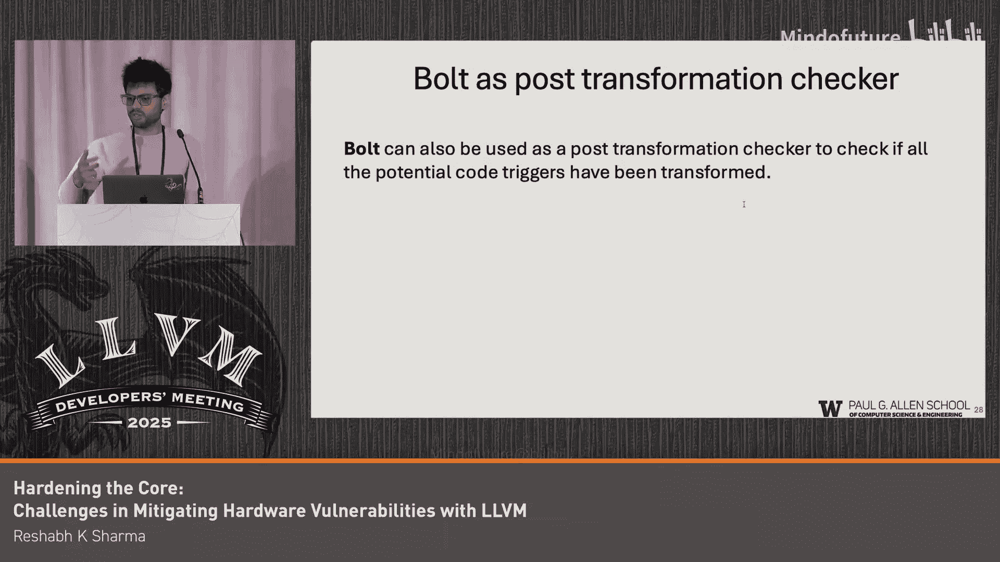

# 021：缓解侧信道漏洞的挑战

## 概述

在本节课中，我们将要学习在LLVM编译器中缓解侧信道漏洞所面临的挑战。我们将探讨侧信道攻击的原理、为何传统的“恒定时间”编程模型不足，以及如何通过编译器层面的代码转换来应对这些威胁。

## 背景：安全关键代码与侧信道

安全人员主要关注处理秘密数据的软件，我们称之为安全关键代码。例如，密码哈希比较和加密质量检查都属于此类代码。我们并不关心通用代码，只专注于强化这些安全关键的加密代码。

侧信道攻击通过程序产生的非预期副作用来泄露数据。例如，程序可能将数据写入缓存，攻击者通过观察缓存状态来间接读取数据。另一种常见的类型是时序侧信道，例如，一个程序在密码正确时运行得更快，攻击者可以利用这种时间差异来提取密码。

## 恒定时间编程及其局限性

为了应对这些威胁，恒定时间编程一直存在。顾名思义，恒定时间编程意味着编写的程序对于任何输入，其执行都不会产生可变的副作用。例如，代码中应避免基于秘密数据的分支，或者在遍历列表时，即使找到了目标也不提前退出。

然而，恒定时间编程足够吗？不幸的是，答案是否定的。我们已经看到，像Spectre和Meltdown这样的攻击也能破坏恒定时间程序。

不仅如此，即使一个程序现在是完美的恒定时间，仍然存在许多微架构侧信道，它们源自缓存、预取器等，仍能产生攻击者可利用的显著差异。

## 微架构侧信道

假设有一段恒定时间代码，它看起来应该以恒定时间执行。但硬件内部可能会决定进行一些优化，这些微架构优化可能导致程序的执行产生不同的副作用。最常见的例子之一是推测执行。

推测执行很简单，我们看到一个条件判断，然后是一个移动操作。实际上，程序中的条件是“如果索引在边界内，则执行此移动”。但CPU决定推测性地执行移动操作，当它发现条件不成立时再回滚。然而，在这个推测性或瞬态执行状态期间，缓存状态已经被改变，这可能帮助攻击者提取信息。我们已经看到Spectre攻击有多么严重。

但这是一个复杂的例子。让我们看一个非常简单的例子，也是我最喜欢的，叫做静默存储。假设有两个存储操作指向完全相同的地址，但它们来自不同的寄存器。在硬件中，如果这两个值（例如EAX和EBX的值）相同，那么第二个存储操作就会被静默化，直接被优化掉。这在硬件层面很有道理，我们不想浪费宝贵的周期再次执行存储操作。然而，从安全角度看，这很糟糕。攻击者已经证明，这种看似微不足道的优化可以被利用。

类似地，一个更简单的例子是加法指令。当其中一个寄存器或参数为0时，我们期望它不应该进入ALU或任何复杂的电路，而应该直接返回第二个参数，因为 `a + 0 = a`。但这可能产生时间差异。因此，当你的一个变量为0时，攻击者会知道这个变量是0，因为加法指令返回得更快。

这些微架构优化是必要的，我们无法摆脱它们，但它们可能产生攻击者可观察到的副作用，从而导致数据泄露。最大的启示是，这些优化会破坏你的恒定时间代码。所有投入编写恒定时间加密库和程序的努力都可能被编译器或硬件优化所抵消。

## 编译器缓解策略：选择性代码转换

我们意识到，程序中存在一些代码模式。作为编译器工程师，我们非常关注这些模式，并将它们转换为更高效、更优化的版本。但同时，这些代码模式也可能被硬件用来触发那些可能易受攻击的优化。

那么，我们能否直接关闭那些不好的优化呢？我们不能关闭推测执行，那会导致巨大的性能损失。我们能否为关心安全的人提供一个开关呢？目前还没有人发布这样的功能。我们能否以编程方式关闭它呢？例如，在执行加密代码时关闭优化，在非关键部分再正常开启？这在一定程度上是可能的，但支持非常有限。

因此，我们思考的另一面是：能否消除所有不应触发那些优化的代码模式？例如，如果我们知道程序的某个特定区域处理秘密数据，能否转换该部分程序，使其在硬件上执行时永远不会触发那些优化？这很聪明，但也很复杂，因为我们必须覆盖所有可能的情况。然而，事实证明这是一个很好的备用和兜底解决方案，因为你可以在“第0天”就实施，也可以为旧硬件提供保护。

这种“第0天”解决方案意味着，一旦出现新攻击，你就可以在编译器中推出这种缓解措施。所有用该编译器编译的代码都不会调用那个可能易受攻击的优化。这种方法也适用于你的旧硬件。

我们需要对程序进行污点分析，以找出程序中处理秘密数据的区域，这些是我们需要保护、不应触发那些优化的区域，然后对它们进行转换。

最简单的案例是Spectre缓解，大多数人可能都熟悉，即插入屏障指令来阻止推测执行。这是相同的概念，只是我们已经在实践中使用了它。假设有一段易受攻击的代码，并且这段代码位于安全关键区域，我们插入一个屏障。由于这个屏障，我们知道这个移动操作不会被推测执行。这实际上是在某种程度上关闭了优化。如果我们能在正确的时间、正确的地点、针对正确的数据（即我们的秘密）这样做，我们就能有效地保护秘密免受Spectre攻击，而无需承受完全关闭推测执行或为程序中所有操作插入屏障所带来的性能损失。

类似地，对于静默存储，你有两个移动操作。如果我在它们之间再插入一个移动操作呢？我插入另一个存储操作，确保R11中的值永远不会等于EAX和EBX。我们实际做的是，取EAX和EBX的值，将它们拆分。我们从EAX取高半部分，从EBX取低半部分，然后将它们反转。这样做，我们保证生成的值永远不会等于EAX或EBX。这使得静默存储不会因为EBX而触发，因为R11永远不会等于EBX。同时，它也不会因为R11本身而触发，因为R11也永远不会等于EAX。

我希望以上内容能让大家对这些攻击的工作原理，以及我们如何通过选择性代码转换在编译器中禁用或缓解它们，有一些直观的理解。

## 实施缓解措施面临的挑战

现在，让我谈谈我们在实施这些缓解措施时面临的一些挑战。过去两三年，我一直在为不同复杂度的攻击实施这些措施。

第一个挑战是，我们应该在哪里实施这些转换？我们是在LLVM IR层面、后端寄存器分配之前，还是之后？假设你关心所有存储操作（如静默存储），我们可能希望在寄存器分配之后进行转换，因为那时溢出和填充已经发生，我们知道所有可能发出的新存储操作。但对于某些缓解措施（例如分配影子内存），那个抽象层次可能太低了。你可能希望在LLVM IR层面做，而不是在寄存器分配之后的MI层面，那会非常痛苦。我们意识到没有完美的解决方案。对我们来说，最好的方法是：在LLVM IR层面能做的就在LLVM IR做，然后向下传递信息，例如标记这些数据的来源。

另一个有趣的问题是，如果我们想在寄存器分配之后实施静默存储转换，我们需要预留R11寄存器。这是一个非常常见的做法。在Helium代码中，我们必须为x86手动预留R11，目前没有更好的方法。但这些改变甚至会影响编译周期的行为方式。

下一个挑战是，我应该在何处调度我的缓解通道？我想把它放在最后，因为我不希望任何其他优化或缓解措施撤销它。但如果每个人都想放在最后，那“最后”是什么？如果你有两个缓解通道，它们之间的顺序如何？考虑到新威胁不断涌现，以及内存安全可能在下一个十年内得到解决，侧信道可能会成为更大的挑战，我们需要处理越来越多的缓解通道。

还有一个视角的转变。当我们进行优化时，我们只关心两件事：等价性和速度。我们找出那些我们有100%把握能保持等价且更快的“低垂果实”。但对于缓解措施，你不能遗漏任何东西。如果你遗漏了一个代码模式，那就是一种虚假的安全感，一个潜在的漏洞。而且这是一个更难发现的漏洞，因为你声称这是一个已缓解的二进制文件。

一些开放的研究问题包括：作为编写这个通道的人，我如何推理排在我前面的通道？这也与编写恒定时间程序的人所面临的痛苦相关，他们希望使用编译器，希望他们的恒定时间程序运行得快，但编译器是如此复杂的基础设施，其行为方式直到完成前都不容易理解。

另一个挑战是内联汇编。编译器中的内联汇编只是一个字符串，我们如何处理它？如果你有一个已缓解的二进制文件，但没有处理内联汇编，那效果就不好，因为攻击者仍然可以找到漏洞。在我们的实验中，几乎所有加密库都有一个没有内联汇编的版本（即非高度优化的版本），我们使用那个版本。但最好的方法是在二进制层面（如二进制重写）处理，但这也有其自身的挑战，因为你无法带入所有分析结果。

此外，还有一个视角：为了弄清楚两个转换是否冲突，或者如何排序它们，是否需要为每个转换定义语义？这需要大量的工作。但我们能否有简单的后转换检查器呢？例如，我生成了这个二进制文件，它是否还包含这个代码模式？这些是可以用二进制写入器实现的更简单的事情，我们实际上也在这么做。所以，一旦我实现了缓解措施，我会获取二进制文件，编写一个检查器，然后检查是否有遗漏。令人惊讶的是，很多时候我以为自己做得很好，结果却发现遗漏了很多代码模式和情况。编译器是如此复杂，后端也是如此复杂。即使你想在寄存器分配后写一个MI通道来支持所有存储操作，但要支持所有生成存储的地方（例如，调用约定中的大小等），也是非常痛苦的。

## 总结与展望

在本节课中，我们一起学习了侧信道漏洞的挑战以及编译器层面的缓解策略。

我想在演讲结束时让大家记住以下几点：基于编译器的防御措施对于应对这些新兴威胁非常灵活且及时。明天出现新攻击，你可以更快地推出基于编译器的缓解措施。我们在Spectre事件中也看到了这一点，基于编译器的防御措施出现得非常快。

我100%同意这些措施可能更慢的观点，但我也相信它们是必要的，因为你无法回头更改硬件。例如，我使用一台M1芯片的笔记本电脑。如果我关心M1上的某个攻击，我可能必须换到其他修复了该问题的新硬件，或者，也许这些编译器转换可以帮到我，因为我只需要将它们应用于实际处理密码或私钥的加密代码。从更大的视角来看，这部分代码相对于我们使用的总代码量来说可能很小，其开销可能很大。但从整体视角看，这部分小代码上的巨大开销是可以管理的。

编译器是惊人的、优秀的基础设施，非常适合进行优化、转换和分析。但它们最初并不是为缓解措施而设计的，这就是为什么我们面临这些挑战。这并不是说编译器不好，它们只是不为缓解措施而生。但仍有改进编译基础设施的空间，使得缓解措施也能成为其中的一部分。

## 问答环节

**提问者**：感谢精彩的演讲，发人深省。我有一个问题：你如何评估你的程序转换是否有效？特别是，例如对于静默存储优化，如果在一块硬件上足够欺骗微架构优化，但在另一块可能已经存在的新硬件上无效，怎么办？你如何验证这类事情？另外，随着新硬件的出现，你如何检查某些缓解措施不会使其他缓解措施退化？这里的评估策略是什么？

**回答**：正确。我们实现的东西是非常特定于架构和微架构的。例如，我们为x86的某个特定微架构实现的东西，就只适用于那个。我们并不声称它适用于任何其他版本或新出现的版本。有趣的是，我们的很多工作也依赖于攻击者社区，他们找出某个特定微架构对这些攻击是脆弱的，并且他们能很好地给出攻击信息。可以说，目前这些转换非常简单，如果你看到新攻击的规范，你可能会自己得到答案。但目前，我们并不那样做。

---

**本节课中，我们一起学习了：**

1.  **侧信道攻击的基本原理**：攻击通过程序的非预期副作用（如缓存状态、执行时间）泄露秘密数据。
2.  **恒定时间编程的不足**：仅靠软件层面的恒定时间编程无法抵御由硬件微架构优化（如推测执行、静默存储）引入的侧信道。
3.  **编译器缓解策略的核心思想**：通过选择性代码转换，消除程序中可能触发有害硬件优化的代码模式，从而在秘密数据处理区域“关闭”这些优化。
4.  **实施中的主要挑战**：包括转换实施的位置（IR vs. 后端）、通道调度与顺序、确保覆盖无遗漏、处理内联汇编以及验证转换有效性等。
5.  **编译器防御的优势与必要性**：提供了灵活、及时的响应手段，尤其对于无法立即更新硬件的旧系统至关重要，尽管可能带来性能开销，但在安全关键代码上是可管理的。

编译器是强大的基础设施，虽然最初并非为安全缓解而设计，但通过持续改进，它将成为应对日益复杂的侧信道威胁的关键组成部分。