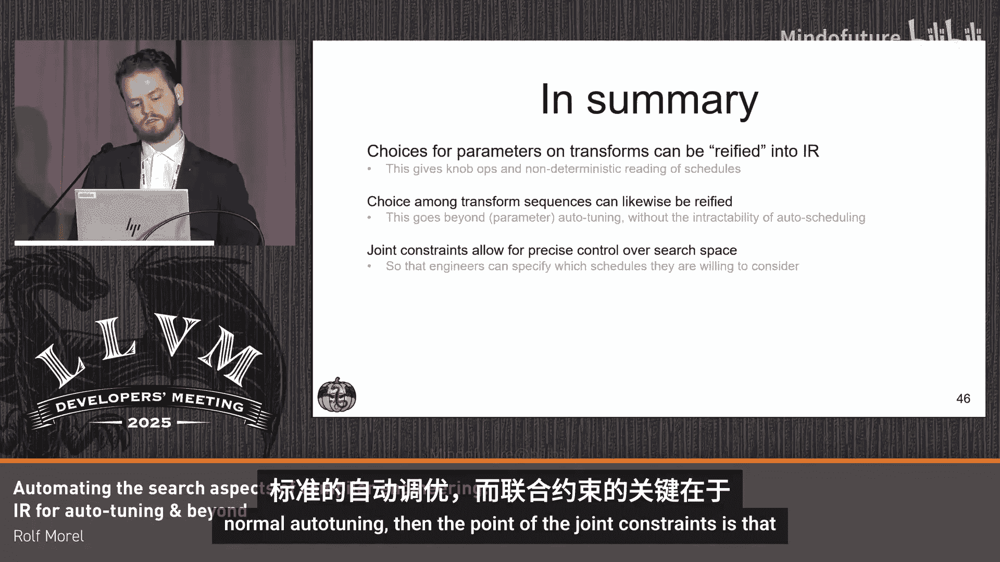

# 022：自动化编译器工程中的搜索环节

在本节课中，我们将学习如何将编译器工程中的部分工作自动化。具体来说，我们将探讨如何通过扩展MLIR的Transform方言，将优化流水线中的参数调整和方案选择等“搜索”环节表达为IR，并利用约束求解器自动完成组合搜索，从而将工程师从繁琐的手动调优中解放出来。

## 概述：编译器工程中的日常挑战

在我看来，编译器工程涉及大量流水线和参数（旋钮）的调整工作。一个典型的工作日可能是这样的：我们有一个现有的流水线需要优化。凭借经验和洞察力，我们决定在特定位置引入新的优化以提升特定工作负载的性能。然后，我们从众多可能的优化中，首先尝试优化F，并评估其性能。如果性能不达标，我们就开始调整F的所有可用参数，并反复评估。如果F不行，我们再尝试优化G，并重复调整和评估的过程。有时我们甚至会尝试不同的优化顺序，例如先F后G，或者先G后F。这个过程包含了大量手动工作。

这里存在一个潜在的改进方向：如果我们能够将这类优化计划表达出来，或许就能将这个过程机械化、自动化。

## 课程结构

在本课程中，我们将按以下步骤展开：
1.  快速回顾调度（Schedules）及其与Transform方言的关系。
2.  介绍用于调优参数的IR，并给出这些操作的非确定性语义。
3.  引入新的操作来处理可选的变换序列。
4.  探讨如何优化这个“优化循环”本身。

## 1：什么是调度？

程序实际上由两部分组成：算法（Algorithm）和调度（Schedule）。算法定义了功能行为，即输入如何映射到输出。而调度则规定了执行应如何进行，例如使用哪些内存、采用何种循环顺序等。

让我们通过Halide的一个著名例子来具体说明。我们有一个对图像应用模糊效果的高级算法。而在特定硬件上运行的实际程序，看起来更像右边这样。在传统编程范式中，程序员最终需要编写这个结合了算法功能行为和所有性能优化细节的低级程序。

根据调度优先的范式，我们可以采用不同的方式：我们可以编写算法的高级代码（功能行为），并声明一个调度，来指导如何对算法应用何种优化和降低，以得到优化后的低级代码。因此，程序员不直接编写低级程序，而是编写算法和一个描述如何优化的调度，然后由某种机制将调度应用到算法上。

调度优先范式有许多实例，包括TVM和Halide，它们都共享相同的基本理念：我们希望对代码变换进行声明式描述。

## 2：MLIR的Transform方言

这引出了MLIR的Transform方言，它只是调度范式在MLIR中的另一个实例。MLIR的Transform方言允许你编写IR来描述应对其他IR进行何种变换。因此，调度就是Transform IR，它使用Transform方言来指导如何修改有效载荷IR（Payload IR），即我们想要降低和优化的常规IR。

例如，我们有一些linalg.generic操作，调度指示我们找到任何具有一个并行迭代器的操作（即找到这个linalg.generic），然后对其应用循环分块（tiling）。我们将有效载荷IR和调度提供给一个称为Transform解释器的机制，该解释器应用调度，最终得到我们想要的、带有额外循环的IR。

更多背景信息：对于不熟悉MLIR的人，我们可以逐步降低（lower）各种方言。我们从非常高级的表示开始，然后转到linalg，接着可能添加一些分块，最后可能通过分解来消除linalg。Transform方言的理念是，这些步骤中的每一步都可以描述为一个小调度，我们甚至可以复用已有的Pass。因为Transform方言就像一种合适的编程语言，这些调度也可以组合，因此我们可以用一个大的调度来描述整个降低过程。这本质上替代了你的优化流水线。

## 3：引入参数选择到调度中

一旦你开始尝试这些调度或流水线，很快就会发现到处都是“魔法值”。例如，调度告诉我们要找到MatMul并对其应用分块，我们可能需要进行缓存分块和寄存器分块，但我们并不确切知道应该使用哪些值。对于每个想要使用的不同分块尺寸，我们最终都会得到一个不同的调度。这通常涉及手动调整或通过脚本生成。无论哪种方式，都很难追踪我们愿意考虑的不同选项。我们需要一个更上层的东西来讨论这些不同的选项。

我的提议是，我们可以将这种“选择”的概念具体化到调度本身中。我们这样做：对于确定M维度缓存分块的大小，我们有一个选择。我们通过引入一个`transform.tune`操作（附带一个描述性名称）来表达这个选择。我们说它有许多不同的选项。这个操作的语义是，它产生一个SSA值，该值的实际值是选项之一（例如16、32或64）。我们可以有多个这样的独立节点。

我们首先观察到，我们可以直接遍历IR，提取出这些引入的参数所构成的参数空间。但这带来了一个问题：这些`transform.tune`旋钮根据Transform解释器是不可执行的，因为这里存在非确定性（值可能是16、32或64之一），解释器不知道如何处理这种非确定性。所以我们需要帮助它，我们需要做点什么。

## 4：映射到约束求解问题

我们能做的第一件事是提取那个约束问题（搜索空间）。然后，我们需要一种机制来在这些不同的值/选项之间做出选择。之后，我们可以有某种驱动程序或脚本，自动将带有选择的调度重写为没有选择的调度。这里，我们只是将调优旋钮映射为常量。这样，我们就从一个不可执行的调度变成了一个可以执行的调度。

我们通过SMT（可满足性模理论）方言来处理这些约束问题。SMT本质上是一种用于表达约束问题的语言或机制。细节并不复杂，但我会给你一个概览：在左边，我们有一个`transform.tune`旋钮，我们将把它映射到SMT。这意味着我们将旋钮解释为一个可以取不同值的变量。这里我们声明有一个变量（恰好是这个名称），并且我们说它可以是16、32或64。因为我们现在仍在MLIR IR中，我们可以将其转换为SMT求解器使用的语言，这是一个非常直接的映射。此时，我们可以将其交给任何现成的SMT求解器软件。

SMT求解器软件可以枚举MC变量的所有有效赋值。然后，我们可以使用这些赋值将非确定性调度重写为确定性调度。在这个简单例子中，我们最终从一个非确定性调度得到三个确定性调度。这是一个相对直接的方法，适用于我们只有这些独立旋钮的情况。枚举独立旋钮的所有赋值并不复杂。

## 5：表达旋钮间的约束

我们希望能够在表达旋钮的同时，直接表达我们对于不同可调参数有效赋值的约束。因为我们知道我们将映射到SMT方言，我们可以利用MLIR中方言混合的特性。例如，对于寄存器分块，我们之前说只有这些有效组合。但实际上，我们知道约束更像是这样：`reg_tile_m * reg_tile_n <= 64`。

现在，我们可以用多个旋钮来表达它，并表达实际的约束。我们引入另一个新操作，它表示：我知道这些transform参数实际上将被视为SMT变量，所以让我们将每个参数映射到一个SMT变量，然后我就可以直接使用SMT方言来表达我想要的任何约束。其转换是直接的：我们独立转换每个旋钮，然后约束只是我们在特定区域中内容的副本。我们将其映射到SMT，要求SMT软件枚举所有有效赋值，我们得到许多赋值，所有这些都满足我们设定的特定约束。

## 6：处理变换序列的替代选择

我认为我们需要更进一步，以解决我们最初提出的例子。在优化调度时，你会发现你会说：我要么做这个变换，要么做那个变换。我希望能够表达这种选择。显然，仅用参数调优是无法做到这一点的。参数调优适用于调整变换或Pass的参数。而这里，我们要表达的是在Pass或变换之间的选择。

这实际上很容易编码。我们引入一个新操作`transform.tune.alternatives`，它表示我们将使用第一个区域或第二个区域。这个操作的语义是：用其区域之一替换这个操作。因此，一旦有了这个操作，我们本质上就得到了我们之前想要的两个独立调度的含义。

为了将其映射到SMT，`transform.tune.alternatives`可以有任意数量的区域。我们需要表示选择的是：对于这个特定的`tune.alternatives`，我们有一个SMT变量，其取值范围是从0到n（n+1个选项）。然后我们断言情况确实如此。接着，我们使用公式来检查子变量实际上被赋值为0、1或n。这允许我们检查选择实际上走了哪条路。然后，我们需要确保在这里面的任何SMT操作、任何旋钮或其他选择也被转换，并且这必须取决于那个特定选择是否成立。

## 7：表达选择间的依赖关系

对我来说，这仍然不够。通常我们不仅关心在调度中特定位置做出选择，后面的选择可能依赖于前面做出的选择。例如，在左边，我先进行并行分块，然后稍后我想将`scf.forall`操作替换为`scf.parallel`操作，这显然依赖于之前进行了`tile_with_forall`。在右边，我先进行顺序分块，然后我会对顺序循环做一些操作。

最直接的做法是将此表达为两个独立的选择：首先是`tile_with_forall`和`tile_with_for`之间的选择，然后是映射到并行或进行`coalesce`之间的另一个独立选择。但这样我们最终会得到四个调度，因为第一个有两个选择，第二个有两个选择。

为了使第二个选择依赖于第一个，我们引入一个标记（marker），它是第一个`tune.alternatives`的结果，允许我们跟踪选择的方向。在这个例子中，如果我们使用并行区域，我们将标记设置为`marked_parallel`（值为1）；如果我们使用顺序区域，则标记为`marked_sequential`（值为0）。然后，对于第二个依赖于第一个的替代选择，我们可以直接使用Transform方言自身的操作来断言标记应该等于`marked_parallel`。当我们对并行循环进行操作时，最好确保标记表明我们之前对并行循环进行了操作。对于要对顺序循环进行操作的情况，我们也断言最好确保我们之前对顺序循环进行了操作。

然后我们将其降低到SMT，这相当详细。我们将其提供给SMT求解器软件，在这种情况下，只有两个满足所有约束的变量有效赋值。因此，我们能够用两个替代选择编码出我们只愿意考虑的两个具体有效调度。

## 8：编码完整的优化计划

现在，我们拥有了将所有工具用于将我们“平均工作日”的平均计划编码到IR中。在左边，我们有想要优化的流水线，我们已经在IR中看到了它的轮廓。现在我们要说：我们要么做F，要么不做F。对于F，我们有一些旋钮，我们可以直接在调度中添加这些旋钮。如果我们不做F，那么我们就做G。G也有其旋钮。现在我要表达另一个选项：我先做G，后做F。当然，它也有其操作。所以，我要么在这里做G，要么什么都不做。使用一个标记来记录发生了什么。然后，我将利用这些`tune.alternatives`选择来表达“F之后的G”，仅当G尚未执行时才执行。否则，我们什么都不做。如果我们没有这一行，就可能出现先G、后F、再G的情况。现在，我们对愿意考虑的具体调度版本表达了大量的控制。

## 总结与自动化流程

总结一下，现在我们拥有了自动化调度/流水线优化的完整机制：
1.  我们拥有带有旋钮和替代选择的调度。
2.  我们将其映射到SMT输入（SMT-lib），这是SMT求解器可以处理的标准格式。
3.  我们将其交给约束求解器（SMT求解器），确保它只挑选满足所有约束的有效赋值。
4.  然后，我们可以将调度重写为没有旋钮和替代选择的具体调度。
5.  我们可以将这些具体调度与想要优化的有效载荷一起提供给Transform解释器。
6.  我们拥有用于评估和评分的测试工具，我们可以循环运行此过程，例如自动收集评分最高的旋钮和替代选择的赋值。

目前我们已经实现了这一部分。我们还想更进一步，例如优化约束求解过程，使其搜索更智能；或者同时优化许多不同的有效载荷，因为我们可能希望针对不同的工作负载优化整个流水线。

## 课程总结

本节课我们一起学习了：
*   我们引入了一种将参数选择具体化到IR中的方法，这为我们提供了具有非确定性语义的旋钮操作。
*   我们使得讨论变换序列的替代选择成为可能，这超越了常规的自动调优。
*   关键点在于，通过联合约束，我们可以对我们愿意考虑的不同具体调度表达大量的控制。如果我们不能做到这一点，很容易陷入难解性问题。
*   我们可以将搜索满足约束的赋值的任务交给求解器，从而自动提取可执行的调度。

