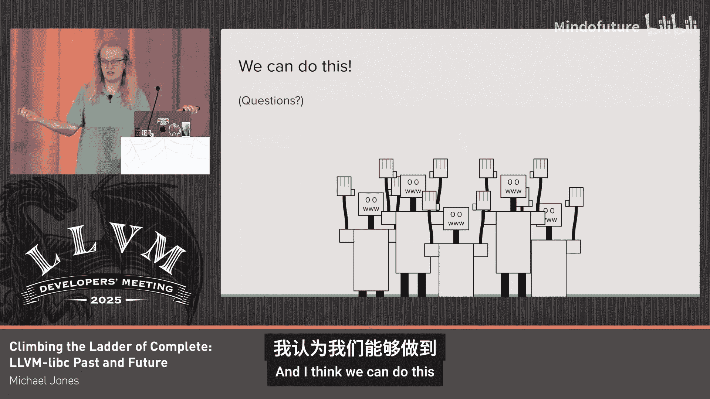

# 023：过去与未来

在本节课中，我们将回顾 LLVM Libc 项目自2019年提案以来的发展历程，探讨其当前用户需求，并介绍一个面向未来的全新设计提案。我们将重点关注项目的模块化、跨平台支持和社区导向，并规划实现一个具体目标：在2026年底前，让 LLVM Libc 能够支持 Clang 编译器，使其达到生产就绪状态。

## 项目起源与2019年提案

首先，让我们回顾一下 LLVM Libc 项目的起点。2019年，Shiva Chandra 撰写了一份提案，为 LLVM Libc 确立了五项指导原则。

以下是该提案的核心原则：
1.  **作为库构建**：Libc 应真正遵循“库”的哲学，而非一个难以分解的单体。
2.  **支持静态链接**：优先支持将库静态链接到应用程序中。
3.  **将标准视为指南**：以满足用户实际需求为目标，而非刻板遵循标准。
4.  **谨慎对待供应商扩展**：对非标准功能持审慎态度。
5.  **成为 LLVM 工具链的典范**：充分利用 LLVM 生态的各种工具来构建高质量的库。

关于“作为库构建”这一点，原提案中有这样一段描述：“尽管 C 标准库名义上是一个库，但大多数实现在实践中是相当单一的整体。” 这就像一块紧密拼接的乐高积木，难以单独替换其中的某一块。

该提案也明确了一些非重点领域，例如动态加载和增加更多架构支持。不过在实际发展中，我们后来增加了对多个新架构的支持。

## 当前进展与用户生态

上一节我们回顾了项目的起点，现在来看看过去六年我们取得了哪些成果。

*   **代码规模**：我们新增了超过 1000 个函数，其中 480 个是数学函数。
*   **架构支持**：目前支持大约 6 种处理器架构（具体计数方式不同，结果在4到8之间）。
*   **社区贡献**：约有 50 位贡献者提交了超过 10 次提交，总计超过 220 人至少有一次提交。我们目前拥有 11 位维护者。

那么，是谁在使用我们构建的这个库呢？主要有以下几类用户：

*   **部署在已知环境**：
    *   容器化服务器（如 Google 所用）。
    *   嵌入式设备（如新款 Pixel Buds）。
    *   甚至可以为 GPU 构建（Joseph Huber 的工作）。
*   **作为源代码库使用**：
    *   LLVM 子项目通过 `libc-utils` 项目使用 Libc 源码，例如 `libc++` 用于字符串到浮点数的转换，`OpenMP` 用于 `printf` 内部功能。
*   **外部用户集成**：
    *   Android 的 Bionic Libc 引入了我们的宽字符函数。
    *   Fuchsia 正在用新的 LLVM Libc 实现替换其部分 Libc 函数。
    *   `musl` 提供了一个实验性配置，允许使用 LLVM Libc 替代原有的 C 运行时。

## 用户需求与设计优先级

了解了用户群体后，我们来看看他们具体需要什么，以及这对我们的设计意味着什么。

用户通常采用“在应用中构建 Libc”的模式。这意味着他们使用静态链接，或者像 Google 的“运行时按需链接”那样，将库和应用程序一起构建和链接。这种模式的优势在于，它避免了传统动态链接库模型中，应用程序需要同时兼容新旧版本库 ABI 的难题。只要应用程序的二进制接口稳定，就可以直接部署包含新版本库的完整新应用。

除了构建模式，用户还有以下核心需求：

*   **可移植性**：包括易于移植到新架构（向上可移植），以及在不同硬件上提供一致的 API（向下可移植）。
*   **质量属性**：性能、代码大小和数学精度都是接口的一部分。不同的应用场景需要在三者之间做出不同的权衡，因此库需要一定程度的可定制性。

相应地，以下是我们当前的非重点领域：

*   **动态加载**：由于用户倾向于静态链接，动态加载不是当前焦点。
*   **ABI 稳定性**：对于静态链接或源码集成的用户，只要他们的应用能重新构建，库的 ABI 是否稳定并不关键。
*   **遗留的有问题特性**：例如将区域设置（locale）作为隐式参数（如 `printf` 依赖全局区域设置），这种设计在现代环境下容易引发问题，更好的方式是使用显式参数。

## 新的设计原则：模块化、跨平台、社区导向

基于对用户需求的分析，我提出以下三项新的指导原则，它们将指引 LLVM Libc 的未来发展。

**1. 模块化**
我们希望函数之间相互独立，实现“垂直模块化”，以便能够单独部署某个函数，而不必引入一堆不需要的依赖。同时，我们希望操作系统层的接口是通用的，实现“水平模块化”，这样在移植到不同平台（如 Linux 到 Windows）时，可以轻松替换底层的 OS 模块，而无需重写上层逻辑。

**2. 跨平台**
为了实现跨平台，我们应尽可能使用 C++ 编写可移植代码，并自动生成汇编，以减少需要手动维护的平台特定汇编代码。我们需要清晰地划分平台无关代码、平台通用代码和平台特定代码的层次。目标是实现“一个前端，多个后端”——相同的 API，通过不同的后端适配到各个系统。

**3. 社区导向**
一个优秀的库离不开一个健康、成长的社区。我们需要营造一个欢迎新人、友好、尊重并能建设性处理分歧的环境。社区应为成员提供新的机会，让他们能够成长并承担更重要的角色。

## 具体目标与实施路线图

前面我们讨论了新的设计原则，现在让我们聚焦于一个具体、可衡量的目标。

我们计划在 **2026 年底前，让 LLVM Libc 达到能够支持 Clang 编译器的生产就绪状态**。选择 Clang 作为目标是因为它是一个真实、行为良好、广泛可用的生产级程序。实现这一目标也将意味着 LLVM 工具链实现了自举（self-hosting），这是一个令人兴奋的里程碑。

以下是实现该目标的路线图：

**2025年底前：**
*   完成本战略的宣讲。
*   完成所有必要的代码清理和重构的设计工作。

**2026年初：**
*   实施上述设计好的清理和重构工作。
*   实现 Clang 所需的一系列函数，包括宽字符文件函数、部分 `pthreads` 功能以及一些 POSIX 系统调用包装器。

**2026年底前：**
*   建立 Clang/LLVM Libc 的持续集成构建机器人，确保 Clang 不仅能构建，还能通过所有测试。
*   进行最终打磨，使 Clang + LLVM Libc 达到真正的生产就绪水平。
*   不仅实现 Clang 所需的函数，而是完成相关函数集的全部实现，避免库中出现奇怪的缺口。
*   设定下一个激动人心的项目目标。

## 问答环节摘要

在演讲后的问答环节，讨论了一些关键问题：

*   **如何替换特定函数（如 `malloc`）？** 主要通过构建系统实现。项目目录结构支持按平台/架构提供特定实现，构建时会选择最具体的版本。
*   **静态链接的代码大小影响？** 预计影响不显著。对于嵌入式设备，死代码消除会移除未用部分；对于服务器，静态链接增加的大小上限大约相当于动态库文件的大小（如 glibc 的 .so 文件约 2MB）。
*   **静态链接下的安全更新？** 在容器化部署等场景中，通常需要重新部署整个应用程序，因此可以在新版本中直接包含修复后的库。
*   **对动态加载和插件支持的计划？** 最终希望将动态加载作为一个可选项。初步阶段，可以尝试配置 Clang 禁用插件加载，或按需构建动态加载支持。
*   **对 Windows/macOS 的平台支持？** 目前不完整，主要缺乏相关贡献者。重构以改进 OS 抽象层后，移植工作会更容易。
*   **将 LLVM Libc 作为库集成到其他项目的难易度？** 目前已经比较容易，许多代码（如 `printf`、字符串转浮点数、数学函数）已经是平台无关的，可以方便地抽取使用。
*   **如何开始贡献？** 可以访问 [libc.llvm.org](https://libc.llvm.org)，参加每四周一次的公开会议，或通过 Discourse、Discord 频道交流。

## 总结

本节课中，我们一起回顾了 LLVM Libc 从2019年提案至今的发展，分析了其用户群体和核心需求。我们重点介绍了一个面向未来的新设计提案，其核心是**模块化**、**跨平台**和**社区导向**三项原则。最后，我们设定了一个清晰的目标：在2026年底前，让 LLVM Libc 能够支持 Clang 并达到生产就绪状态。这是一个充满挑战但令人兴奋的旅程，欢迎社区的每一位成员参与其中，共同攀登 LLVM Libc 的完整阶梯。

