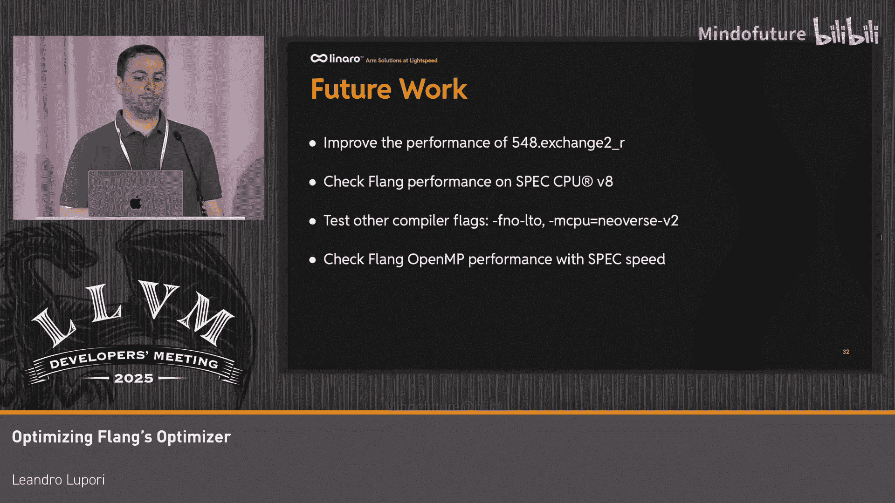

# 024：优化Flang的优化器

在本教程中，我们将学习如何分析和优化Flang编译器（LLVM的Fortran前端）的性能。我们将通过分析SPEC CPU 2017基准测试中的具体案例，探讨如何识别性能瓶颈并实施优化，最终目标是使Flang的性能与GCC的差距控制在10%以内。

## 1️⃣：Flang简介与性能评估

Flang是LLVM项目的Fortran语言前端。它的工作流程是将Fortran源代码逐步降低（lower）为不同的中间表示（IR）。首先，Fortran代码被转换为高级Fortran IR（HLFIR），然后进一步转换为FIR（Flang IR），最终转换为其他MLIR方言和LLVM IR。从这一点开始，后续的编译步骤由MLIR和LLVM完成，最终生成可执行文件。

在从Fortran到HLFIR的降低过程中，除了HLFIR操作外，还会使用其他MLIR方言，如`func`和`arith`。HLFIR保留了Fortran语言结构和语义的许多细节，因此它是执行Fortran特定优化的理想阶段。

在尝试优化Flang之前，首先需要评估其性能。我们使用SPEC CPU 2017基准测试中仅包含Fortran代码的部分。测试运行在一台Nerverse VI机器上。我们的目标是，在任何基准测试上，Flang的性能不应比GCC 14低10%以上。

截至今年4月，LLVM和GCC的最新稳定版本分别是20和14。性能对比图表显示，在大多数基准测试中，Flang的性能与GCC 14相当或更好。然而，在`cactuBSSN`（简称`c4`）测试中，Flang的性能低了18%。因此，`c4`成为了一个很好的优化候选对象。

## 2️⃣：识别性能瓶颈

为了识别占用最多执行时间的函数，我们在Ubuntu机器上使用了`perf`工具。分析发现，性能问题分散在整个程序中，这使得识别差异最大的函数变得有些困难。

以下是`perf report`输出的`c4`测试中最热的10个函数列表。我们选择了`array_props_s_w`函数，因为其样本数几乎是GCC版本的两倍，表明性能差距显著。

然而，在尝试检查该函数时，只列出了汇编指令，没有对应的Fortran源代码。这是因为与GCC不同，当启用LTO（链接时优化）时，LLVM有时会丢失调试信息。我们的解决方法是禁用LTO，以便能够将汇编指令映射回Fortran结构。

禁用LTO后，我们现在可以看到与汇编指令并列的Fortran源代码。`array_props_s_w`是一个大型函数，但引起我们注意的是其中三维数组的初始化部分。可以看到，LLVM使用了多个嵌套循环结构，而GCC仅使用两个简单的循环。问题似乎在于LLVM没有意识到这是对整个数组的连续初始化，因此未能使用单个循环来优化。

## 3️⃣：数组初始化优化

为了探究问题的根源，我们检查了代码生成的每个阶段，从HLFIR开始。在HLFIR中，整个初始化由一个单独的`hlfir.assign`操作完成。当它被转换为FIR时，变成了三个嵌套循环，每个数组元素都通过`store double`指令初始化。在LLVM IR中，这又变成了一系列`getelementptr`指令后跟`store double`指令。

这种情况的发生是因为两个内层循环被完全展开了。但由于数组在内存中是连续的，也许我们可以让Flang将`assign`操作降低为使用单个循环，这可能有助于LLVM生成更优化的LLVM IR。

要实现这一点，首先需要对多维数组进行线性化，以便能够用单个循环遍历它。以下是执行此优化的核心代码逻辑，但我们将重点关注应用此优化后生成的FIR代码。

可以看到，三个嵌套循环被替换为一个单循环，该循环遍历扁平化的数组，为每个元素存储`double`值。在LLVM IR中，现在也变成了一个单循环，并且这次甚至能够将`store double`指令成对分组。最终，在汇编指令中也可以确认，初始化部分只剩下一个循环。

然而，不幸的是，最终`c4`的执行时间几乎没有变化。可能的原因包括：`array_props_s_w`是一个大型函数，数组初始化只占其运行时间的一小部分；此外，该函数中还存在其他分散的性能问题。不过，在其他测试程序中，我们观察到了显著的性能提升。如下表所示，对于64kB到256kB大小的数组，速度提升了约30%。另一个好处是，数组初始化所需的指令数在`c4`案例中从38条减少到了8条。

## 4️⃣：字符串比较优化

这是我第一次尝试优化`c4`。一段时间后，我再次尝试优化它。那时GCC 15已经发布，我使用了LLVM的主干版本。同时，由于其他Flang开发者的贡献，`array_props_s_w`函数的性能差距已经缩小。

我使用火焰图来帮助识别在比较GCC和LLVM时差异最大的函数。识别出的函数是`twamax_is`。对比火焰图可以看到，LLVM编译版本在该函数上花费的时间显著高于GCC版本。放大观察，我们发现LLVM版本调用了`trim`和`free`函数，而GCC版本只调用了一个不同的字符串比较运行时函数。

`perf`输出证实了这一点：LLVM进行了两次`trim`调用、两次`free`调用，并且字符串比较是内联进行的。这个函数实际上很简单，只是比较两个修剪（trim）后的字符串。有趣的是，GCC能够简单地消除这两个`trim`调用。

让我们看看这是如何实现的。首先需要记住，在Fortran中，字符字符串在右侧用空格填充。此外，查阅Fortran语言规范可知，在比较操作中，较短的字符串操作数总是用空格填充以匹配另一个操作数的长度。所有这些意味着，可以安全地去掉`trim`调用，因为关系运算符本身已经考虑了右侧的空格。

为了实现这种表达式简化，第一步是添加一个新的HLFIR操作来表示对`trim`的调用。这使得更容易识别并在可能时移除该调用；当无法移除时，该操作会被转换为一个行为与之前相同的运行时调用。

在此基础上，我编写了一个Pass来简化字符比较。其核心可以总结为以下表达式：两个修剪后字符串的比较，变成了这两个字符串本身的比较。

以下是执行此转换的核心代码，但我们将跳过代码细节，重点关注优化应用前后的HLFIR代码。可以看到，在优化后的版本中，两个`chartrim`操作以及相应的`destroy`操作都被移除了。

这项优化的结果是，`c4`的执行时间从217秒下降到280秒，估计带来了约3.5%的速度提升。

## 5️⃣：其他贡献与未来计划

我想提一下，其他开发者也为Flang的性能提升做出了许多贡献。本幻灯片列出了一些近期的贡献。在当前LLVM主干版本与GCC 15的性能对比图表中，红色柱代表LLVM（从20版到主干版），蓝色柱代表GCC 14和15。可以看到，现在唯一一个Flang性能比GCC 15低10%以上的基准测试是`exchange2`，差距为11%。尽管`c4`仍有改进空间。

未来，我们计划改进`exchange2`的性能，并检查Flang在SPEC CPU V8上的表现。其他计划包括：测试不使用LTO的编译器标志、针对Nerverse CPU进行测试，以及检查Flang在启用OpenMP时使用SPEC Speed基准测试的表现。

## 总结

本节课中，我们一起学习了如何分析和优化Flang编译器的性能。我们通过两个具体案例——多维数组初始化和字符串比较——探讨了识别性能瓶颈、在HLFIR层面实施优化以及评估优化效果的全过程。尽管并非所有优化都能直接带来显著的端到端性能提升，但它们在特定场景下减少了指令数量，并为整体性能改进做出了贡献。Flang的性能正在通过社区的努力持续提升。